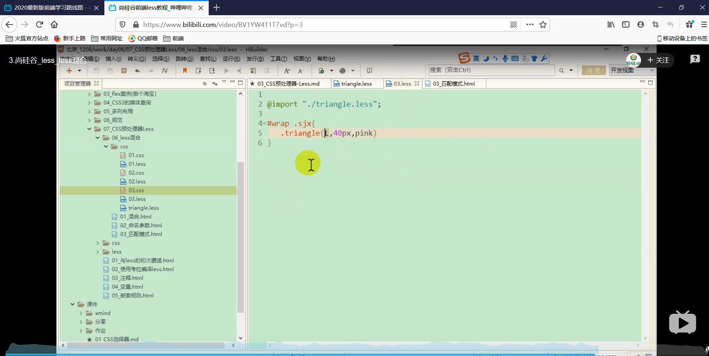
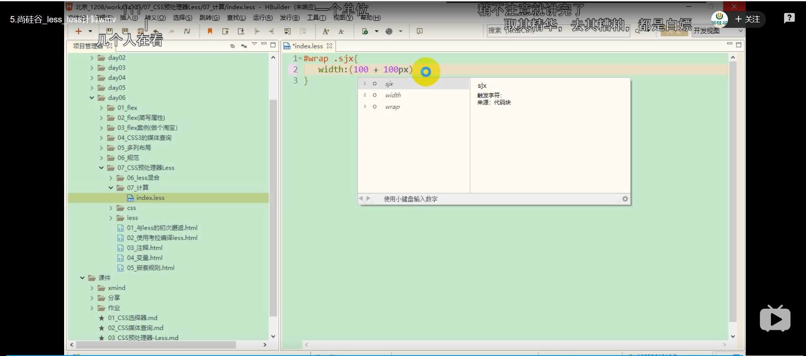

# Less学习笔记

## Less_初见Less

### Less简介

less是一种动态样式语言，属于css预处理器的范畴，它扩展了 CSS 语言，
增加了变量、Mixin、函数等特性，使 CSS 更易维护和扩展
**LESS 既可以在 客户端 上运行 ，也可以借助Node.js在服务端运行**。**Less 是一门 CSS 预处理语言，它扩展了 CSS 语言，增加了变量、Mixin、函数等特性，使 CSS 更易维护和扩展。**

**Less 可以运行在 Node 或浏览器端。**

less的中文官网：http://lesscss.cn/
bootstrap中less教程：http://www.bootcss.com/p/lesscss/

### 浏览器端使用Less

~~~html
<!DOCTYPE html>
<html lang="en">
<head>
    <meta charset="UTF-8">
    <meta name="viewport" content="width=device-width, initial-scale=1.0">
    <title>Document</title>
    
</head>
<body>
    

        

    

    
</body>

</html>
~~~

利用这种方式，浏览器可以执行style元素里面的Less语法的css代码，但是可以知道Less为预编译，也就是在浏览器执行时，执行的是正常的css语法。意味着Less是在运行之前已经被解析成正常的css文件了。将Less语法的css转成正常的css文件，然后交给浏览器执行。

说人话就是开发人员在写代码的时候采用Less语法写css文件，然后在将Less文件编译成浏览器可以识别并且执行的css文件，最后开发人员将编译后的css文件连同其他资源提供给服务器。

呃呃呃，类似于ts转js这种过程。

## Less_Less基础

### Less的编译工具

koala 官网:www.koala-app.com 

vscode预编译插件:Easy Less

预编译的Less文件

~~~less
.container{
    width: 100px;
    height: 100px;
    background-color: red;
    padding:100px 100px;
    margin:100px auto;
    .box{
    height: 100px;
    width: 100px;
    background-color: purple;
    margin:0 auto;
    }
}
~~~

vscode保存之后自动编译成的css文件

~~~css
.container {
  width: 100px;
  height: 100px;
  background-color: red;
  padding: 100px 100px;
  margin: 100px auto;
}
.container .box {
  height: 100px;
  width: 100px;
  background-color: purple;
  margin: 0 auto;
}

~~~

预编译的html文件

~~~html
<!DOCTYPE html>
<html lang="en">
<head>
    <meta charset="UTF-8">
    <meta name="viewport" content="width=device-width, initial-scale=1.0">
    <title>Document</title>
    <link rel="stylesheet" href="./less/02_01预编译.css">
</head>
<body>
    

        

    

</body>
</html>
~~~

结果：

### Less的注释

 以//开头的注释，不会被编译到css文件中  	

以/**/包裹的注释会被编译到css文件中  

~~~less
// 这个是Less开发时的注释，将不会保存到编译之后的文件中
/* 这个是专门用于保存到编译之后的css的文件中的注释*/
.container{
    width: 100px;
    height: 100px;
    background-color: red;
    padding:100px 100px;
    margin:100px auto;
    .box{
    height: 100px;
    width: 100px;
    background-color: purple;
    margin:0 auto;
    }
}
~~~

~~~ css
/* 这个是专门用于保存到编译之后的css的文件中的注释*/
.container {
  width: 100px;
  height: 100px;
  background-color: red;
  padding: 100px 100px;
  margin: 100px auto;
}
.container .box {
  height: 100px;
  width: 100px;
  background-color: purple;
  margin: 0 auto;
}
~~~

### Less中的变量

	使用@来申明一个变量：@pink：pink;
	1.作为普通属性值只来使用：直接使用@pink
	2.作为选择器和属性名：#@{selector的值}的形式
	3.作为URL：@{url}
	4.变量的延迟加载

#### 1.作为普通属性的属性值来使用

~~~less
// 这个是Less开发时的注释，将不会保存到编译之后的文件中
/* 这个是专门用于保存到编译之后的css的文件中的注释*/
@outbgc:purple;
@inbgc:#f00;
.container{
    width: 100px;
    height: 100px;
    background-color:@outbgc;
    padding:100px 100px;
    margin:100px auto;
    .box{
    height: 100px;
    width: 100px;
    background-color: @inbgc;
    margin:0 auto;
    }
}
~~~

~~~css
/* 这个是专门用于保存到编译之后的css的文件中的注释*/
.container {
  width: 100px;
  height: 100px;
  background-color: purple;
  padding: 100px 100px;
  margin: 100px auto;
}
.container .box {
  height: 100px;
  width: 100px;
  background-color: #f00;
  margin: 0 auto;
}

~~~

#### 2.作为选择器和属性名

一般在实际的开发过程中，属性名和选择器都是常量，被当成变量的情况非常少。

#### 3.作为URL：@{url}

使用时用""将变量的值括起来，同样将变量以@{变量名}的方式使用

~~~less文件
// 这个是Less开发时的注释，将不会保存到编译之后的文件中
/* 这个是专门用于保存到编译之后的css的文件中的注释*/
@outbgc:purple;
@inbgc:#f00;
@imgUrl:"../../image";
.container{
    width: 100px;
    height: 100px;
    background-color:@outbgc;
    padding:100px 100px;
    margin:100px auto;
    .box{
    height: 100px;
    width: 100px;
    background-color: @inbgc;
    margin:0 auto;
    }
}
.imgUrl{
    background: url("@{imgUrl}/01.png") no-repeat;
    width: 200px;
    height: 200px;
}
// 
~~~

预编译之后的css文件

~~~css
/* 这个是专门用于保存到编译之后的css的文件中的注释*/
.container {
  width: 100px;
  height: 100px;
  background-color: purple;
  padding: 100px 100px;
  margin: 100px auto;
}
.container .box {
  height: 100px;
  width: 100px;
  background-color: #f00;
  margin: 0 auto;
}
.imgUrl {
  background: url("../../image/01.png") no-repeat;
  width: 200px;
  height: 200px;
}

~~~

html文件

~~~html
<!DOCTYPE html>
<html lang="en">
<head>
    <meta charset="UTF-8">
    <meta name="viewport" content="width=device-width, initial-scale=1.0">
    <title>Document</title>
    <link rel="stylesheet" href="./less/02_01预编译.css">
</head>
<body>
    

        

    

    

    

</body>
</html>
~~~

结果

#### 4.变量的延迟加载

变量的延迟加载，顾名思义，就是在一个{}里面，只有等{}里面的东西都解析完了之后，再去编译，所以可以知道"2"被"3"给覆盖掉了。

### Less的嵌套规则

嵌套规则：1.就是如果两个{}为嵌套关系,则两个{}对应的选择器为父子关系

​				   2.就是如果两个{}为嵌套关系,且里面的选择器添加了"&"符号，则两个{}为父子关系

Less文件

~~~less
// 这个是Less开发时的注释，将不会保存到编译之后的文件中
/* 这个是专门用于保存到编译之后的css的文件中的注释*/
@outbgc:purple;
@inbgc:#f00;
@imgUrl:"../../image";
.container{
    width: 100px;
    height: 100px;
    background-color:@outbgc;
    padding:100px 100px;
    margin:100px auto;
    &.box{
    height: 100px;
    width: 100px;
    background-color: @inbgc;
    margin:0 auto;
    }
}
.imgUrl{
    background: url("@{imgUrl}/01.png") no-repeat;
    width: 200px;
    height: 200px;
}
~~~

css文件

~~~css
/* 这个是专门用于保存到编译之后的css的文件中的注释*/
.container {
  width: 100px;
  height: 100px;
  background-color: purple;
  padding: 100px 100px;
  margin: 100px auto;
}
/* 可以看到.container与.box成了兄弟关系 */
.container.box {
  height: 100px;
  width: 100px;
  background-color: #f00;
  margin: 0 auto;
}
.imgUrl {
  background: url("../../image/01.png") no-repeat;
  width: 200px;
  height: 200px;
}
~~~

## Less_Less的混合(一)

混合就是将一系列属性从一个规则集引入到另一个规则集的方式
	1.普通混合
	2.不带输出的混合
	3.带参数的混合
	4.带参数并且有默认值的混合
	5.带多个参数的混合
	6.命名参数
	7.匹配模式
	8.arguments变量

### 1.普通混合

html文件

~~~html
<!DOCTYPE html>
<html lang="en">
<head>
    <meta charset="UTF-8">
    <meta name="viewport" content="width=device-width, initial-scale=1.0">
    <title>Document</title>
    
</head>
<body>
    

        

            

        

    

    
</body>
</html>
~~~

less文件

~~~less
.container{
    width: 400px;
    height: 400px;
    position: relative;
    margin:200px auto;
    background-color: seagreen;
    // 重复了居中代码
    .outer{
        position: absolute;
        left:0;
        right: 0;
        top:0;
        bottom:0;
        margin:auto;
        width: 250px;
        height: 250px;
        background-color: sienna;
    }
    // 重复了居中代码
    .inner{
        position: absolute;
        left:0;
        right: 0;
        top:0;
        bottom:0;
        margin:auto;
        width: 100px;
        height: 100px;
        background-color:purple; 
    }
  
}
~~~

编译之后的css文件

~~~css
.container {
  width: 400px;
  height: 400px;
  position: relative;
  margin: 200px auto;
  background-color: seagreen;
}
.container .outer {
  position: absolute;
  left: 0;
  right: 0;
  top: 0;
  bottom: 0;
  margin: auto;
  width: 250px;
  height: 250px;
  background-color: sienna;
}
.container .inner {
  position: absolute;
  left: 0;
  right: 0;
  top: 0;
  bottom: 0;
  margin: auto;
  width: 100px;
  height: 100px;
  background-color: purple;
}
~~~

使用混入模式

~~~less文件
// 使用混入
.center{
    position: absolute;
    left:0;
    right: 0;
    top:0;
    bottom:0;
    margin:auto;

}
.container{
    width: 400px;
    height: 400px;
    position: relative;
    margin:200px auto;
    background-color: seagreen;
    .outer{
        width: 250px;
        height: 250px;
        background-color: sienna;
        .center;
    }
    .inner{
        width: 100px;
        height: 100px;
        background-color:purple; 
        .center;
    }
  
}
~~~

编译之后的css文件

~~~css文件
// 这一块代码也被编译进来了，显得有些重复，有没有方法可以控制是否去掉
.center {
  position: absolute;
  left: 0;
  right: 0;
  top: 0;
  bottom: 0;
  margin: auto;
}
.container {
  width: 400px;
  height: 400px;
  position: relative;
  margin: 200px auto;
  background-color: seagreen;
}
.container .outer {
  width: 250px;
  height: 250px;
  background-color: sienna;
  position: absolute;
  left: 0;
  right: 0;
  top: 0;
  bottom: 0;
  margin: auto;
}
.container .inner {
  width: 100px;
  height: 100px;
  background-color: purple;
  position: absolute;
  left: 0;
  right: 0;
  top: 0;
  bottom: 0;
  margin: auto;
}
~~~

### 	2.不带输出的混合

### 3.带参数的混合

min in

### 4.带参数并且有默认值的混合

### 5.带多个参数的混合

### 6.命名参数

### 7.匹配模式

### 8.arguments变量

## Less的计算

## Less的继承

性能比混合高

灵活性比混合低

## Less避免编译

