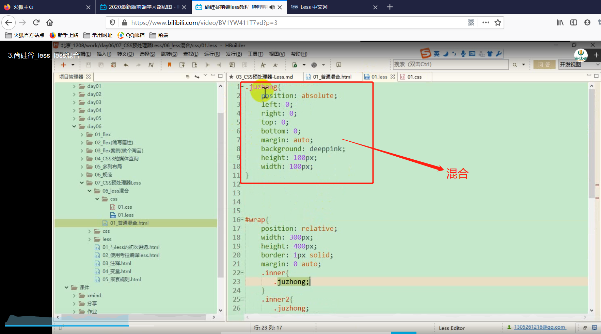
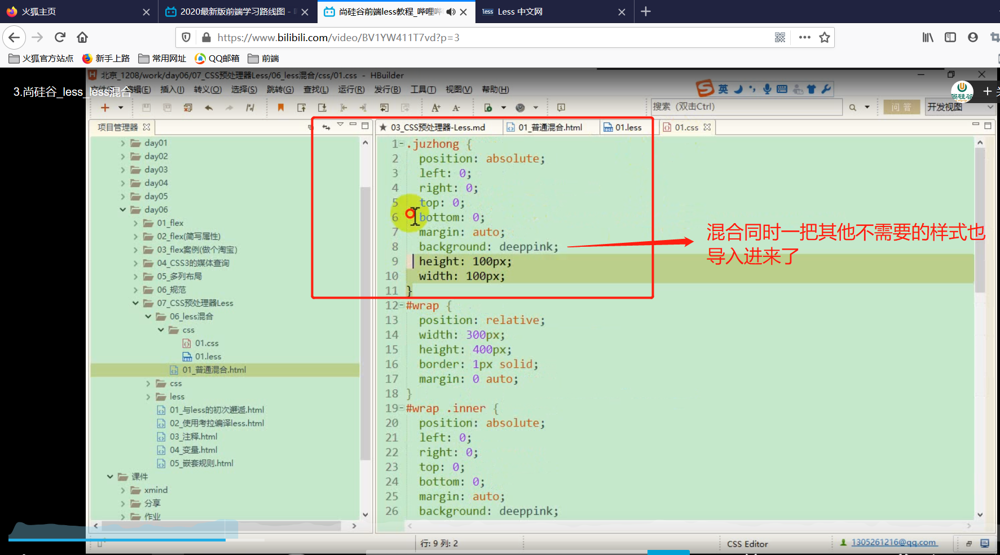

# Less学习笔记

## Less_初见Less

### Less简介

less是一种动态样式语言，属于css预处理器的范畴，它扩展了 CSS 语言，
增加了变量、Mixin、函数等特性，使 CSS 更易维护和扩展
LESS 既可以在 客户端 上运行 ，也可以借助Node.js在服务端运行。Less 是一门 CSS 预处理语言，它扩展了 CSS 语言，增加了变量、Mixin、函数等特性，使 CSS 更易维护和扩展。Less 可以运行在 Node 或浏览器端。

less的中文官网：http://lesscss.cn/
bootstrap中less教程：http://www.bootcss.com/p/lesscss/

### 浏览器端使用Less

利用这种方式，浏览器可以执行style元素里面的Less语法的css代码，但是可以知道Less为预编译，也就是在浏览器执行时，执行的是正常的css语法。意味着Less也就是在运行之前执行。将Less语法的css转成正常的css文件，然后交给浏览器执行。

说人话就是开发人员在写代码的时候采用Less语法写css文件，然后在将Less文件编译成浏览器可以识别并且执行的css文件，最后开发人员将编译后的css文件连同其他资源提供给服务器。

呃呃呃，类似于ts转js这种过程。

## Less_Less基础

### Less的编译工具

koala 官网:www.koala-app.com 

### Less的注释

 以//开头的注释，不会被编译到css文件中  	

以/**/包裹的注释会被编译到css文件中  

### Less中的变量

	使用@来申明一个变量：@pink：pink;
	1.作为普通属性值只来使用：直接使用@pink
	2.作为选择器和属性名：#@{selector的值}的形式
	3.作为URL：@{url}
	4.变量的延迟加载

一般在实际的开发过程中，属性名和选择器都是常量，被当成变量的情况非常少。

变量的延迟加载，顾名思义，就是在一个{}里面，只有等{}里面的东西都解析完了之后，再去编译，所以可以知道"2"被"3"给覆盖掉了。

### Less的嵌套规则

## Less_Less的混合(一)

混合就是将一系列属性从一个规则集引入到另一个规则集的方式
	1.普通混合      
	2.不带输出的混合
	3.带参数的混合
	4.带参数并且有默认值的混合
	5.带多个参数的混合
	6.命名参数
	7.匹配模式
	8.arguments变量

### 普通混合

