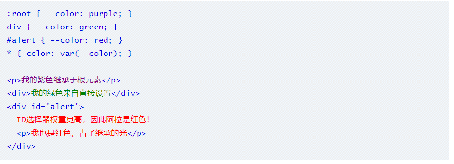
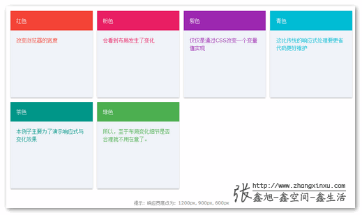
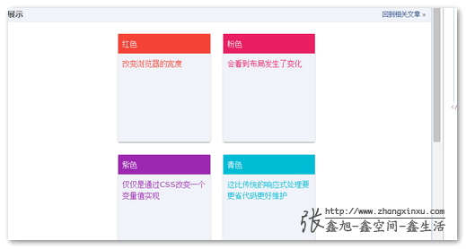

# var的语法特性以及用法

## 一、变量是个好东西

​        在任何语言中，变量的有一点作用都是一样的，那就是可以降低维护成本，附带还有更高性能，文件更高压缩率的好处。

​      随着CSS预编译工具Sass/Less/[Stylus](http://www.zhangxinxu.com/wordpress/2012/06/stylus-nodejs-expressive-dynamic-robust-css/)的关注和逐渐流行，CSS工作组迅速跟进[CSS变量的规范](https://drafts.csswg.org/css-variables/)制定，并且，很多浏览器已经跟进，目前，在部分项目中已经可以直接使用了。


## 二、CSS变量var()语法和用法和特性

​       CSS中原生的变量定义语法是：`--*`，变量使用语法是：`var(--*)`，其中`*`表示我们的变量名称。关于命名这个东西，各种语言都有些显示，例如CSS选择器不能是数字开头，JS中的变量是不能直接数值的，但是，在CSS变量中，这些限制通通没有，例如：

~~~html
:root {
  --1: #369;
}
body {
  background-color: var(--1);
}
~~~

结果背景色如下：


但是，不能包含`$`，`[`，`^`，`(`，`%`等字符，普通字符局限在只要是“数字`[0-9]`”“字母`[a-zA-Z]`”“下划线`_`”和“短横线`-`”这些组合，但是可以是中文，日文或者韩文，例如：

~~~html
body {
  --深蓝: #369;
  background-color: var(--深蓝);
}
~~~


**无论是变量的定义和使用只能在声明块`{}`里面，例如，下面这样是无效的：**

~~~html
 --深蓝: #369;
body {
  background-color: var(--深蓝);
}
~~~

变量的定义，或者说声明跟[CSS计数器](http://www.zhangxinxu.com/wordpress/2014/08/css-counters-automatic-number-content/)的声明类似的，你应该摆脱Sass/Less等预编译工具语法先入为主的语法影响，把CSS的原生变量理解为一种CSS属性。

这样，你就对其权重和变量应用规则要容易理解地多。

例如下面这个例子：



```
:root { --color: purple; }
div { --color: green; }
#alert { --color: red; }
* { color: var(--color); }

<p>我的紫色继承于根元素</p>
<div>我的绿色来自直接设置</div>
<div id='alert'>
  ID选择器权重更高，因此阿拉是红色！
  <p>我也是红色，占了继承的光</p>
</div>
```

上面这个例子我们可以获得这些信息：

1. **变量也是跟着CSS选择器走的，如果变量所在的选择器和使用变量的元素没有交集，是没有效果的。例如`#alert`定义的变量，只有`id`为`alert`的元素才能享有。如果你想变量全局使用，则你可以设置在`:root`选择器上;**
2. **当存在多个同样名称的变量时候，变量的覆盖规则由CSS选择器的权重决定的，但并无`!important`这种用法，因为没有必要，`!important`设计初衷是干掉JS的`style`设置，但对于变量的定义则没有这样的需求。**

#### CSS属性名可以走变量吗？


类似下面这样：

~~~html
body{
--bgc:background-color;
var(--bgc):red;
}
~~~

答案是“不可以”，要是可以支持的话，那CSS的压缩可就要逆天了，估计所有的属性都会变成1~2个字符。

#### CSS变量支持同时多个声明吗？

类似下面这样：
…
不好意思，类似不了，语法上就根本不支持。

**CSS变量使用完整语法**
CSS变量使用的完整语法为：`var( [, ]? )`，用中文表示就是：`var( <自定义属性名> [, <默认值 ]? )`，

意思就是，如果我们使用的变量没有定义（注意，仅限于没有定义），则使用后面的值作为元素的属性值。举个例子：

```html
.box {
  --1: #369;
}
body {
  background-color: var(--1, #cd0000);
}
```

则此时的背景色是`#cd0000`：


(此处的自我分析，可以知道，body包含div,所以可以知道当body使用变量--1时，变量并没有定义，也不存在什么继承的样式，所以直接可以取后面的颜色样式表)

#### CSS变量不合法的缺省特性

请看下面这个例子：

```
body {
  --color: 20px;
  background-color: #369;
  background-color: var(--color, #cd0000);
}
```

请问，此时&lt;body>&gt;的背景色是？

```
A. transparent    B. 20px     C. #369      D. #cd0000
```

答案是…………………………**A. transparent**

不知大家答对了没有！

这是CSS变量非常有意思的一个点，对于CSS变量，只要语法是正确的，就算变量里面的值是个乱七八糟的东西，也是会作为正常的声明解析，如果发现变量值是不合法的，例如上面背景色显然不能是`20px`，则使用背景色的缺省值，也就是默认值代替，于是，上面CSS等同于：

~~~html
body {
--color: 20px;
background-color: #369;
background-color: transparent;
}
~~~

千万不能想当然得认为等同于`background-color:20px`，这也是为什么上面要强调CSS默认值的使用仅限于变量未定义的情况，并不包括变量不合法。


#### CSS变量的空格尾随特性

请看下面这个例子：

```
body {
  --size: 20;   
  font-size: var(--size)px;
}
```

请问，此时&lt;body&gt;的`font-size`大小是多少？

如果你以为是`20px`就太天真了，实际上，此处`font-size:var(--size)px`等同于`font-size:20 px`，注意，`20`后面有个空格，所以，这里的`font-size`使用的是&lt;body&gt;元素默认的大小。因此，就不要妄图取消就使用一个数值来贯穿全场，还是使用稳妥的做法：

```
body {
  --size: 20px;   
  font-size: var(--size);
}
```


或者使用CSS3 `calc()`计算：

```
body {
  --size: 20;   
  font-size: calc(var(--size) * 1px);
}
```

此时，&lt;body&gt;的`font-size`大小才是`20px`，


#### CSS变量的相互传递特性

就是说，我们在CSS变量定义的时候可以直接引入其他变量给自己使用，例如：

```
body {
  --green: #4CAF50;   
  --backgroundColor: var(--green);
}
```

或者更复杂的使用CSS3 `calc()`计算，例如：

```
body {
  --columns: 4;
  --margins: calc(24px / var(--columns));
}
```


对于复杂布局，CSS变量的这种相互传递和直接引用特性可以简化我们的代码和实现成本，尤其和动态布局在一起的时候，无论是CSS的响应式或者是JS驱动的布局变化。

我们来看一个CSS变量与响应式布局的例子，您可以狠狠地点击这里：[CSS变量与响应式布局实例demo](http://www.zhangxinxu.com/study/201611/css-var-media-query-layout.html)

默认进去是4栏，如下图：


随着浏览器宽度减小，`4`栏可能就变成`3`栏，`2`栏甚至`1`栏，我们实际开发的时候，显然不仅仅是栏目数量变化，宽度小，往往意味着访问设备尺寸有限，此时我们往往会缩小空白间距以及文字字号大小，这样，有限屏幕才能显示更多内容。

也就是说，当我们响应式变化的时候，改变的CSS属性值不是1个，而是3个或者更多，如果我们有3个响应点，是不是就至少需要9个CSS声明？但是，由于我们有了CSS变量，同时，CSS变量可以传递，当我们遭遇响应点的时候，我们只需要改变一个CSS属性值就可以了。

下面就是本demo核心CSS代码（只需要改变`--columns`这一个变量即可）：

```
.box {
    --columns: 4;
    --margins: calc(24px / var(--columns));
    --space: calc(4px * var(--columns));
    --fontSize: calc(20px - 4 / var(--columns));
}
@media screen and (max-width: 1200px) {
    .box {
        --columns: 3;
    }
}
@media screen and (max-width: 900px) {
    .box {
        --columns: 2;
    }
}
@media screen and (max-width: 600px) {
    .box {
        --columns: 1;
    }
}
```

于是，我们在2栏下的效果就是这样，字号，间距随着栏目数量的减小也一并减小了，然后每栏之间间距是扩大了：


有没有觉得CSS越来越屌了呢！哈哈~

**补充于2019-07-08**

1. 如何使用JS设置和获取CSS变量可以参考这篇文章：“[HTML标签和JS中设置CSS3 var变量](https://www.zhangxinxu.com/wordpress/?p=8163)”
2. IE浏览器不支持CSS变量，试试参考这个Github项目：[css-vars-ponyfill](https://github.com/jhildenbiddle/css-vars-ponyfill)