# DOM、BOM基础

# Web APIs简介

## 1. Web APIs和JS基础关联性

### 1.1 JS的组成

### 1.2 JS基础阶段以及Web APIs阶段

## 2. API和Web API

### 2.1 API

### 2.2 Web API

### 2.3 API和Web API总结

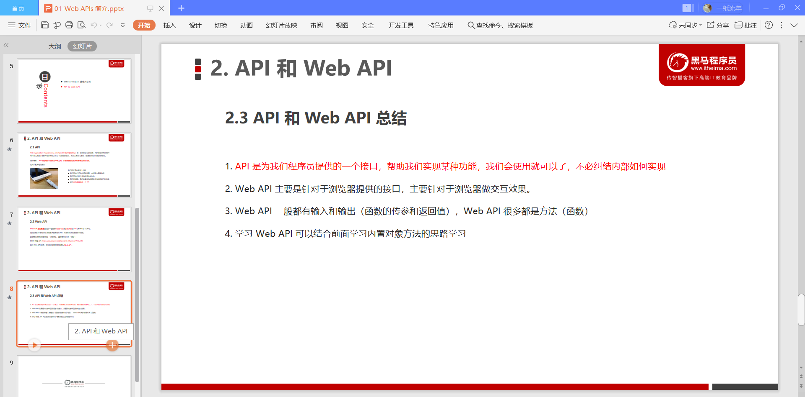

# DOM

## 1. DOM简介

### 1.1 什么是DOM

### 1.2 DOM树

## 2. 获取元素

### 2.1 如何获取页面元素

### 2.2 根据ID获取

### 2.3 根据标签名获取

### 2.4 通过HTML5新增的方法获取

### 2.5  获取特殊元素（body,html）

## 3. 事件基础

### 3.1 事件概述

### 3.2 事件三要素

### 案例一：点击按钮弹出警示框

### 3.3 执行事件的步骤

### 3.4 常见的鼠标事件

### 3.5 分析事件三要素

## 4. 操作元素

### 4.1 改变元素内容

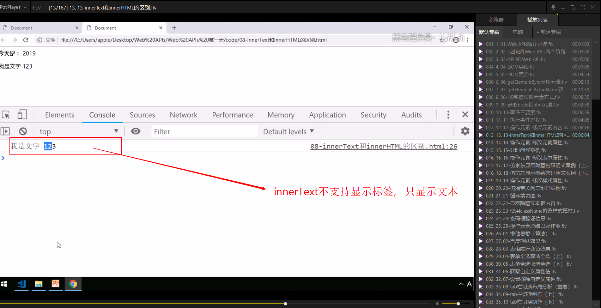

### 4.2 常见元素的属性操作

~~~html
<!DOCTYPE html>
<html lang="en">
<head>
    <meta charset="UTF-8">
    <meta name="viewport" content="width=device-width, initial-scale=1.0">
    <title>Document</title>
    
</head>
<body>
    <button id="first">第一张图片</button>
    <button id="second">第二张图片</button>
    
</body>

</html>
~~~

### 案例

~~~html
<!DOCTYPE html>
<html lang="en">
<head>
    <meta charset="UTF-8">
    <meta name="viewport" content="width=device-width, initial-scale=1.0">
    <title>Document</title>
    
</head>
<body>
    
    
上午好

</body>

</html>
~~~

### 4.3 表单元素的属性操作

### 案例：仿京东显示密码

~~~html
<!DOCTYPE html>
<html lang="en">
<head>
    <meta charset="UTF-8">
    <meta name="viewport" content="width=device-width, initial-scale=1.0">
    <title>Document</title>
    
</head>
<body>
    

        <input type="password" id="pwd">
        
    

</body>

</html>
~~~

### 4.4 样式属性操作

### 案例：淘宝点击关闭二维码

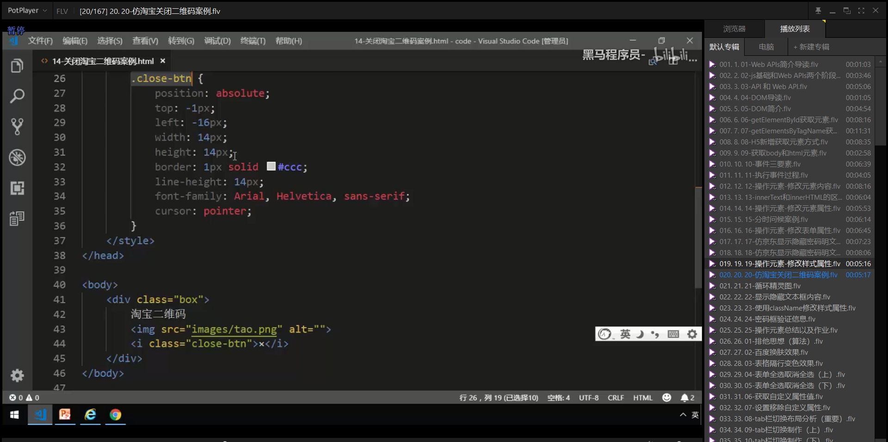

~~~html
<!DOCTYPE html>
<html lang="en">
<head>
    <meta charset="UTF-8">
    <meta name="viewport" content="width=device-width, initial-scale=1.0">
    <title>Document</title>
    
</head>
<body>
    

        手机淘宝
        
        <i class="btn-close">×</i>
    

</body>

</html>
~~~

### 案例：循环精灵图背景

### 案例：显示隐藏文本框内容

~~~html
<!DOCTYPE html>
<html lang="en">
<head>
    <meta charset="UTF-8">
    <meta name="viewport" content="width=device-width, initial-scale=1.0">
    <title>Document</title>
</head>
<body>
    <input type="text" value="手机">
</body>

</html>
~~~

### 4.5 样式属性操作

### 案例：密码框格式提示错误信息

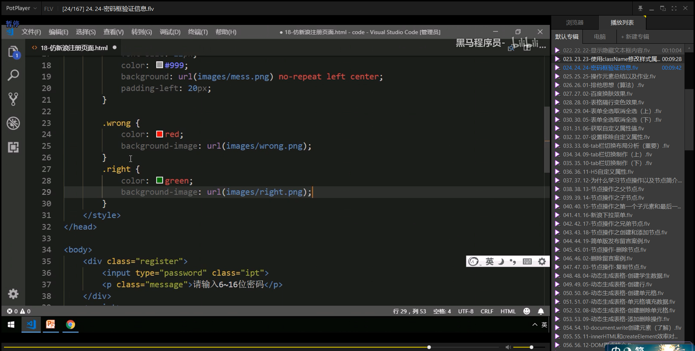

~~~html
<!DOCTYPE html>
<html lang="en">
<head>
    <meta charset="UTF-8">
    <meta name="viewport" content="width=device-width, initial-scale=1.0">
    <title>Document</title>
    
</head>
<body>
    

        <i>*</i>
        <label for="pwd">
            设置密码：
        </label>
        <input type="password"  name ="pwd"  id="pwd"/>
        
请输入6~16位密码

    

</body>

</html>
~~~

### 操作元素总结

### 作业

### 4.6 排他思想

~~~html
<!DOCTYPE html>
<html lang="en">
<head>
    <meta charset="UTF-8">
    <meta name="viewport" content="width=device-width, initial-scale=1.0">
    <title>Document</title>
    
</head>
<body>
    

        <button>按钮1</button>
        <button>按钮2</button>
        <button>按钮3</button>
        <button>按钮4</button>
        <button>按钮5</button>
    

</body>

</html>
~~~

### 案例：百度换肤

~~~html
<!DOCTYPE html>
<html lang="en">
<head>
    <meta charset="UTF-8">
    <meta name="viewport" content="width=device-width, initial-scale=1.0">
    <title>Document</title>
    
</head>
<body>
    

        <ul>
            <li></li>
            <li></li>
            <li></li>
            <li></li>
        </ul>
    

</body>

</html>
~~~

### 案例：表格隔行变色

### 案例：表单全选取消全选案例

 

~~~html
<!DOCTYPE html>
<html lang="en">
<head>
    <meta charset="UTF-8">
    <meta name="viewport" content="width=device-width, initial-scale=1.0">
    <title>Document</title>
    
</head>
<body>
    <table>
        <thead>
          <tr>
              <th><input type="checkbox" id="is_check_all"/>全选</th>
              <th>商品</th>
              <th>价格</th>
          </tr>
        </thead>
        <tbody id="is_check_body">
            <tr>
                <td><input type="checkbox" id="is_check"/></td>
                <td>苹果1</td>
                <td>1120</td>
            </tr>
            <tr>
                <td><input type="checkbox" id="is_check"/></td>
                <td>苹果2</td>
                <td>2220</td>
            </tr>
            <tr>
                <td><input type="checkbox" id="is_check"/></td>
                <td>苹果3</td>
                <td>3330</td>
            </tr>
            <tr>
                <td><input type="checkbox" id="is_check"/></td>
                <td>苹果4</td>
                <td>4440</td>
            </tr>
        </tbody>
    </table>
</body>

</html>
~~~

### 4.7 自定义属性的操作

#### 1. 获取属性值

#### 2. 设置属性值

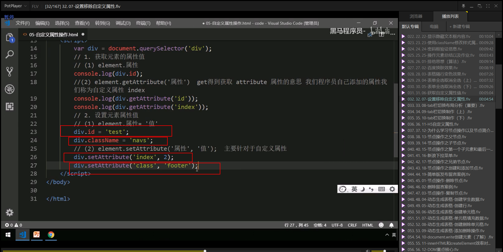

#### 3. 移除属性

#### 案例：tab栏切换

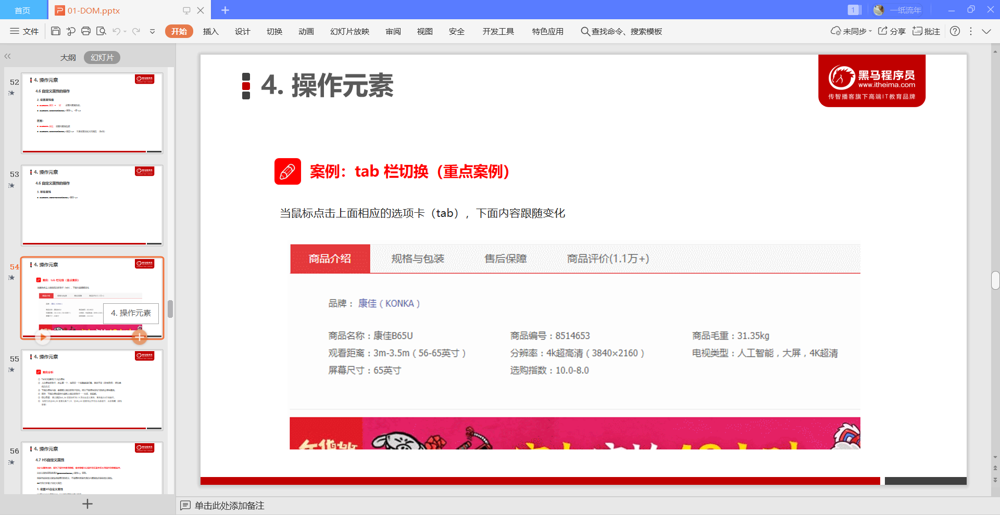

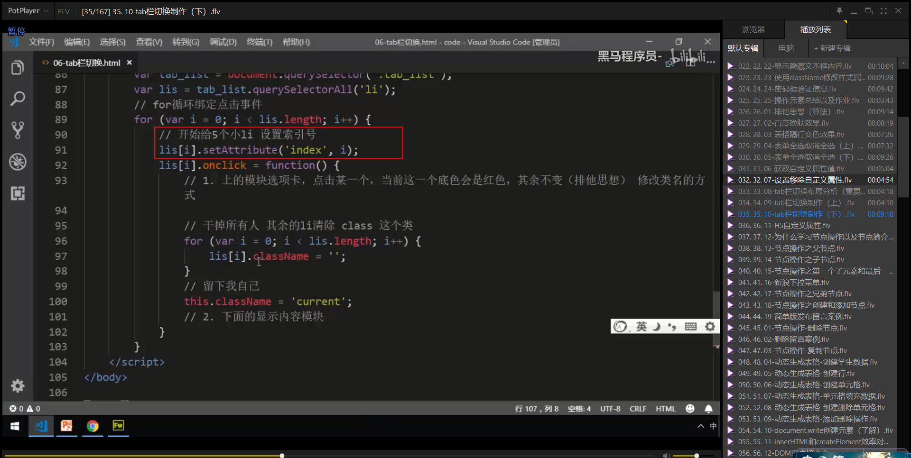

~~~html
<!DOCTYPE html>
<html lang="en">
<head>
    <meta charset="UTF-8">
    <meta name="viewport" content="width=device-width, initial-scale=1.0">
    
    <title>Document</title>
</head>
<body>
    

        

            <ul>
                <li class="tab_current">商品介绍</li>
                <li>规格与包装</li>
                <li>售后保障</li>
                <li>商品评价（50000）</li>
                <li>手机社区</li>
            </ul>
        

        

            
商品介绍的内容

            
规格与包装的内容

            
售后保障的内容

            
商品评价（50000）的内容

            
手机社区的内容

        

    

</body>

</html>
~~~

### 4.8 H5自定义属性

#### 1.设置H5自定义属性

#### 2. 获取H5自定义属性

## 5. 节点操作

 

### 5.1 为什么学节点操作

### 5.2 节点概述

### 5.3 节点层级

#### 1.父级节点：parentNode

#### 2.子节点:

##### 2.1 childNode

##### 2.2 children

##### 2.3 firstChild、lastChild

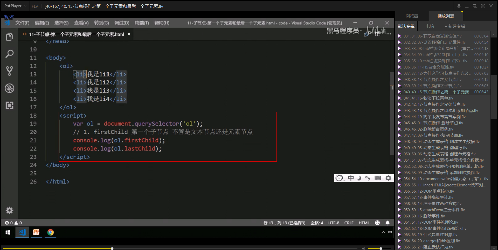

##### 2.4 firstElementChild、lastElementChild

##### 2.5 子元素节点小结

#### 案例：下拉菜单

~~~html
<!DOCTYPE html>
<html lang="en">
<head>
    <meta charset="UTF-8">
    <meta name="viewport" content="width=device-width, initial-scale=1.0">
    <title>Document</title>
    
</head>
<body>
    <ul class="nav">
        <li>
            <a href="#">微博</a>
            <ul class="">
                <li>
                    <a href="">私信</a>
                </li>
                <li>
                    <a href="">评论</a>
                </li>
                <li>
                    <a href="">@我</a>
                </li>
            </ul>
        </li>
        <li>
            <a href="#">微博</a>
            <ul>
                <li>
                    <a href="">私信</a>
                </li>
                <li>
                    <a href="">评论</a>
                </li>
                <li>
                    <a href="">@我</a>
                </li>
            </ul>
        </li>
        <li>
            <a href="#">微博</a>
            <ul>
                <li>
                    <a href="">私信</a>
                </li>
                <li>
                    <a href="">评论</a>
                </li>
                <li>
                    <a href="">@我</a>
                </li>
            </ul>
        </li>
        <li>
            <a href="#">微博</a>
            <ul>
                <li>
                    <a href="">私信</a>
                </li>
                <li>
                    <a href="">评论</a>
                </li>
                <li>
                    <a href="">@我</a>
                </li>
            </ul>
        </li>
    </ul>
</body>

</html>
~~~

#### 3.兄弟节点

##### 3.1.nextSibling

##### 3.2.previousSibing

##### 3.3.nextElementSibling

##### 3.4.previousElementSibling

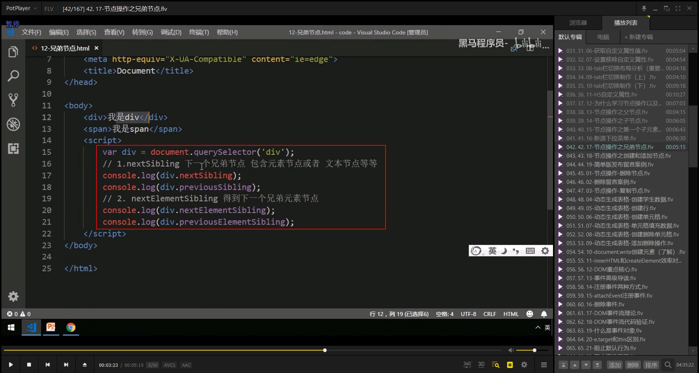

##### 3.5 兄弟节点小结

### 5.4 创建节点

### 5.5 添加节点

### 案例：简单版发布留言案列

~~~html
<!DOCTYPE html>
<html lang="en">
<head>
    <meta charset="UTF-8">
    <meta name="viewport" content="width=device-width, initial-scale=1.0">
    <title>Document</title>
    
</head>
<body>

    

        <textarea name="desc">
        </textarea>
        <button>添加</button>
        <ul>
        </ul>
    

</body>

</html>
~~~

### 5.6 删除节点

### 案例：删除留言板案例

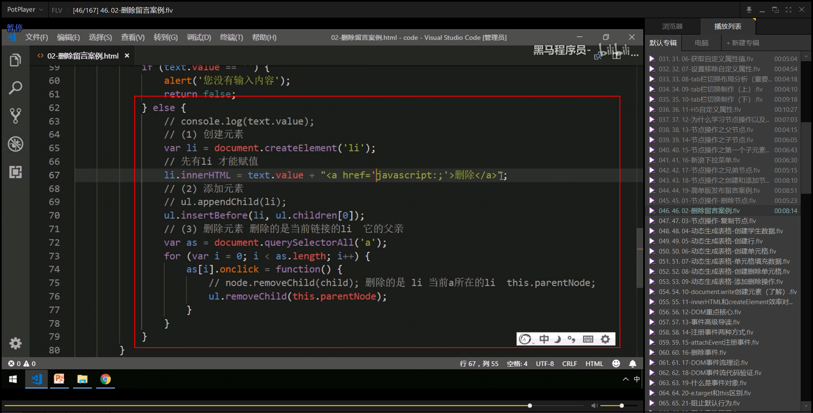

~~~html
<!DOCTYPE html>
<html lang="en">
<head>
    <meta charset="UTF-8">
    <meta name="viewport" content="width=device-width, initial-scale=1.0">
    <title>Document</title>
    
</head>
<body>
    

        <textarea name="desc">
        </textarea>
        <button>添加</button>
        <ul>
        </ul>
    

</body>

</html>
~~~

### 5.7 复制节点

### 案例：动态生成表格

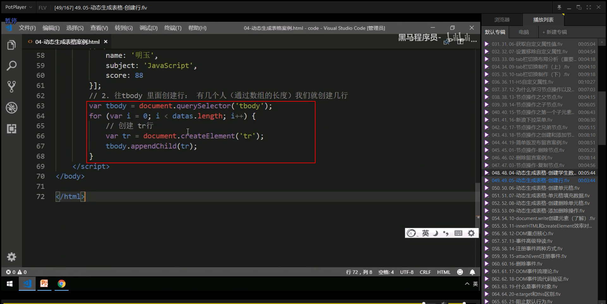

~~~html
<!DOCTYPE html>
<html lang="en">
<head>
    <meta charset="UTF-8">
    <meta name="viewport" content="width=device-width, initial-scale=1.0">
    <title>Document</title>
    
</head>
<body>
    

        <table>
            <thead>
               <tr>
                    <th>姓名</th>
                    <th>科目</th>
                    <th>成绩</th>
                    <th>操作</th>
               </tr>
            </thead>
            <tbody>
                <!-- <tr>
                    <td>hello</td>
                    <td>hello</td>
                    <td>hello</td>
                </tr>
                <tr>
                    <td>hello</td>
                    <td>hello</td>
                    <td>hello</td>
                </tr> <tr>
                    <td>hello</td>
                    <td>hello</td>
                    <td>hello</td>
                </tr> -->
            </tbody>
        </table>
    

</body>

</html>
~~~

### 5.8 三种动态创建元素区别

## 5.6 DOM重点核心

### 6.1 创建

### 6.2 新增

### 6.3  删除

### 6.4 修改

### 6.5 查询

### 6.6 属性操作

### 6.7 事件操作

# 事件高级

## 1.注册事件（绑定事件）

### 1.1 注册事件概述

### 1.2 addEventListener 事件监听方式

### 1.3  attachEvent  事件监听方式

### 1.4 注册事件兼容性解决方案

## 2.删除事件（解绑事件）

### 2.1 删除事件的方式

### 2.2 删除事件兼容性解决方案

## 3.DOM事件流

## 4.事件对象

### 4.1 什么是事件对象

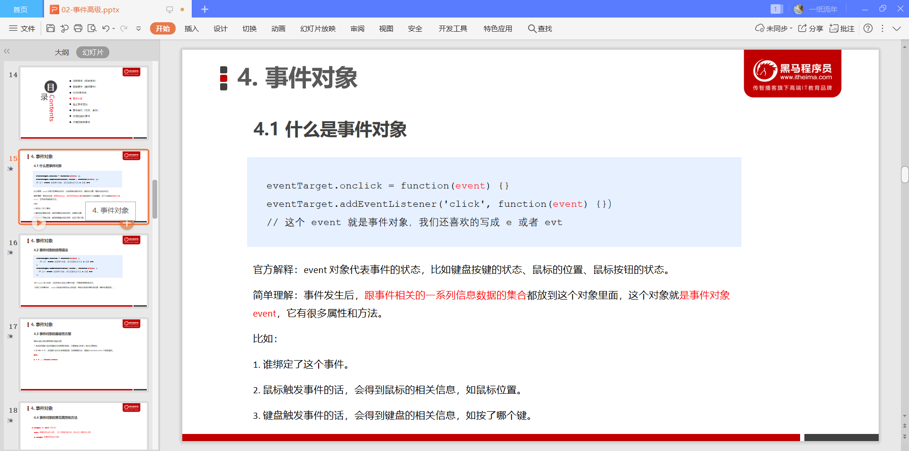

### 4.2 事件对象的使用语法

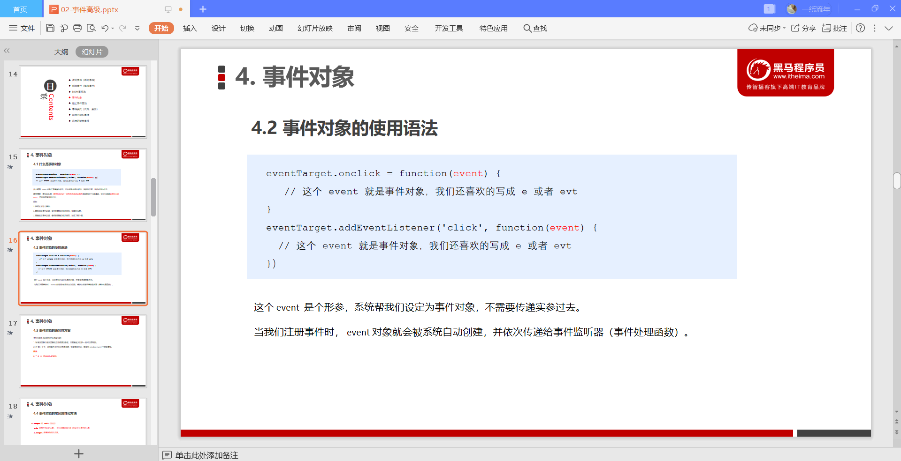

### 4.3 事件对象的兼容性方案

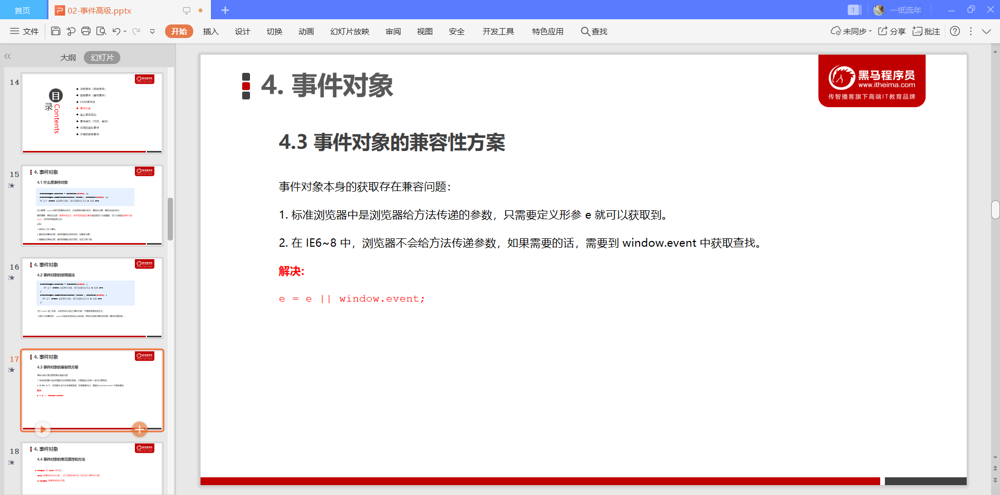

### 4.4 事件对象的常见属性和方法

## 5.阻止事件冒泡

### 5.1 阻止事件冒泡的两种方式

### 5.2  阻止事件冒泡的兼容性解决方案

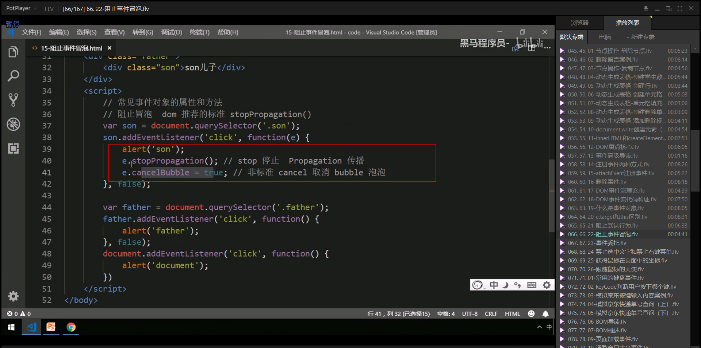

## 6.事件委托（代理，委派）

## 7.常用的鼠标事件

### 7.1 常用的鼠标事件

### 7.2 鼠标事件对象

### 案例：跟随鼠标的天使

~~~html
<!DOCTYPE html>
<html lang="en">

<head>
    <meta charset="UTF-8">
    <meta name="viewport" content="width=device-width, initial-scale=1.0">
    <meta http-equiv="X-UA-Compatible" content="ie=edge">
    <title>Document</title>
    
</head>
<body>
    
    
</body>
</html>
~~~

## 8.常用的键盘事件

### 8.1 常用键盘事件

### 8.2 键盘事件对象

### 8.3 ASCLL表

### 案例：模拟京东按键输入内容

~~~html
<!DOCTYPE html>
<html lang="en">
<head>
    <meta charset="UTF-8">
    <meta name="viewport" content="width=device-width, initial-scale=1.0">
    <title>Document</title>
</head>
<body>
    <input type="text" name = ''/>
</body>

</html>
~~~

### 案例：模拟京东快递单号查询

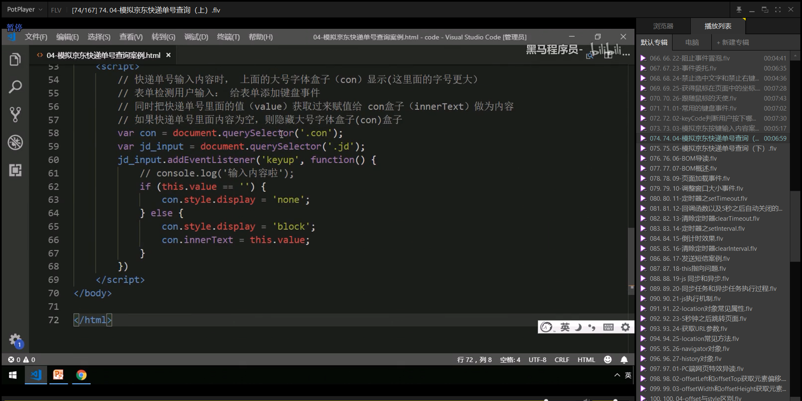

~~~html
<!DOCTYPE html>
<html lang="en">
<head>
    <meta charset="UTF-8">
    <meta name="viewport" content="width=device-width, initial-scale=1.0">
    <title>Document</title>
    
</head>
<body>
    

        

        <input type="text" placeholder="请输入快递单号" class="input"/>
    

</body>

</html>
~~~

# BOM浏览器对象模型

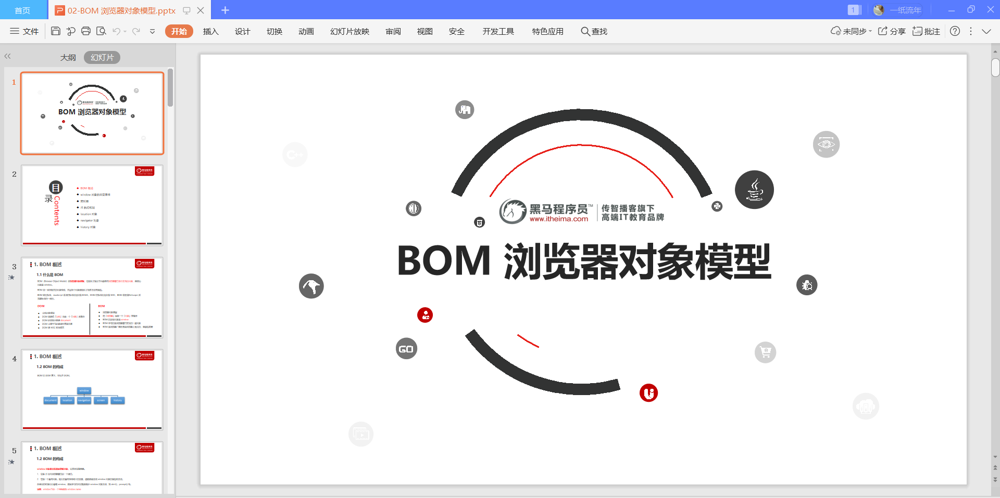

## 1.BOM概述

### 1.1 什么是BOM

### 1.2 BOM的构成

## 2.window对象的常见事件

### 2.1 窗口加载事件

### 2.2 调整窗口大小事件

**这个方法应该比较常用于媒体查询中的编程方式**

## 3.定时器

### 3.1 两种定时器

### 3.2 setTimeout()定时器

### 案例：5s后自动关闭的广告

~~~html
<!DOCTYPE html>
<html lang="en">
<head>
    <meta charset="UTF-8">
    <meta name="viewport" content="width=device-width, initial-scale=1.0">
    <title>Document</title>
</head>
<body>
    
</body>

</html>
~~~

### 3.3 停止setTimeout()定时器

### 3.4 setInterval()定时器

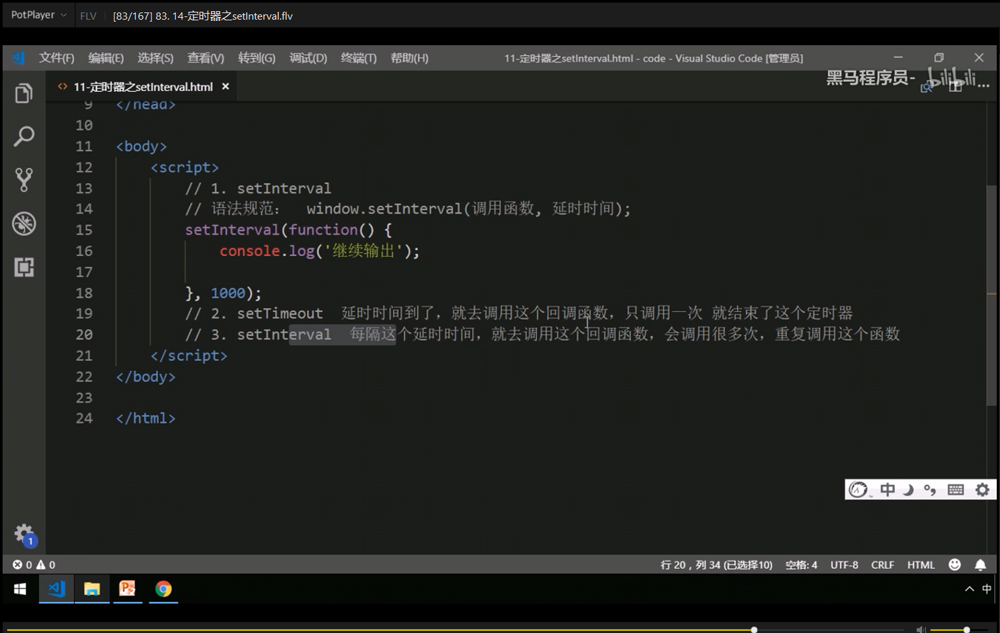

### 案例：京东计时器

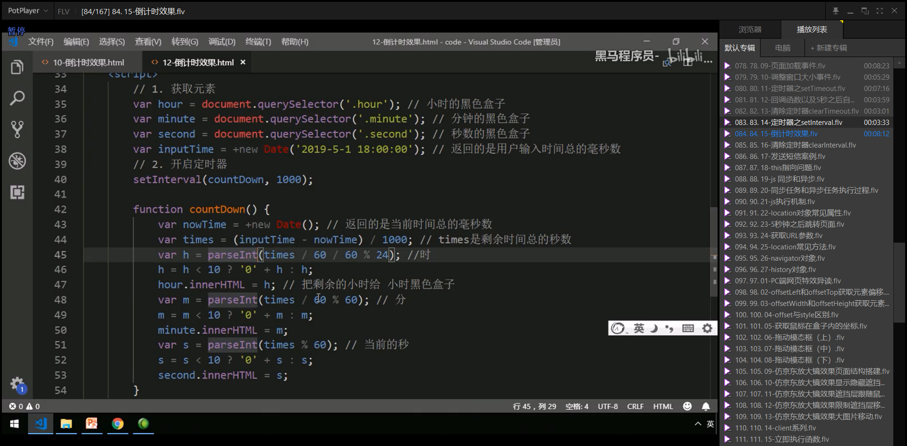

~~~html
<!DOCTYPE html>
<html lang="en">
<head>
    <meta charset="UTF-8">
    <meta name="viewport" content="width=device-width, initial-scale=1.0">
    <title>Document</title>
    
</head>
<body>
    

        
00

        
11

        
22

    

</body>

</html>
~~~

### 3.5 停止setInterval()定时器

### 案例：发送短信

~~~html
<!DOCTYPE html>
<html lang="en">
<head>
    <meta charset="UTF-8">
    <meta name="viewport" content="width=device-width, initial-scale=1.0">
    <title>Document</title>
    
</head>
<body>
    

        <input type="text" placeholder="请输入验证码"/><button>发送</button>
    

</body>

</html>
~~~

### 3.6 this

~~~html
<!DOCTYPE html>
<html lang="en">
<head>
    <meta charset="UTF-8">
    <meta name="viewport" content="width=device-width, initial-scale=1.0">
    <meta http-equiv="X-UA-Compatible" content="ie=edge">
    <title>Document</title>
</head>
<body>
    <button>点击</button>
    
</body>

</html>
~~~

### 案例：时钟

## 4. JS执行机制

### 4.1 JS是单线程

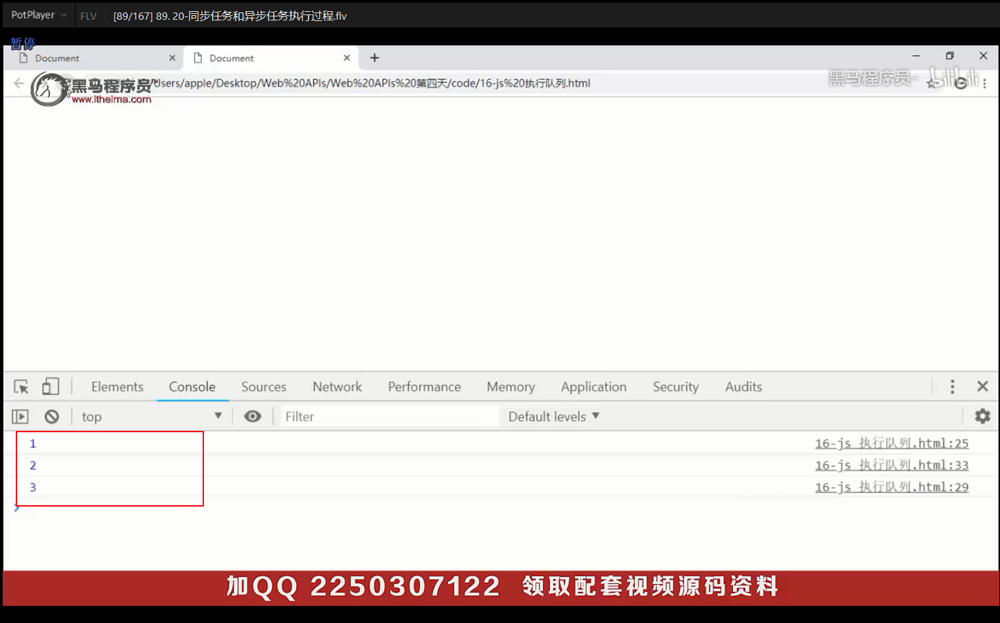

### 4.2 同步和异步

### 4.3 同步和异步

### 4.4 JS执行机制

## 5.location 对象

### 5.1 什么是location对象

### 5.2 URL

### 5.3 location 对象的属性

### 案例：5s之后自动跳转页面

~~~html
<!DOCTYPE html>
<html lang="en">
<head>
    <meta charset="UTF-8">
    <meta name="viewport" content="width=device-width, initial-scale=1.0">
    <title>Document</title>
    
</head>
<body>
    

    <button>点击跳转</button>
</body>

</html>
~~~

### 案例：获取URL参数数据

~~~html
<!DOCTYPE html>
<html lang="en">
<head>
    <meta charset="UTF-8">
    <meta name="viewport" content="width=device-width, initial-scale=1.0">
    <title>Document</title>
</head>
<body>
    <form action="21_2_index.html">
        <input type="text" name='uname'/>
        <input type='submit'>
    </form>
</body>
</html>
~~~

~~~html
<!DOCTYPE html>
<html lang="en">
<head>
    <meta charset="UTF-8">
    <meta name="viewport" content="width=device-width, initial-scale=1.0">
    <title>Document</title>
</head>
<body>
    

</body>

</html>
~~~

### 5.4 location对象的方法

## 6. navigator对象

## 7.history对象

