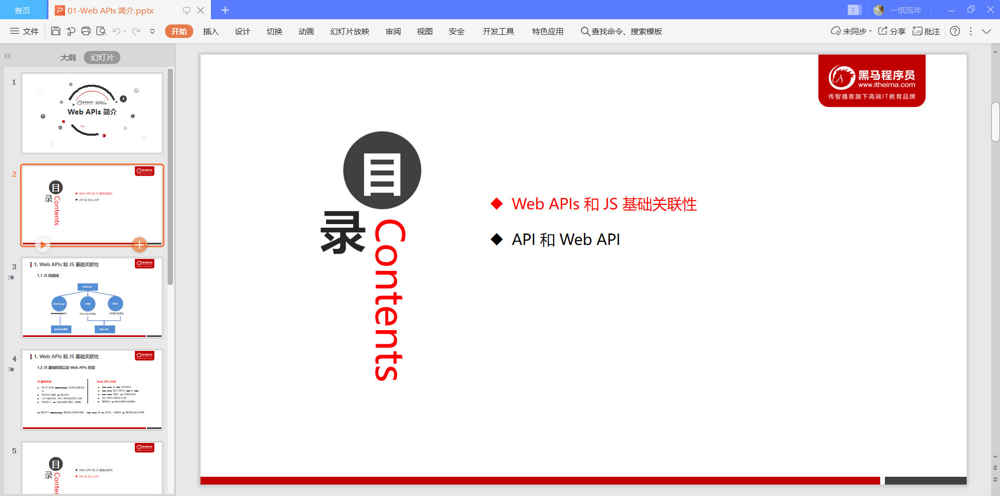
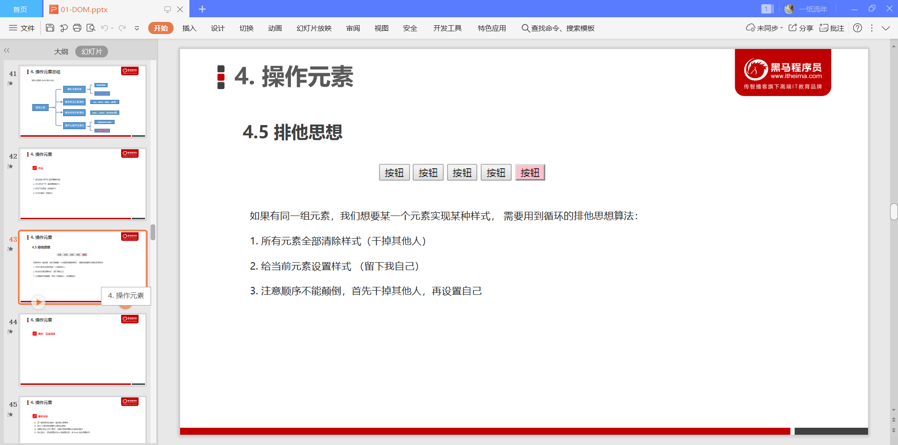
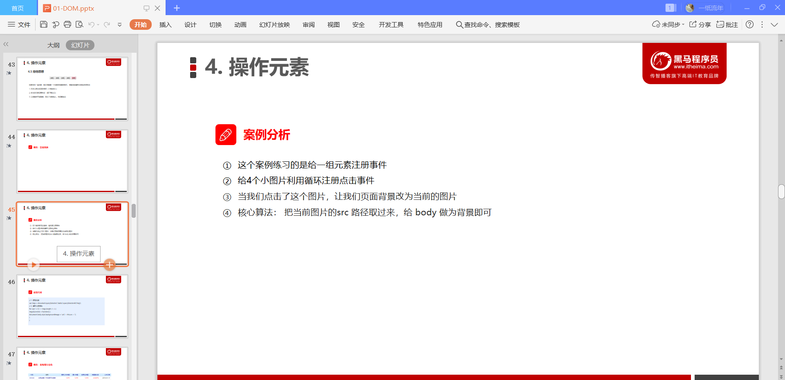
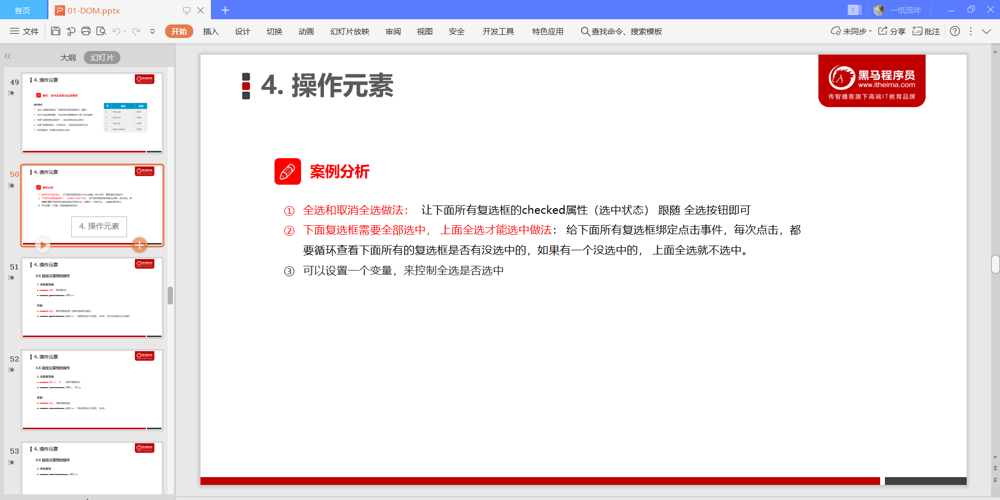
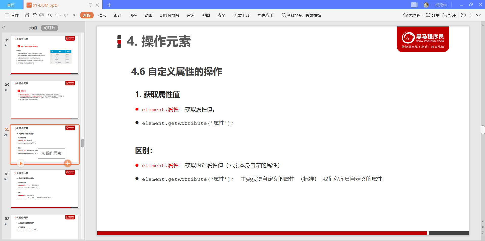
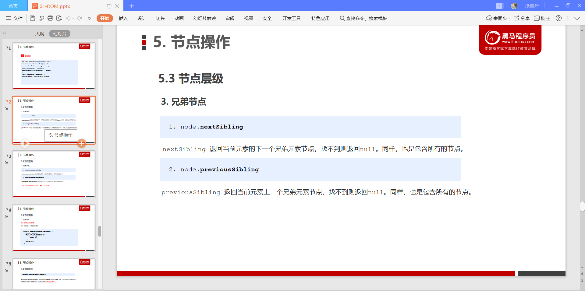
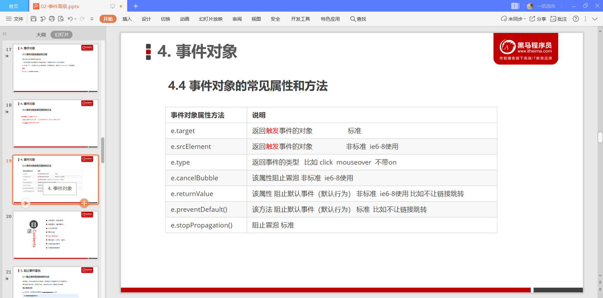

# DOM、BOM基础

# Web APIs简介

## 1. Web APIs和JS基础关联性

### 1.1 JS的组成

### 1.2 JS基础阶段以及Web APIs阶段

## 2. API和Web API

### 2.1 API

### 2.2 Web API

### 2.3 API和Web API总结

# DOM

## 1. DOM简介

### 1.1 什么是DOM

### 1.2 DOM树

## 2. 获取元素

### 2.1 如何获取页面元素

### 2.2 根据ID获取

### 2.3 根据标签名获取

### 2.4 通过HTML5新增的方法获取

### 2.5  获取特殊元素（body,html）

## 3. 事件基础

### 3.1 事件概述

### 3.2 事件三要素

### 案例一：点击按钮弹出警示框

### 3.3 执行事件的步骤

### 3.4 常见的鼠标事件

### 3.5 分析事件三要素

## 4. 操作元素

### 4.1 改变元素内容

### 4.2 常见元素的属性操作

### 案例

### 4.3 表单元素的属性操作

### 案例：仿京东显示密码

### 4.4 样式属性操作

### 案例：淘宝点击关闭二维码

### 案例：循环精灵图背景

### 案例：显示隐藏文本框内容

### 4.5 样式属性操作

### 案例：密码框格式提示错误信息

### 操作元素总结

### 作业

### 4.6 排他思想

### 案例：百度换肤

### 案例：表格隔行变色

### 案例：表单全选取消全选案例

### 4.7 自定义属性的操作

#### 1. 获取属性值

#### 2. 设置属性值

#### 3. 移除属性

#### 案例：tab栏切换

### 4.8 H5自定义属性

#### 1.设置H5自定义属性

#### 2. 获取H5自定义属性

## 5. 节点操作

 

### 5.1 为什么学节点操作

### 5.2 节点概述

### 5.3 节点层级

#### 1.父级节点：parentNode

#### 2.子节点:

##### 2.1 childNode

##### 2.2 children

##### 2.3 firstChild、lastChild

##### 2.4 firstElementChild、lastElementChild

##### 2.5 子元素节点小结

#### 案例：下拉菜单

#### 3.兄弟节点

##### 3.1.nextSibling

##### 3.2.previousSibing

##### 3.3.nextElementSibling

##### 3.4.previousElementSibling

##### 3.5 兄弟节点小结

### 5.4 创建节点

### 5.5 添加节点

### 案例：简单版发布留言案列

### 5.6 删除节点

### 案例：删除留言板案例

### 5.7 复制节点

### 案例：动态生成表格

### 5.8 三种动态创建元素区别

## 5.6 DOM重点核心

### 6.1 创建

### 6.2 新增

### 6.3  删除

### 6.4 修改

### 6.5 查询

### 6.6 属性操作

### 6.7 事件操作

# 事件高级

## 1.注册事件（绑定事件）

### 1.1 注册事件概述

### 1.2 addEventListener 事件监听方式

### 1.3  attachEvent  事件监听方式

### 1.4 注册事件兼容性解决方案

## 2.删除事件（解绑事件）

### 2.1 删除事件的方式

### 2.2 删除事件兼容性解决方案

## 3.DOM事件流

## 4.事件对象

### 4.1 什么是事件对象

### 4.2 事件对象的使用语法

### 4.3 事件对象的兼容性方案

### 4.4 事件对象的常见属性和方法

## 5.阻止事件冒泡

### 5.1 阻止事件冒泡的两种方式

### 5.2  阻止事件冒泡的兼容性解决方案

## 6.事件委托（代理，委派）

## 7.常用的鼠标事件

### 7.1 常用的鼠标事件

### 7.2 鼠标事件对象

### 案例：跟随鼠标的天使

## 8.常用的键盘事件

### 8.1 常用键盘事件

### 8.2 键盘事件对象

### 8.3 ASCLL表

### 案例：模拟京东按键输入内容

### 案例：模拟京东快递单号查询

# BOM浏览器对象模型

## 1.BOM概述

### 1.1 什么是BOM

### 1.2 BOM的构成

## 2.window对象的常见事件

### 2.1 窗口加载事件

### 2.2 调整窗口大小事件

## 3.定时器

### 3.1 两种定时器

### 3.2 setTimeout()定时器

### 案例：5s后自动关闭的广告

### 3.3 停止setTimeout()定时器

### 3.4 setInterval()定时器

### 案例：京东计时器

### 3.5 停止setInterval()定时器

### 案例：发送短信

### 3.6 this

### 案例：时钟

## 4. JS执行机制

### 4.1 JS是单线程

### 4.2 同步和异步

### 4.3 同步和异步

### 4.4 JS执行机制

## 5.location 对象

### 5.1 什么是location对象

### 5.2 URL

### 5.3 location 对象的属性

### 案例：5s之后自动跳转页面

### 案例：获取URL参数数据

### 5.4 location对象的方法

## 6. navigator对象

## 7.history对象

