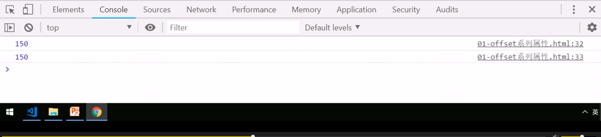

# PC端网页特效

## 1.元素偏移量offset系列

### 1.1 offset概述

### 1.2 offset与style区别

### 案例：获取鼠标在盒子内的坐标

### 案例：模态框拖拽

### 案例：仿京东放大境

## 2. 元素可视区 client系列

### 案例：淘宝flexible.js源码分析

## 3.元素滚动scroll系列

### 3.1 元素scroll系列属性

### 3.2 页面被卷去的头部

### 案例：仿淘宝固定右侧侧边栏

### 元素scrollTop与页面pageYOffSet

### 3.3 页面被卷去的头部兼容性解决方案

## 三大系列比较

## 三大系列总结

## mouseenter 和mouseover的区别

## 4.动画函数封装

### 4.1 动画实现原理

### 4.2 动画函数简单封装

### 4.3 动画函数给不同元素记录不同定时器

### 4.4 缓懂效果原理

### 4.5 动画函数多个目标之间移动

### 4.6 动画函数添加回调函数

### 4.7 动画函数封装到单独JS文件里面

## 5.常见网页特效案例

### 案例：网页轮播图

### 5.1 节流阀

### 案例：返回顶部

### 案例：筋斗云案例

