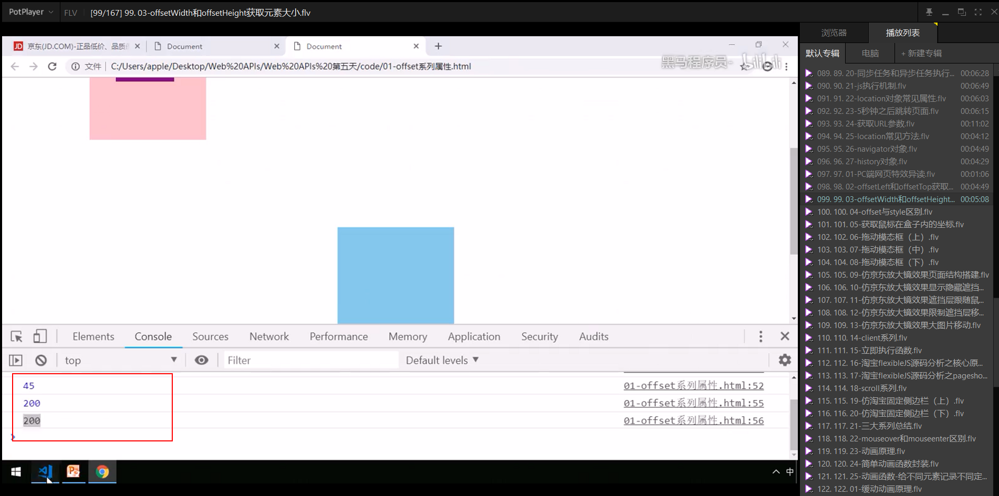
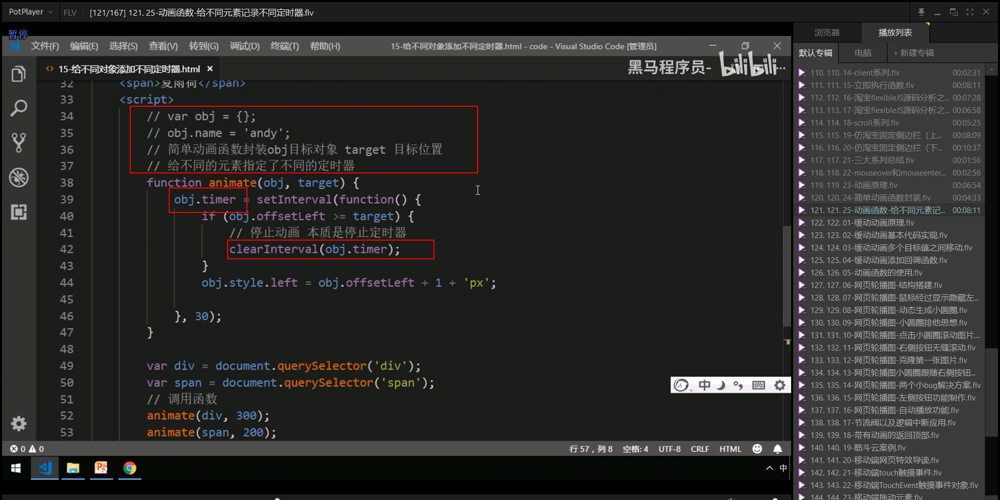
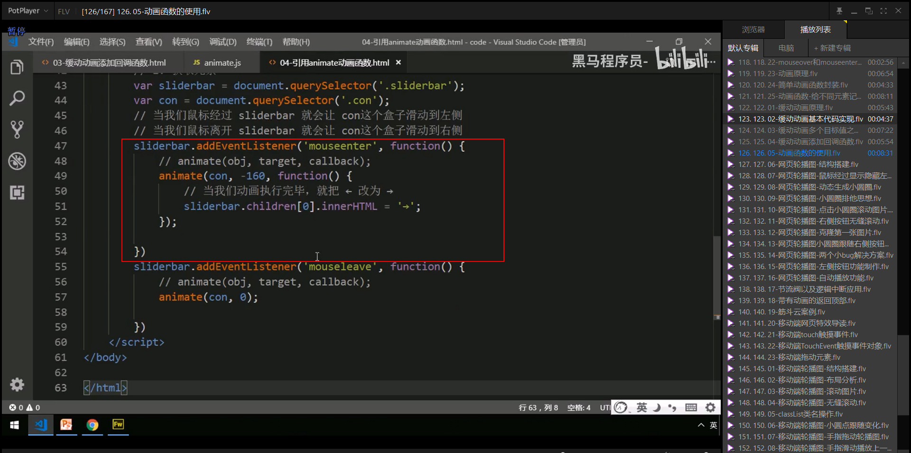

# PC端网页特效

## 1.元素偏移量offset系列

### 1.1 offset概述

### 1.2 offset与style区别

### 案例：获取鼠标在盒子内的坐标

~~~html
<!DOCTYPE html>
<html lang="en">
<head>
    <meta charset="UTF-8">
    <meta name="viewport" content="width=device-width, initial-scale=1.0">
    <title>Document</title>
    
</head>
<body>
    

</body>

</html>
~~~

### 案例：模态框拖拽

### 案例：仿京东放大境

## 2. 元素可视区 client系列

### 2.1立即执行函数

### 案例：淘宝flexible.js源码分析

## 3.元素滚动scroll系列

### 3.1 元素scroll系列属性

可以说说scrollHeight是内容的大小，也就是实际的大小。

### 3.2 页面被卷去的头部

### 案例：仿淘宝固定右侧侧边栏

### 元素scrollTop与页面pageYOffSet

~~~html
<!DOCTYPE html>
<html lang="en">
<head>
    <meta charset="UTF-8">
    <meta name="viewport" content="width=device-width, initial-scale=1.0">
    <title>Document</title>
    
</head>
<body>
    
这是nav

    
这是header

    
这是一个main

    

        返回顶部
    

</body>

</html>
~~~

### 3.3 页面被卷去的头部兼容性解决方案

## 三大系列比较

## 三大系列总结

## mouseenter 和mouseover的区别(面试题)

## 4.动画函数封装

### 4.1 动画实现原理

### 4.2 动画函数简单封装

封装animate.js

~~~java
function animate(obj, target, callback) {
    // console.log(callback);  callback = function() {}  调用的时候 callback()

    // 先清除以前的定时器，只保留当前的一个定时器执行
    clearInterval(obj.timer);
    obj.timer = setInterval(function() {
        // 步长值写到定时器的里面
        // 把我们步长值改为整数 不要出现小数的问题
        // var step = Math.ceil((target - obj.offsetLeft) / 10);
        var step = (target - obj.offsetLeft) / 10;
        step = step > 0 ? Math.ceil(step) : Math.floor(step);
        if (obj.offsetLeft == target) {
            // 停止动画 本质是停止定时器
            clearInterval(obj.timer);
            // 回调函数写到定时器结束里面
            // if (callback) {
            //     // 调用函数
            //     callback();
            // }
            callback && callback();
        }
        // 把每次加1 这个步长值改为一个慢慢变小的值  步长公式：(目标值 - 现在的位置) / 10
        obj.style.left = obj.offsetLeft + step + 'px';

    }, 15);
}
~~~

引入：animate.js

~~~html
<!DOCTYPE html>
<html lang="en">

<head>
    <meta charset="UTF-8">
    <meta name="viewport" content="width=device-width, initial-scale=1.0">
    <meta http-equiv="X-UA-Compatible" content="ie=edge">
    <title>Document</title>
    
    
</head>

<body>
    

        ←
        
问题反馈

    

    
</body>

</html>
~~~

### 4.3 动画函数给不同元素记录不同定时器

### 4.4 缓动效果原理

### 4.5 动画函数多个目标之间移动

### 4.6 动画函数添加回调函数

我们先来看看回调的英文定义：A callback is a function that is passed as an argument to another function and is executed after its parent function has completed。

　　字面上的理解，回调函数就是传递一个参数化的函数，就是将这个函数作为一个参数传到另一个主函数里面，当那一个主函数执行完之后，再执行传进去的作为参数的函数。走这个过程的参数化的函数 就叫做回调函数。换个说法也就是被作为参数传递到另一个函数（主函数）的那个函数就叫做 回调函数。

    　举一个别人举过的例子：约会结束后你送你女朋友回家，离别时，你肯定会说：“到家了给我发条信息，我很担心你。” 对不，然后你女朋友回家以后还真给你发了条信息。小伙子，你有戏了。其实这就是一个回调的过程。你留了个参数函数（要求女朋友给你发条信息）给你女朋友，然后你女朋友回家，回家的动作是主函数。她必须先回到家以后，主函数执行完了，再执行传进去的函数，然后你就收到一条信息了。
    
     回调函数应用场景多用在使用 js 写组件时和耗时操作上面，尤其是组件的事件很多都需要回调函数的支持。
————————————————
版权声明：本文为CSDN博主「huwao」的原创文章，遵循CC 4.0 BY-SA版权协议，转载请附上原文出处链接及本声明。
原文链接：https://blog.csdn.net/hu_belif/java/article/details/80284140

### 4.7 动画函数封装到单独JS文件里面

## 5.常见网页特效案例

### 案例：网页轮播图

### 5.1 节流阀

### 案例：返回顶部

~~~html
<!DOCTYPE html>
<html lang="en">
<head>
    <meta charset="UTF-8">
    <meta name="viewport" content="width=device-width, initial-scale=1.0">
    <title>Document</title>
    
</head>
<body>
    
这是nav

    
这是header

    
这是一个main

    

        返回顶部
    

</body>

</html>
~~~

### 案例：筋斗云案例

~~~ html
<!DOCTYPE html>
<html lang="en">
<head>
    <meta charset="UTF-8">
    <meta name="viewport" content="width=device-width, initial-scale=1.0">
    <title>Document</title>
    
</head>
<body>
    

        
        <ul class="nav-list">
            <li style="color:green;font-weight: 700;"><a href="#">首页新闻</a></li>
            <li><a href="#">师资力量</a></li>
            <li><a href="#">活动策划</a></li>
            <li><a href="#">企业文化</a></li>
            <li><a href="#">招聘信息</a></li>
            <li><a href="#">公司简介</a></li>
            <li><a href="#">我是佩奇</a></li>
            <li><a href="#">啥是佩奇</a></li>
        </ul>
    

</body>

</html>
~~~

