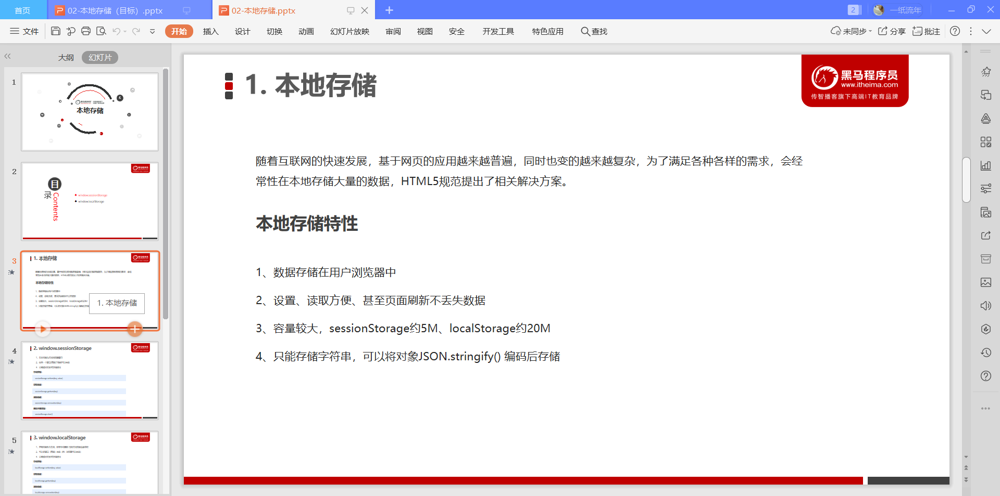

# 本地存储

## 1.本地存储

本地存储特点:

1.设置，读取方便，甚至页面刷新不丢失数据（sessionStorage、localStorage);

2.容量大，sessionStorage约有5M,localStorage约有20M

3.只能存储字符串，可以将对象JSON.stringify()编码后保存。

测试可以发现:   www.todolist.cn,采用的是localStorage方法，将数据保存到浏览器中。基本上相当于永久保存

## 2.window.sessionStorage

特点:

1.生命周期为关闭浏览器窗口。

2.在同一个窗口（页面）下数据可以共享。

3.以键值对的形式存储使用。

~~~ html
<!DOCTYPE html>
<html lang="en">
<head>
    <meta charset="UTF-8">
    <meta name="viewport" content="width=device-width, initial-scale=1.0">
    <title>Document</title>
</head>
<body>
    <input type="text" name = 'uname' class="text" placeholder="输入数据"/>
    <button class="set">存入数据</button>
    <button class="get">获取数据</button>
    <button class="remove">删除数据</button>
    <button class="clear-all">清除所有数据</button>
    

        <input type="text" class="show" placeholder="显示数据"/>
    

</body>

</html>
~~~

## 3.window.localStorage

window.localStorage

1.声明周期永久生效，除非手动删除，否则关闭页面也会存在

2.可以多窗口（页面） 共享（同一个浏览器可以共享）

3.以键值对的形式存储使用

~~~html
<!DOCTYPE html>
<html lang="en">
<head>
    <meta charset="UTF-8">
    <meta name="viewport" content="width=device-width, initial-scale=1.0">
    <title>Document</title>
</head>
<body>
    <input type="text" name = 'uname' class="text" placeholder="输入数据"/>
    <button class="set">存入数据</button>
    <button class="get">获取数据</button>
    <button class="remove">删除数据</button>
    <button class="clear-all">清除所有数据</button>
    

        <input type="text" class="show" placeholder="显示数据"/>
    

</body>

</html>
~~~

## 案例：记住用户名

~~~html
<!DOCTYPE html>
<html lang="en">
<head>
    <meta charset="UTF-8">
    <meta name="viewport" content="width=device-width, initial-scale=1.0">
    <title>Document</title>
</head>
<body>
    

        <label for="userName">用户名:</label>
        <input type="text" name = 'userName' id="userName" />
    

    

        <label for="userPwd">密码:</label>
        <input type="password" name = 'userPwd' id="userPwd" />
    

    <input type="checkbox" id = 'remeber' name = 'remeber'>
    <label for="remeber">记住用户名，密码。</label>
</body>

</html>
~~~

