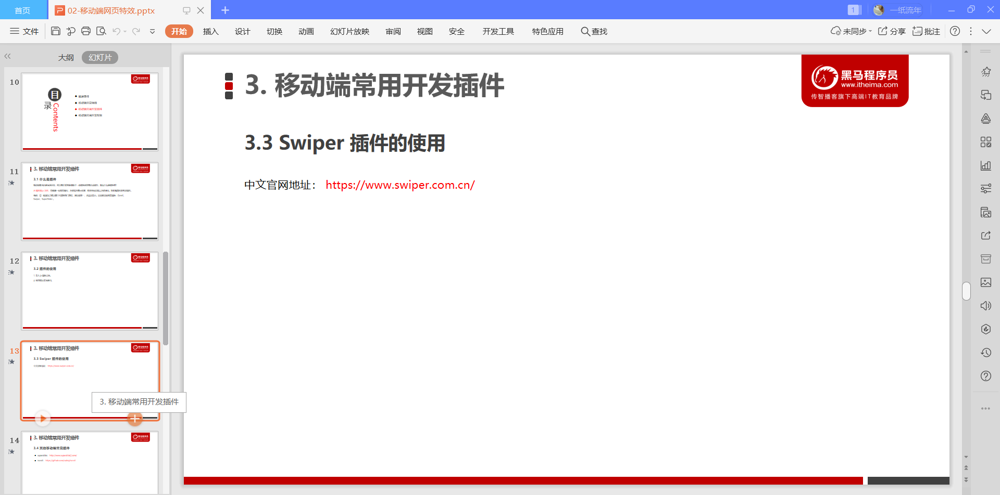

# 移动端网页特效

## 1.触屏事件

### 1.1 触屏事件概述

#### touchstart

#### touchmove

#### touchend

### 1.2 触屏事件对象（TouchEvent）

#### touches

#### targetTouches

#### changedTouches

#### 特殊：手机离开DOM元素事件

##### 具有changedTouches

##### 没有targetTouches

##### 没有touches

##### 触摸：第一根手指实例

### 1.3 移动端拖动元素

计算鼠标触摸时候的位置，并保存。

触摸时获取触摸时候的DOM的相对于屏幕的位置

计算手指划动的距离（也就是划动事件里面手指的位置，减去手指的初始位置。）

在手指划动事件中同时改变DOM的定位的位置（此时默认DOM已经进行了绝对定位）

阻止屏幕滚动的默认行为。

~~~html
<!DOCTYPE html>
<html lang="en">
<head>
    <meta charset="UTF-8">
    <meta name="viewport" content="width=device-width, initial-scale=1.0">
    <title>Document</title>
    
</head>
<body>
    

    

</body>

</html>
~~~

## 2.移动端常见特效

### 案例：移动端轮播图

### 2.1 classList属性

不同于className的直接覆盖所有类名，此处的add，始终是在原来的类名的基础上，在新增一个类名。

### 案例：返回顶部

## 3.移动端常用开发插件

### 3.1 什么是插件

### 3.2 插件的使用

### 3.3 Swiper插件的使用

### 3.4 其他移动端常见插件

### 3.5 click延时解决方案

### 3.6 移动端视频插件-zy.media.js

## 4. 移动端常用开发框架

### 4.1 框架概述

### 4.2 Bootstrap

### 4.3 MUI原生UI前端框架

