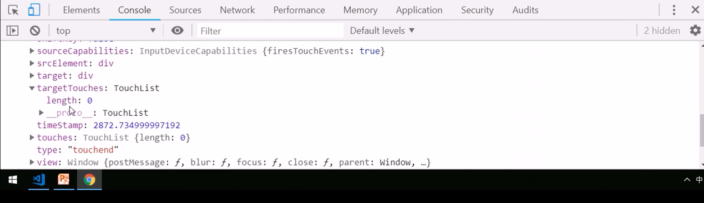
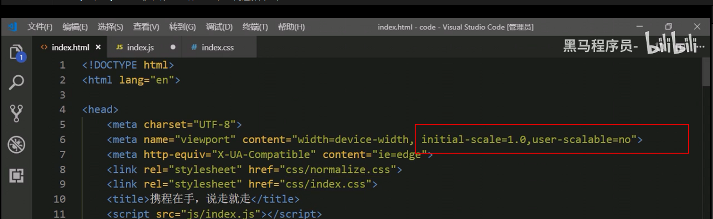

# 移动端网页特效

## 1.触屏事件

### 1.1 触屏事件概述

### 1.2 触屏事件对象（TouchEvent）

### 1.3 移动端拖动元素

## 2.移动端常见特效

### 案例：移动端轮播图

### 2.1 classList属性

### 案例：返回顶部

## 3.移动端常用开发插件

### 3.1 什么是插件

### 3.2 插件的使用

### 3.3 Swiper插件的使用

### 3.4 其他移动端常见插件

### 3.5 click延时解决方案

### 3.6 移动端视频插件-zy.media.js

## 4. 移动端常用开发框架

### 4.1 框架概述

### 4.2 Bootstrap

### 4.3 MUI原生UI前端框架

