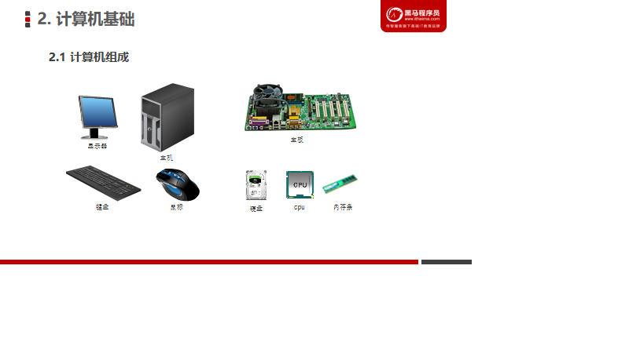
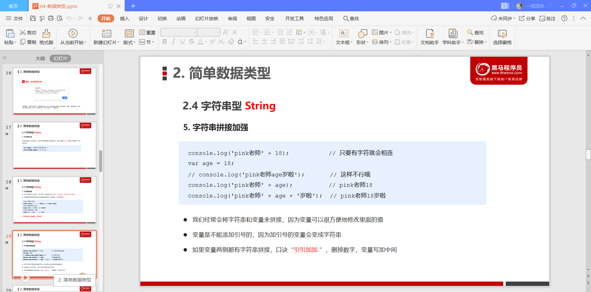
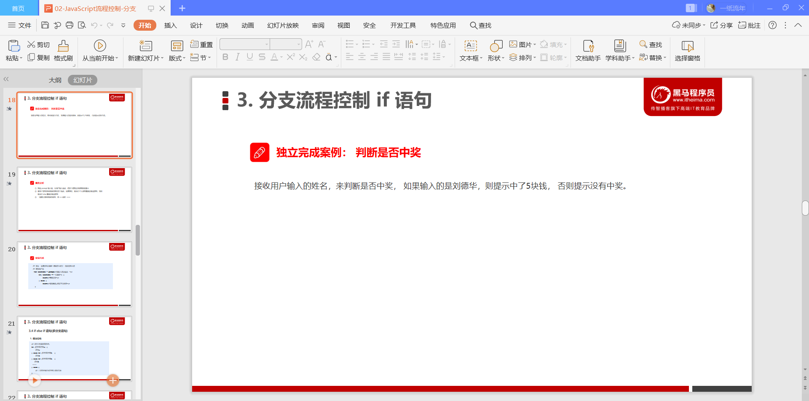
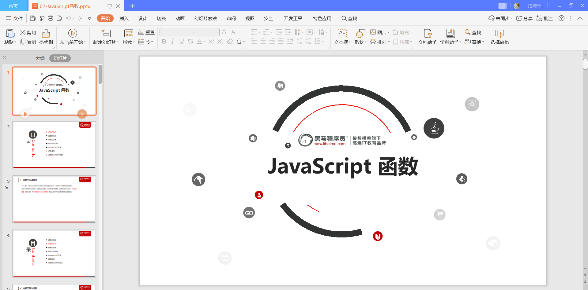
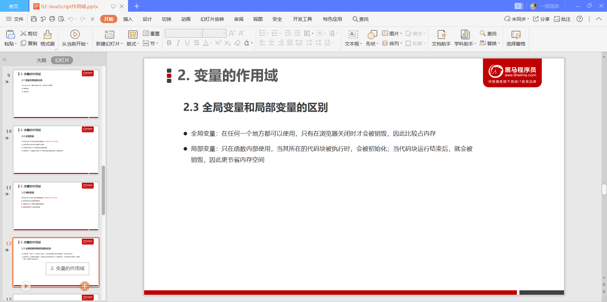
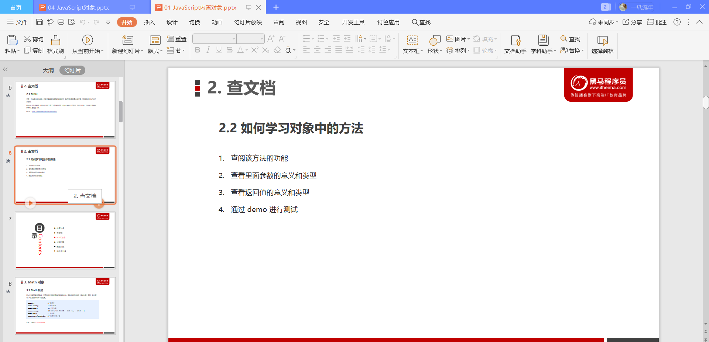
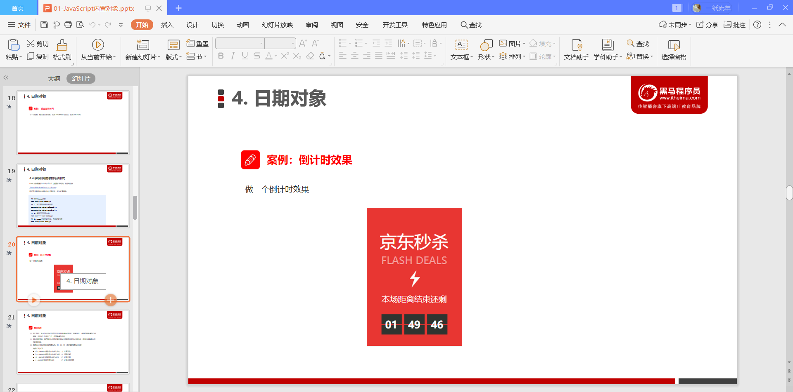
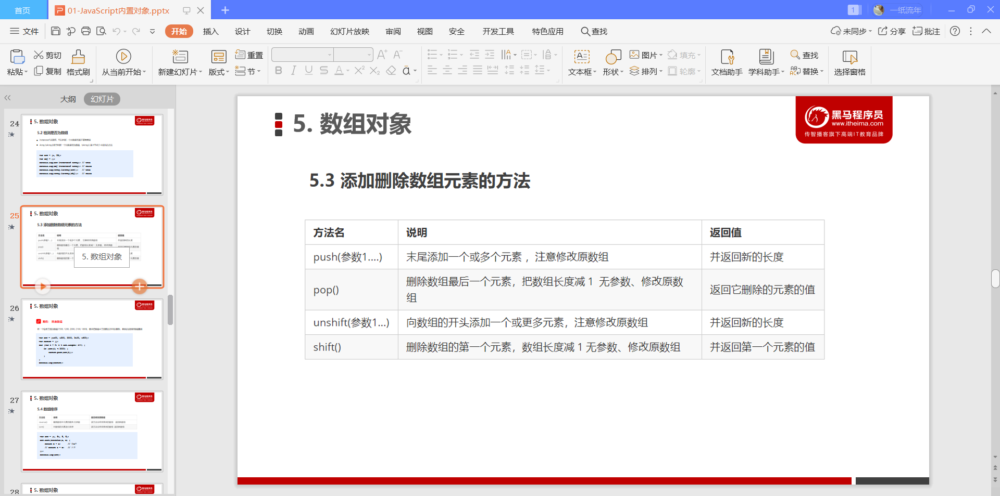

# JavaScript基础


## 计算机基础


​	

### 1.编程语言

#### 1.1编程


#### 1.2 计算机语言


#### 1.3 编程语言


#### 1.4 翻译器


#### 1.5 编程语言和标记语言的区别


#### 总结


### 2.计算机基础

#### 2.1计算机组成





#### 2.2 数据存储


#### 2.3 数据存储单位


#### 2.4 程序运行


## 初识Javascript


### 1.初识JavaScript


​	 **布兰登艾奇**

	#### 1.1 JavaScript是什么


#### 1.2 JavaScript的作用


#### 1.3 HTML/CSS/JS的关系


#### 1.4 浏览器执行JS简介


​      渲染引擎：解析HTML和CSS，如浏览器的blink,老版本的webkit

​      JS引擎：也称为JS解释器，读取，解析后运行js代码,比如chrome浏览器的V8,逐行解释每一句源码（转换为机器语言），然后由计算机去执行。


#### 1.5 JS的组成


​    javaScript由三部分组成，分别是ECMAScript（JavaScript语法），DOM(页面文档对象模型)，BOM(浏览器对象模型)这三部分组成

##### 1.ECMAScript


##### 2.DOM-文档对象模型


##### 3.BOM-浏览器对象模型


#### 1.6JS初体验

##### 1.行内式JS


~~~html
<!DOCTYPE html>
<html lang="en">
<head>
    <meta charset="UTF-8">
    <meta name="viewport" content="width=device-width, initial-scale=1.0">
    <title>Document</title>
</head>
<body>
    <!-- 行内式JS -->
    <input type="text" onclick="alert('干嘛点我')">
</body>
</html>
~~~


##### 2.内嵌JS


##### 3.外部JS文件


**注意：引用外部JS文件的script标签中间不可以写代码，否则将只执行标签中间的js代码，而不是外部js代码**


### 2. JavaScript注释


#### 2.1 单行注释


~~~javascript
  // 单行注释 ctrl + /
    console.log('单行注释');
~~~


#### 2.2 多行注释


~~~javascript
 /* 多行注释 alt+shift+a */
    console.log('多行注释');
~~~


#### 2.3 文档注释（添加）

~~~javascript
 /**
    * 
    * 文档API注释 /**+enter
    *
    */
   console.log('文档注释');
~~~


### 3.JavaScript输入输出语句


~~~html
<!DOCTYPE html>
<html lang="en">
<head>
    <meta charset="UTF-8">
    <meta name="viewport" content="width=device-width, initial-scale=1.0">
    <title>Document</title>
</head>
<body>
</body>
<script>
    var input = prompt('请输入你的年龄')
    alert('你的年龄是'+input);
    console.log('你的年龄是'+input);
</script>
</html>
~~~


## 变量


### 1.变量的概述

#### 1.1 什么是变量


#### 1.2 变量在内存中的存储


**可以如此理解，变量声明：就是在内存中申请一块用来存放数据的空间，也就是"预定酒店"，变量赋值：就是将值存放如内存空间中，也就是相当于"入住酒店"**


### 2.变量的使用

#### 2.1 声明变量


 **通过变量名来访问内存中给对应变量分配的空间**

#### 2.2 赋值


#### 2.3 变量的初始化

变量的初始化：就是在声明一个变量的同时也给这个变量赋值，一步完成。这个过程就是变量的初始化。


#### 2.4 案例一


#### 2.5 案例二


~~~html
<!DOCTYPE html>
<html lang="en">
<head>
    <meta charset="UTF-8">
    <meta name="viewport" content="width=device-width, initial-scale=1.0">
    <title>Document</title>
</head>
<body>
</body>
<script>
    var uName = prompt('请输入你的用户名');
    alert('你的姓名是:'+uName);
</script>
</html>
~~~


###  3.变量语法的拓展

#### 3.1 更新变量


#### 3.2 同时声明多个变量


~~~html
<!DOCTYPE html>
<html lang="en">
<head>
    <meta charset="UTF-8">
    <meta name="viewport" content="width=device-width, initial-scale=1.0">
    <title>Document</title>
</head>
<body>
    
</body>
<script>
    var a = 15, b="name", c=true;
    console.log(a);
    console.log(b);
    console.log(c);
</script>
</html>
~~~


#### 3.3 声明变量特殊情况


### 4.变量命名的规范


第一组中： 第五个以数字开头====》不合法

第二组中：第五个包含了非法字符&====》不合法

第三组中：第五个以for也就是关键字===》不合法


### 实例一


~~~html
<!DOCTYPE html>
<html lang="en">
<head>
    <meta charset="UTF-8">
    <meta name="viewport" content="width=device-width, initial-scale=1.0">
    <title>Document</title>
</head>
<body>
</body>
<script>
   var uName = 'smith',age=88;
   console.log(uName,age);
   var temp;
    temp = uName;
    uName = age;
    age = temp;
    console.log(uName,age);
</script>
</html>
~~~


### 5.小结


~~~html
<!DOCTYPE html>
<html lang="en">
<head>
    <meta charset="UTF-8">
    <meta name="viewport" content="width=device-width, initial-scale=1.0">
    <title>Document</title>
</head>
<body>
    
</body>
<script>
    var a = 10;
    console.log(a); // 10 
    var b;
    console.log(b); // undefined
    console.log(name); // 什么也没有
    console.log(d); // d is not defined
</script>
</html>
~~~


## 数据类型


### 1. 数据类型简介

#### 1.1 为什么需要数据类型


#### 1.2 变量的数据类型


#### 1.3 数据类型的分类


JS中把数据类型分成了两类

1.简单数据类型，包括（Number,String,Boolean,Undefined,Null）

2.复杂数据类型，包括（Object,Function,Array);

#### **typeof 操作符**

由于`js`中的变量是松散类型的，所以它提供了一种检测当前变量的数据类型的方法，也就是typeof关键字.

typeof  123　　 //number

typeof NaN       // number

typeof  'abc'　　//string

typeof   true    //boolean

typeof   undefined  //undefined

typeof   null     //object

typeof   { }      //object

typeof   [ ]      //object

typeof   console.log()    //function

null类型进行typeof操作符后，结果是object，原因在于，null类型被当做一个空对象引用。既然是一个对象，那么其typeof的值必然为object.

##### **1.Number类型**

Number类型包含整数和浮点数（浮点数数值必须包含一个小数点，且小数点后面至少有一位数字）两种值。

NaN:非数字类型。特点：① 涉及到的 任何关于NaN的操作，都会返回NaN  ② NaN不等于自身。也就是NaN == NaN和

NaN === NaN均返回false

isNaN() 函数用于检查其参数是否是非数字值。

isNaN(123)  //false  isNaN("hello")  //true

##### **2.String类型**

字符串有length属性。

字符串转换：转型函数String(),适用于任何数据类型（null,undefined 转换后为null和undefined）；toString()方法（null,undefined没有toString()方法）。

~~~java
var param1 = undefined;
var param2 = null;
param1 = new String(param1);
param2 = new String(param2);
console.log(typeof param1);//object
console.log(typeof param2);//object
// 结果对象是一个伪数组么？
console.log(Array.isArray(param1));//false
console.log(Array.isArray(param2));//false
// 很明显返回的是一个字符串形式的伪数组
console.log(Array.isArray([...param1]));//true
console.log(param1.length);//9
console.log(param2.toString());
for(var item in param1){
    console.log(item); // 0 1,2,3,4,5.6.7.8.9
}
~~~


##### **3.Boolean类型**

该类型只有两个值，true和false

##### **4.Undefined类型**

只有一个值，即undefined值。使用var声明了变量，但未给变量初始化值，那么这个变量的值就是undefined。

注意：

~~~javasc
console.log(undefined == undefined);//true
console.log(undefined === undefined);//true
~~~


##### **5.Null类型**

null类型被看做空对象指针，前文说到null类型也是空的对象引用。

~~~javas
console.log(null == null);//true
console.log(null === null);//true
~~~


##### **6.Object类型**

**js中对象是一组属性与方法的集合**。这里就要说到引用类型了，**引用类型是一种数据结构**，用于将数据和功能组织在一起。引用类型有时候也被称为对象定义，因为它们描述的是一类对象所具有的属性和方法。

#### 三大引用类型

##### **1.Object类型**

我们看到的大多数类型值都是Object类型的实例，创建Object实例的方式有两种。

第一种是使用new操作符后跟Object构造函数，如下所示

var person = new Object();

person.name = "Micheal";

person.age = 24;

第二种方式是使用对象字面量表示法，如下所示

var person = {

　　name : "Micheal",

　　age : 24

};

或者var person = Object.create(原型);

##### **2.Array类型**

数组的每一项可以用来保存任何类型的数据，也就是说，可以用数组的第一个位置来保存字符串，第二个位置保存数值，第三个位置保存对象....另外，数组的大小是可以动态调整的。

创建数组的基本方式有两种

第一种是使用Array构造函数，如下所示

var colors = new Array("red","blue","yellow");

第二种是使用数组字面量表示法，如下所示

var colors = ["red","blue","yellow"];

##### **3 Function类型**

每个函数都是Function类型的实例，而且都与其他引用类型一样具有属性和方法。函数通常是使用函数声明语法定义的，如下所示

function sum(num1,num2){

　　return num1 + num2;

};

这和使用函数表达式定义函数的方式相差无几。

var sun = function (){

　　return sum1 + sum2;

};

**也就是说，js按照存储方式分为值类型和引用类型。那么他们的计算有什么区别呢？**

题目1： var a = 100;

　　　　var b = a;

　　　  a = 200;

　　　　console.log (b);

题目2： var a = {age : 20};

　　　　var b = a;

　　　　b.age = 21;

　　　　console.log (a.age);

题目1的答案是 100，题目2的答案是21，

题目1是简单的值类型，在从一个变量向另一个变量赋值基本类型时，会在该变量上创建一个新值，然后再把该值复制到为新变量分配的位置上。

此时，a中保存的值为 100 ，当使用 a 来初始化 b 时，b 中保存的值也为100，但b中的100与a中的是完全独立的，该值只是a中的值的一个副本，此后，
这两个变量可以参加任何操作而相互不受影响。也就是说基本类型在赋值操作后，两个变量是相互不受影响的。

题目2是引用类型，当从一个变量向另一个变量赋值引用类型的值时，同样也会将存储在变量中的对象的值复制一份放到为新变量分配的空间中。

这时保存在变量中的是对象在堆内存中的地址，所以，与简单赋值不同，这个值的副本实际上是一个指针，而这个指针指向存储在堆内存的一个对象。那么赋值操作后，
两个变量都保存了同一个对象地址，则这两个变量指向了同一个对象。因此，改变其中任何一个变量，都会相互影响。

因此，引用类型的赋值其实是对象保存在栈区地址指针的赋值，因此两个变量指向同一个对象，任何的操作都会相互影响


### 2.简单数据类型

#### 2.1 简单数据类型（基本数据类型）


#### 2.2 数字型Number


##### 1.数字型进制


~~~html
<!DOCTYPE html>
<html lang="en">
<head>
    <meta charset="UTF-8">
    <meta name="viewport" content="width=device-width, initial-scale=1.0">
    <title>Document</title>
</head>
<body>
    
</body>
<script>
    // 八进制与十进制
    var num1 = 017;
    console.log(num1);//15
    var num2  = 018;
    console.log(num2);//18
    var num3 = 019;
    console.log(num3);//19
    var num4 = 010;
    console.log(num4); //8
    var num5 = 012;
    console.log(num5); //10
    
    // 十六进制
    var num6 = 0x9;
    console.log(num6);//9

    var num7 = 0xa;
    console.log(num7);//10

    var num8 =0xa8;
    console.log(num8);//168
    
    // js中的最大值与最小值

    console.log(Number.MAX_VALUE);//1.7976931348623157e+308
    console.log(Number.MIN_VALUE);//5e-324

    console.log(Number.MAX_VALUE*2);//Infinity
    console.log(-Number.MAX_VALUE*2);//Infinity
    console.log(Number.MIN_VALUE*2);//1e-323
    console.log(-Number.MIN_VALUE*2);//-1e-323
</script>
</script>
</html>
~~~


此处需要注意Number.MIN_VALUE*2的值与其他的值有所区别。


##### 2.数字型范围


##### 3.数字型三个特殊值


##### 4.isNaN()


#### 2.3 字符串型String


**因为HTML标签里面的属性使用的是双引号，JS这里我们更推荐使用单引号**

##### 1.字符串引号嵌套

**JS可以使用单引号嵌套双引号，或者用双引号嵌套单引号（外双内单，外单内双)**


##### 2.字符串转义符


##### 3.字符串长度


字符串只是一个变量，怎么有length属性？这里设计到了字符串的包装类，也就是将.变量的字符串隐式的包装成了一个字符串。

##### 4.字符串拼接


**数值相加，字符相连**


##### 5.字符串拼接加强



**引引加加**


##### 案例：显示年龄


#### 2.4 布尔型Boolean


布尔值和数值相加的时候，存在隐式转换的情况，可以知道:

1. true被转成了1，false被转成了0；
2. 如果与字符串直接相加，则可以知道会形成字符串拼接操作,不会存在先隐式转换成数值这种情况；

**boolean值在涉及到字符串拼接的时候，并没有自动隐式转换成数值**


~~~javas
console.log(1 + 'smith');//1smith
console.log(true + 'smith');//truesmith
console.log('smith' + 1);//smith1
console.log('smith' + true);//smithtrue

console.log(0 + 'smith');//0smith
console.log(false + 'smith');//falsesmith
console.log('smith' + 0);//smith0
console.log('smith' + false);//smithfalse
~~~


关于if()判断情况下的boolean值情况

~~~javascript
if(-1){
    console.log('这是-1');//这是-1
    
}
if(0){ // 默认为false
    console.log('这是0');
    
}
if(1){
    console.log('这是1');//这是1
    
}
// undefined
if(undefined){ // 默认为false
    console.log('这是undefined');
    
}
// 空指针对象
if(null){ // 默认为false
    console.log('这是null');
    
}
// 空串
if(''){ // 默认为false
    console.log('这是"-"');
    
}
// 空串有空格
if('  '){
    console.log('这是"---"');//这是"---"
    
}
if(NaN){ // 默认为false
    console.log('这是NaN');
}

~~~


**所以，综合可以知道 0、''、NaN、undefined、null、都会被自动.转成false**


#### 2.5 Undefined和Null


**总结**


1. 对于undefined、null可以知道当与字符串拼接时候，不存在隐式转换，直接字面量想拼接成字符串；
2. 对于undefined、null可以知道当他们与boolean值想相加的时候，是存在隐式转换的，直接转成了相应的数字，而对于undefined,null，与数值相加，也会存在相应的隐式转换，其中undefined仍旧为数值型undefined,而null则隐式转换成0；
3. 对于undefined、null与数值相加，可以知道undefined仍然为undefined，而对于null,则被默认转换成了0；


### 3.获取变量数据类型

#### 3.1 获取检测变量的数据类型


这里哆嗦一句 typeof function(){} ,结果为function;

而对于obj,array,null,均返回object;


#### 3.2 字面量


### 4.数据类型转换


#### 4.1 什么是数据类型转换


#### 4.2 转换为字符串


#### 4.3 转换为数字型(重点)


~~~html
<!DOCTYPE html>
<html lang="en">
<head>
    <meta charset="UTF-8">
    <meta name="viewport" content="width=device-width, initial-scale=1.0">
    <title>Document</title>
</head>
<body>
</body>
<script>
    var num1  = "78.9999";
    var num2  = "78.1111";
    var num3 = '0.23';
    var num4 = '.23';
    var num5 = '023';
    var num6 = 'abc'
    var num7 = '123px';
    var num8 = 'px123';
    console.log("-----------parseInt------------------");
    // 向下取整
    console.log(parseInt(num1)); // 78
    console.log(parseInt(num2)); // 78
    console.log(parseInt(num3)); // 0
    console.log(parseInt(num4)); // NaN
    console.log(parseInt(num5)); // 23
    console.log(parseInt(num6)); // NaN
    console.log(parseInt(num7)); // 123
    console.log(parseInt(num8)); // NaN

    console.log("-----------parseFloat------------------");
    console.log(parseFloat(num1)); // 78.9999
    console.log(parseFloat(num2)); // 78.1111
    console.log(parseFloat(num3)); // 0.23
    console.log(parseFloat(num4)); // 0.23
    console.log(parseFloat(num5)); // 23
    console.log(parseFloat(num6)); // NaN
    console.log(parseFloat(num7)); // 123
    console.log(parseFloat(num8)); // NaN

    console.log("-----------Number-----------------------");
    console.log(Number(num1)); // 78.9999
    console.log(Number(num2)); // 78.1111
    console.log(Number(num3)); // 0.23
    console.log(Number(num4)); // 0.23
    console.log(Number(num5)); // 23
    console.log(Number(num6)); // NaN
    console.log(Number(num7)); // NaN
    console.log(Number(num8)); // NaN
    
    
</script>
</html>
~~~


减法存在隐式转换，因为year为一个字符串数值。


'+'对于字符串数值只能强制转换。


**代表空、否定的值会被转换成false,如 ""、0、NaN、null、undefined**

~~~javascript
  console.log("----------Boolean----------------------");
    var a = -7;
    console.log(Boolean(a));// true
    var b = -1;
    console.log(Boolean(b));// true
    var c = 0;
    console.log(Boolean(c));// false
    var d = "0";
    console.log(Boolean(d));// true
    
    var e= -1;
    if(e){
        console.log("-1的布尔值不为false"); //-1的布尔值不为false
    }
~~~


## 扩展阅读


### 1.解释型语言与编译型语言

#### 1.概述


#### 2.执行过程


### 2.标识符，关键字，保留字

#### 1.标识符


#### 2.关键字


#### 3.保留字


## JavaScript运算符


###  运算符

#### 1.运算符


### 算数运算符

#### 1.算术运算符概述


#### 2.浮点数的精度问题


**不要直接判断两个浮点数是否相等**


~~~html
<!DOCTYPE html>
<html lang="en">
<head>
    <meta charset="UTF-8">
    <meta name="viewport" content="width=device-width, initial-scale=1.0">
    <title>Document</title>
</head>
<body>
</body>
<script>
    var a = 0.1+0.2;
    console.log(a === 0.3);// false
    var b = 0.1+0.3;
    console.log(b === 0.4);//true
</script>
</html>
~~~


#### 3.课堂提问


#### 4.表达式和返回值


### 递增和递减运算符

#### 1.递增和递减运算符概述


#### 2.递增运算符

##### 1.前置递增运算符


##### 2.后置递增运算符


#### 3.递增和递减运算符练习


#### 4.前置递增和后置递增小结


### 比较运算符

#### 1.比较运算符概述


#### 2.=小结


#### 3.比较运算符练习


### 逻辑运算符

#### 1.逻辑运算符概述


#### 2.逻辑与 &&


#### 3.逻辑或 ||


#### 4.逻辑非 ！


#### 练习


#### 4.短路运算（逻辑中断）

##### 1.逻辑与


此处有一个问题，应该为算术运算符的优先级大于逻辑运算符的优先级。

~~~html
.// 逻辑与短路
console.log( 123 && 456 && 678);//678
console.log(0 && 1+2 && 100*678);//0
console.log(''&& 3+4 && 900);//''
console.log(null && 3+4 && 900);//null
console.log(NaN && 3+4 && 900);//NaN
console.log(undefined && 3+4 && 900);//undefined

~~~


##### 2.逻辑或


##### 3.逻辑中断（短路操作）


### 赋值运算符

#### 1.赋值运算符概述


### 运算符优先级

#### 1.运算符优先级概述


## JavaScript 流程控制-分支


### 1.流程控制


### 2..顺序流程控制


### 3.分支流程控制 if 语句

#### 3.1分支结构.


#### 3.2.if语句.

##### 1.语法结构.


##### 2.执行顺序.


##### 案例：进入网吧.


#### 3.3 if else语句（双分支语句）

##### 1.语法结构


##### 2.执行流程


##### 案例：判断闰年


##### 案例：判断是否中奖




#### 3.4 if else if语句（多分支语句）

##### 1.语法结构


##### 2.执行流程


##### 案例：判断成绩级别


### 4.三元表达式

##### 1.语法结构


##### 案例：数字补0


此处对于字符串形式的数值，比较的时候有一个隐式转换。直接将字符串形式的数值转成了数值。


### 5.分支流程控制switch 语句

##### 5.1语法结构


**注意case执行的是全等操作,进行选项判断的**


##### 案例：查询水果价格


##### 5.2  switch语句和if else if 语句的区别.


##### 作业


## JavaScript流程控制-循环


### 1.循环

#### 1.循环目的


#### 3.JS中的循环


### 2.for循环

#### 2.1语法结构


#### 执行过程


#### 断点调试


#### 2.2 for循环重复相同的代码


#### 2.3 for循环重复不相同的代码


#### 2.4 for循环重复某些相同操作


#### 案例：求1~100之间所有整数的累加和。


####　案例：求学生成绩


#### 案例：一行打印五个星星


### 3.双重for循环

#### 3.1双重for循环概述


#### 3.2 双重for循环语法


#### 3.3打印五行五列星星


#### 案例：打印n行n列的星星


#### 案例：打印倒三角形


#### 案例：打印正三角形


#### 案例：打印九九乘法表


#### 3.5 for循环小结


### 4.while 循环

#### 执行思路


#### 案例：打印人的一生


#### 案例：询问你爱我么


### 5.do while 循环


### 6.continue break

#### 6.1 continue关键字


#### 6.2 break关键字


## JavaScript命名规范以及语法格式


### 标识符命名规范


### 操作符规范


### 单行注释规范


### 其他规范


## JavaScript数组


### 1.数组的概念


### 2.创建数组

#### 2.1数组的创建的方式


#### 2.2 利用new创建数组


#### 2.3利用数组字面量创建数组


#### 2.4 数组元素的类型


### 3.获取数组中的元素

#### 3.1数组的索引


#### 数组练习


### 4.遍历数组


#### 4.1 数组的长度


#### 遍历数组


#### 案例：数组最大值


#### 案例：数组转换为字符串


#### 案例：数组转换为分割字符串


~~~javasc
var arr = ['aaa','bbb','ccc','dddd'];
var str = '';
var separator = '|'
for(var i=0;i<arr.length;i++){
    str += arr[i] + separator;
}
console.log(str);//aaa|bbb|ccc|dddd|
~~~


### 数组中新增元素

#### 5.1 通过修改length的长度新增数组元素


#### 5.2 通过修改数组索引新增数组元素


#### 案例：数组新增元素


#### 案例：筛选数组


**此处对于新数组，采用 j++方式来完成索引自增，也是可以的，但是更好的是采取如下模式
newArr[newArr.length],利用数组的length可以自动增长的方式来动态改变索引的值并且存入相应的元素**

如以下的示例：


### 数组案例

#### 案例1：删除指定的数组元素。


#### 案例2：翻转数组。


#### 案例3：数组排序（冒泡排序）


~~~javascript
// 随机生成一个数组
var arr = [];
for(let i = 0;i<20;i++){
    arr[i] = parseInt(Math.random()*100 )
}
console.log("打印随机生成的数组："+arr);
// 对随机生成的数组进行排序操作(主要采用冒泡排序)
for(var k =0;k<arr.length-1;k++){// 第一个循环用来控制循环的次数
    for(var n = 0; n<arr.length-k-1;n++){// 第二个循环用来控制比较的次数
        if(arr[n]>arr[n+1]){
            var temp = arr[n];
            arr[n] = arr[n+1];
            arr[n+1] = temp;
        }
    }
}
console.log("打印排序之后的arr:"+arr);
打印随机生成的数组：13,61,62,75,33,86,68,5,6,49,18,50,75,70,30,98,87,52,78,85
打印排序之后的arr:5,6,13,18,30,33,49,50,52,61,62,68,70,75,75,78,85,86,87,98
~~~


## JavaScript函数




### 1.函数的概念


### 2.函数的使用

#### 2.1 声明函数


#### 2.2 调用函数


#### 2.3 函数的封装


#### 案例：利用函数计算1-100之间的累加和


#### 2.4 pink老师提问


### 3.函数的参数

#### 3.1 形参和实参


#### 案例：利用函数求任意两个数的和


#### 3.2 函数参数的传递过程


#### 3.3 函数形参和实参个数不匹配问题


#### 3.4 小结


### 4.函数的返回值

#### 4.1 return 语句


#### 案例：利用函数求任意两个数的最大值


#### 案例：利用函数求任意一个数组中的最大值


#### 4.2 return 终止函数


#### 4.3 return 的返回值


#### 案例：创建一个函数，实现两个数之间的加减乘除运算，并将结果返回


**此处利用数组保存计算之后的值，然后将数组返回出来，比较节省时间**


#### 4.4 函数没有return 返回undefined


#### 4.5 break、continue、return的区别


### 5.arguments的使用

#### 案例：利用函数求任意个数的最大值


### 6.函数案例

#### 案例：利用函数封装方式，翻转任意一个数组


#### 案例：利用函数封装方式，对数组排序--冒泡排序


#### 案例：判断闰年


#### 函数可以调用另外一个函数


#### 案例：用户输入年份，输出当前年份2月份的天数


### 7.函数的两种声明方式


#### 7.1.自定义函数方式（命名函数）


#### 7.2 函数表达式方式（匿名函数）


## JavaScript作用域


### 1.作用域

#### 1.1 作用域概述


#### 1.2 全局作用域


#### 1.3 局部作用域（函数作用域）


**也就是说函数作用域和局部作用域是同一个概念的不同的解释术语**


#### 1.4 JS没有块级作用域


### 2.变量的作用域

#### 2.1 变量作用域的分类


#### 2.2 全局变量


#### 2.2 局部变量


​	函数的形参实际上就是相当于定义在函数内部的局部变量。


#### 2.3 全局变量和局部变量的区别。




### 3.作用域链


#### 案例1：结果是几？


#### 作用域链:采取就近原则的方式来查找变量最终的值


二、作用域链

这个大家都懂吧，作用域就是指变量的使用范围，除了函数以外,其他的任何位置用var定义的变量都是全局变量。注：js没有块级作用域

作用域链就是当一条执行语句用到某一个变量时，会先在本级作用域去找这个变量，如果没有找到，就到上一级作用域里去找，以此类推。
三、总结

~~~java
// 储备知识
function test(){
    console.log('test');  
}
console.log(test);//[Function: test]
test = 1;
console.log(test);//1 说明声明函数可以直接被替换掉，类似于重新赋值
~~~


看到这里，你是不是觉得比较简单，那么来做一道题吧：

~~~javascript
var a = 1;
function b(){
    a = 10;
    return;
    function a(){
        console.log(a);
    }
}
b();
console.log(a);

~~~

用到我刚才讲到知识，你觉得打印出的答案是多少呢？

如果你觉得答案是10，那么恭喜你，答错了！

有很多人会觉得进入函数b之后，让a赋值为10，之后就return了，所以结果是10。但是却忘了函数声明提升与作用域的问题。

我们先写出预解析的结果：

~~~java
function b(){
	function a(){
        console.log(a);
    }
    a = 10;
    return;
}
var a;
a=1;
b();
console.log(a);
~~~

这是代码预解析的结果，如果你不知道这个是怎么来的，那你再重新看看上面的讲解吧

从预解析的结果看，执行函数b时，函数b内有一个函数名为a的函数声明，且函数a下面有一个变量名为a的变量，且赋值为10。首先看函数a，由于在执行函数b的时候，并没有调用函数a，因此函数a并没有起作用；但是执行到a=10的时候，首先查找变量a的地址，从系统内存中开始按照作用域链查找，由于作用域链的查找顺序是由里向外的，故要先从函数b里面开始查找，在查找的过程中，发现函数b中已经声明了一个函数名为a的函数，所以查找到函数名为a的函数后，这里便不再往外查找，直接将a=10赋值给了函数名为a的这个函数对象，而外部的a不受影响。

## JavaScript预解析


### 1.预解析


### 2.变量预解析和函数预解析

#### 2.1 变量预解析（变量提升）


#### 2.2 函数预解析（函数提升）


但是对于匿名函数，JavaScript的预解析是它当作一个变量的预解析的形式来解析的么？


#### 2.3 解决函数表达式声明调用问题


~~~~java
fun1();//fun1 is not a function
var fun1 = function(){
    console.log('hello');
}
/*
因为预解析导致的函数声明提升，这里采用匿名函数，所以应该与变量提升一致的
可以知道 var fun1;变量提升，此时应该we
var fun1;
fun1();// fun1为undefined，此时fun1()报错误
fun1 = function(){
    console.log('hello');
}
*/
~~~~


#### 2.4 函数声明提升高于变量声明提升


## 一、预解析

1.先说js代码的预解析问题，js和许多其他语言不同，它在执行之前会预解析代码，意思就是**变量声明**和**函数声明**提升，值得注意的是**函数声明提升比变量声明提升的优先级高**，先来看几个例子：

~~~javas
console.log(a);//打出的是 undefined
var a=1;
console.log(a);//打出的是 1
~~~

上面的代码与下面的代码等价：

~~~java
var a;
console.log(a);
a=1;
console.log(a);

~~~

意思就是变量(函数)声明会提升到它的**作用域**的最上面，而变量的**赋值**还是在原来的位置。

2.**当函数名和变量名重名时**：我刚刚说函数声明提升比变量声明提升的优先级高，是什么意思呢？看下面的例子：

~~~java
function a() {};
var a;
console.log(a);
~~~

**上面这三行代码无论顺序是怎样的**，打印出的结果都是函数a，原因就是函数的声明提升会比变量的声明提升优先级高。但是我改动一下上面的代码就完全不一样了：

~~~java
var a=1;
function a() {};
console.log(a);//打印 1
~~~

那么为什么改动一下就变成打印1了呢？我们来仔细分析一下js预解析的结果：

~~~java
function a() {};//首先函数声明优先级最高
var a;//然后是变量
a=1;//然后给a赋值，此时a已经被赋值成一个number类型了
console.log(a);//所以打印出的是 1
~~~

3.说到函数的预解析，这里有一个易错点，看下面的代码：

~~~java
	f1();//报错
	console.log(f1);//undefined
    var f1=function () {
        console.log(a);
        var a=10;
    };
~~~

上面的f1()根本调用不了，会报错，它预解析之后的结果是这样的：

~~~java
	var f1;//变量声明提升
	f1();//报错
	console.log(f1);//undefined
    f1=function () {
        console.log(a);
        var a=10;
    };
    /*用一个变量去接收一个函数时，预解析只会让变量声明提升，当代码执行到它原来的位置时变量才被赋值
    成一个函数*/
~~~


#### 练习：结果是几？


~~~javascript
console.log(a);//[Function: a]
var a = 1;
console.log(a);//1
function a(){
    console.log(a);
}
/**
 * function a(){...}
 * var a;
 * console.log(a);
 * a = 1;
 * console.log(a)
 */
~~~


### 预解析案列

#### 案例1：结果是几？


结果为undefined


#### 案例2：结果是几？


~~~javascript
var num = 100;
function func(){
    console.log(num);//undefined
    var num = 10;
    console.log(num);//10
}
func();
~~~


#### 案例3：结果是几？


~~~javascript
var a = 16;
fn1();
function fn1(){
    var b = 9;
    console.log(a);//undefined
    console.log(b);//9
    var a = '123'
}
~~~


#### 案例4：结果是几？


~~~javascript
f1();
console.log(c);//9
console.log(b);//9
console.log(a);//a is not defined
function f1(){
    var a = b = c = 9;// 被拆成了 var a = 9; b = 9; c = 9;
    console.log(a);//9
    console.log(b);//9
    console.log(c);//9
}
~~~


## JavaScript对象


### 1.对象

#### 1.1 什么是对象？


#### 1.2 为什么需要对象


### 2.创建对象的三种方式


#### 2.1利用字面量创建对象


##### 对象的调用


#### 练习：按照要求写出对象


#### 变量、属性、函数、方法总结


#### 2.2 利用new Object创建对象


#### 练习：按照要求写出对象


#### 2.3 利用构造函数创建对象


构造函数里面的方法直接调用的时候，直接传递参数就可以了。.


##### 注意：


#### 练习：请按照要求创建对象


#### 2.4 构造函数和对象


### 3.new关键字


### 4.遍历对象属性


### 小结


### 作业


## JavaScript内置对象


### 1.内置对象


### 2.查文档

#### 2.1MDN


#### 2.2如何学习对象中的方法




### 3.Math对象

#### 3.1Math概述


#### 案例：封装自己的数学对象


#### 3.2 随机数方法random()


#### 案例：猜数字游戏


~~~html
<!DOCTYPE html>
<html lang="en">
<head>
    <meta charset="UTF-8">
    <meta name="viewport" content="width=device-width, initial-scale=1.0">
    <title>Document</title>
</head>
<body>
    
</body>
<script>
    // 生成1-10之间的随机数字
    function getRandomNum(startNum,endNum){
        return Math.floor(Math.random()*(endNum - startNum +1)) +startNum
    }
    // 调用函数
    var randdomNum = getRandomNum(1,10);
    while(true){
        var inputNum = window.prompt('请输入数字');
        if(inputNum > randdomNum){
            window.alert('你输入的数字太大了');
        } else if(inputNum == randdomNum){
            window.alert('你输入的数字正确');
            break;
        } else {
            window.alert('你输入的数字太小了');
        }
    }
</script>
</html>
~~~


### 4.日期对象

#### 4.1 Date概述


#### 4.2 Date()方法的使用

##### 1.获取当前的时间必须实例化


##### 2.Date构造函数的参数

~~~javascript
var date = new Date();
console.log(date);//2020-05-12T07:43:37.617Z

var date1 = new Date('2015-8-23');
console.log(date1);//2015-08-22T16:00:00.000Z

var date2 = new Date('2015-08-23');
console.log(date2);//2015-08-23T00:00:00.000Z


var date3 = new Date(2015,10,06);
console.log(date3);//2015-11-05T16:00:00.000Z


var date4 = new Date('2016-10-06 08:08:08');
console.log(date4);//2016-10-06T00:08:08.000Z


~~~


#### 4.3 日期格式化


#### 案例：输出当前日期


~~~javascript
//输出指定格式的当前日期
var date5 = new Date();
//获取年份
var year =  date5.getFullYear();
//获取月份(0-11)
var month = date5.getMonth()+1;
//获取日期
var date = date5.getDate();
//获取星期(0-6)
var day = date5.getDay();
//获取小时
var hours = date5.getHours();
//获取分钟
var minutes = date5.getMinutes();
//获取秒钟
var seconds = date5.getSeconds();

//设置星期数组
var week = ['星期天','星期一','星期二','星期三','星期四','星期五','星期六']
console.log(year+'年'+month+'月'+date+'日'+ week[day]);//2020年5月12日星期二.
~~~


#### 案例：输出当前时间


~~~javascript
// 获取当前时间
function getTime(){
    var date = new Date();
    //获取小时
    var hours = date.getHours();
    hours = hours < 10 ?'0'+hours :hours;
    //获取分钟
    var minutes = date.getMinutes();
    minutes = minutes < 10 ?'0'+minutes :minutes;
    //获取秒钟
    var seconds = date.getSeconds();
    seconds = seconds < 10 ?'0'+seconds :seconds;
    return hours + ":" + minutes + ":" + seconds
}
console.log(getTime());//16:26:05
~~~


#### 4.4获取日期的总的毫秒形式


~~~javascript
// 获取日期总的毫秒数
// 方式一
var millisecond1 = new Date().valueOf();
console.log(millisecond1);//1589272254554
// 方式二
var millisecond2 = new Date().getTime();
console.log(millisecond2);//1589272314409
// 方式三
var millisecond3 = + new Date();
console.log(millisecond3);//1589272387909
// 方式四
var millisecond4 =Date.now();
console.log(millisecond4);//1589272470060
~~~


#### 案例:计时器效果




~~~html
<!DOCTYPE html>
<html lang="en">
<head>
    <meta charset="UTF-8">
    <meta name="viewport" content="width=device-width, initial-scale=1.0">
    <title>Document</title>
    <style>
        .box{
            position: relative;
            width: 240px;
            height: 360px;
            background-color: #f00;
            margin: 30px auto;
        }
        .content{
            position: absolute;
            bottom: 25px;
            left: 0;
            right: 0;
            width: 220px;
            height: 70px;
            margin: 0 auto;
            display: flex;
            justify-content: space-evenly;
        }
        .content div{
            width: 60px;
            height: 70px;
            background-color: black;
            color:#fff;
            line-height: 70px;
            text-align: center;
            font-size:30px;
        }
        .content div span{
            display: block;
            position: relative;
            z-index: 999;
        }
        .line{
            position:absolute;
            bottom:60px;
            height: 0.5px;
            width: 100%;
            background-color: #f00;
        }

    </style>
</head>
<body>
    <div class="box">
        <div class="content">
            <div><span class="hour" >08</span></div>
            <div><span class="minute" >08</span></div>
            <div><span class="second" >08</span></div>
        </div>
        <div class="line">
        </div>
    </div>
</body>
<script>
    var hour = document.querySelector('.hour');
    var minute = document.querySelector('.minute');
    var second = document.querySelector('.second');
    //添加时间计算方法
    function getTime(time){
        // 获取当前的时间并转成毫秒数
        var nowTime = new Date().getTime();
        // 获取输入的时间并转成毫秒数
        var inputTime = new Date(time).getTime();
        // 计算与输入时间的差值,并且将差值转成秒数
        var differenceValue = (inputTime - nowTime) / 1000
        // 获取天数
        var day = parseInt(differenceValue / 60 / 60 / 24);// 天数，注意默认向下取整
        day = day < 10 ? '0' + day : day;
        var hour = parseInt(differenceValue /60 / 60 %24);// 小时数;
        hour = hour < 10 ? '0' + hour : hour;
        var minute = parseInt(differenceValue / 60 %60);
        minute = minute < 10 ? '0' + minute : minute;
        var second = parseInt(differenceValue % 60);
        second = second < 10 ? '0' + second : second;
        return [day,hour,minute,second]
    }
    // 设置定时器
    //并且设置初始时间
    var setTime = '2020-05-12 21:00:00'
    setInterval(function(){
        var arr = getTime(setTime);
        hour.innerHTML = arr[1];
        minute.innerHTML = arr[2];
        second.innerHTML = arr[3]
    },1000)
</script>
</html>
~~~


### 5.数组对象

#### 5.1 数组对象的创建


##### new Array创建数组


#### 5.2 检测是否为数组

#####  arrobj instanceof Array

##### Array.isArray()


#### 5.3 添加删除数组元素的方法





#### 案例：筛选数组


#### 5.4 数组排序


#### 5.5 数组索引方法


#### 案例：数组去重


#### 5.6 数组转换为字符串


#### 5.7课下查询


##### 1.concat():连接数组

concat() 方法用于连接两个或多个数组。

该方法不会改变现有的数组，而仅仅会返回被连接数组的一个副本。

~~~javascript
arrayObject.concat(arrayX,arrayX,......,arrayX)
arrayX	必需。该参数可以是具体的值，也可以是数组对象。可以是任意多个。
~~~

返回值

返回一个新的数组。该数组是通过把所有 arrayX 参数添加到 arrayObject 中生成的。如果要进行 concat() 操作的参数是数组，那么添加的是数组中的元素，而不是数组。

例一

在本例中，我们将把 concat() 中的参数连接到数组 a 中：

```javascript
<script type="text/javascript">

var a = [1,2,3];
document.write(a.concat(4,5));
</script>
```

输出：

```javascript
1,2,3,4,5
```

例二

在本例中，我们创建了两个数组，然后使用 concat() 把它们连接起来：

```javascript
<script type="text/javascript">

var arr = new Array(3)
arr[0] = "George"
arr[1] = "John"
arr[2] = "Thomas"

var arr2 = new Array(3)
arr2[0] = "James"
arr2[1] = "Adrew"
arr2[2] = "Martin"
document.write(arr.concat(arr2))
</script>
```

输出：

```javascript
George,John,Thomas,James,Adrew,Martin
```

例三

在本例中，我们创建了三个数组，然后使用 concat() 把它们连接起来：

```javascript
<script type="text/javascript">
var arr = new Array(3)
arr[0] = "George"
arr[1] = "John"
arr[2] = "Thomas"
var arr2 = new Array(3)
arr2[0] = "James"
arr2[1] = "Adrew"
arr2[2] = "Martin"
var arr3 = new Array(2)
arr3[0] = "William"
arr3[1] = "Franklin"
document.write(arr.concat(arr2,arr3))
</script>
```

输出：

```javascript
George,John,Thomas,James,Adrew,Martin,William,Franklin
```


##### 2.slice()：截取数组

定义和用法

slice() 方法可从已有的数组中返回选定的元素。

语法

```javascript
arrayObject.slice(start,end)
```

| start | 必需。规定从何处开始选取。如果是负数，那么它规定从数组尾部开始算起的位置。也就是说，-1 指最后一个元素，-2 指倒数第二个元素，以此类推。 |
| ----- | ------------------------------------------------------------ |
| end   | 可选。规定从何处结束选取。该参数是数组片断结束处的数组下标。如果没有指定该参数，那么切分的数组包含从 start 到数组结束的所有元素。如果这个参数是负数，那么它规定的是从数组尾部开始算起的元素。 |

返回值

返回一个新的数组，包含从 start 到 end （不包括该元素）的 arrayObject 中的元素。

说明

请注意，该方法并不会修改数组，而是返回一个子数组。如果想删除数组中的一段元素，应该使用方法 Array.splice()。

**注释：**您可使用负值从数组的尾部选取元素。

**注释：**如果 end 未被规定，那么 slice() 方法会选取从 start 到数组结尾的所有元素。

例一

在本例中，我们将创建一个新数组，然后显示从其中选取的元素：

```javascript
<script type="text/javascript">
var arr = new Array(3)
arr[0] = "George"
arr[1] = "John"
arr[2] = "Thomas"
document.write(arr + "<br />")
document.write(arr.slice(1) + "<br />")
document.write(arr)
</script>
```

输出：

```
George,John,Thomas
John,Thomas
George,John,Thomas
```


例二

在本例中，我们将创建一个新数组，然后显示从其中选取的元素：

```javascript
<script type="text/javascript">
var arr = new Array(6)
arr[0] = "George"
arr[1] = "John"
arr[2] = "Thomas"
arr[3] = "James"
arr[4] = "Adrew"
arr[5] = "Martin"
document.write(arr + "<br />")
document.write(arr.slice(2,4) + "<br />")
document.write(arr)
</script>
```

输出：

```
George,John,Thomas,James,Adrew,Martin
Thomas,James
George,John,Thomas,James,Adrew,Martin
```


##### 3.splice()：删除数组指定索引元素

定义和用法

splice() 方法向/从数组中添加/删除项目，然后返回被删除的项目。

**注释：**该方法会改变原始数组。

语法

```javascript
arrayObject.splice(index,howmany,item1,.....,itemX)
```

| index             | 必需。整数，规定添加/删除项目的位置，使用负数可从数组结尾处规定位置。 |
| ----------------- | ------------------------------------------------------------ |
| howmany           | 必需。要删除的项目数量。如果设置为 0，则不会删除项目。       |
| item1, ..., itemX | 可选。向数组添加的新项目。                                   |


返回值

| 类型  | 描述                                 |
| :---- | :----------------------------------- |
| Array | 包含被删除项目的新数组，如果有的话。 |

说明

splice() 方法可删除从 index 处开始的零个或多个元素，并且用参数列表中声明的一个或多个值来替换那些被删除的元素。

如果从 arrayObject 中删除了元素，则返回的是含有被删除的元素的数组。

注意：

请注意，splice() 方法与 slice() 方法的作用是不同的，splice() 方法会直接对数组进行修改。

例一

在本例中，我们将创建一个新数组，并向其添加一个元素：

```javascript
<script type="text/javascript">
var arr = new Array(6)
arr[0] = "George"
arr[1] = "John"
arr[2] = "Thomas"
arr[3] = "James"
arr[4] = "Adrew"
arr[5] = "Martin"
document.write(arr + "<br />")
arr.splice(2,0,"William")
document.write(arr + "<br />")
</script>
```

输出：

```javascript
George,John,Thomas,James,Adrew,Martin
George,John,William,Thomas,James,Adrew,Martin
```

例二

在本例中我们将删除位于 index 2 的元素，并添加一个新元素来替代被删除的元素：

```javascript
<script type="text/javascript">
var arr = new Array(6)
arr[0] = "George"
arr[1] = "John"
arr[2] = "Thomas"
arr[3] = "James"
arr[4] = "Adrew"
arr[5] = "Martin"
document.write(arr + "<br />")
arr.splice(2,1,"William")
document.write(arr)
</script>
```

输出：

```javascript
George,John,Thomas,James,Adrew,Martin
George,John,William,James,Adrew,Martin
```

例三

在本例中我们将删除从 index 2 ("Thomas") 开始的三个元素，并添加一个新元素 ("William") 来替代被删除的元素：

```javascript
<script type="text/javascript">
var arr = new Array(6)
arr[0] = "George"
arr[1] = "John"
arr[2] = "Thomas"
arr[3] = "James"
arr[4] = "Adrew"
arr[5] = "Martin"
document.write(arr + "<br />")
arr.splice(2,3,"William")
document.write(arr)
</script>
```

输出：

```javascript
George,John,Thomas,James,Adrew,Martin
George,John,William,Martin
```


### 6.字符串对象

#### 6.1 基本包装类型


#### 6.2 字符串的不可变


#### 6.3 根据字符返回位置


#### 案例：返回字符位置


~~~javascript
// 查早字符串中'o'出现的位置以及次数
var str = 'rtyuhoouyioonmopojomotobforofoobaodofo';
// 获取'o'第一次出现的索引
var index = str.indexOf('o');
// 计算'o'的次数
var num = 0;
// 进行循环遍历
while(index !== -1){
    console.log(index);
    num++;
    // 如果获取到'o'的位置，则在当前'o'的位置上继续下一位查找
    index = str.indexOf('o',++index);
}
console.log(num);
~~~

~~~javascript
5
6
10
11
14
16
18
20
22
25
27
29
30
33
35
37
16
~~~


#### 6.4 根据位置返回字符（重点）


#### 案例：返回字符位置


~~~javascript
// 查找字符串中出现次数最多的字符，并统计其次数
var str = 'abcefeaoeofogoabocooo'
// 定义一个空对象
var obj = {};
// 遍历字符串
for(var i = 0;i<str.length;i++){
    var key = str[i];
    if(obj[key]){ // 如果该对象已经具有该属性了,就自动添加1
        obj[key] +=1;
    } else { // 如果该对象不具有该属性，就添加该属性并设置其值为1；
        obj[key] = 1;
    }
}
console.dir(obj);//{ a: 3, b: 2, c: 2, e: 3, f: 2, o: 8, g: 1 }
// 求取最多的字符，并且打印次数
// 设最大次数为0
var max = 0;
// 对应字符为a;
var maxChar = 'a'
for(var k in obj){
    if(obj[k] > max){
        max = obj[k];
        maxChar = k;
    }
}
console.log('重复次数最多次数:'+ max);//重复次数最多次数:8
console.log('对应字符为：'+ maxChar);//对应字符为：o
~~~


#### 6.5 字符串操作方法(重点)


~~~javascript
// 字符串拼接、截取
var str1 = 'hello world'
var str = '春风又绿江南岸，明月何时照我还';
console.log(str1.concat(str));//hello world春风又绿江南岸，明月何时照我还
console.log(str.substr(1,3));//风又绿
console.log(str.slice(1,3));//风又
console.log(str.substring(1,4));//风又绿
~~~


#### 6.6 replace()方法


**注意replace一次只能替换一个字符串**

##### 案例：替换一个字符串中的所有的'o'为'*'


~~~javascript
var str = 'abcefeaoeofogoabocooo';
console.log(str.replace('o','*')); // abcefea*eofogoabocooo
while(str.indexOf('o') !== -1){
    str = str.replace('o','*')
}
console.log(str);// abcefea*e*f*g*ab*c***
~~~


#### 6.7 split()方法


#### 6.8 课下查询


#### 作业


~~~javascript
// 作业
var str = 'abaasdffggghhjjkkgfddsssss3444343';
// 字符串长度
console.log(str.length);//33
// 取出指定位置的字符，如0，3，5，9 等
console.log(str[0]);//a
console.log(str.charAt(3));//a
console.log(str.charAt(5));//d
console.log(str.charAt(9));//g
// 查找指定字符是否在以上的字符串中出现，如 i、c、b等
console.log(str.indexOf('i') === -1);//true
console.log(str.indexOf('c') === -1);//true
console.log(str.indexOf('b') === -1);//false
// 替换指定的字符，例如：g替换为22，ss替换为b等操作方法
var copyStr1 = str;
var copyStr2 = str;
function replaceStr(str,sourStr,targetStr){
    while(str.indexOf(sourStr) !== -1){
        str = str.replace(sourStr,targetStr);
    }
    return str;
}
console.log(replaceStr(copyStr1,'g','22'));//abaasdff222222hhjjkk22fddsssss3444343
console.log(replaceStr(copyStr2,'ss','b'));//abaasdffggghhjjkkgfddbbs3444343
// 截取指定开始位置到结束位置的字符串，如取得1-5的字符串
console.log(str.slice(1,5));//baas
console.log(str.substring(1,5));//baas
// 找到以上字符中出现频率最大的字符和出现的次数
var obj = {};
for(var i = 0;i < str.length; i++){
    var key = str.charAt(i);
    if(obj[key]){
        obj[key] +=1;
    } else {
        obj[key] = 1;
    }
}
console.log(obj);
/**
 * {
  '3': 3,
  '4': 4,
  a: 3,
  b: 1,
  s: 6,
  d: 3,
  f: 3,
  g: 4,
  h: 2,
  j: 2,
  k: 2
}
 */
var max = 0;
var maxChar = 'a';
for( var k in obj){
    if(obj[k] > max){
        max = obj[k];
        maxChar = k;
    }
}
console.log(max);//6
console.log(maxChar);//s
// 遍历字符串，并且将遍历的字符的两边天降'@'
var newStr = ''
for(var j = 0;j < str.length ;j++){
    newStr += "@" + str.charAt(j) + '@'
}
console.log(newStr);
//@a@@b@@a@@a@@s@@d@@f@@f@@g@@g@@g@@h@@h@@j@@j@@k@@k@@g@@f@@d@@d@@s@@s@@s@@s@@s@@3@@4@@4@@4@@3@@4@@3@
~~~


## JavaScript的简单类型与复杂类型


### 简单类型与复杂类型


简单数据类型：string,number,boolean,undefined,null.

引用类型：null,object,function ,Array,Date等


### 堆和栈


### 简单类型的内存分配


### 复杂类型的内存分配


### 简单类型传参


### 复杂类型传参


