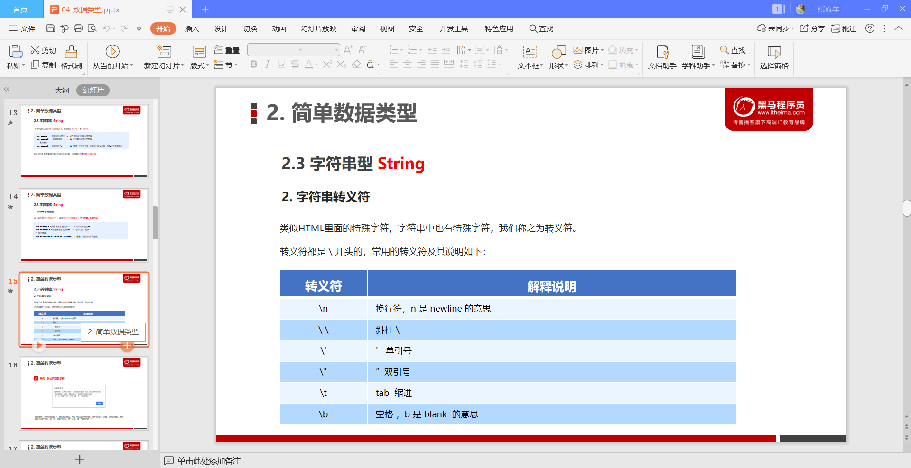
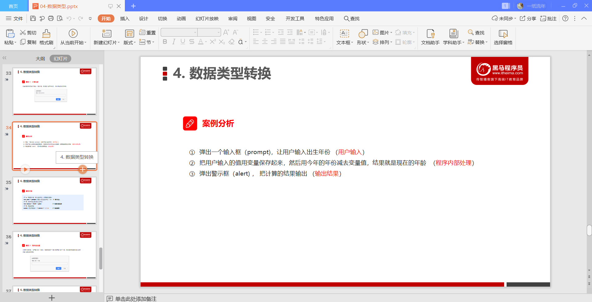

# JavaScript基础

## 计算机基础

## 初识Javascript

## 变量

### 变量额概述

### 变量的使用

### 变量语法的拓展

### 变量命名的规范

## 数据类型

### 数据类型简介

### 简单数据类型

### 获取变量数据类型

### 数据类型转换

## 扩展阅读

### 解释型语言与编译型语言

### 标识符，关键字，保留字

## JavaScript运算符

