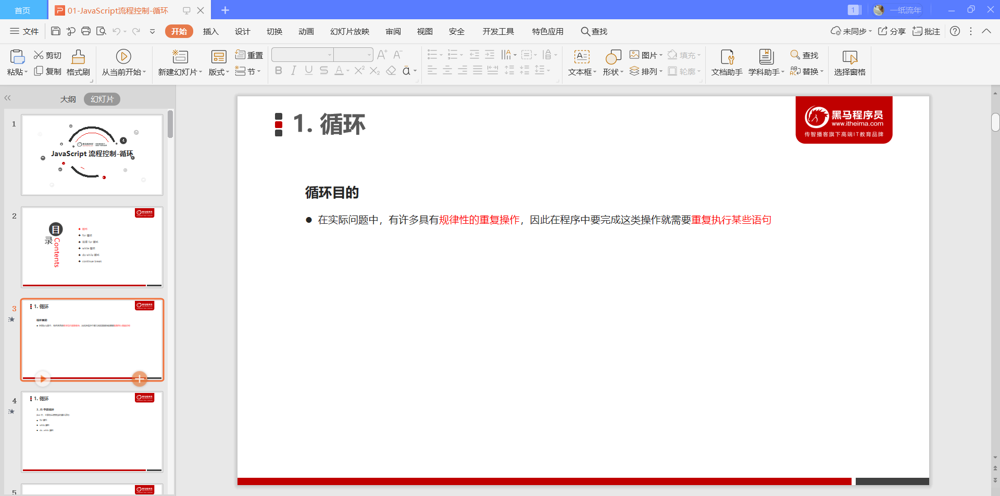
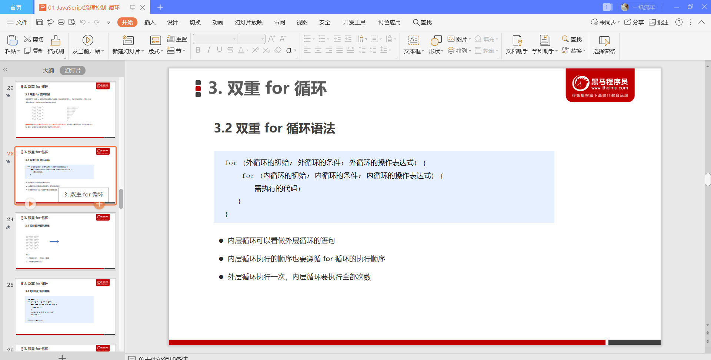
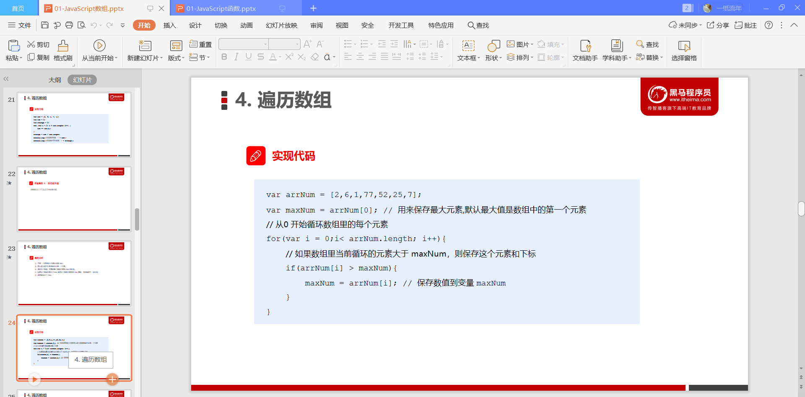

# JavaScript基础

## 计算机基础

## 初识Javascript

## 变量

### 变量额概述

### 变量的使用

### 变量语法的拓展

### 变量命名的规范

## 数据类型

### 数据类型简介

### 简单数据类型

### 获取变量数据类型

### 数据类型转换

## 扩展阅读

### 解释型语言与编译型语言

### 标识符，关键字，保留字

## JavaScript运算符

###  运算符

### 算数运算符

### 递增和递减运算符

### 比较运算符

### 逻辑运算符

### 赋值运算符

### 运算符优先级

## JavaScript 流程控制-分支

### 流程控制

### 顺序流程控制

### 分支流程控制 if 语句

### 三元表达式

### 分支流程控制switch 语句

## JavaScript流程控制-循环

### 循环

### for循环

### 双重for循环

### while 循环

### do while 循环

### continue break

## JavaScript命名规范以及语法格式

### 标识符命名规范

### 操作符规范

### 单行注释规范

### 其他规范

## JavaScript数组

### 数组的概念

### 创建数组

### 获取数组中的元素

### 遍历数组

### 数组中新增元素

### 数组案例

## JavaScript函数

### 函数的概念

### 函数的使用

### 函数的参数

### 函数的返回值

### arguments的使用

### 函数案例

### 函数的两种声明方式

