# JavaScript基础

## 计算机基础

​	

### 1.编程语言

#### 1.1编程

#### 1.2 计算机语言

#### 1.3 编程语言

#### 1.4 翻译器

#### 1.5 编程语言和标记语言的区别

#### 总结

### 2.计算机基础

#### 2.1计算机组成

#### 2.2 数据存储

#### 2.3 数据存储单位

#### 2.4 程序运行

## 初识Javascript

### 1.初识JavaScript

​	 **布兰登艾奇**

	#### 1.1 JavaScript是什么

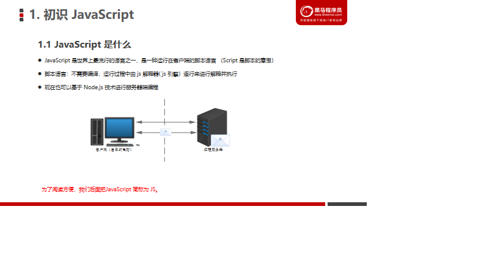

#### 1.2 JavaScript的作用

#### 1.3 HTML/CSS/JS的关系

#### 1.4 浏览器执行JS简介

​      渲染引擎：解析HTML和CSS，如浏览器的blink,老版本的webkit

​      JS引擎：也称为JS解释器，读取，解析后运行js代码,比如chrome浏览器的V8,逐行解释每一句源码（转换为机器语言），然后由计算机去执行。

#### 1.5 JS的组成

​    javaScript由三部分组成，分别是ECMAScript（JavaScript语法），DOM(页面文档对象模型)，BOM(浏览器对象模型)这三部分组成

##### 1.ECMAScript

##### 2.DOM-文档对象模型

##### 3.BOM-浏览器对象模型

#### 1.6JS初体验

##### 1.行内式JS

~~~html
<!DOCTYPE html>
<html lang="en">
<head>
    <meta charset="UTF-8">
    <meta name="viewport" content="width=device-width, initial-scale=1.0">
    <title>Document</title>
</head>
<body>
    <!-- 行内式JS -->
    <input type="text" onclick="alert('干嘛点我')">
</body>
</html>
~~~

##### 2.内嵌JS

##### 3.外部JS文件

**注意：引用外部JS文件的script标签中间不可以写代码，否则将只执行标签中间的js代码，而不是外部js代码**

### 2. JavaScript注释

#### 2.1 单行注释

~~~javascript
  // 单行注释 ctrl + /
    console.log('单行注释');
~~~

#### 2.2 多行注释

~~~javascript
 /* 多行注释 alt+shift+a */
    console.log('多行注释');
~~~

#### 2.3 文档注释（添加）

~~~javascript
 /**
    * 
    * 文档API注释 /**+enter
    *
    */
   console.log('文档注释');
~~~

### 3.JavaScript输入输出语句

~~~html
<!DOCTYPE html>
<html lang="en">
<head>
    <meta charset="UTF-8">
    <meta name="viewport" content="width=device-width, initial-scale=1.0">
    <title>Document</title>
</head>
<body>
</body>

</html>
~~~

## 变量

### 1.变量的概述

#### 1.1 什么是变量

#### 1.2 变量在内存中的存储

**可以如此理解，变量声明：就是在内存中申请一块用来存放数据的空间，也就是"预定酒店"，变量赋值：就是将值存放如内存空间中，也就是相当于"入住酒店"**

### 2.变量的使用

#### 2.1 声明变量

 **通过变量名来访问内存中给对应变量分配的空间**

#### 2.2 赋值

#### 2.3 变量的初始化

变量的初始化：就是在声明一个变量的同时也给这个变量赋值，一步完成。这个过程就是变量的初始化。

#### 2.4 案例一

#### 2.5 案例二

~~~html
<!DOCTYPE html>
<html lang="en">
<head>
    <meta charset="UTF-8">
    <meta name="viewport" content="width=device-width, initial-scale=1.0">
    <title>Document</title>
</head>
<body>
</body>

</html>
~~~

###  3.变量语法的拓展

#### 3.1 更新变量

#### 3.2 同时声明多个变量

~~~html
<!DOCTYPE html>
<html lang="en">
<head>
    <meta charset="UTF-8">
    <meta name="viewport" content="width=device-width, initial-scale=1.0">
    <title>Document</title>
</head>
<body>
    
</body>

</html>
~~~

#### 3.3 声明变量特殊情况

### 4.变量命名的规范

第一组中： 第五个以数字开头====》不合法

第二组中：第五个包含了非法字符&====》不合法

第三组中：第五个以for也就是关键字===》不合法

### 实例一

~~~html
<!DOCTYPE html>
<html lang="en">
<head>
    <meta charset="UTF-8">
    <meta name="viewport" content="width=device-width, initial-scale=1.0">
    <title>Document</title>
</head>
<body>
</body>

</html>
~~~

### 5.小结

~~~html
<!DOCTYPE html>
<html lang="en">
<head>
    <meta charset="UTF-8">
    <meta name="viewport" content="width=device-width, initial-scale=1.0">
    <title>Document</title>
</head>
<body>
    
</body>

</html>
~~~

## 数据类型

### 1. 数据类型简介

#### 1.1 为什么需要数据类型

#### 1.2 变量的数据类型

#### 1.3 数据类型的分类

JS中把数据类型分成了两类

1.简单数据类型，包括（Number,String,Boolean,Undefined,Null）

2.复杂数据类型，包括（object）

#### **typeof 操作符**

由于`js`中的变量是松散类型的，所以它提供了一种检测当前变量的数据类型的方法，也就是typeof关键字.

typeof  123　　 //Number

typeof  'abc'　　//String

typeof   true    //Boolean

typeof   undefined  //Undefined

typeof   null     //Object

typeof   { }      //Object

typeof   [ ]      //Object

typeof   console.log()    //Function

null类型进行typeof操作符后，结果是object，原因在于，null类型被当做一个空对象引用。

##### **1.Number类型**

Number类型包含整数和浮点数（浮点数数值必须包含一个小数点，且小数点后面至少有一位数字）两种值。

NaN:非数字类型。特点：① 涉及到的 任何关于NaN的操作，都会返回NaN  ② NaN不等于自身。

isNaN() 函数用于检查其参数是否是非数字值。

isNaN(123)  //false  isNaN("hello")  //true

##### **2.String类型**

字符串有length属性。

字符串转换：转型函数String(),适用于任何数据类型（null,undefined 转换后为null和undefined）；toString()方法（null,undefined没有toString()方法）。

##### **3.Boolean类型**

该类型只有两个值，true和false

##### **4.Undefined类型**

只有一个值，即undefined值。使用var声明了变量，但未给变量初始化值，那么这个变量的值就是undefined。

##### **5.Null类型**

null类型被看做空对象指针，前文说到null类型也是空的对象引用。

##### **6.Object类型**

**js中对象是一组属性与方法的集合**。这里就要说到引用类型了，**引用类型是一种数据结构**，用于将数据和功能组织在一起。引用类型有时候也被称为对象定义，因为它们描述的是一类对象所具有的属性和方法。

#### 三大引用类型

##### **1.Object类型**

我们看到的大多数类型值都是Object类型的实例，创建Object实例的方式有两种。

第一种是使用new操作符后跟Object构造函数，如下所示

var person = new Object();

person.name = "Micheal";

person.age = 24;

第二种方式是使用对象字面量表示法，如下所示

var person = {

　　name : "Micheal",

　　age : 24

};

或者var person = Object.create(原型);

##### **2.Array类型**

数组的每一项可以用来保存任何类型的数据，也就是说，可以用数组的第一个位置来保存字符串，第二个位置保存数值，第三个位置保存对象....另外，数组的大小是可以动态调整的。

创建数组的基本方式有两种

第一种是使用Array构造函数，如下所示

var colors = new Array("red","blue","yellow");

第二种是使用数组字面量表示法，如下所示

var colors = ["red","blue","yellow"];

##### **3 Function类型**

每个函数都是Function类型的实例，而且都与其他引用类型一样具有属性和方法。函数通常是使用函数声明语法定义的，如下所示

function sum(num1,num2){

　　return num1 + num2;

};

这和使用函数表达式定义函数的方式相差无几。

var sun = function (){

　　return sum1 + sum2;

};

**也就是说，js按照存储方式分为值类型和引用类型。那么他们的计算有什么区别呢？**

题目1： var a = 100;

　　　　var b = a;

　　　  a = 200;

　　　　console.log (b);

题目2： var a = {age : 20};

　　　　var b = a;

　　　　b.age = 21;

　　　　console.log (a.age);

题目1的答案是 100，题目2的答案是21，

题目1是简单的值类型，在从一个变量向另一个变量赋值基本类型时，会在该变量上创建一个新值，然后再把该值复制到为新变量分配的位置上。

此时，a中保存的值为 100 ，当使用 a 来初始化 b 时，b 中保存的值也为100，但b中的100与a中的是完全独立的，该值只是a中的值的一个副本，此后，
这两个变量可以参加任何操作而相互不受影响。也就是说基本类型在赋值操作后，两个变量是相互不受影响的。

题目2是引用类型，当从一个变量向另一个变量赋值引用类型的值时，同样也会将存储在变量中的对象的值复制一份放到为新变量分配的空间中。

这时保存在变量中的是对象在堆内存中的地址，所以，与简单赋值不同，这个值的副本实际上是一个指针，而这个指针指向存储在堆内存的一个对象。那么赋值操作后，
两个变量都保存了同一个对象地址，则这两个变量指向了同一个对象。因此，改变其中任何一个变量，都会相互影响。

因此，引用类型的赋值其实是对象保存在栈区地址指针的赋值，因此两个变量指向同一个对象，任何的操作都会相互影响

### 2.简单数据类型

#### 2.1 简单数据类型（基本数据类型）

#### 2.2 数字型Number

##### 1.数字型进制

~~~html
<!DOCTYPE html>
<html lang="en">
<head>
    <meta charset="UTF-8">
    <meta name="viewport" content="width=device-width, initial-scale=1.0">
    <title>Document</title>
</head>
<body>
    
</body>

</script>
</html>
~~~

##### 2.数字型范围

##### 3.数字型三个特殊值

##### 4.isNaN()

#### 2.3 字符串型String

**因为HTML标签里面的属性使用的是双引号，JS这里我们更推荐使用单引号**

##### 1.字符串引号嵌套

##### 2.字符串转义符

##### 3.字符串长度

##### 4.字符串拼接

**数值相加，字符相连**

##### 5.字符串拼接加强

**引引加加**

#### 2.4 布尔型Boolean

#### 2.5 Undefined和Null

### 3.获取变量数据类型

#### 3.1 获取检测变量的数据类型

#### 3.2 字面量

### 4.数据类型转换

#### 4.1 什么是数据类型转换

#### 4.2 转换为字符串

#### 4.3 转换为数字型(重点)

~~~html
<!DOCTYPE html>
<html lang="en">
<head>
    <meta charset="UTF-8">
    <meta name="viewport" content="width=device-width, initial-scale=1.0">
    <title>Document</title>
</head>
<body>
</body>

</html>
~~~

**代表空、否定的值会被转换成false,如 ""、0、NaN、null、undefined**

~~~javascript
  console.log("----------Boolean----------------------");
    var a = -7;
    console.log(Boolean(a));// true
    var b = -1;
    console.log(Boolean(b));// true
    var c = 0;
    console.log(Boolean(c));// false
    var d = "0";
    console.log(Boolean(d));// true
    
    var e= -1;
    if(e){
        console.log("-1的布尔值不为false"); //-1的布尔值不为false
    }
~~~

## 扩展阅读

### 1.解释型语言与编译型语言

#### 1.概述

#### 2.执行过程

### 2.标识符，关键字，保留字

#### 1.标识符

#### 2.关键字

#### 3.保留字

## JavaScript运算符

###  运算符

### 算数运算符

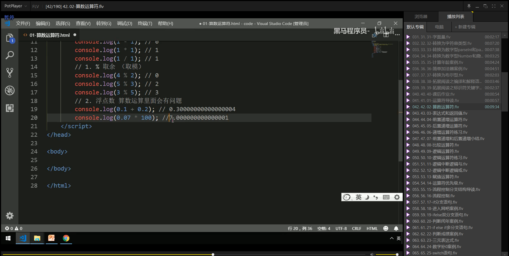

### 递增和递减运算符

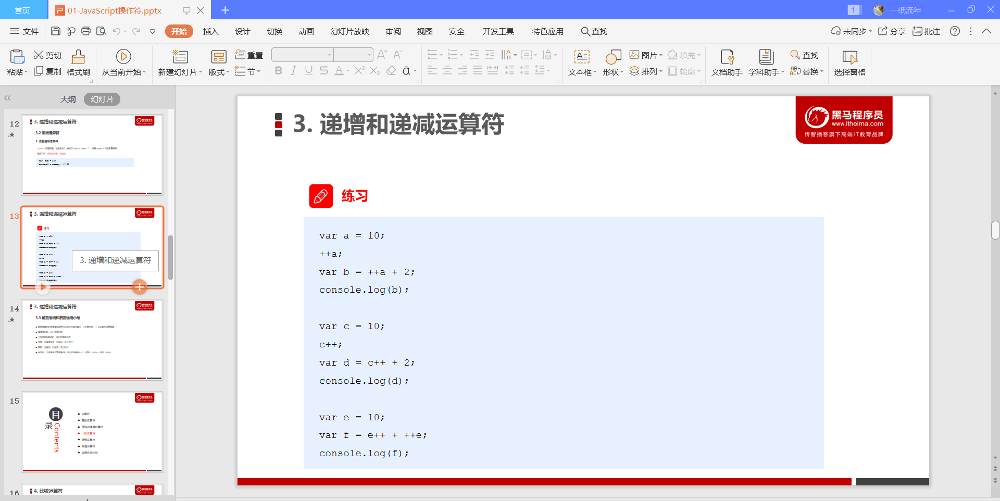

### 比较运算符

### 逻辑运算符

### 赋值运算符

### 运算符优先级

## JavaScript 流程控制-分支

### 流程控制

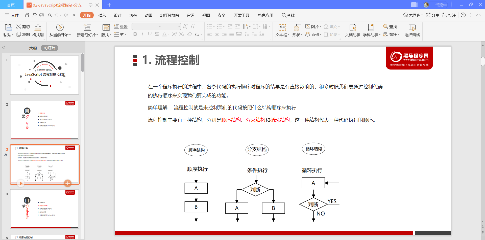

### 顺序流程控制

### 分支流程控制 if 语句

### 三元表达式

### 分支流程控制switch 语句

## JavaScript流程控制-循环

### 循环

### for循环

### 双重for循环

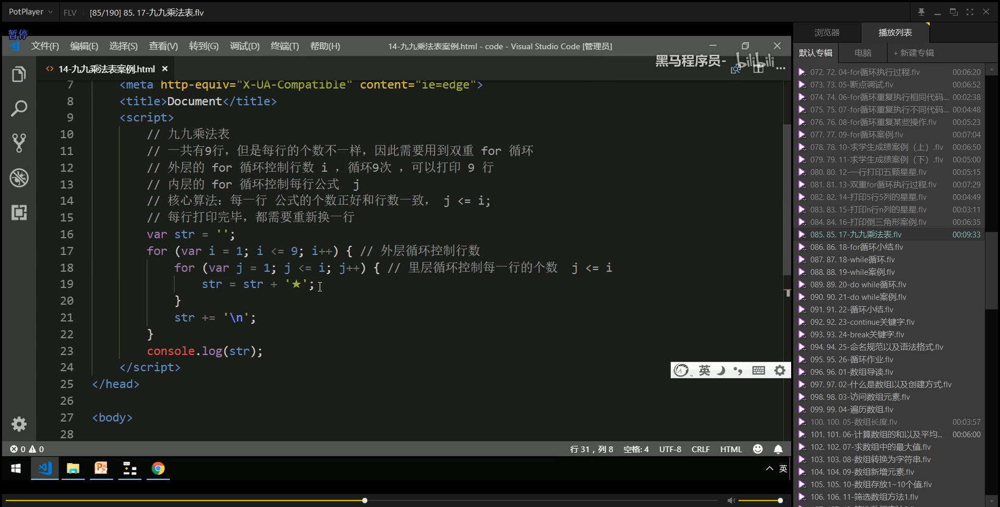

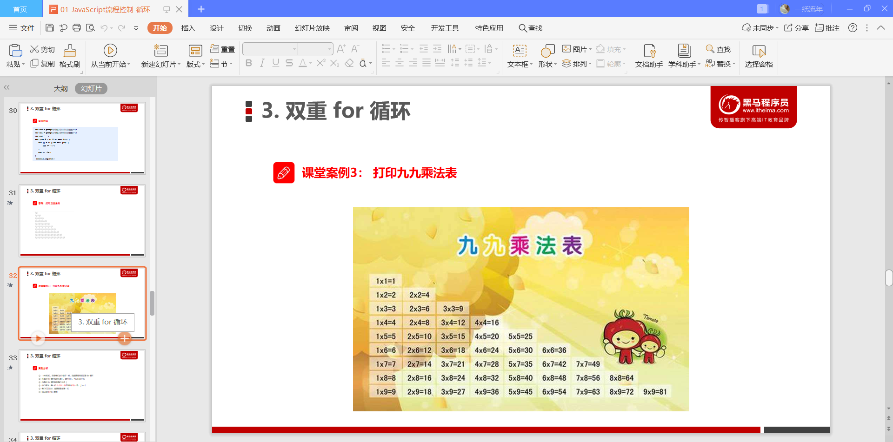

### while 循环

### do while 循环

### continue break

## JavaScript命名规范以及语法格式

### 标识符命名规范

### 操作符规范

### 单行注释规范

### 其他规范

## JavaScript数组

### 数组的概念

### 创建数组

### 获取数组中的元素

### 遍历数组

### 数组中新增元素

### 数组案例

## JavaScript函数

### 函数的概念

### 函数的使用

### 函数的参数

### 函数的返回值

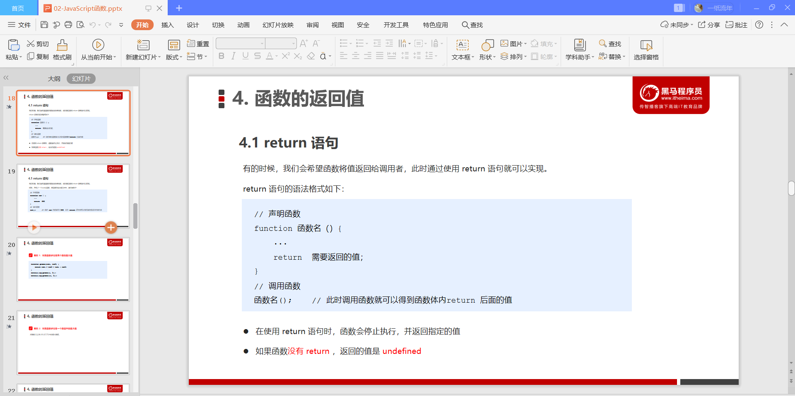

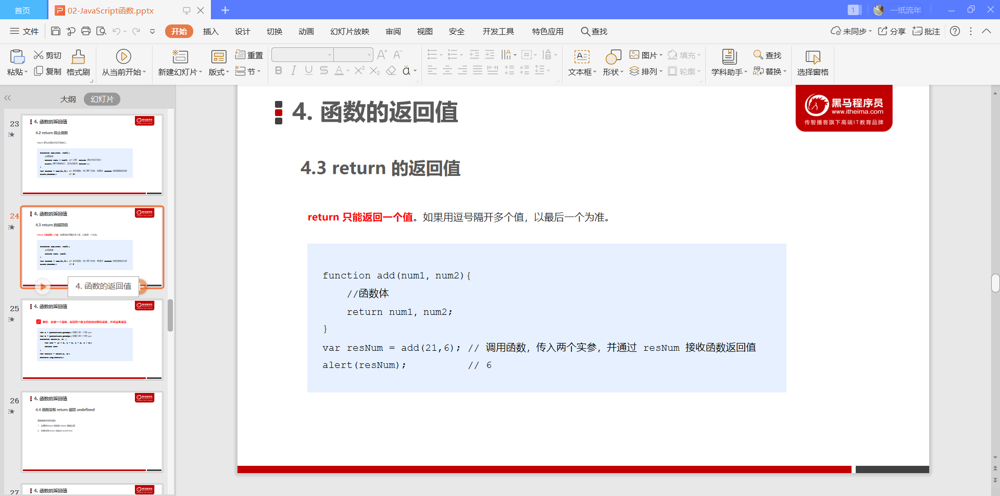

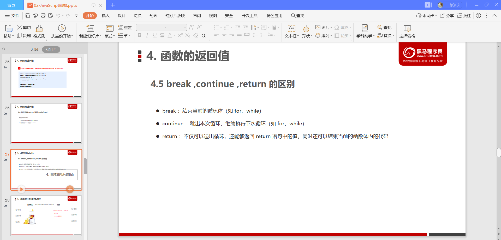

### arguments的使用

### 函数案例

### 函数的两种声明方式

## JavaScript作用域

### 作用域

### 变量的作用域

### 作用域链

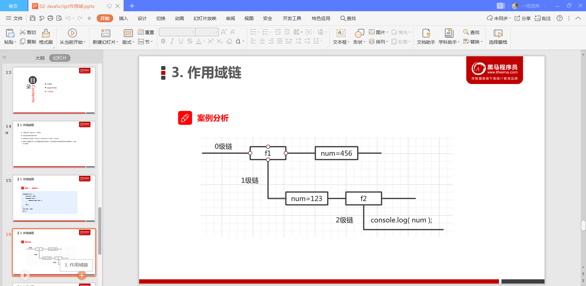

## JavaScript预解析

### 预解析

### 变量预解析和函数预解析

但是对于匿名函数，JavaScript的预解析是它当作一个变量的预解析的形式来解析的么？

### 预解析案列

结果为undefined

## JavaScript对象

### 对象

### 创建对象的三种方式

### new关键字

### 遍历对象属性

## JavaScript内置对象

### 内置对象

### 查文档

### Math对象

### 日期对象

### 数组对象

### 字符串对象

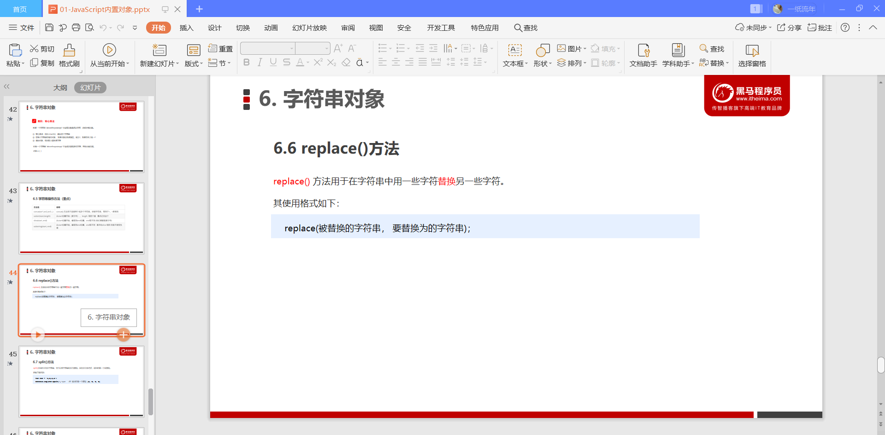

## JavaScript的简单类型与复杂类型

### 简单类型与复杂类型

### 堆和栈

### 简单类型的内存分配

### 复杂类型的内存分配

### 简单类型传参

### 复杂类型传参

