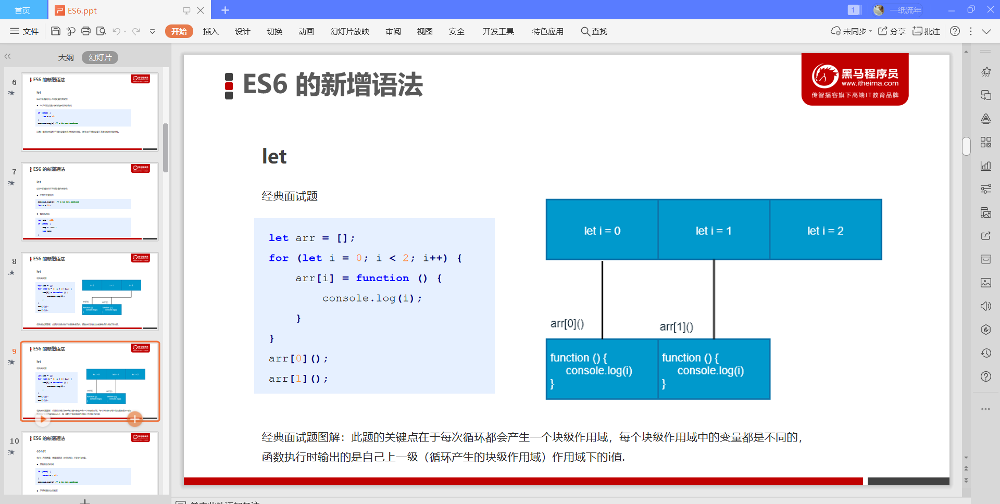
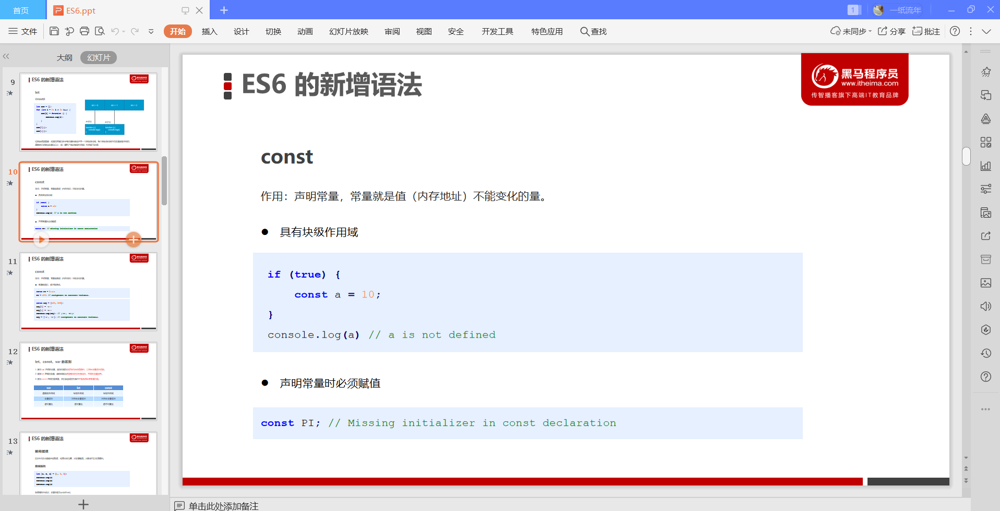
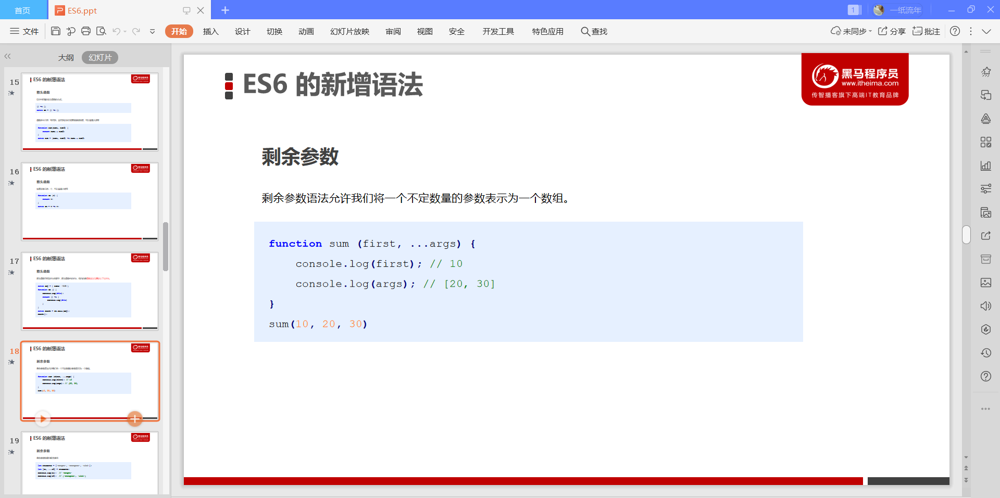

ES6

# 1. ES6 简介

## 1.1 什么是ES6?

## 1.2 为什么使用ES6?

# 2. ES6的新增语法

## 2.1 let

## 2.2 const

## 2.3 let、const、var的区别

## 2.4 解构赋值

### 数组解构

### 对象结构

## 2.5 箭头函数

## 2.6 剩余参数

## 2.7 剩余参数和解构配合使用

# 3. ES6的内置对象扩展

## 3.1 Array的拓展方法

### 1. 扩展运算符（展开语法）

### 2.构造函数方法：Array.from()

### 3.实例方法：find();

### 4.  实例方法：findIndex()

### 5. 实例方法：includes()

## 3.2 字符串扩展方法

### 1.模板字符串

### 2.实例方法：startsWith()和endsWith()

### 3. 实例方法：repeat()

## 3.3 Set数据结构

### 利用set实现数组去重复

### 1.实例方法

### 2.遍历

