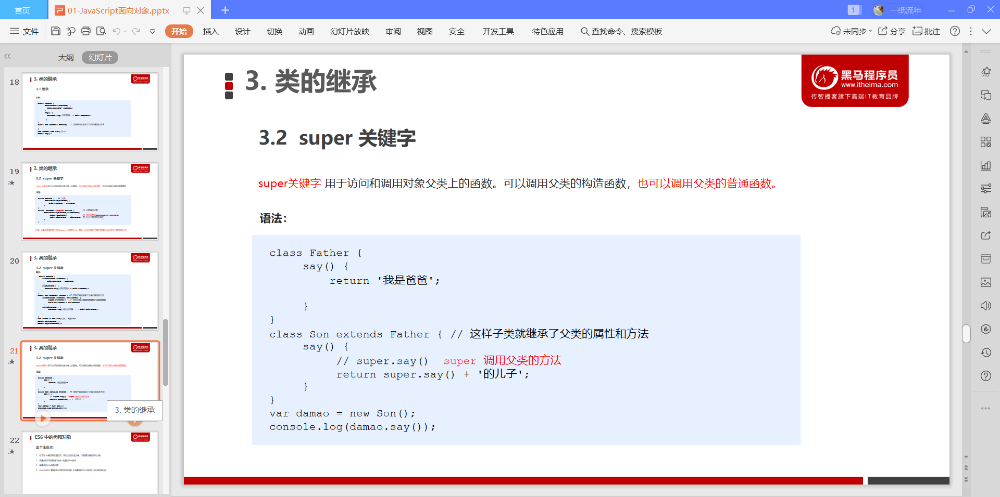
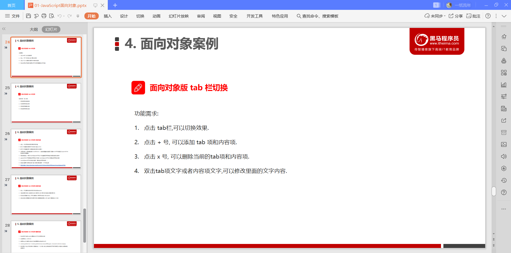
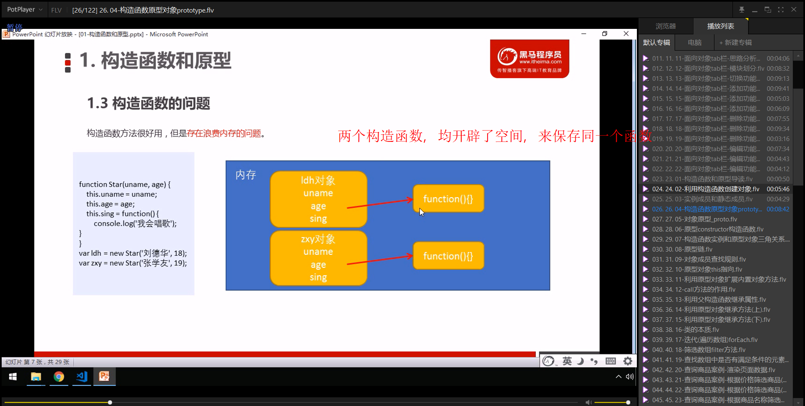
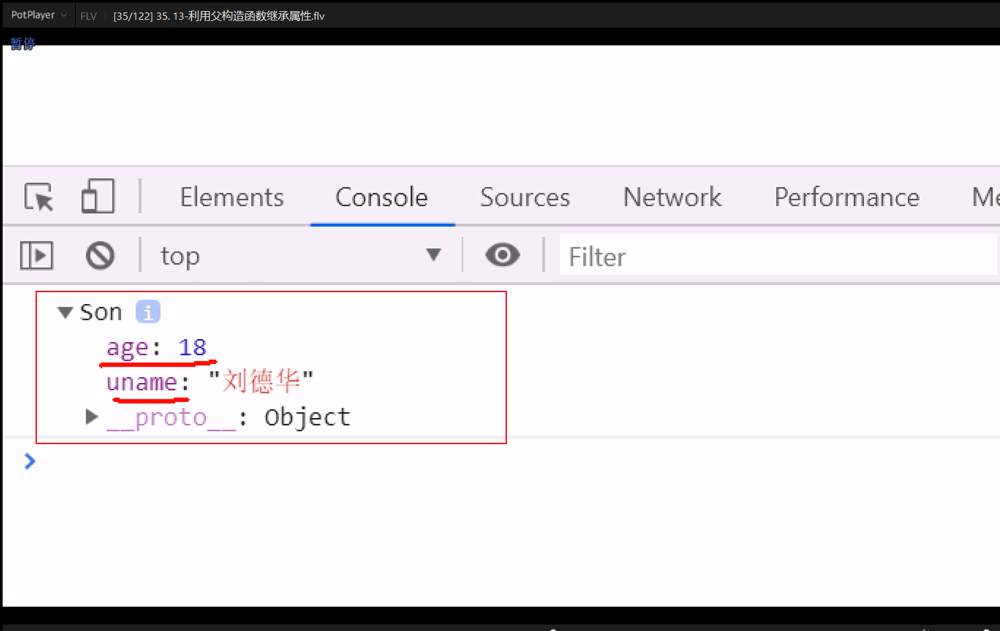
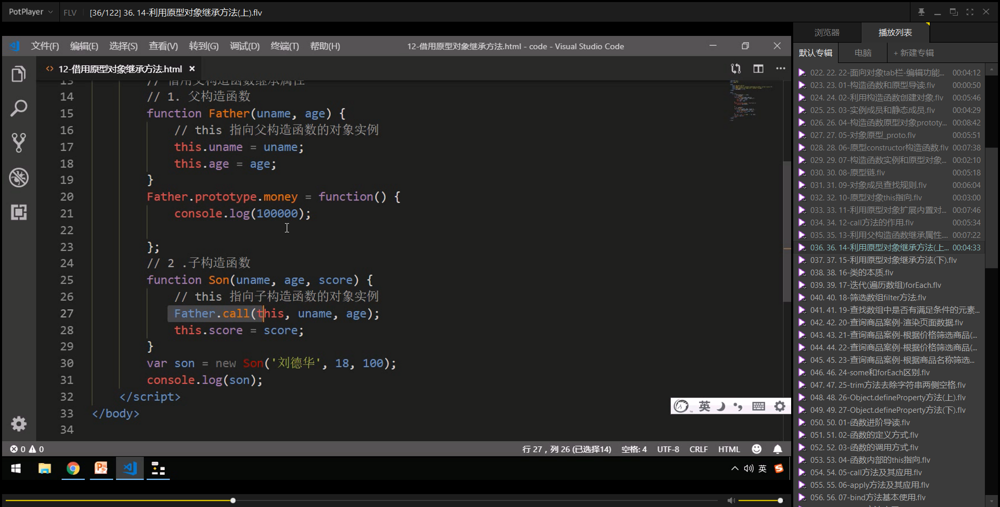

# JavaScript高级

# JavaScript面向对象

## 1. 面向对象编程介绍

### 1.1 两大编程思想

### 1.2 面向过程编程 POP

### 1.3 面向对象编程 OOP

### 1.4 面向过程和面向对象的对比

## 2. ES6中的类和对象

### 2.1 对象

### 2.2 类class

### 2.3 创建类

### 2.4 类 constructor 构造函数

### 2.5 类添加方法

## 3. 类的继承

### 3.1 继承

### 3.2 super关键字

### 3.3 三个注意点

## 4. 面向对象案例

### 案例：面向对象版tab栏切换

#### 1. tab栏目切换-准备工作

#### 2. tab栏目切换-模块划分

#### 3. tab栏目切换-切换功能

#### 4. tab栏目切换-添加功能

#### 5. tab栏目切换-删除功能

#### 6. tab栏目切换-编辑功能

# 构造函数和原型

## 1. 构造函数和原型

### 1.1 概述

### 1.2 构造函数

### 1.3 构造函数的问题

### 1.4 构造函数的原型 prototype

### 1.5 对象原型  \_proto\_

### 1.6 constructor 构造函数

### 1.7 构造函数、实例、原型对象三者之间的关系

### 1.8 原型链

### 1.9 JavaScript 的成员查找机制(规则)

### 1.10 原型对象this指向

### 1.11 内置拓展对象

## 2. 继承

### 2.1 call()

### 2.2 借用构造函数继承父类型属性

### 2.3 借用原型对象继承父类型方法

### 2.4 类的本质

## 3. ES5中的新增方法

### 3.1 ES5 新增方法概述

### 3.2 数组方法

#### forEach()

#### filter()

#### some()

#### 案例：查询商品案例

### 3.3  字符串方法

#### str.trim()

### 3.4 对象方法

#### Object.keys(obj)

#### Object.defineProperty(obj, prop, descripator)

# 函数进阶

## 1. 函数的定义以及调用

### 1.1 函数的定义方式

### 1.2 函数的调用方式

## 2. this

### 2.1 函数内this的指向

### 2.2 改变函数内部this指向

#### 1. call方法

#### 2. apply方法

#### 3. bind方法

#### 4. 总结

## 3.严格模式

### 3.1 什么是严格模式

### 3.2 开启严格模式

#### 1. 为脚本开启严格模式

#### 2. 为函数开启严格模式

### 3.3 严格模式中的变化

##### 1. 变量规定

##### 2. 严格模式下this的指向问题

##### 3. 函数的变化

## 4. 高阶函数

## 5. 闭包

### 5.1 变量作用域

 

### 5.2 什么是闭包

### 5.3 在chrome中调试闭包

### 5.4 闭包的作用

### 5.5 闭包的案例

### 5.6 闭包总结

## 6. 递归

### 6.1 什么是递归

### 6.2 利用递归求数学题

### 6.3 利用递归求：根据id返回对应的数据对象

### 6.4 浅拷贝和深拷贝

