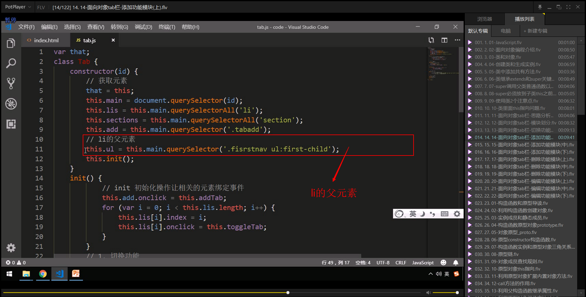
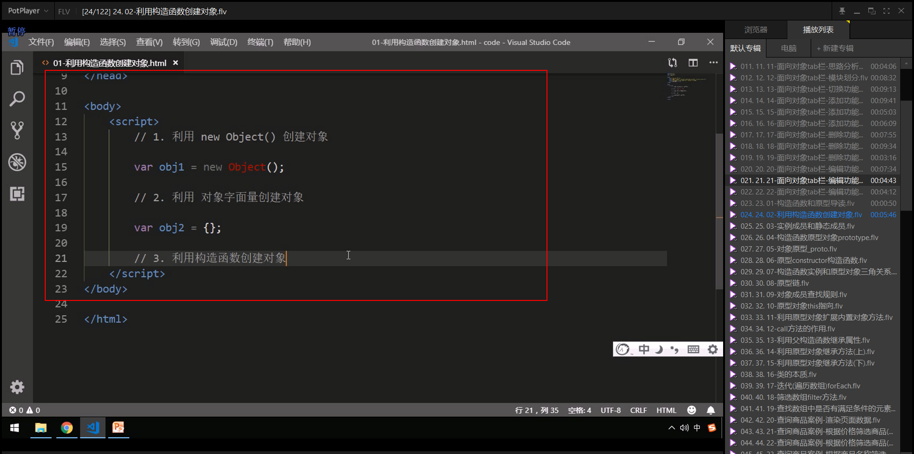
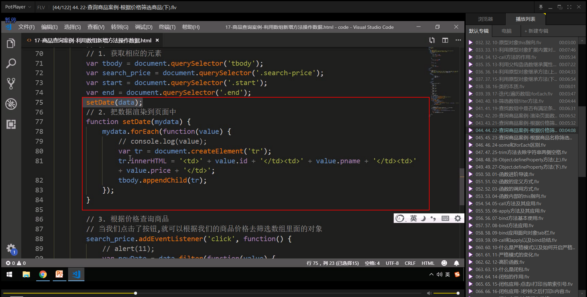
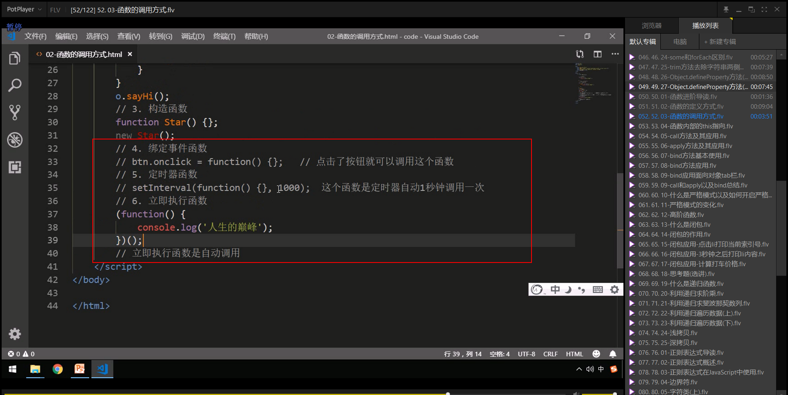
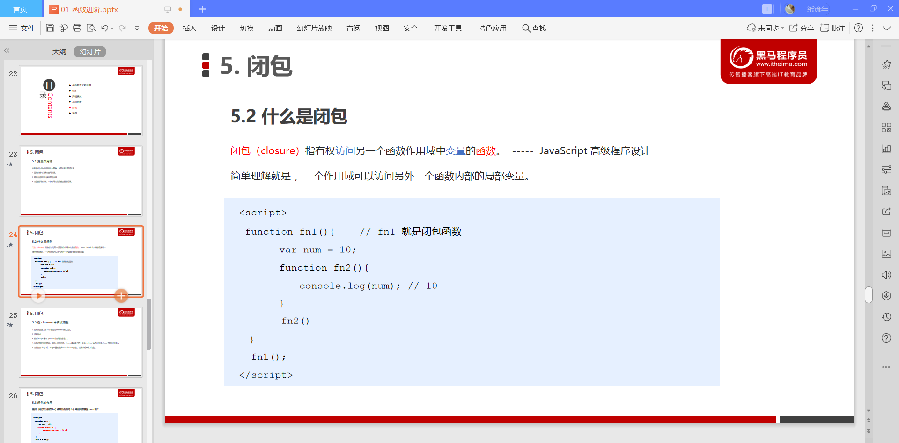
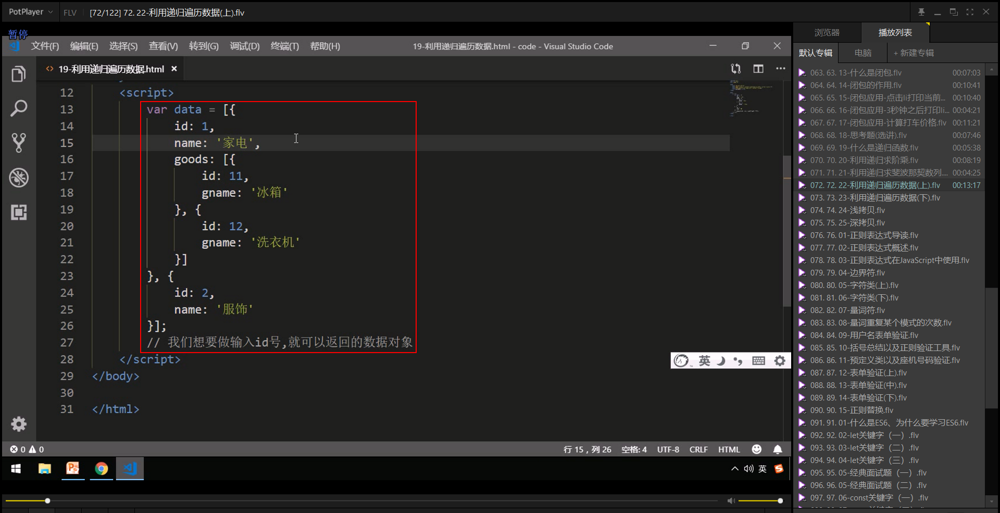
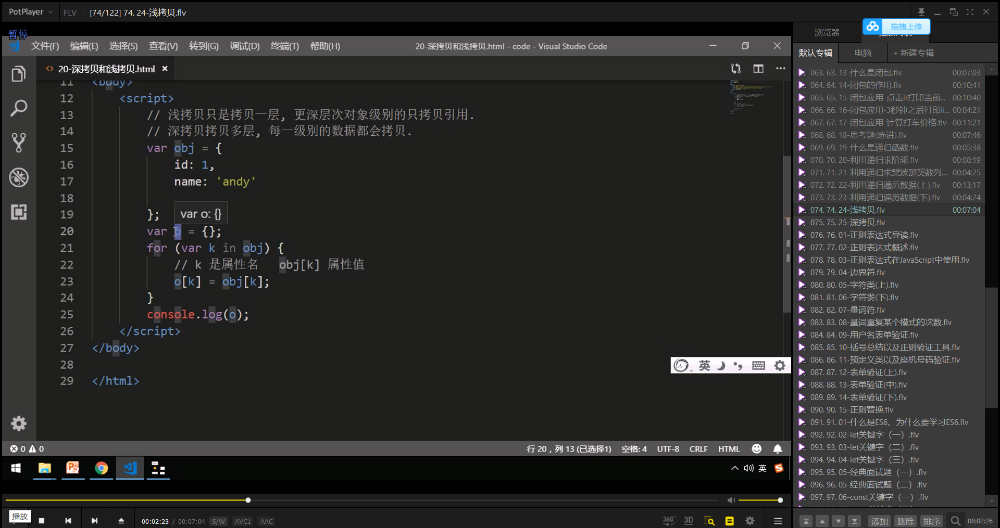

JavaScript高级


# JavaScript面向对象


## 1. 面向对象编程介绍

### 1.1 两大编程思想


### 1.2 面向过程编程 POP


### 1.3 面向对象编程 OOP


### 1.4 面向过程和面向对象的对比


## 2. ES6中的类和对象


### 2.1 对象


### 2.2 类class


### 2.3 创建类、实例


### 2.4 类 constructor 构造函数


### 2.5 类添加方法


## 3. 类的继承


### 3.1 继承


### 3.2 super关键字


#### 1. 继承的执行顺序


#### 2. 类里面共有属性和方法的调用


### 3.3 三个注意点


**constructor里面的this指向实例对象，方法里面的this指向这个方法的调用者**


这里有一个问题，如果只有一个类，那么方法自然是由实例化的对象调用。可以如果存在继承中的情况下，因为子类继承了父类的方法，那么在子类的实例化对象中调用父类的方法的话，那么很明显此处意思是原本父类方法里面的this指向的是父类，由于是子类的实例调用，所以该变成了指向子类了，是否可以这样理解？


~~~html
<!DOCTYPE html>
<html lang="en">
<head>
    <meta charset="UTF-8">
    <meta name="viewport" content="width=device-width, initial-scale=1.0">
    <title>Document</title>
</head>
<body>
</body>
<script>
    class Father {
        constructor(uname){
            this.uname = uname;
        }
        say(){
            console.dir(this);// 在子类中调用指向子类
            console.log(JSON.stringify(this)+'这是父类里面的this');
            return this.uname
        }
    }
    class Son extends Father{
        constructor(uname,age){
            super(uname);
            this.age = age;
        }
        show(){
            console.dir(this); // 在子类中调用指向子类
            console.log(JSON.stringify(this) + '这是子类里面的this')
            super.say();// 在子类的方法中通过super调用，仍然指向子类
            return this.uname + this.age;
        }
    }
    var person = new Son('Smith',88);
    // 调用父类的方法
    person.say();  
    // 调用子类的方法
    person.show();
</script>
</html>
~~~


## 4. 面向对象案例


### 案例：面向对象版tab栏切换


#### 1. tab栏目切换-准备工作


#### 2. tab栏目切换-模块划分


#### 3. tab栏目切换-切换功能


#### 4. tab栏目切换-添加功能





#### 5. tab栏目切换-删除功能


#### 6. tab栏目切换-编辑功能


# 构造函数和原型


## 1. 构造函数和原型

### 1.1 概述


#### 1. 创建对象的三种方式




### 1.2 构造函数


在构造函数中，无论是属性还是方法，都需要添加this前缀，之前感觉只有属性才需要添加this.对于对象没有什么印象，因为不常见，其实也可以理解，分析构造函数实例化的过程如下

1. 在内存空间中创建一个空对象。
2. 将this指向这个空对象。
3. 执行构造函数里面的代码，将属性和方法赋值给对象。
4. 返回新创建的对象(所以构造函数不需要return)。

所以可以知道this代表当前构造函数的实例对象，所有的this前缀的属性和方法，都是实例中的内容。为了实现这一点必须要都添加 this

因为构造函数在实例化过程中对于函数都会开辟单独的空间存储，所以如果构造函数多次实例，则造成了对于一个相同的函数，结果在内存中被保存了多次，造成了系统资源的浪费。所以在实际的开发过程中都是在构造函数的原型对象中保存公共的方法，同时也要注意，构造函数的原型对象里面的公共方法里面的this,也依旧指向构造函数所创建的实例对象。


#### 1. new 在执行时会做四件事


#### 2. 静态成员和实例成员


**此处有一个问题，构造函数本身也属于一个对象，如果采用静态成员，也就是直接 Func.name = 'silly'这种形式的话，按照理解应该为静态成员，那么实例对象能否获取静态成员的值呢**

**另外如果添加的成员是一个函数，那么实例对象能否正常访问呢？**

**可以知道实例对象是无法访问其构造函数上的成员的（包括属性和方法）**


**构造函数不可以访问实例成员（也就是this指向的成员）**


**实例对象不可以访问静态成员（也就是构造函数直接添加的属性或者方法）**


### 1.3 构造函数的问题

构造函数问题，主要是指构造函数的函数对象的重复保存问题


### 1.4 构造函数的原型 prototype


构造函数通过原型分配的函数是所有对象所共有的，那么可以知道的是构造函数的原型对象中的函数里面的this指向的是构造函数所创建的实例对象的，操作代码：

~~~html
<!DOCTYPE html>
<html lang="en">
<head>
    <meta charset="UTF-8">
    <meta name="viewport" content="width=device-width, initial-scale=1.0">
    <title>Document</title>
</head>
<body>
    <script>
        // 创建构造函数
        function Person(uname,age){
            this.uname = uname;
            this.age = age;
        }
        // 利用构造函数的prototype原型对象添加公共的方法
        Person.prototype.say = function(){
            // 打印里面的this
            console.log(this);
        }
        // 分别实例化对象并且调用say方法
        var ps1  = new Person('ldh',77);
        ps1.say();
        var ps2 = new Person('zxy',66);
        ps2.say();
    </script>
</body>
</html>
~~~


**这才是在实际的开发中遇到的情况，也就是在创建构造函数时，将公共的属性放在构造函数里面，通过属性赋值，将公共的方法放在构造函数的原型对象里面，实例对象可以直接调用，也可以采用this的方法，直接获取构造函数实例化之后的值**


### 1.5 对象原型  \_proto\_


**此处需要注意\__proto\__此处的间隔应该为两个下划线，而不是一个下划线，需要注意**、


### 1.6 constructor 构造函数


**因为：Star.prototype = {.....},这种形式，如果直接Star.prototype.sing = function(){ ...... }这种形式的化，相当于{......}.sing = function())}{ ...... }，所以不会覆盖原来的对象。只是给原来的对象添加了新的属性**


**而如果采取这种形式的化，可以直接知道 Star.prototype = {原来的对象}被重新赋值了一个对象Star.prototype = {新的对象}，所以其他的一些东西例如 constructor都被覆盖掉了。所以需要注意**


可以知道的是：

1. 原来的构造函数被覆盖掉了。
2. 新的构造函数是Object是因为新的原型对象是一个对象，根据其默认l隐藏的对象原型\__proto\__,其实也可以知道其是指向Object.prototype的，所以可以知道确实如此。

在新的原型对象上重新设置其对应的constructor函数。


可以看到设置了的指向原来的构造函数


**手动操作指向原来的constructor函数**


### 1.7 构造函数、实例、原型对象三者之间的关系


### 1.8 原型链


**是否可以总结几条关键记录**

1. JavaScript中的一切对象和方法都可以看作是对象。
2. 一切对象和方法都具有\__proto\__属性也就是对象原型指向对象的构造函数的原型对象。
3. 所以可以知道一切对象都具有构造函数，也就是可以通过 new 关键字()实例化出来。
4. 通过以上步骤，可以推导出一个原型链出来。


### 1.9 JavaScript 的成员查找机制(规则)


**原型链查找规则是基于\__proto\__的查找机制来查找的，可以知道的是,__proto__,是所有对象均具有的，原型链的基础是原型对象和对象原型**


### 1.10 原型对象this指向


**坐实了原型对象里面的this指向实例对象，这一论断**


### 1.11 内置拓展对象


因为如果直接={}，会将数组和字符串的原型对象的一些方法都会直接覆盖掉的，所以我们要综合考量，只能采取这种方式来扩展内置对象，而不是采取直接覆盖的这种方式。


​	Array是所有数组的构造函数 ，因为有 var arr = new Array(1,2,3,4)这种创建数组的形式，所以直接在数组的原型对象上添加方法，则后面的所有的数组实例对象均可以调用该方法。


​	如果采取直接对象值覆盖这样的赋值方法的话，在浏览器控制台直接打印报错。

因为将数组的其他方法都覆盖掉了。

## 2. 继承

### 2.1 call()


**此处的call方法，调用方式是：fun.call(thisArg,arg1,arg2),改变的是fun里面的this的指向问题，一般而言，构造函数fun里面的this的指向为构造函数的实例对象，而采用call的话，则构造函数的this指向的是thisArg这个对象。**


**当然对于普通函数而言，可以知道的是普通函数里面的this指向的是window对象，普通函数调用了call方法，同样也可以改变其中的this的指向问题，与构造函数的情况是一致的。**


#### 1.call可以调用函数


#### 2.call可以改变函数里面的this的指向


#### 3.call方法传递参数


**在以上的条件下，可以知道的是call方法的第一个参数，也就是要调用call函数的fun函数里面的this的指向，而其它的剩余的参数参与的是fun函数的其他赋值情况，也就是彼此无影响**


### 2.2 借用构造函数继承--父类型属性


~~~html
<!DOCTYPE html>
<html lang="en">
<head>
    <meta charset="UTF-8">
    <meta name="viewport" content="width=device-width, initial-scale=1.0">
    <title>Document</title>
</head>
<body>
    <script>
        // 父类
        function Father(uname,age,sex){
            this.uname = uname;
            this.age = age;
            this.sex = sex;
            console.log(this); 
        }
        // 子类
        function Son(uname,age,sex){
            Father.call(this,uname,age,sex)
        }
        var son = new Son('ldh',55,'男');
        console.log(son);
    </script>
</body>
</html>
~~~


#### 1.子类继承父类之后新增属性


### 2.3 借用原型对象继承--父类型方法


继承的前提条件：

1. 一般情况下，对象的方法都在构造函数的原型对象中设置，通过构造函数无法继承父类的方法(之前的属性是通过call方法来继承的，但是这种方法无法继承属性，因为构造函数的方法一般是设置在构造函数的原型对象中的，无法通过改变this的指向来获取)。

方法：让子类所共享的方法提取出来，让子类的prototype原型对象 = new 父类();

理解：可以知道的是，new 父类()，会场产生一个父类的实例对象，设为 father,可以知道father的\__proto\__指向Father的原型对象从而可以获取定义在构造函数原型对象上的定义的方法。

如果让 Son.prototype = father，可以知道就是让father对象作为Son的原型对象，可以知道那么son.\__proto__就可以获取设置在Father原型对象上面定义的方法了。

可是此时可以知道的是Son的关于原型对象的一些属性例如constructor都会被Father覆盖掉，所以可以知道存在一些问题


son并没有继承自Father的原型对象的money方法。


此处存在一些理解的问题，可以知道的是如果 Son.prototype = Father.prototype,那么就是Son.prototype与Father.prototype均指向相同的地址，所以可以知道的是任何一方地址的改变都影响相同的变化，所以说修改了子类的原型对象之后，父类的原型对象也接着改变。因为它们均指向同一个


~~~html
<!DOCTYPE html>
<html lang="en">
<head>
    <meta charset="UTF-8">
    <meta name="viewport" content="width=device-width, initial-scale=1.0">
    <title>Document</title>
</head>
<body>
    <script>
            function Father (uname){
                this.unameb = uname;
            }
            Father.prototype.earnMoney = function(){
                console.log('父类挣钱');  
            }
            function Son(age){
                this.age = age;
            }
            Son.prototype.costMoney = function(){
                console.log('子类花钱');
            }
            Son.prototype = Father.prototype;
            var son = new Son();
            var father = new Father();
            // 第一种继承方式 尝试给子类添加新的方法查看父类的变化
            Son.prototype.say = function(){
                console.log('我要说话');
            }
            console.log(son);
            console.log(father);
    </script>
</body>
</html>
~~~


~~~html
<!DOCTYPE html>
<html lang="en">
<head>
    <meta charset="UTF-8">
    <meta name="viewport" content="width=device-width, initial-scale=1.0">
    <title>Document</title>
</head>
<body>
    <script>
            function Father (uname){
                this.unameb = uname;
            }
            Father.prototype.earnMoney = function(){
                console.log('父类挣钱');  
            }
            function Son(age){
                this.age = age;
            }
            Son.prototype.costMoney = function(){
                console.log('子类花钱');
            }
            Son.prototype = new Father();
            var son = new Son();
            var father = new Father();
            // 第二种继承方式 尝试给子类添加新的方法查看父类的变化
            Son.prototype.say = function(){
                console.log('我要说话');
            }
            console.log(son);
            console.log(father);
    </script>
</body>
</html>
~~~


可以知道，子类继承了父类的earnMoney方法，同时自己的新添加的say方法并没有影响到父元素。

可是还是有一个问题子类的构造函数问题。


### 2.4 类的本质


## 3. ES5中的新增方法


### 3.1 ES5 新增方法概述


### 3.2 数组方法


#### forEach()


#### filter()


#### some()


#### map()

map() 方法返回一个新数组，数组中的元素为原始数组元素调用函数处理后的值。

map() 方法按照原始数组元素顺序依次处理元素。 

**注意：** map() 不会对空数组进行检测。

**注意：** map() 不会改变原始数组。

~~~javascript
// 给数组中的每一个元素加上其索引，如果为字符串，则加一个字符
var arr = [1,90,'smilly','hello worold',88,67];
 var newArr = arr.map(function(value,index,arr){
        return value + index;
})
console.log(newArr); // [1, 91, "smilly2", "hello worold3", 92, 72]
~~~


#### every()

every() 方法用于检测数组所有元素是否都符合指定条件（通过函数提供）。

every() 方法使用指定函数检测数组中的所有元素：

- 如果数组中检测到有一个元素不满足，则整个表达式返回 *false* ，且剩余的元素不会再进行检测。
- 如果所有元素都满足条件，则返回 true。

**注意：** every() 不会对空数组进行检测。

**注意：** every() 不会改变原始数组。

~~~java

    // 检测数组中的所有元素是否都是数值
var arr = [1,90,'smilly','hello worold',88,67];
var isFlag = arr.every(function(value,index,arr){
  return typeof value === 'number'
    })
    console.log(isFlag);//false
    var arr1 = [1,2,3,4]
    var isFlag1 = arr1.every(function(value,index,arr){
        return typeof value === 'number'
    })
    console.log(isFlag1);//truetrue
~~~


~~~html
<!DOCTYPE html>
<html lang="en">
<head>
    <meta charset="UTF-8">
    <meta name="viewport" content="width=device-width, initial-scale=1.0">
    <title>Document</title>
</head>
<body>
</body>
<script>
    // 打印数组所有的元素以及对应的下标
     var arr = [1,90,'smilly','hello worold',88,67];
     arr.forEach(function(value,index,arr){
         console.log(value+ '--'+index+'--'+arr);
     })
    //1--0--1,90,smilly,hello worold,88,67
    //90--1--1,90,smilly,hello worold,88,67
    //smilly--2--1,90,smilly,hello worold,88,67
    //hello worold--3--1,90,smilly,hello worold,88,67
    //88--4--1,90,smilly,hello worold,88,67
    //67--5--1,90,smilly,hello worold,88,67
    //过滤数组，获取数组中的所有的数字元素，并且返回一个新数组。
    var numArr = arr.filter(function(value,index,arr){
        if(typeof value === 'number'){
           return true;
        } else {
            return false;
        }
     })
     console.log(numArr);//[1, 90, 88, 67]
    // 查找数组中的第一个偶数
    var evenNumber = arr.some(function(value,index,arr){
        return value% 2 === 0 ? true:false;
    })
    console.log(evenNumber);//true
    // 给数组中的每一个元素加上其索引，如果为字符串，则加一个字符
    var newArr = arr.map(function(value,index,arr){
        return value + index;
    })
    console.log(newArr); // [1, 91, "smilly2", "hello worold3", 92, 72]
    // 检测数组中的所有元素是否都是数值
    var isFlag = arr.every(function(value,index,arr){
        return typeof value === 'number'
    })
    console.log(isFlag);//false
    var arr1 = [1,2,3,4]
    var isFlag1 = arr1.every(function(value,index,arr){
        return typeof value === 'number'
    })
    console.log(isFlag1);//truetrue
</script>
</html>
~~~


#### 案例：查询商品案例


##### 1.渲染页面数据


##### 2.根据价格筛选数据





##### 3.根据商品名筛选


~~~html
<!DOCTYPE html>
<html lang="en">
<head>
    <meta charset="UTF-8">
    <meta name="viewport" content="width=device-width, initial-scale=1.0">
    <title>Document</title>
    <style>
        .container{
            width: 40%;
            height: 300px;
            margin: 0 auto;
        }
        table{
            border-collapse:collapse;
            margin: 0 auto;
            width: 400px;
            text-align: center;
        }
        th,td{
            border:1px solid #333;
        }
        .container input{
            width: 50px;
        }
        .container .search,.search-by-price,.search-by-name{
            display: flex;
            align-items: center;
            justify-content: space-around;
        }
        .search{
            margin-bottom: 20px;
        }
        .search input:last-child{
            margin-left: 5px;
        }
    </style>
</head>
<body>
  <div class="container">
      <div class="search">
          <div class="search-by-price">
              <span>按照价格查询：</span>
              <input type="number" class="start-price"/>
              <span>-</span>
              <input type="number" class="end-price"/>
              <input type="button" value ="查询" class="btn-search-price"/>
          </div>
          <div class="search-by-name">
              <span>按照商品名称查询：</span>
              <input type="text" class="search-name">
              <input type="button" class="btn-search-name" value = '查询'>
          </div>
      </div>
    <table>
        <thead>
            <tr>
                <th>id</th>
                <th>商品名称</th>
                <th>价格</th>
            </tr>
        </thead>
        <tbody>
            <!-- <tr>
                <td>001</td>
                <td>小米</td>
                <td>1000</td>
            </tr>
            <tr>
                <td>002</td>
                <td>苹果</td>
                <td>9000</td>
            </tr> 
            <tr>
                <td>003</td>
                <td>华为</td>
                <td>5000</td>
            </tr>
            <tr>
                <td>004</td>
                <td>Oppo</td>
                <td>4000</td>
            </tr>
            <tr>
                <td>005</td>
                <td>vivo</td>
                <td>3000</td>
            </tr> -->
        </tbody>
    </table>
  </div>
</body>
<script>
    window.onload = function(){
        // 页面加载完成之后，再重新设置
        var datas = [
        {
            id:'001',
            name:'小米',
            price:1000
        },{
            id:'002',
            name:'苹果',
            price:9000
        },{
            id:'003',
            name:'华为',
            price:5000
        },{
            id:'004',
            name:'vivo',
            price:2000
        },{
            id:'005',
            name:'努比亚N5',
            price:3000
        },{
            id:'荣耀',
            name:'vivo',
            price:4000
        }];
        // 将数据渲染到页面中
        var tbody = document.querySelector('tbody');
        // 封装渲染方法
        function renderDatas(datas){
            datas.forEach(function(value,index,arr){
            var tr = document.createElement('tr');
            tr.innerHTML = '<td>'+value.id + '</td>'+'<td>'+value.name + '</td>'+'<td>'+value.price + '</td>';
            tbody.appendChild(tr);
            })
        }
        // 初始化调用渲染方法
        renderDatas(datas);
        // 按照价格查询
        var  btnSearchByPrice =document.querySelector(".btn-search-price");
        btnSearchByPrice.addEventListener('click',function(){
            var startPrice = document.querySelector('.start-price');
            var endPrice = document.querySelector('.end-price');
            // 对输入的价格做检验(略)
            // 通过filter
            var priceResults = datas.filter(function(value,index,arr){
                return value.price >= startPrice.value && value.price <= endPrice.value
            })
            // 在渲染之前，先清空之前的渲染结果
            tbody.innerHTML = '';
            // 重新渲染之后过滤的数据
            console.log(priceResults);
            renderDatas(priceResults);
        })
        // 按照商品名称查询
        var btnSearchByName = document.querySelector('.btn-search-name')
        btnSearchByName.addEventListener('click',function(){
            var name = document.querySelector('.search-name')
            var item = [];
            datas.some(function(value,index,arr){
                if(value.name === name.value){
                    item.push(value);
                    return true;
                }else {
                    return false
                }
            })
            // 重新渲染数据
            tbody.innerHTML = '';
            renderDatas(item)
        })
    }
</script>
</html>
~~~


#### some和forEach,filter的区别

在遍历过程中哦贵some中执行return true会停止遍历。

而forEach和filter中执行return true不会停止遍历。


### 3.3  字符串方法

#### str.trim()


### 3.4 对象方法


#### Object.keys(obj)


注意：获取的是对象自身所有的属性，那是否包含了继承父类的属性呢？


~~~html
<!DOCTYPE html>
<html lang="en">
<head>
    <meta charset="UTF-8">
    <meta name="viewport" content="width=device-width, initial-scale=1.0">
    <title>Document</title>
</head>
<body>
    <script>
        obj = {
            id:'001',
            name:'smith',
            hobby:'baseball'
        }
       console.log(Object.keys(obj));
       for(var item in obj){
           console.log(item);
       }
    </script>
</body>
</html>
~~~


#### Object.defineProperty(obj, prop, descripator)


# 函数进阶


## 1. 函数的定义以及调用


### 1.1 函数的定义方式


Function 是所有函数的构造函数，也属于对象。


### 1.2 函数的调用方式





## 2. this

### 2.1 函数内this的指向


### 2.2 改变函数内部this指向

#### 1. call方法


当我们想要改变this的指向，同时想要调用这个函数的时候，可以使用call,比如继承

注意两点:

1. 调用这个函数
2. 改变函数内部的this的指向


在之前的练习中确实有一个实例：就是函数的调用，

可以通过 func.call()；方法来调用函数，类似于func();

所以在这里可以知道的是，函数在改变其内部的this的指向的时候，同时函数自身也在被调用状态。


#### 2. apply方法


~~~html
<!DOCTYPE html>
<html lang="en">
<head>
    <meta charset="UTF-8">
    <meta name="viewport" content="width=device-width, initial-scale=1.0">
    <title>Document</title>
</head>
<body>
    <script>
        var arr = [1,67.34,90,67,8,90,116]
        // 求数组的最大值
        var max1 = Math.max.apply(null,arr);
        console.log(max1);
        var max2 = Math.max.apply(Math,arr);
        console.log(max2);
    </script>
</body>
</html>
~~~


#### 3. bind方法


**注意bind方法不会执行调用函数，这是它与call()和apply()最大的区别**

**也就是他会返回一个原函数的拷贝，而不是原函数的执行结果的返回值**


~~~html
<!DOCTYPE html>
<html lang="en">
<head>
    <meta charset="UTF-8">
    <meta name="viewport" content="width=device-width, initial-scale=1.0">
    <title>Document</title>
</head>
<body>
    <script>
        var obj = {
            id:'1001',
            name:'smilly',
            age:78
        }
        function func(a,b){
            console.log(this);
            console.log(a + b); 
        }
        // 查看调用bind时是否调用函数
        var newFunc = func.bind(obj,7,8);
        console.log(newFunc);
        console.log(newFunc());
    </script>
</body>
</html>
~~~


##### 3.1 bind应用延时点击样式


~~~html
<!DOCTYPE html>
<html lang="en">
<head>
    <meta charset="UTF-8">
    <meta name="viewport" content="width=device-width, initial-scale=1.0">
    <title>Document</title>
</head>
<body>
    <button>点击一下</button>
    <script>
        var btn = document.querySelector('button');
        btn.addEventListener('click',function(){
            btn.disabled = true;
            setTimeout(function(){
                this.disabled = false;
            }.bind(this),3000)
        })
    </script>
</body>
</html>
~~~


##### 3.2 bind应用面向对象tab栏目


#### 4. 总结


## 3.严格模式


### 3.1 什么是严格模式


### 3.2 开启严格模式


#### 1. 为脚本开启严格模式


**外部引入的js脚本文件以及内部的js脚本文件，用立即执行函数来处理比较好**


#### 2. 为函数开启严格模式


### 3.3 严格模式中的变化

##### 1. 变量规定


##### 2. 严格模式下this的指向问题


##### 3. 函数的变化


## 4. 高阶函数


## 5. 闭包

### 5.1 变量作用域


### 5.2 什么是闭包




闭包：闭包是一个函数，这个函数能够访问另外一个函数作用域里面的变量，这个函数叫做闭包。

### 5.3 在chrome中调试闭包


### 5.4 闭包的作用


### 5.5 闭包的案例


#### 闭包应用-点击li打印当前的索引号


采用小闭包的做法，也就是立即执行函数的方法创造出一个闭包出来。


~~~html
<!DOCTYPE html>
<html lang="en">
<head>
    <meta charset="UTF-8">
    <meta name="viewport" content="width=device-width, initial-scale=1.0">
    <title>Document</title>
</head>
<body>
    <ul>
        <li>点击1</li>
        <li>点击2</li>
        <li>点击3</li>
        <li>点击4</li>
        <li>点击5</li>
    </ul>
</body>
<script>
    var btns = document.querySelectorAll('li');
    // for(var i = 0;i<btns.length;i++){
    //      // 不采用闭包
    //     btns[i].index = i; // 需要添加一个index属性
    //     btns[i].addEventListener('click',function(){
    //         console.log(this.index);
    //     })
    // }
    for(var i = 0;i<btns.length;i++){
         // 采用小闭包
         (function(i){
            btns[i].addEventListener('click',function(){
            console.log(i);
        })
         })(i)
    }
</script>
</html>
~~~


#### 闭包应用-3S后打印li里面的内容


~~~html
<!DOCTYPE html>
<html lang="en">
<head>
    <meta charset="UTF-8">
    <meta name="viewport" content="width=device-width, initial-scale=1.0">
    <title>Document</title>
</head>
<body>
    <ul>
        <li>内容1</li>
        <li>内容2</li>
        <li>内容3</li>
        <li>内容4</li>
        <li>内容5</li>
        <li>内容6</li>
    </ul>
</body>
<script>
    var lis = document.querySelectorAll('li');
    for(var i = 0;i<lis.length;i++){
        (function(i){
            setTimeout(function(){
            console.log(lis[i].innerHTML);
        },1000)
        })(i)
    }
</script>
</html>
~~~


#### 闭包应用-计算打车价格


~~~html
<!DOCTYPE html>
<html lang="en">
<head>
    <meta charset="UTF-8">
    <meta name="viewport" content="width=device-width, initial-scale=1.0">
    <title>Document</title>
</head>
<body>
</body>
<script>
    var calculateTaxiFare = (function(){
        var startPrice = 13;// 起步价
        var totalPrice = 0;// 总价0
        return {
            regularPrice:function(n){ // n为公里数
               if(n<3){ // 如果距离小于13公里
                totalPrice = startPrice;
               } else {
                totalPrice = (n-3)*5 + startPrice;
               }
               return totalPrice;
            },
            congestionPrice:function(flag){
                return flag ? totalPrice + 10 : totalPrice;
            }
        }
    })()
    console.log(calculateTaxiFare.regularPrice(5));// 23;
    console.log(calculateTaxiFare.congestionPrice(true));// 33
    console.log(calculateTaxiFare.regularPrice(1));//13
    console.log(calculateTaxiFare.congestionPrice(false));//13
</script>
</html>
~~~


### 5.6 闭包总结


### 5.7 思考题


## 6. 递归


### 6.1 什么是递归


**如果一个函数在其内部调用自身，那么这个函数就是递归函数**

**注意栈溢出，所以必须要加结束条件**


~~~html
<!DOCTYPE html>
<html lang="en">
<head>
    <meta charset="UTF-8">
    <meta name="viewport" content="width=device-width, initial-scale=1.0">
    <title>Document</title>
</head>
<body>
</body>
<script>
    // 递归函数
    var num = 1;
    function func(){
        // 执行操作
        console.log('打印六次');
        if(num === 6){
            return 
        }
        num ++; // 注意要把判断递归结束的条件放在递归执行的前面否则不起效果
        func();
    }
    func();
</script>
</html>
~~~


### 6.2 利用递归求数学题


#### 1.求1*2\*3...\*n的阶层


~~~html
<!DOCTYPE html>
<html lang="en">
<head>
    <meta charset="UTF-8">
    <meta name="viewport" content="width=device-width, initial-scale=1.0">
    <title>Document</title>
</head>
<body>
</body>
<script>
    // 利用递归求n的阶层
    function factorial(n){
        if(n==1){
            return 1;
        }
        return  n*factorial(n-1);
    }
    console.log(factorial(5));
    console.log(factorial(10));
</script>
</html>
~~~


#### 2.利用递归求斐波那契数列


~~~html
<!DOCTYPE html>
<html lang="en">
<head>
    <meta charset="UTF-8">
    <meta name="viewport" content="width=device-width, initial-scale=1.0">
    <title>Document</title>
</head>
<body>
    
</body>
<script>
    function fibonacciSequence(n){
        if(n==1 || n==2){
            return 1;
        }
        return fibonacciSequence(n-1) + fibonacciSequence(n-2);
    }
    console.log(fibonacciSequence(1));
    console.log(fibonacciSequence(2));
    console.log(fibonacciSequence(3));
    console.log(fibonacciSequence(4));
    console.log(fibonacciSequence(5));
    console.log(fibonacciSequence(6));
    console.log(fibonacciSequence(7));
    console.log(fibonacciSequence(8));
    console.log(fibonacciSequence(9));
    console.log(fibonacciSequence(10));
</script>
</html>
~~~


### 6.3 利用递归求：根据id返回对应的数据对象





~~~html
<!DOCTYPE html>
<html lang="en">
<head>
    <meta charset="UTF-8">
    <meta name="viewport" content="width=device-width, initial-scale=1.0">
    <title>Document</title>
</head>
<body>
</body>
<script>
    // 定义一个复杂对象
    var arr = [{
        id:"1001",
        name:'smilly',
        hobbies:[{
            id:'1',
            name:'baseball'
        },{
            id:'2',
            name:'playfootball'
        },{
            id:'3',
            name:'basketball'
        }]
    },{
        id:'1002',
        name:'alice1002',
        dosomething:[{
            id:'90',
            name:'piano'
        },{
            id:'100',
            name:'flySket'
        }]
    },{
        id:'1003',
        name:'alice1003',
        dohouseWord:[{
            id:'901',
            name:'piano1003'
        },{
            id:'1000',
            name:'flySket1003'
        }]
    },{
        id:'1004',
        name:'alice1004',
        friends:[{
            id:'910',
            name:'piano1004'
        },{
            id:'1100',
            name:'flySket1004'
        }]
    }]
    // 根据id查找指定的项目
    function getByID(target,id){
        // 遍历数组对象
        target.forEach(function(item){
            // 遍历对象所有的属性
            for(var k in item){
                // 判断对象是否具有id属性
                if(k === 'id' && item.id === id){
                    console.log(item);
                    // 判断对象的属性值有没有数组，如果有就继续遍历，没有则跳过。
                    } else if( Array.isArray(item[k])  && item[k].length > 0){
                        getByID(item[k],id)
                    }
            }
        })
    }
    getByID(arr,'901');
</script>
</html>
~~~


### 6.4 浅拷贝和深拷贝


#### Object.assign()方法


#### 浅拷贝




~~~javascript
var arr = [{
    id:"1001",
    name:'smilly',
    hobbies:[{
        id:'1',
        name:'baseball'
    },{
        id:'2',
        name:'playfootball'
    },{
        id:'3',
        name:'basketball'
    }]
},{
    id:'1002',
    name:'alice1002',
    dosomething:[{
        id:'90',
        name:'piano'
    },{
        id:'100',
        name:'flySket'
    }]
},{
    id:'1003',
    name:'alice1003',
    dohouseWord:[{
        id:'901',
        name:'piano1003'
    },{
        id:'1000',
        name:'flySket1003'
    }]
},{
    id:'1004',
    name:'alice1004',
    friends:[{
        id:'910',
        name:'piano1004'
    },{
        id:'1100',
        name:'flySket1004'
    }]
}]

//深拷贝 arr
function deepCopy(resource,target){
        // 遍历对象
        for(var index in resource){
        // 判断对象的属性值类型
        if(Array.isArray(resource[index]) && resource[index].length > 0){
            // 属性值为数组
            target[index] = [];
            deepCopy(resource[index],target[index])
        } else if(target[index] instanceof Object){
            // 属性值为对象
            target[index] = {}
            deepCopy(resource[index] , target[index])
        } else {
            // 属性值为普通类型
            target[index] = resource[index]
        }
        }
}
var obj1 = arr;
var obj2 = [];
deepCopy(obj1,obj2);
console.log(obj1);
console.log("------------------------------------------------------------------");
console.log(obj2);

~~~


## 补充：typeof与instanceof区别


### typeof

用于判断数据类型，返回值为6个字符串，分别为`string`、`Boolean`、`number`、`function`、`object`、undefined。

```jsx
  var a = [34,4,3,54],
        b = 34,
        c = 'adsfas',
        d = function(){console.log('我是函数')},
        e = true,
        f = null,
        g;

        console.log(typeof(a));//object
        console.log(typeof(b));//number
        console.log(typeof(c));//string
        console.log(typeof(d));//function
        console.log(typeof(e));//boolean
        console.log(typeof(f));//object
        console.log(typeof(g));//undefined
```


**但是你可能会发现，`typeof`在判断`null`、`array`、`object`以及函数实例`（new + 函数）`时，得到的都是`object`。这使得在判断这些数据类型的时候，得不到真是的数据类型。由此引出`instanceof`。**

**注意关键字：typeof无法对**

**array,**

**null,**

**object ,**

**new 构造函数,**

**做判断，因为他们统一都返回object，所以才引入instanceof方式**

### instanceof

instance中文翻译为实例，因此instanceof的含义就不言而喻，判断该对象是谁的实例，同时我们也就知道instanceof是对象运算符。
 这里的实例就牵扯到了对象的继承，它的判断就是根据原型链进行搜寻，在对象obj1的原型链上如果存在另一个对象obj2的原型属性，那么表达式（obj1 instanceof obj2）返回值为true；否则返回false。

### 总结：

想必到这里大家也都明白两者的含义和用法，总之，typeof和instanceof都是用来判断变量类型的，两者的区别在于：

- typeof判断所有变量的类型，返回值有number，boolean，string，function，object，undefined。
- typeof对于丰富的对象实例，只能返回"Object"字符串。
- instanceof用来判断对象，代码形式为obj1 instanceof obj2（obj1是否是obj2的实例），obj2必须为对象，否则会报错！其返回值为布尔值。
- instanceof可以对不同的对象实例进行判断，判断方法是根据对象的原型链依次向下查询，如果obj2的原型属性存在obj1的原型链上，（obj1 instanceof obj2）值为true。

在javascript中，判断一个变量的类型可以用typeof

　　(1) 数字类型、typeof返回的值是number。比如说：typeof(1)，返回值是number

　　(2) 字符串类型，typeof返回的值是string。比如typeof(“123”返回值时string)

　　(3) 布尔类型，typeof返回的值是boolean。比如typeof(true)返回值时boolean

　　(4) 对象、数组、null返回的值是object。比如typeof(window)，typeof(document)，typeof(null)返回的值都是object

　　(5) 函数类型，返回的值是function。比如：typeof(eval)，typeof(Date)返回的值都是function。

　　(6) 不存在的变量、函数或者undefined，将返回undefined。比如：typeof(abc)、typeof(undefined)都返回undefined

 

在javascript中，instanceof用于判断某个对象是否被另一个函数构造。

使用typeof运算符时采用引用类型存储值会出现一个问题，无论引用的是什么类型的对象，它都返回”object”。ECMAScript引入了另一个Java运算符instanceof来解决这个问题。Instanceof运算符与typeof运算符相似，用于识别正在处理的对象的类型。与typeof方法不同的是，instanceof方法要求开发者明确地确认对象为某特定类型


**JS中会使用typeof 和 instanceof来判断一个变量是否为空或者是什么类型的。**

ES6规范中有7种数据类型，分别是基本类型和引用类型两大类

基本类型（简单类型、原始类型）：String、Number、Boolean、Null、Undefined、Symbol

引用类型（复杂类型）：Object（对象、Function、Array）

1、**typeof**返回结果是该类型的字符串形式表示【6】（number、string、undefined、boolean、function、object）

**注意**

- typeof对于原始类型来说，除了null都可以显示正确类型
- typeof对于对象来说，除了函数都会显示object

2、**instanceof**是用来判断 A 是否为 B 的实例，表达式为：A instanceof B，如果 A 是 B 的实例，则返回 true,否则返回 false。 在这里需要特别注意的是：instanceof 检测的是原型。 


~~~java
[] instanceof Array; //true
{} instanceof Object;//true
new Date() instanceof Date;//true
 
function Person(){};
new Person() instanceof Person;
 
[] instanceof Object; //true
new Date() instanceof Object;//true
new Person instanceof Object;//true
~~~

　

​    但是instanceof可以判断出[]是Array的实例，同时也认为是Object的实例，Why？？？？

​    **instanceof 只能用来判断两个对象是否属于实例关系， 而不能判断一个对象实例具体属于哪种类型。**

​    之后增加了**Array.isArray()**方法判断这个值是不是数组的。

总结一下：

1、typeof能够检测出了null之外的原型类型（String、Number、Boolean、Undefined），对于对象类型能判断出function、其他的都为Object

2、判断一个值是否为数组，使用Array.isArray()

3、如果需要判断一个值是否为null，最直接就是与null比较

```javascript
value === null;    //true or false
```

注意这里需要三等号操作符“===”，因为三等号操作符在进行比较的时候不会将变量强制转换为另一种类型。

由此可见，无论是typeof还是instanceof都不能准确判断出正确的类型。


