# 正则表达式

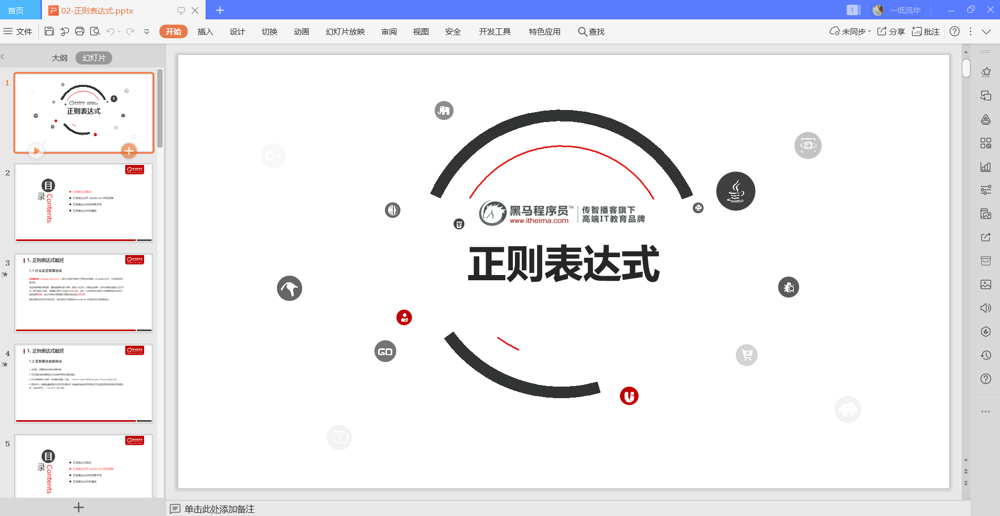

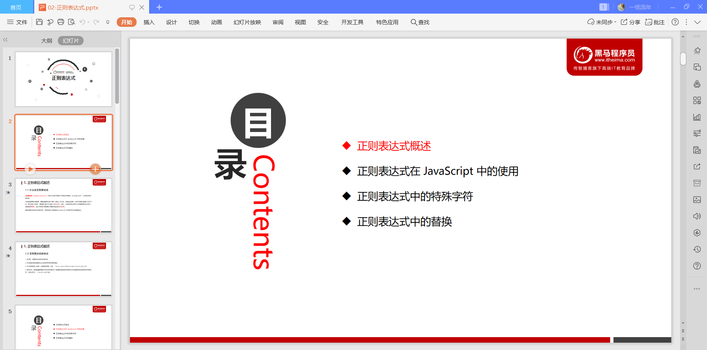

## 1. 正则表达式概述

### 1.1 什么是正则表达式

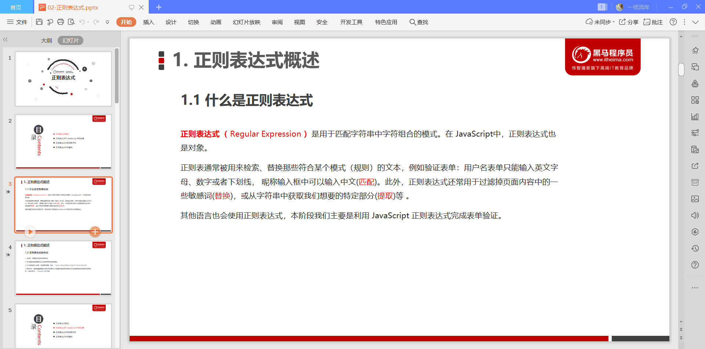

### 1.2 正则表达式的特点

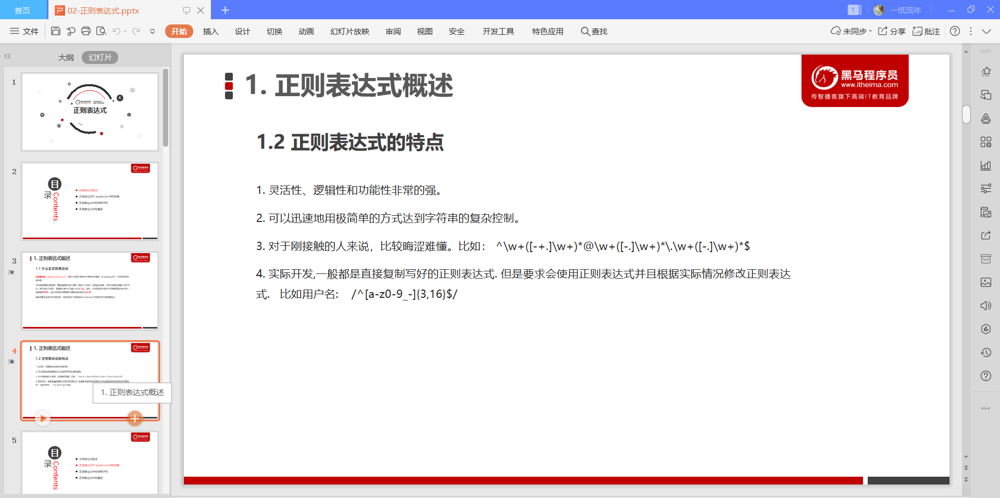

## 2. 正则表达式在JavaScript中的使用

### 2.1 创建正则表达式

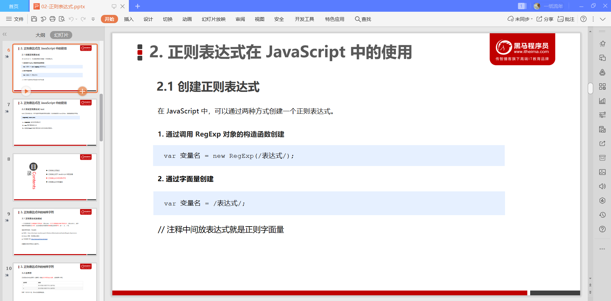

### 2.2 测试正则表达式 test

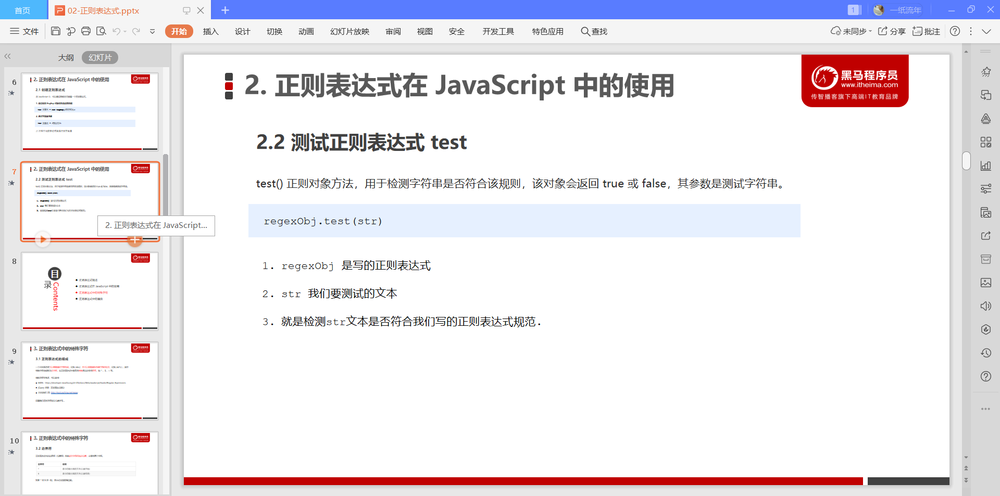

## 正则表达式中的特殊字符

### 3.1 正则表达式的组成

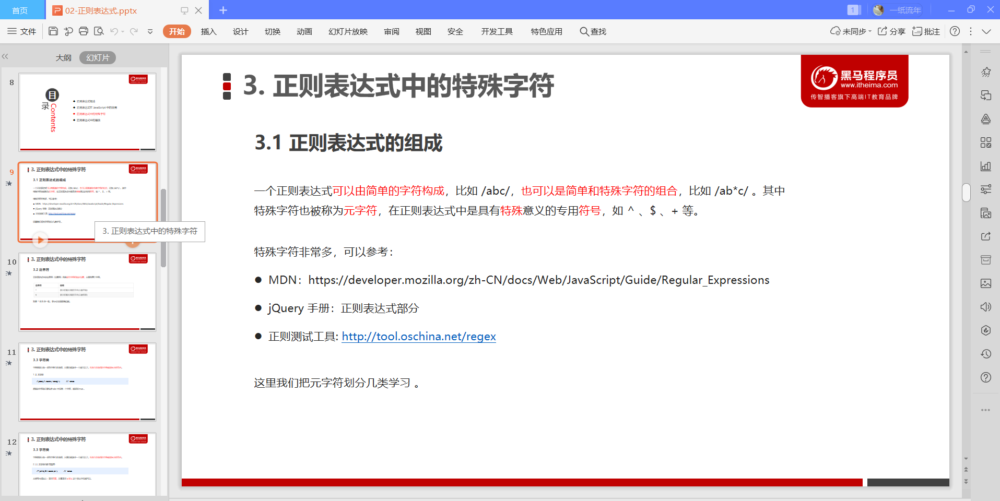

### 3.2 边界符

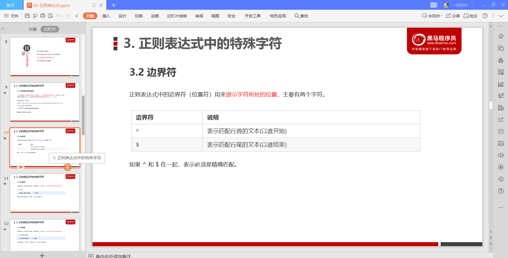

### 3.3 字符类

#### 1.[ ] 方括号

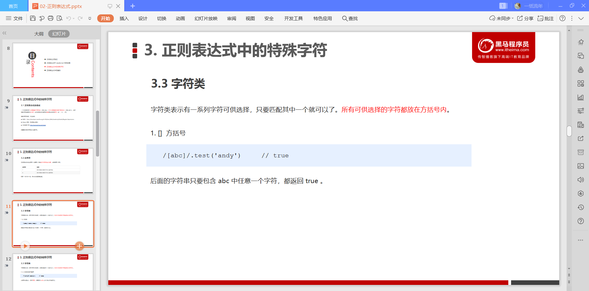

#### 2.[ - ] 方括号内部范围符号 - 

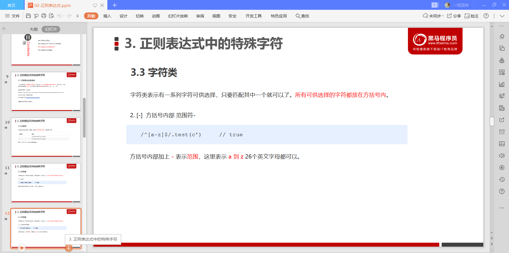

#### 3. [ ^ ]  方括号内部取反符号^

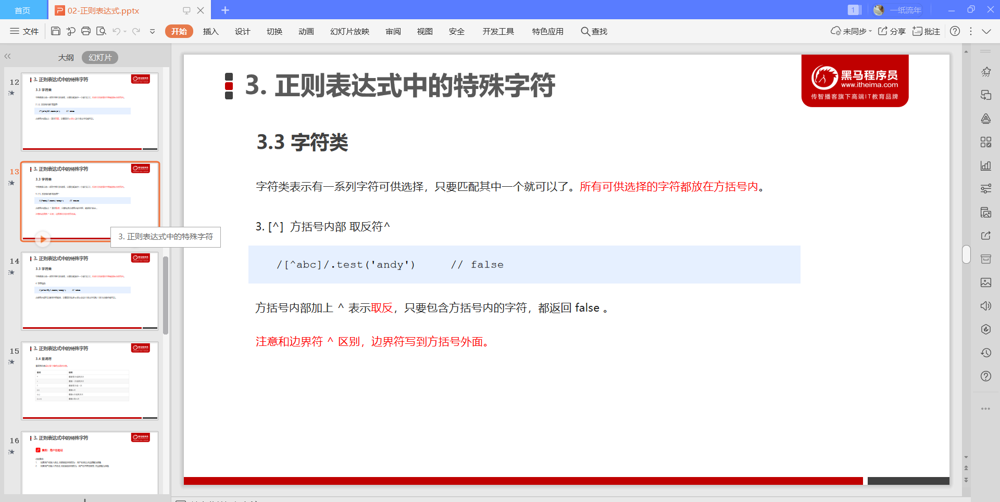

#### 4.字符组合

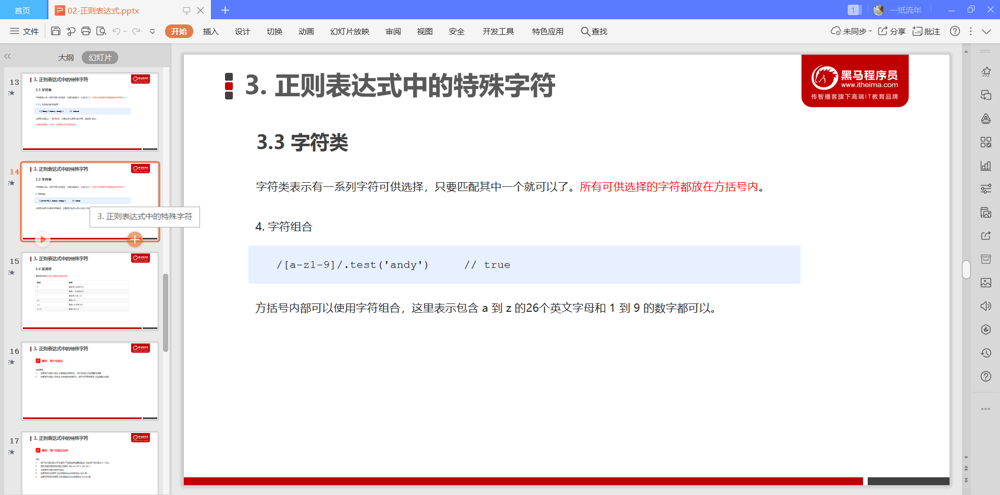

### 3.4 量词符

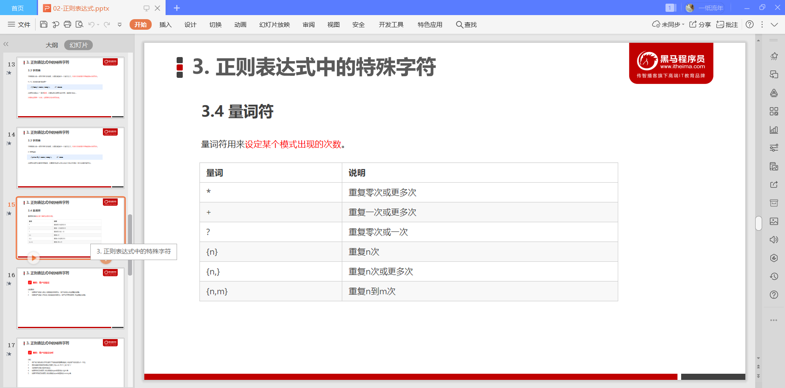

###  案例：用户名验证

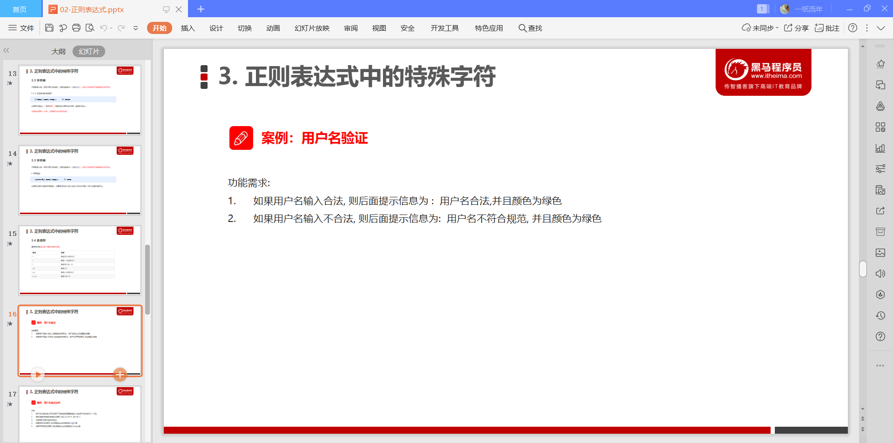

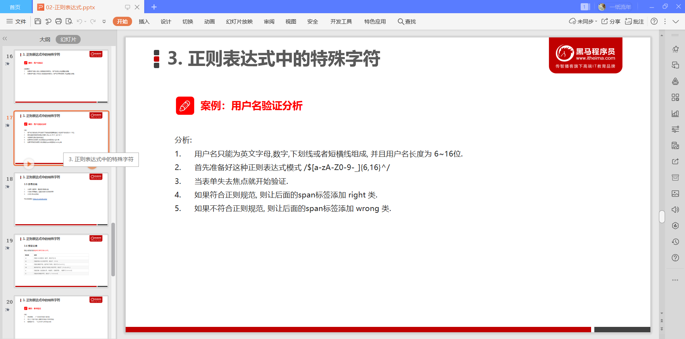

### 3.5 括号总结

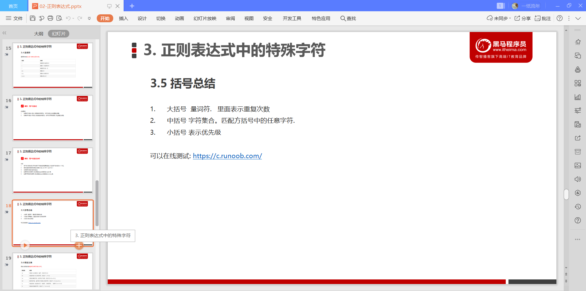

### 3.6 预定义类

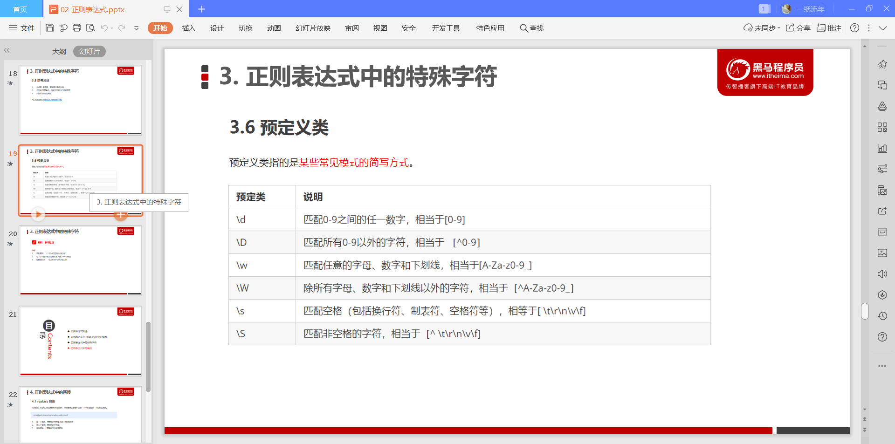

### 案例：表单验证

#### 手机号码

#### QQ

#### 昵称为中文

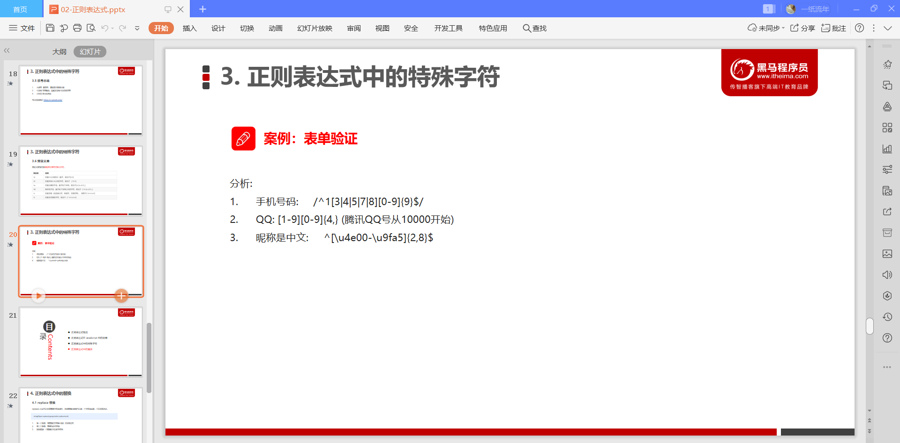

## 3. 表达式中的替换

### 4.1  replace替换

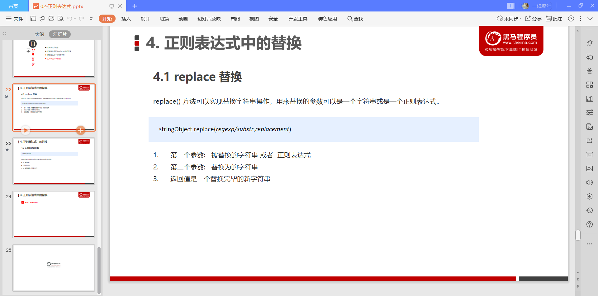

### 4.2 正则表达式参数

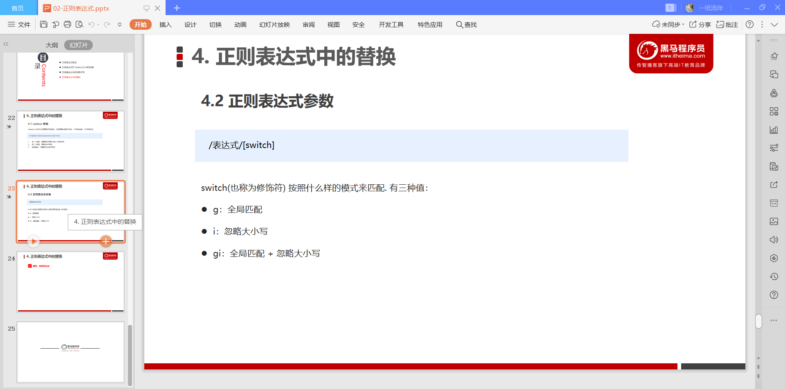

### 案例：敏感词过滤

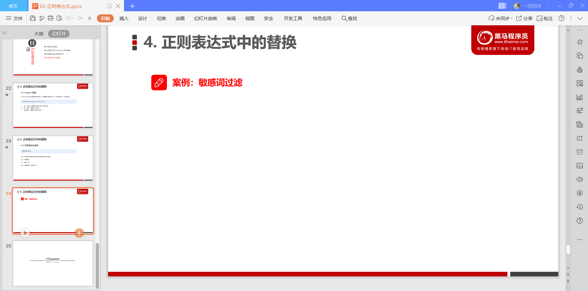

