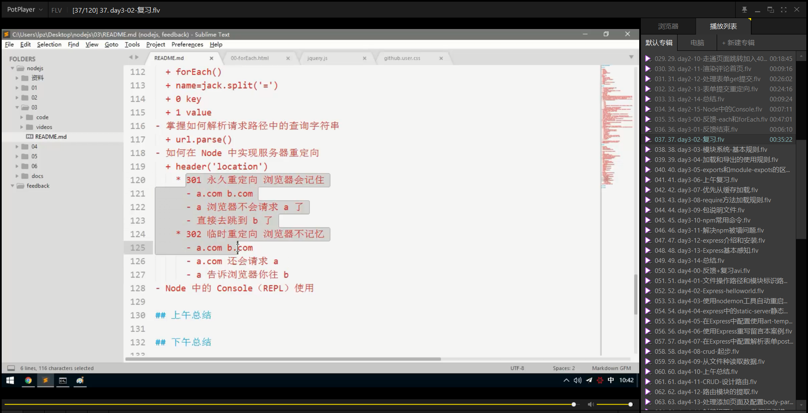

# 笔记

## 如何解析携带了参数的URL地址

在`nodejs` 中具有`urll  `核心模块，调用`url.parse(request.url)` 就可以获取当当前`url`的详细信息

~~~javascript
var http = require('http');
// 引入url核心模块
var url = require('url')
var server = http.createServer();
 server.on('request',function(req,res){
     var urlObject = url.parse(req.url);
     console.log(urlObject);//获取url地址的详细信息
     return res.end('hello url');
 })
 server.listen(9000,function(){
    console.log('server is runing');
 })
~~~

结果：

~~~shell
Url {
  protocol: null,
  slashes: null,
  auth: null,
  host: null,
  port: null,
  hostname: null,
  hash: null,
  search: '?name=zh&sex=female',   
  query: 'name=zh&sex=female',     
  pathname: '/path',
  path: '/path?name=zh&sex=female',
  href: '/path?name=zh&sex=female' 
}
  auth: null,
  host: null,
  port: null,
  hostname: null,
  hash: null,
  search: '?name=zh&sex=female',
  query: 'name=zh&sex=female',
  pathname: '/path',
  path: '/path?name=zh&sex=female',
  href: '/path?name=zh&sex=female'
}
~~~

利用字符串处理函数 `String.split('&')和String.split('=')` 来将get请求的参数获取出来

~~~javascript
 var urlObject = url.parse(req.url,true);//直接将参数转成对象形式输出
~~~

可以在`pares()方法里面添加，true` 配置，来直接获取get请求的参数的对象，而不必对url进行繁琐的解析处理。

~~~javascript
Url {
  protocol: null,
  slashes: null,
  auth: null,
  host: null,
  port: null,
  hostname: null,
  hash: null,
  search: '?name=zh&sex=female',
  query: [Object: null prototype] { name: 'zh', sex: 'female' },
  pathname: '/path',
  path: '/path?name=zh&sex=female',
  href: '/path?name=zh&sex=female'
}
Url {
  protocol: null,
  slashes: null,
  auth: null,
  host: null,
  port: null,
  hostname: null,
  hash: null,
  search: null,
  query: [Object: null prototype] {},
  pathname: '/favicon.ico',
  path: '/favicon.ico',
  href: '/favicon.ico'
}
~~~

## 如何在Node中实现重定向

~~~javascript
// 测试重定向
var http = require('http');
var url = require('url');
var server = http.createServer();
server.on('request',function(request,response){
    var urlObjectb =url.parse(request.url,true);
    var urlpath =urlObjectb.pathname;
    console.log(urlpath);
    if(urlpath === '/redirect'){
        // 执行301永久重定向，也就是缓存重定向
        console.log('访问了redirect');
        response.statusCode = 302;
        response.setHeader('Location','/index');
        return response.end();
    } else if(urlpath === '/index'){
        return response.end('hello index');
    } else {
        return response.end('404 Not found')
    }
})
server.listen(3000,function(){
    console.log('重定向启动');
})
~~~

 经过测试发现无论`response.statusCode`为`301`还是`302`，当访问 `'/redirect'`的时候，均会向服务器中的`redirect`发送请求，不知为何?

测试发现采用 `302` 的状态吗，路径执行  `/redirect` 的时候直接重定向了，并没有执行 `/redirect` 路径里面的其他代码，所以说的是  `response.statusCode = 302` 浏览器并不是不会发送请求，而是不会执行请求路径里面的代码，而是直接跳转到了重定向页面中。

如果为`301 `测试发现，都会执行。这大概就是重定向的区别。

## 解释`[].slick.call($div)`伪数组转成数组的原理

刚开始时，不是很理解，可是结合slice的函数来观察，就可以很容易理解了

+ 首先，可以知道`Array.prototype.slice()`中`slice`里面的`this`,指向的是数组的实例对象，例如 `[]`,所以

  `[].slice()` 中slice里面的this指向的是`[]`,当我们采用了`[].slice.call($div)` 的时候，可以知道**`call`的作用是改变调用它的对象的内部的`this指向`** 所以此时可以知道`[].slice.call($div)`中`slice`函数里面的`this` 指向的`$div`,也就是一个`伪数组`，结合原型对象里面的slice返回一个`新数组`，且其中新数组的值由`this[i]` 获取，也就是`$div[i]`。所以我们可以利用这种方式直接将`伪数组`转换为`数组`。

+ 伪数组的构成，如上图所示

  ~~~javascript
  var fakeArr = {
      0:'abc',
      1:'zws',
      2:'haha',
      length:3
  }
  ~~~

  伪数组可以使用 `for循环遍历，采用下标遍历出来,其中对象的key值必须为数组，与数组的索引想对应，其中length必须具有`

## exports和module.exports的使用总结

`exports`和`module.exports`区别

~~~shell
每一个模块（一般就是js文件），都有一个module对象
module对象中有一个exports对象（这里是不是module对象的exports属性）
我们可以把需要导出的成员挂载道module.exports接口对象中，也就是 module.exports.xxx = xx的方式
但是每次都要module.exports.xxx = xxx有些太麻烦了，层级有点多
所以Node为了方便操作，同时在每一个模块中提供了一个成员交：exports
exports === module.exports 结果为true
所以对比module.exports.xx = xx的方式，完全可以采用 exports.xx = xx的方式
但是当一个模块要导出单个成员的时候，必须要使用 module.exports = xxx的方式
而不是采用 exports = xx 的方式
因为每一个模块最终导向外面 return 出去的是 module.expots而不是exports
exports只是module.exports的一个引用
~~~

~~~javascript
// 总结以上两点
// export和module.export均为对象
export = module.export;
return module.export;
// 一般情况下如果分不清的话都采用module.export就可以了
~~~

## require方法的加载规则

### 优先从缓存中加载

优先从缓存纵加载，就是指： `main.js`中导入了`a.js`和`b.js`，然后再`a.js`中再次导入`b.js`，那么在执行`main.js`的时候`b.js`只会被执行一次，同时它可以被`main.js`导入，`a.js`也同时导入。

我们都知道，导入一个模块的作用就是执行模块里面的代码，并且导出对象，所以从换出中加载，就是模块多次被不同的文件导入，只执行一次，接下来就是在缓存中查找。导出多次。

### 判断模块标识

1. 核心模块
   + 模块名
2. 第三方模块
   + 模块名
3. 自定义模块
   + 自己写入路径

### 自定义模块加载规则

### 核心模块加载规则

### 第三方模块加载规则

## 包查找机制总结

## npm

**全称 node package manager**

### npm网站

**npmjs.com**

### npm 命令行工具

npm的第二层含义就是一个命令行工具，只要你安装了node就已经安装了npm.

npm 也有版本这个概念。

可以通过命令行中输入

~~~powershell
1 npm --version
~~~

升级npm (自己升级自己)

~~~powershell
2 npm install --global npm
~~~

### npm 常用命令

* npm init 
  - npm init -y 可以跳过向导，快速生成
* npm install
  - 一次性把dependencies选项中的依赖项全部安装
  - npm i
* npm install 包名
  - 只下载
  - npm i 包名
* npm install --save 包名
  - 下载并且保存依赖项（package.json文件中的dependencies选项）
  - npm i -S 包名 （注意要大写S）
* npm uninstall 包名
  * 只删除，如果有依赖项会依然保存
  * npm un 包名
* npm uninstall --save 包名
  * 删除的同时也会把依赖信息也去除
  * npm un -S 包名
* npm help
  * 查询使用帮助
* npm 命令 --help
  * 查询指定命令的使用帮助
  * 例如我忘记了uninstall 命令的简写了，这个时候，可以输入`npm uninstall --help`  来查询使用帮助

### 解决npm 被墙问题

npm存储包文件的服务器在国外，有时候会被墙，速度很慢，所以我们需要解决这个问题。

http://npm/taobao.org/淘宝的开发团队把npm在国内做了一个备份

安装淘宝的cnpm ；

~~~shell
#在任意目录下执行都可以
#--global表示安装到全局，而非当前目录
#--global 不能省略，否则不起作用
npm install --global cnpm
~~~

接下来你安装包的时候把之前的npm 替换成cnpm

~~~shell
# 这里还是走国外的npm服务器，速度比较慢
npm install jquery
# 使用cnpm 就会通过淘宝的服务器来下载jquery
cnpm install jquery
~~~

如果不想安装 `cnpm` 又想使用淘宝的服务器来下载

~~~shell
npm install jquery --registry=https://registry.npm.taobao.org
~~~

但是每一次手动这样加参数非常麻烦，所以我们可以把这个选项加入配置文件中

~~~shell
npm config set registry https://registry.npm.taobao.org
# 查看 npm 配置信息
npm config list
~~~

只要经历了上面命令的配置，则你以后所有的 `npm install` 都会默认通过淘宝服务器来下载依赖包

## package.json

我们建议每一个项目都要有一个package.json文件（包描述文件，就像产品说明书一样），给人踏实的感觉。这个文件可以通过npm init的方式来自动初始化出来。

对于目前来讲，最有用的是那个`dependencies`  选项，可以用来帮助我们保存第三方包的依赖信息。

如果你的`node_modules`  删除了，可以通过 `npm install` ，就可以自动的把`package.json`  中的 `dependencies` 中的所有的依赖项都下载回来

* 建议每一个项目的根目录下都要有一个`package.json`文件
* 建议执行`npm install 包名`的时候都要加上 `--save`这个选项，目的是用来保存依赖项信息。

## Express

### express的安装

~~~shell
# 初始化package.json文件
npm init  
~~~

~~~shell
# 在当前目录下面下载express
npm install express --save
~~~

### express的hello world

### express罗列请求

### express开放资源

### 重写留言板项目

~~~javascript
// 使用express框架重写留言板功能
const express = require('express');
const template = require('art-template');
const fs = require('fs');
// 创建服务器
const server = express();
// 设置端口号
const part = 9000;
console.log('-------------------创建数据-------------------------------------------------------');
var commonList = [{
    name:'silly1',
    comment:'hello world1',
    dateTime:'2019-09-24'
},{
    name:'silly2',
    comment:'hello world2',
    dateTime:'2019-09-24'
},{
    name:'silly3',
    comment:'hello world3',
    dateTime:'2019-09-24'
},{
    name:'silly4',
    comment:'hello world4',
    dateTime:'2019-09-24'
},{
    name:'silly5',
    comment:'hello world5',
    dateTime:'2019-09-24'
},{
    name:'silly6',
    comment:'hello world6',
    dateTime:'2019-09-24'
}]

// 处理请求响应
console.log('-------------------处理请求响应---------------------------------------------------');
/**
 *首页渲染
 */
server.get('/',function(request,response){
    fs.readFile('./views/index.html',(error,data)=>{
        if(error){
            console.log('首页数据读取失败');
            return response.send('<h1>index file read failed</h1>')
        } else {
            var str = template.render(data.toString(),{
                commonList:commonList
            })
            return response.send(str);
        }
    })
});
/**
 * 留言添加
 */
server.get('/post',function(request,response){
    fs.readFile('./views/post.html',function(error,data){
        if(error){
            console.log('添加留言数据读取失败');
            response.setHeader('Content-Type','text/html')
            return response.send('<h1>post file read failed</h1>')
        } else {
            response.setHeader('Content-Type','text/html')
            return response.send(data);
        }
    })
    });
/**
 * 添加之后跳转
 */
server.get('/pinglun',function(request,response){
      // 添加到评论数据中
      request.query.dateTime = '2020-09-09';
      commonList.unshift(request.query);
      // 执行重定向返回首页中,并重新渲染
      response.statusCode = 302;
      response.setHeader('Location','/')
      return response.send()
})
console.log('-------------------静态资源开放---------------------------------------------------');
// 处理开放资源的访问,只要这样做了，就可以通过/public/xx的方式来访问public目录下面的所有的静态资源
server.use('/public/',express.static('./public/'))
console.log('-------------------端口监听-------------------------------------------------------');
// 监听端口号
server.listen(part,()=>{
    console.log('server is runing');
})
~~~

