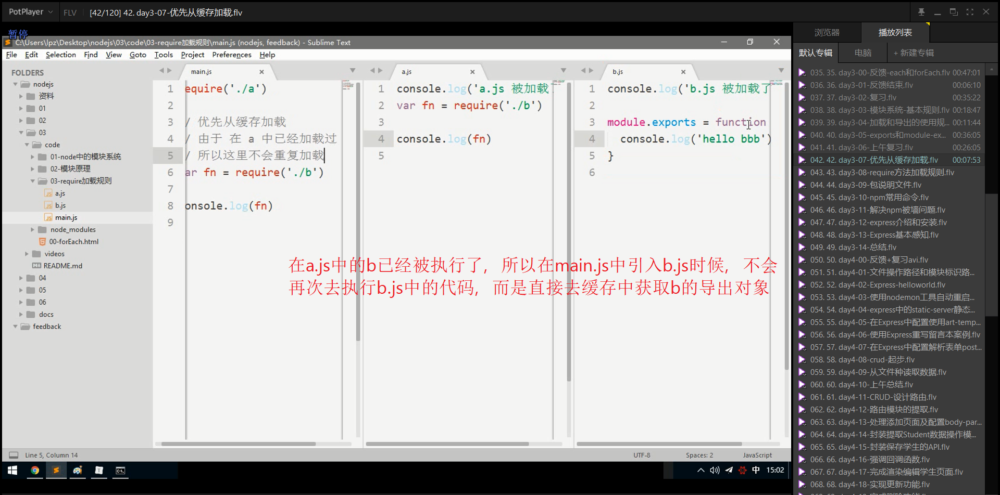

# 笔记

## 如何解析携带了参数的URL地址

## 如何在Node中实现重定向

## 解释`[].slick.call($div)`伪数组转成数组的原理

## exports和module.exports的使用总结

## require方法的加载规则

### 优先从缓存中加载

### 判断模块标识

1. 核心模块
   + 模块名
2. 第三方模块
   + 模块名
3. 自定义模块
   + 自己写入路径

### 自定义模块加载规则

### 核心模块加载规则

### 第三方模块加载规则

## 包查找机制总结

## npm

**全称 node package manager**

### npm网站

**npmjs.com**

### npm 命令行工具

npm的第二层含义就是一个命令行工具，只要你安装了node就已经安装了npm.

npm 也有版本这个概念。

可以通过命令行中输入

~~~powershell
1 npm --version
~~~

升级npm (自己升级自己)

~~~powershell
2 npm install --global npm
~~~

### npm 常用命令

* npm init 
  - npm init -y 可以跳过向导，快速生成
* npm install
  - 一次性把dependencies选项中的依赖项全部安装
  - npm i
* npm install 包名
  - 只下载
  - npm i 包名
* npm install --save 包名
  - 下载并且保存依赖项（package.json文件中的dependencies选项）
  - npm i -S 包名 （注意要大写S）
* npm uninstall 包名
  * 只删除，如果有依赖项会依然保存
  * npm un 包名
* npm uninstall --save 包名
  * 删除的同时也会把依赖信息也去除
  * npm un -S 包名
* npm help
  * 查询使用帮助
* npm 命令 --help
  * 查询指定命令的使用帮助
  * 例如我忘记了uninstall 命令的简写了，这个时候，可以输入`npm uninstall --help`  来查询使用帮助

### 解决npm 被墙问题

npm存储包文件的服务器在国外，有时候会被墙，速度很慢，所以我们需要解决这个问题。

http://npm/taobao.org/淘宝的开发团队把npm在国内做了一个备份

安装淘宝的cnpm ；

~~~shell
#在任意目录下执行都可以
#--global表示安装到全局，而非当前目录
#--global 不能省略，否则不起作用
npm install --global cnpm
~~~

接下来你安装包的时候把之前的npm 替换成cnpm

~~~shell
# 这里还是走国外的npm服务器，速度比较慢
npm install jquery
# 使用cnpm 就会通过淘宝的服务器来下载jquery
cnpm install jquery
~~~

如果不想安装 `cnpm` 又想使用淘宝的服务器来下载

~~~shell
npm install jquery --registry=https://registry.npm.taobao.org
~~~

但是每一次手动这样加参数非常麻烦，所以我们可以把这个选项加入配置文件中

~~~shell
npm config set registry https://registry.npm .taobao.org

# 查看 npm 配置信息
npm config list
~~~

只要经历了上面命令的配置，则你以后所有的 `npm install` 都会默认通过淘宝服务器来下载依赖包

## package.json

我们建议每一个项目都要有一个package.json文件（包描述文件，就像产品说明书一样），给人踏实的感觉。这个文件可以通过npm init的方式来自动初始化出来。

对于目前来讲，最有用的是那个`dependencies`  选项，可以用来帮助我们保存第三方包的依赖信息。

如果你的`node_modules`  删除了，可以通过 `npm install` ，就可以自动的把`package.json`  中的 `dependencies` 中的所有的依赖项都下载回来

* 建议每一个项目的根目录下都要有一个`package.json`文件
* 建议执行`npm install 包名`的时候都要加上 `--save`这个选项，目的是用来保存依赖项信息。

## Express

### express的安装

### express的基本感知

### express罗列请求

### express开放资源

