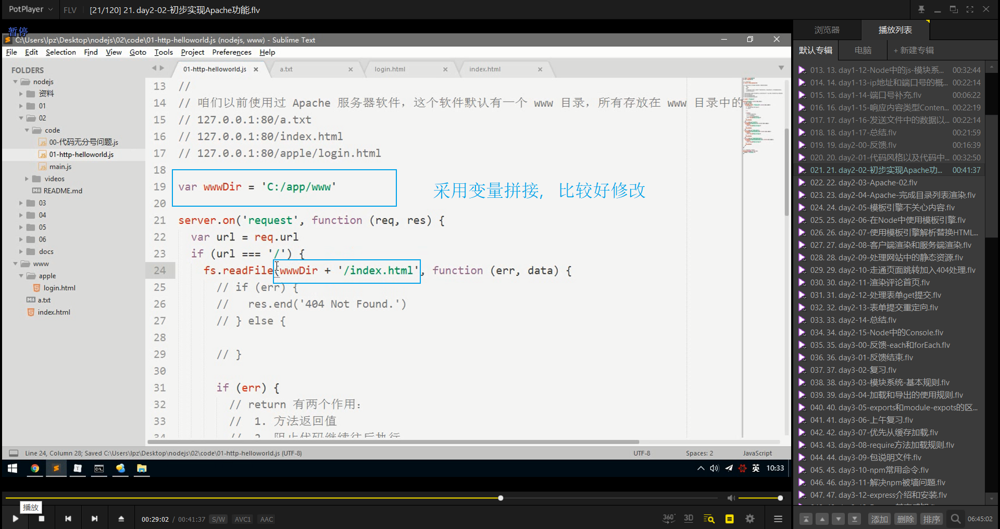
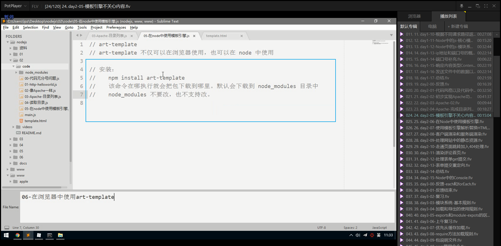
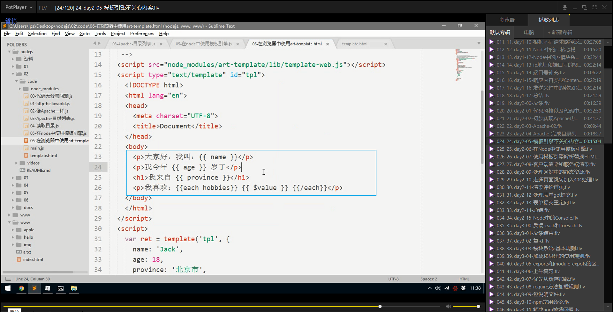
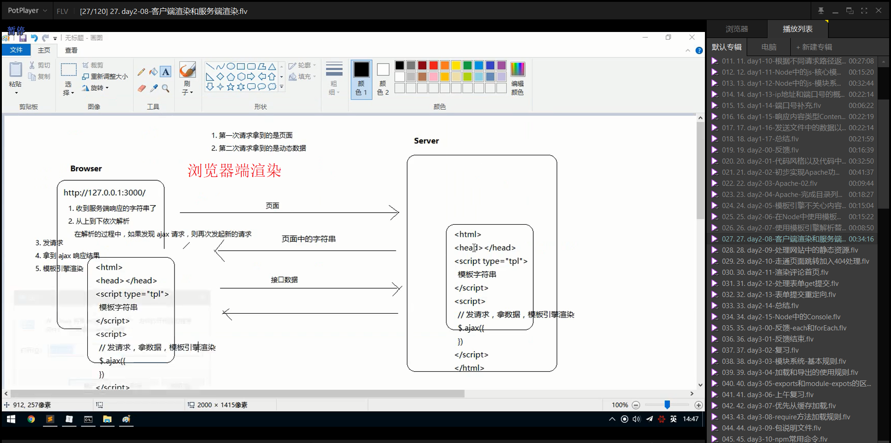
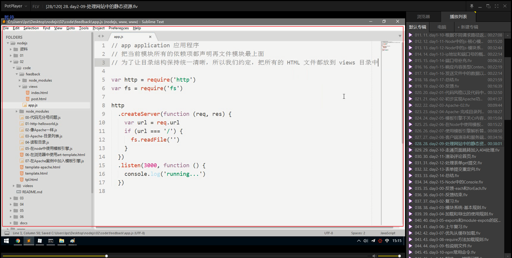

# 笔记

## 代码风格以及代码中的分号问题

## 初步实现Apache功能

## Apache--目录列表

## Apache-完成目录列表渲染

## 模板引擎不关心内容

## 在Node中使用模板引擎

## 使用模板引擎解析替换HTML页面

## 服务端渲染和客户端渲染

## 处理网站中的静态资源

## 走通页面跳转加入404处理

## 渲染评论首页

## 处理表单get提交

## 表单提交重定向

