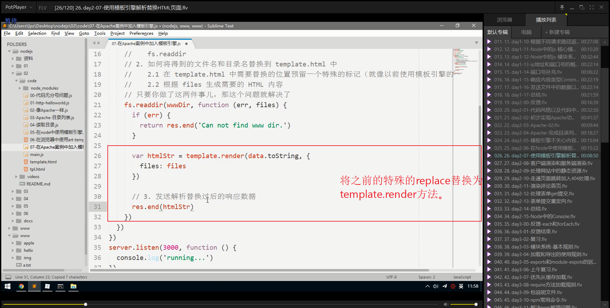

#  笔记

## 代码风格以及代码中的分号问题

### 编码风格

~~~javascript
var foo = 'bar'
var foo ='bar'
var foo= 'bar'
var foo = "bar"

if (true) {
  console.log('hello') 
}

if (true) {
    console.log('hello') 
}

if (true ){
      console.log('hello') 
}
~~~

为了约定大家的代码风格，所以在社区中诞生了一些比较规范的代码风格规范：

- JavaScript Standard Style。
- Airbnb JavaScript Style。
- 此外还有一些小众的编码风格

### 分号问题

无分号

+ `(`
+ `[`
+ `
+ 最好前面补分号，避免一些问题
+ 《编写可维护的 JavaScript》
+ 不仅是功能，还要写的漂亮

具体的原因可以参考立即执行函数前面一般加  `;`。

因为可以知道 （function(){...})()因为前面如果再有一个()的话，浏览器无法识别，认为这是语法错误，从而提示错误

所以对于一行代码如果以

`()`、`[]`、`` 开头代码一般都在开始前加  ; 标志，用以和之前的代码做一个区分。

~~~javascript
/**
 * 测试无 ; 情况下三种出错的情况
 */

 // 第一种哦贵()
(function(){
    console.log('hello ( first)');//hello ( first)
    
})();
(function(){
    console.log('hello (second)');//hello (second)
})()
// 不加分割符号 ; 直接报错

// 第二种 []
var arr = ['1','2','3'];// 不加 ; 直接报错
['4','5','6'].forEach(function(item){
    console.log(item);
});
// 第三种 ``
var str = `hello world`;// 不加 ; 直接报错
`heheheh`.trim();
~~~

## 初步实现Apache功能

### Apache默认目录

所谓的Apache默认目录，也就是当url 路径地址为 '/'的时候，自动显示当前项目的目录文件。

同时也可以直接在电脑中将文件夹拖拽到Chrome浏览器上面，也可以显示当前文件夹中的目录文件，此时，我们要做的就是搭建一个服务器,将html页面字符串传递到浏览器中，此时的html页面内容为目录文件。

### end中的return

**可以知道一次请求对应一次响应，如果想要在响应之后，中断接下来的程序执行，那么可以采用return的方式，结束程序的执行**

一般而言，return 有两个作用

* 方法返回值
* 阻止代码继续往后执行

### 静态获取显示文件夹的index.htm文件

### 静态页面自带的charset=utf8

### 根路径变量字符串拼接

采用根目录的字符串拼接形式，本质上是根路径的使用，只是为了便于修改根路径，故而直接采用一个全局变量的字符串拼接的形式，本质没有变化。

此处并没有对输入的 res.end('404 Not Found')处理，是否可以正常显示呢?很明显普通的数字，英文字符是可以正常显示的，只是中文的话，因为没有设置字符编码，所以显示在页面中为乱码格式。

~~~javascript
/**
 * 创建服务器,所有数据均在index.html中拷贝下来，所以动态修改文件夹时，没有动态展示
 */
 var fs = require('fs');
 var http = require('http');
 var server = http.createServer();
 var absolutePate = 'D:/documents/Git/BasicKnowledgeLearning/NodeJS/code/02_第二天/02_Apache静态目录/01_直接静态'
 server.on('request',function(request,response){
       var url = request.url;
       if(url === '/'){
            // 相比之前，此处采用绝对路径来完成         
           fs.readFile( absolutePate + '/index.html',function(error,data){
               if(error){
                   console.log('文件读取失败：'+error);
                  return response.end('404 Not Found')
               } else {
                   console.log('文件读取成功');
                  return response.end(data) 
               }
           })
       }else if(url ==='/apple/login'){
           fs.readFile(absolutePate + '/www/apple/login.html',function(error,data){
               if (error) {
                   console.log(error);
                  return response.end('404 Not Found')
               } else {
                   return response.end(data)
               }
           })
       }
 })
 server.listen(3000,function(){
     console.log('server is running');
 })
~~~

## Apache--目录列表

此处因为没有下载Apache 服务器，所以无法验证，不过这无关重要

### 获取目录列表中的文件名和目录名 fs.readdir

主要步骤：

1. 获取当前目录列表中的文件名和目录名 fs.readdir
2. 将template.html中的文件名和目录名采用模板引擎替换掉

## Apache-完成目录列表渲染

### 获取当前目录下的文件列表

无法区分文件名和文件夹名，那么如何处理呢？

### fs.readdir()的参数(一)

### fs.readdir的参数(二)

### 采用replace替换拼接好的HTML页面字符串

采用的es6的字符串拼接的语法，这样写起来比较简单。

~~~javascript
/**
 * 采用手动字符串拼接，然后替换的方法
 */
var fs = require('fs');
var http = require('http');
var server = http.createServer();
var absolutePate = 'D:/documents/Git/BasicKnowledgeLearning/NodeJS/code/02_第二天/02_Apache静态目录/01_直接静态/www'
server.on('request',function(request,response){
      var url = request.url;
      if(url === '/'){
        // 相比之前，此处采用绝对路径来完成         
          fs.readFile('./template.html',function(error,data){
              if(error){
                  console.log('文件读取失败：'+error);
                 return response.end('404 Not Found')
              } else {
                    var dirs = fs.readdir(absolutePate,function(error,fileNames){
                    if(error){
                        console.log('获取目录文件失败：' + error);
                    } else {
                            var content = '';
                            console.log('fileNames:'+fileNames);
                            
                            fileNames.forEach(function(item){
                                content += `
                                <tr>
                                <td data-value="apple/"><a class="icon dir" href="/D:/Movie/www/apple/">${item}/</a></td>
                                <td class="detailsColumn" data-value="0"></td>
                                <td class="detailsColumn" data-value="1509589967">2017/11/2 上午10:32:47</td>
                                </tr>
                            `
                            })
                            data = data.toString();
                            // 直接使用replace字符串替换
                            console.log(content);
                            data = data.replace('^_^', content)
                            console.log(data);
                            return response.end(data) 
                        }
                            })
                }
          })
      }else if(url ==='/apple/login'){
          fs.readFile(absolutePate + '/www/apple/login.html',function(error,data){
              if (error) {
                  console.log(error);
                 return response.end('404 Not Found')
              } else {
                  return response.end(data)
              }
          })
      }
})
server.listen(3000,function(){
    console.log('server is running');
})
~~~

## 模板引擎不关心内容

### 直接使用github下载 art-template渲染引擎教程

其实渲染引擎，感觉就是一个数据渲染工具，因为可以知道html中如果要添加或者修改数据，都必然会用到DOM操作

而其中的繁杂也是可以知道的，采用渲染引擎的话，可以更好的关注于业务，和页面设计，而不是始终要花大力气来考虑

数据的渲染问题，而且渲染引擎最初也是在浏览器中渲染数据使用的，将html页面中的数据渲染完成之后，再重新将html

字符串页面传递给服务器，让服务器去解析。

#### github查找art-tempalte流程

### 采用npm 下载 art-template

 #### node_module目录中引入

### 模板引擎浏览器端渲染

#### 渲染展示

~~~html
<html dir="ltr" lang="zh" i18n-processed="">
<head>
  <meta charset="utf-8">
  <meta name="google" value="notranslate">
  
  
  
  <title id="title">D:\Movie\www\ 的索引</title>
</head>

<body>
  
糟糕！Google Chrome无法解读服务器所发送的数据。请<a href="http://code.google.com/p/chromium/issues/entry">报告错误</a>，并附上<a href="LOCATION">原始列表</a>。

  <h1 id="header">D:\Movie\www\ 的索引</h1>
  

    <a id="parentDirLink" class="icon up">
    {{title}}
  </a>
  

  <table>
    <thead>
      <tr class="header" id="theader">
        <th onclick="javascript:sortTable(0);">名称</th>
        <th class="detailsColumn" onclick="javascript:sortTable(1);">
          大小
        </th>
        <th class="detailsColumn" onclick="javascript:sortTable(2);">
          修改日期
        </th>
      </tr>
    </thead>
    <tbody>
    </tbody>
  </table>
</body>

</html>
~~~

## 在Node中使用模板引擎

模板引擎最早就是诞生于服务器灵域，后来才发展到了前端

​	此处直接使用字符串进行模板引擎的渲染，实质上也可以通过fs读取html文件进来，然后转成字符串，一起渲染，最后传到浏览器。

### 可以看到在node中渲染的结果

### 在node中引入art-template

### ES6模板字符串拼接

### 单独html文件引入

## 使用模板引擎解析替换HTML页面

### HTML中的art-template语法

## 服务端渲染和客户端渲染

这里结合art-template模板引擎说明。

首先了解下前端页面中如何使用art-template

1、script 标签导入包，当这个标签导入完毕后，在window全局中就有了template 函数。

2、创建一个script标签，内部是模板字符串

<script type="text/template" id="tmpl">

3、 var htmlStr = template('tmpl',{要渲染的数据对象})

4、将创建好的HTML字符串，追加到页面中即可

### 服务端渲染

1、服务器端渲染

   每当有客户端请求页面了，服务器先在后端调用art-template，把指定的页面预先在后端渲染后，然后通过res.end把这个渲染完毕的完整页面，

返回给客户端直接展示。

 优点：对SEO友好，因为我们经过服务器端渲染的页面，在网络中传输的时候，传输的是一个真实的页面。因此，爬虫客户端，当爬到我们的页面后，

会分系我们给他提供的这个页面，此时，我们页面中的关键数据就会被爬虫给收录了。

缺点： 服务器端渲染，对服务器压力比较打，可以使用服务器端的页面缓存技术，减轻服务器的渲染压力；不适合前后端分离开发。

### 客户端渲染

2、客户端渲染

   每当用户要请求某个页面了，

 第一步，用户需要先把这个页面请求到客户端，此时用户拿到的页面只是一个模板页面。

 第二步，浏览器在解析模板页面的时候，会发起art-template的二次资源请求，同时要发送Ajax请求，去服务器获取数据

 第三步，在客户端调用art-template 渲染HTML结构，并把渲染厚的htmlStr append 到页面指定的容器中;

缺点： 对SEO相当不友好

优点： 减轻了服务器端的渲染压力;同时，最大的好处就是：能够实现前后端分离开发;

### 总结

## 处理网站中的静态资源

### 一般项目目录结构

### 浏览器针对外链资源自动发起访问

### 创建public文件夹

### 注意开放静态资源路径问题

### 服务器中的资源路径问题

## 走通页面跳转加入404处理

### 重新设置link外链资源的路径

### 点击返回首页

## 渲染评论首页

### 设置渲染数据

### 设置art-template中的html模板语法

## 处理表单get提交

### 设置请求的路径地址

### 采用url.parse()解析url地址

### 配置url.parse()的参数

## 表单提交重定向

~~~javascript
/**
 * 创建留言板服务器
 */
var http = require('http');
var fs = require('fs');
var template = require('art-template');
var url = require('url');
var commonList = [{
    name:'silly1',
    comment:'hello world1',
    dateTime:'2019-09-24'
},{
    name:'silly2',
    comment:'hello world2',
    dateTime:'2019-09-24'
},{
    name:'silly3',
    comment:'hello world3',
    dateTime:'2019-09-24'
},{
    name:'silly4',
    comment:'hello world4',
    dateTime:'2019-09-24'
},{
    name:'silly5',
    comment:'hello world5',
    dateTime:'2019-09-24'
},{
    name:'silly6',
    comment:'hello world6',
    dateTime:'2019-09-24'
}]
var server = http.createServer();
server.on('request',function(request,response){
    var urlObj = url.parse(request.url,true);
    console.log(urlObj)
    var urlPath = urlObj.pathname;
    if(urlPath ==='/'){//  // 渲染首页
        fs.readFile('./views/index.html',function(error,data){
            if(error){
                console.log('读取index.html报错：'+error);
            } else {
                // 通过art-template模板引擎渲染
                data = data.toString();// 16进制数字转字符串
                var str = template.render(data,{commonList:commonList})
                // 将已经渲染完成的数据提交给浏览器
                return response.end(str)
            }
        })
    } else if(urlPath.indexOf('/public') === 0){ // 针对public文件里面的静态资源开放
        // 可以知道url 为/public/img,或者public/css这种形式，所以可以在此处灵活设置开放资源
        fs.readFile('.'+ urlPath,function(error,data){
            if(error){
                console.log('public资源请求失败:'+error);
                fs.readFile('./views/error.html',function(error,data){
                    return response.end(data);
                })
            } else {
                return response.end(data)
            }
        })
    } else if(urlPath === '/post'){
        fs.readFile('./views/post.html',function(error,data){
            if(error){
                console.log('添加页面读取错误:'+error);
                 //渲染错误页面
                fs.readFile('./views/error.html',function(error,data){
                        return response.end(data);
                })  
            } else {
                fs.readFile('./views/post.html',function(error,data){
                    if(error){
                        console.log('添加编辑读取错误:'+error);
                        //渲染错误页面
                       fs.readFile('./views/error.html',function(error,data){
                               return response.end(data);
                       })
                    } else {
                        return response.end(data);
                    }
                })
            }
        })
    } else if(urlPath === '/pinglun'){
        // 将传递过来的数据天添加到数组中
        var obj = {};
        obj.name = urlObj.query.name;
        obj.comment = urlObj.query.message;
        obj.dateTime = '2020-12-31';
        commonList.unshift(obj);
        console.log(commonList);
        // 重定向到首页
        response.statusCode = 302;
        response.setHeader('Location','/');
        response.end();

    }  else {
        //渲染错误页面
        fs.readFile('./views/error.html',function(error,data){
            return response.end(data);
        })
    }
})
server.listen(9000,function(error,data){
    console.log('server is running');
})
~~~

