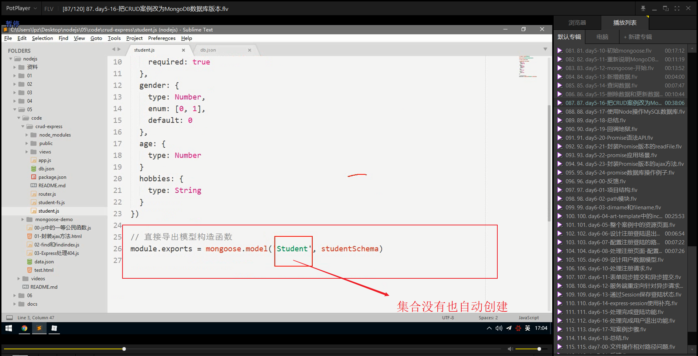

# 笔记

## MySQL账户密码：

账户：user7417

密码：root420222

## 回调函数

+ 一种数据类型
+ 参数
+ 返回值
+ 函数太灵活了，无所不能
+ 一般情况下，把函数作为参数的目的就是为了获取函数内部的异步操作结果。

常用的异步操作

* setTimeout
* readFile
* writeFile
* ajax

这几种情况必须要通过：回掉函数获取返回值

往往异步API都伴随一个回掉函数

## 封装ajax方法

## package-lock.json文件

npm 5 以前是不会有`package-lock.json` 文件的

npm5 以后才加入了这个文件

当你安装包的时候，npm都会自动生成或者更新`package-lock.json` 这个文件

* npm5 以后的版本安装包都不需要加`--save` 参数，它会自动保存依赖信息
* 当你安装包的时候，会自动创建或者更新`package-lock.json` 这个文件
* `package-lock.json` 这个文件会保存`node_modules`中所有包的信息（版本，下载地址）
  + 这样的话，重新 `npm install` 的时候速度就可以提升很多

+ 从文件来看，有一个`lock` 称为锁
  + 这个`lock` 是用来锁住版本的
  + 如果项目依赖了`1.1.1`版本
  + 如果你重新install其实会下载最新的版本，而不是1.1.1
  + 我们的目的就是希望可以锁住1.1.1这个版本
  + 所以这个`package-lock.json` 这个文件的另一个作用就是锁住版本号，防止自动升级新版。

+ 补充知识
  + `package.json`中`depencies`中的包的依赖其实是一个最低的版本，实际下载的`node_modules`中的包的版本可以比它在`package.json`中的版本更高，但是`package-lock.json`文件锁住了版本，不会让这个实际的版本很高就是了,这就是**`锁住`**的实际内涵

## find和findIndex的原理

find接收一个方法作为参数，方法内部返回一个条件

find会遍历所有的元素，执行你给定的带有条件返回值的函数

符合该条件的元素会作为find方法的返回值

如果遍历结束还没有符合该条件的元素，则返回undefined

## MongoDB介绍和安装

### 关系型数据库和非关系型数据库

表就是关系，或者说表与表之间存在关系

+ 所有的关系型数据库都需要通过`sql` 语言来操作
+ 所有的关系型数据库在操作之前都需要设计表结构
+ 而且数据表还支持约束
  + 唯一性
  + 主键
  + 默认值
  + 非空
+ 非关系型数据库非常的灵活
+ 有的非关系型数据库就是key-value对
+ 但是MongoDB是长的最像关系型数据库的非关系型数据库
  + 数据库==》数据库
  + 数据表==》集合（数组）
  + 表记录==》（文档对象）

+ MongoDB不需要设计表结构
+ 也就是说你可以任意的往里面存数据，没有结构性这么一说

### mongoDB数据库基本概念

+ 数据库
+ 集合
+ 文档

~~~javascript
{ // mongoDB 数据库是个大对象
    qq:{ // qq数据库
        users:[ // 集合。
            {name:'张三',age:15}, // 每一个集合中都只能保存对象，可以认为一个集合(表)中的每一条对象(记录)。
            {name:'李四',age:34}, // 每一个对象也被称为文档。
            {name:'李四',age:34},
            {name:'李四',age:34},
            ......
            
        ],
        product:[// 集合
            
        ]
        ......
    },
    taobao:{
        
    },
    baidu:{
        
    }
}
~~~

+ 可以有多个数据库
+ 一个数据库中可以有多个集合（表）
+ 一个集合中可以有多个文档（表记录）

+ 文档结构很灵活，没有任何限制

+ MongoDB非常灵活，不需要像MySQL一样先创建数据库、表、设计表结构

  + 在这里只需要：当你需要插入数据的时候，只需要指定往哪个数据库的哪个集合操作就可以了。
  + 一切都由MongoDB来帮你自动完成建库建表的操作。

  

### 安装

没什么注意点，自行百度。

[下载地址](https://www.mongodb.com/download-center/community)

配置 ：在path中将mongoDB的bin文件路径配置到用户变量中

测试 :

~~~shell
mongo --version
~~~

### 开启和关闭mongoDB数据

#### 启动：

~~~shell
# mongoDB默认使用执行了 mongod 命令所处盘符根目录下的/data/db作为自己的数据存储目录
# 所以在第一次执行该命令之前先自己动手新建一个/data/db
mongod
~~~

 如果想要修改默认的数据存储目录，可以：

~~~shell
mongod --dbpath=数据存储目录路径
~~~

#### 停止：

~~~shell
在开启服务的控制台，直接ctrl+c即可以停止
或者直接关闭开启服务的控制台也可以
~~~

### 连接和退出数据库

#### 连接：

~~~shell
#该命令默认连接本机的MongoDB服务
mongo
~~~

#### 退出：

~~~shell
#在连接状态输入exit退出连接
exit
~~~

### 基本命令

+ `show dbs`
  
  + 查看显示所有数据库（新建的空白数据库无法显示）
+ `db`
  + 查看当前操作的数据库（无论是否有数据都显示）
  + 默认刚开始时是连接mongoDB的test数据库的（这个数据库默认没有记录，所以`show dbs` 无法显示出来）
+ `use 数据库名称`
  * 切换到指定的数据库（如果没有就会新建一个数据库）
  * 当新建一个数据库时候，则会默认连接到这个数据库

+ `db.students.insertOne({"name":"jack"})`

  + 默认在当前连接的数据库中插入一条记录（mongoDB没有表的概念）

  + 返回一个对象

    ~~~shell
    {
        "acknowledged":true,
         "insertId":ObjectId("5a0000e6886772a")
    }
    ~~~

  + 此时执行`show dbs` 可以显示test数据库

  + 执行`show collections`  显示当前数据库的所有的集合，其结果为

    ~~~shell
    >show collections
    students
    >
    ~~~

  + 查看集合中的所有的元素，执行`db.students.find()`

    结果为：

    ~~~shell
    {"_id":ObjectId("5a0000e6886772a"),"name":"jack"}
    ~~~

  + 重新执行`db.students.insertOne({"name":"jack","age":27})`，结果返回

    ~~~shell
    {"_id":ObjectId("5a0000e688677889b"),"name":"jack","age":27}
    ~~~

    

### 在Node中如何操作mongoDB数据

#### 1.使用官方的mongodb包来操作

https://github.com/mongodb/node-mongodb-native

#### 2.使用第三方mongooes来操作mongoDB数据库

安装:

~~~shell
npm install mongooes
~~~

配置：

~~~javascript
var mongoose = require('mongoose');

// 连接MongoDB数据库
mongoose.connect('mongodb://localhost/test',{useMongoClient:true});
mongoose.Promise = global.Promise
// 创建一个模型，就是在设计一个数据库 MongoDB是动态的，非常灵活，只需要在代码中设计你的数据库就可以了,mongoDB这个包就可以非常灵活的让你的设计编写非常的简单。
// 此处表示在mongoDB中的test库中创建一个名为 'cat'的集合，集合中的name属性值必须是字符串
var Cat = mongoose.model('Cat',{name:'String'});

// 实例化一个Cat，也就是往集合中添加一个对象。
var kitty = new Cat({name:'Zildjian'});
// 持久化保存kitty实例
kitty.save(function(error){
    if(error){
        console.log(err)
    } else {
        console.log('meow');
    }
})

// 存储多个对象
for(var i = 0;i<100;i++){
    var kitty = new Cat({ name:  '喵喵'+i });
    kitty.save(function(error){
        if(error){
            console.log(error);
        } else {
            console.log('meow');
        }
    });
}
~~~

#### 3.mongoose参考资料

+ 官网：https://mongoosejs.com/

+ 官网指南：https://mongoosejs.com/docs/guide.html

+ 官方API文档：https://mongoosejs.com/docs/api.html

  

### mongoDB中的集合设计

#### 1.获取设计表(集合)构造函数--Schema

为了防止集合中的数据过于混乱，需要给集合中的数据也就是文档来添加一些约束，例如，一个文档中需要有哪些对象，哪些对象必须为非空，哪些对象是布尔值，哪些对象为数值。。。等等，类似于之前MySQL中的设计表的过程。而这种行为在mongoDB中被称为集合设计，也就是表设计，因为mongoDB中的集合类似于MySQL中的表

~~~javascript
var mongoose = require('mongoose');
var Schema = mongoose.Schema
// 连接数据库，指定连接的数据库不需要存在，当你插入第一条数据之后就会被自动创建出来
mongoose.connect('mongodb://localhost/itcast')
~~~

#### 2.利用Schema构造函数设计文档结构

文档中的Schema模板

~~~javascript
// 设计集合结构
// 字段名称就是表结构中的属性名称
// 值
var blogSchema = new Schema({
    // 设置title属性值（字段）为String类型。
    title:String,
    author:String,
    body:String,
    // 设置comments属性值为一个数组，且其里面对象包含了body,date字段，以及指定了类型。
    comments:[{ body: String, date: Date }],
    // 设置类型，默认值
    date:{ type: Date, default: Date.now },
    // 设置Boolean值
    hidden:Boolean,
    meta:{
        votes: Number,
        favs: Number
    }
})
~~~

#### 3.手写文档结构

~~~javascript
// 设计文档结构（表结构）
// 字段名称就是表结构中的属性名称
// 约束的目的是为了保证数据的完整性，不要有脏数据
var userSchema = new Schema({
    username:{
        type:String,
        required:true //必须有
    },
    password:{
        type:String,
        required:true
    },
    email:{
        type:String
    }
});
~~~

#### 4.将文档结构发布为模型

~~~javascript
// mongoose.model方法就是用来将一个架构发布为model
// 第一个参数：传入一个大写名词单数字字符串用来表示你的数据库名称(此处应该是集合(表)名称吧？因为数据库			   已经创建了，数据库连接时已经触发了)
//			 mongoose 会自动将大写名词的字符串生成小写复数的集合名称
//           例如这里的User 最终会变成 users 集合名称(符合之前的推断)
// 第二个参数：模型构造函数

var User = mongoose.model('User',userSchema)
~~~

#### 5.创建实例文档对象并且持久化

~~~javascript
// 创建对象
var admin = new User({
    username:'admin',
    password:'123456',
    email:'admin@admin.com'
})
// 持久化
admin.save(function(err,ret){
    if(err){
        console.log('保存失败')
    } else {
        console.log('保存成功')
    }
})
~~~

### 新增数据

（以上略）

### 查询数据

#### 查询所有

~~~javascript
// find无论返回多少个文档对象，始终以数组形式存储

User.find(function(err,ret){
    if(err){
        console.log('查询失败')
    } else {
        console.log('查询成功:'+ret)
    }
})
~~~

#### 条件查询所有

~~~javascript
// find无论返回多少个文档对象，始终以数组形式存储

User.find({
    username:'zs'
},function(err,ret){
     if(err){
        console.log('查询失败')
    } else {
        console.log('查询成功:'+ret)
    }
})
~~~

#### 按照条件查询单个-findOne查询

~~~javascript
// findOne取查到的第一个文档对象以对象的形式返回

User.findOne({
    username:'zs',
    password:'123456' // 可以同时按多个条件查询
},function(err,ret){
     if(err){
        console.log('查询失败')
    } else {
        console.log('查询成功:'+ret)
    }
})
~~~

### 删除数据

~~~javascript

// 删除所有符合条件的文档对象(数据)
// 根据条件删除所有
User.remove({
    username:'zs',
    password:'123456' 
},function(err,ret){
     if(err){
        console.log('删除失败')
    } else {
        console.log('删除成功:'+ret)
    }
})
// 根据条件删除一个
Model.findOneAndRemove(condations,[option],[callback]);
// 根据id删除一个
Model.findByIdAndRemove(id,[option],[callback]);
~~~

### 修改数据

~~~javascript
// 删除所有符合条件的文档对象(数据)

// 根据id更新一个
User.findByIdAndUpdate('5a001b23d219e00c8581184',{
    password: '123'},function(err,ret){
     if(err){
        console.log('更新失败')
    } else {
        console.log('更新成功:'+ret)
    }
})
// 根据条件更新所有
Model.update(conditions,doc,[options],[callback]);
// 根据指定条件更新一个
Model.findOneAndUpdate([conditions],[update],[options],[callback])
~~~

## 把CRUD案例改写为mongoDB版本

保存

## 使用Node操作MySQL数据库

### 安装

~~~javascript
npm install --save mysql
~~~

### 示例

~~~javascript
var mysql = require('mysql');
// 1.创建连接
var connection = mysql.createConnection({
    host:'localhost',
    user:'me',
    password:'secret',
    database: 'my_db'
})

// 2.连接数据库
connection.connect();
// 3.操作--查询
connection.query('SELECT 1+ 1 AS solution',function(error,results,fields){
    if(error) throw error;
    console.log('The solution is:',results[0].solution)
});
// 3.操作-插入
connection.query('INSERT INTO users VALUE(NULL,"admin","123")')
// 4.关闭连接
connection.end();
~~~

 

