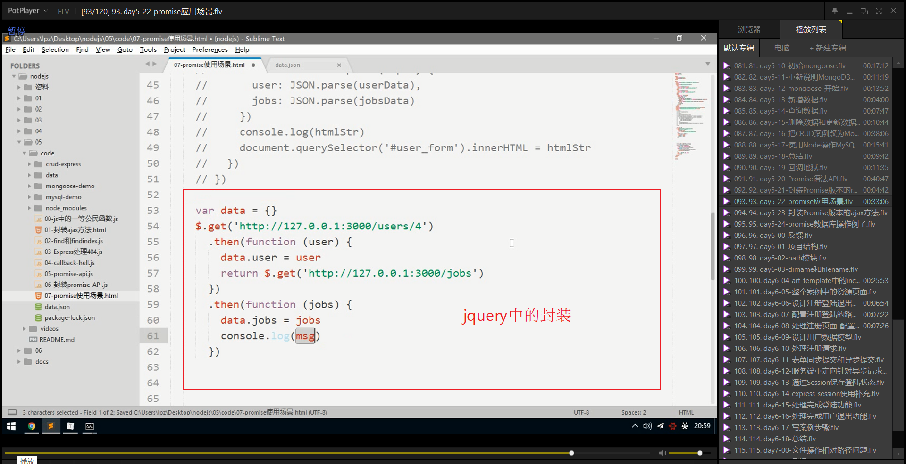

# 笔记

## 回掉地狱（callback hell）

~~~javascript
// 异步编程无法保证代码的执行顺序
fs.readFile('./a.text','utf8',function(error,data){
    if(error){
        // 手动抛出异常，一：终止程序执行，二：向控制台抛出异常
        throw errow
    }
    console.log(data)  
})

fs.readFile('./b.text','utf8',function(error,data){
    if(error){
        // 手动抛出异常，一：终止程序执行，二：向控制台抛出异常
        throw errow
    }
    console.log(data)  
})

fs.readFile('./c.text','utf8',function(error,data){
    if(error){
        // 手动抛出异常，一：终止程序执行，二：向控制台抛出异常
        throw errow
    }
    console.log(data)  
})

// 因为都是异步编程，所以代码无法确定谁先执行，谁之后执行
~~~

只能通过回调嵌套的方式来保证执行顺序，这就是回调地狱

~~~javascript
// 异步编程无法保证代码的执行顺序
fs.readFile('./a.text','utf8',function(error,data){
    if(error){
        // 手动抛出异常，一：终止程序执行，二：向控制台抛出异常
        throw errow
    }
    console.log(data) 
    fs.readFile('./b.text','utf8',function(error,data){
        if(error){
            // 手动抛出异常，一：终止程序执行，二：向控制台抛出异常
            throw errow
        }
    	console.log(data)  
        fs.readFile('./c.text','utf8',function(error,data){
            if(error){
                // 手动抛出异常，一：终止程序执行，二：向控制台抛出异常
                throw errow
            }
            console.log(data)  
        })
	})
})
// 这里只有三层回调嵌套，如果存在四层，五层乃至十层，那该如何维护代码。
~~~

为了解决以上编码方式带来的回调嵌套造成的回调地狱这种情况，EcmaScript 6 添加了一个新的API `Promise` ,为一个构造函数。

## Promise语法API

### 基础

~~~javascript
var fs = require('fs');
console.log(1)
// Promise 容器一旦创建，就开始执行里面的代码
var p1 = new Promise(function(resolve,reject){
    // Promise本身不是异步的，只是内部往往都是封装或者说存放了一个异步任务
  console.log(2);
  fs.readFile('./data/a.txt','utf8',function(err,data){
        if(err){// 失败了，承诺容器中的任务失败了
            //console.log(err)
            // 把容器的Pending 状态变为 Rejected
            // 当调用reject就相当于调用了then方法的第二个参数函数
            reject(err);
        } else {
            console.log(3);
            // 承诺容器中的任务成功了
            //consoe.log(data);
            // 把容器中的pending状态变为 resolve
            // 当调用resolve就相当于调用了then方法的第一个参数函数
            resolve(data);
        }
    })
})
// p1 就是那个承诺
// 当p1成功了，然后（then）做指定的操作
// then方法第一个参数接收function 就是容器中的resolve函数
// then方法第二个参数接收function 就是容器中的reject函数
p1.then(function(data){
    console.log(err);
},function(err){
    console.log("读取文件失败",err)
})
console.log(4)
~~~

### 进阶

~~~javascript

var fs = require('fs');
var p1 = new Promise(function(resolve,reject){
  fs.readFile('./data/a.txt','utf8',function(err,data){
        if(err){
            reject(err);
        } else {
            resolve(data);
        }
    })
})
var p2 = new Promise(function(resolve,reject){
  fs.readFile('./data/b.txt','utf8',function(err,data){
        if(err){
            reject(err);
        } else {
            resolve(data);
        }
    })
})
var p3 = new Promise(function(resolve,reject){
  fs.readFile('./data/c.txt','utf8',function(err,data){
        if(err){
            reject(err);
        } else {
            resolve(data);
        }
    })
})
p1.then(function(data){
      console.log(err);
        // 当p1读取成功的时候
        // 当前函数中return 的结果就可以在后面的 then中的第一个参数function接收到
        // 当你 return 123 后面的then里面的回调函数就是接收123
        //     return 'hello' 后面接收的就是 'hello'
        //     没有return 后面收到的就是undefined
        // 上面那些return 的数据没有什么用，只是最为示例
        // 真正有用的是：我们可以return 一个Promise对象
        // 当 return 一个Promise对象的时候，后续的then中的方法的第一个参数会作为p2的    
        // resolve,同样第二个参数作为p2的reject返回
      return p2;
    },function(err){
        console.log("读取文件失败",err)
    })
    .then(function(data){
        console.log(data);
        return p3
        },function(err){
            console.log(err)
        })
    .then(function(data){
        console.log(data)
        },function(err){
            console.log(err)
        })

~~~

### 封装Promise版本的readFile

~~~javascript
var fs = require('fs');
function pReadFile(filePath){
    return new Promies(function(resolve,reject){
        fs.readFile(filePath,'utf8',function(err,data){
            if(err){
                reject(err);
            } else {
                resolve(data)
            }
        })
    })
}
pReadFile('./data/a.txt')
    .then(function(data){
    console.log(data);
    return pReadFile('./data/b.txt');
  })
	.then(function(data){
    console.log(data);
    return pReadFile('./data/c.txt');
 })
	.then(function(data){
    console.log(data);
 })
~~~

## Promise的应用场景

## 封装 Promise的ajax方法

~~~javascript
function pGet(url){
    return new Promise(function(resolve,reject){
        var oReq = new XMLHttpRequest();
        oReq.onload = function(){
            resolve(JSON.parse(oReq.responseText))
        }
        oReq.onerror = function(){
            reject(err);
        }
        oReq.open('get',url,true);
        oReq.send()
    })
}
// 使用
var data = {}
pGet('http://127.0.0.1:3000/users/4')
.then(function(user){
    data.user = user
    return pGet('http://127.0.0.1:3000/jobs')
})
.then(function(jobs){
    data.jobs = jobs;
    var htmlStr = template('tpl',data)
    document.querySelector('#user_form').innerHTML = htmlStr
})
~~~

### 添加callback

~~~javascript
function pGet(url，callback){
    return new Promise(function(resolve,reject){
        var oReq = new XMLHttpRequest();
        oReq.onload = function(){
            callback && callback(JSON.parse(oReq.responseText))
            resolve(JSON.parse(oReq.responseText))
        }
        oReq.onerror = function(){
            reject(err);
        }
        oReq.open('get',url,true);
        oReq.send()
    })
}
// 使用
var data = {}
pGet('http://127.0.0.1:3000/users/4',function(data){
    console.log(data)
})

// 也可是使用then
var data = {}
pGet('http://127.0.0.1:3000/users/4')
.then(function(user){
    data.user = user
    return pGet('http://127.0.0.1:3000/jobs')
})
.then(function(jobs){
    data.jobs = jobs;
    var htmlStr = template('tpl',data)
    document.querySelector('#user_form').innerHTML = htmlStr
})
~~~

## Promise操作数据库例子

