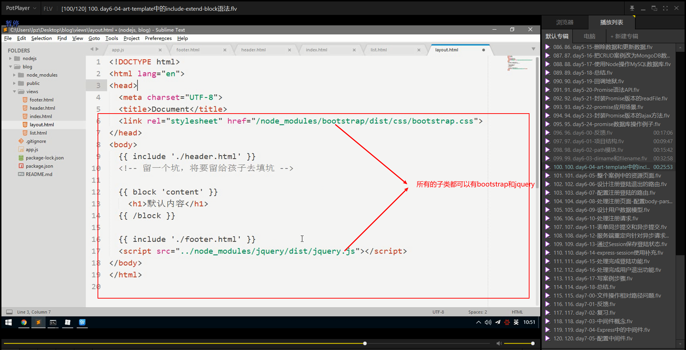
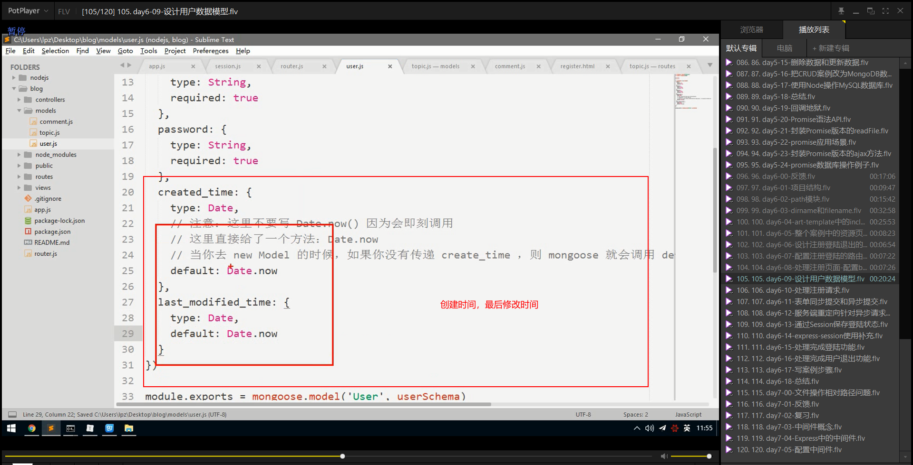
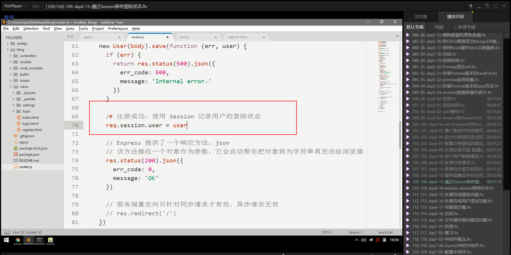
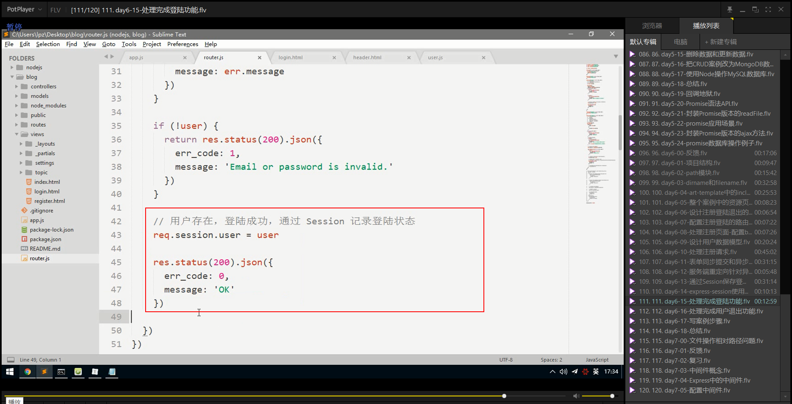
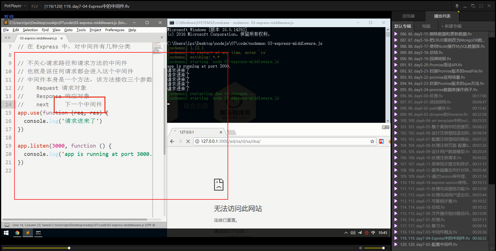
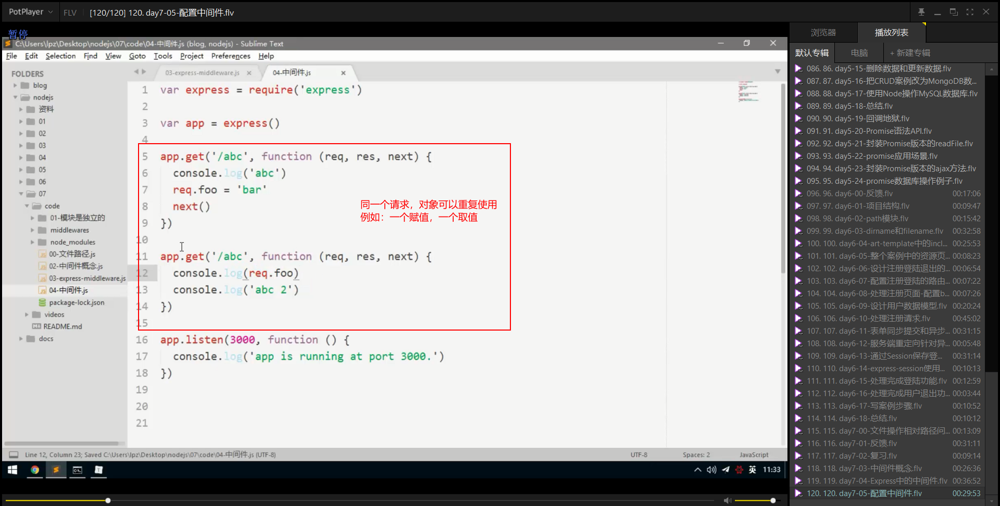

# 多人社区案例

## 示例

## path模块

之前开放静态资源有过：

~~~javascript
app.use('/node_module/',express.static(path.join(_dirname,'./node_modules/')))
~~~

+ path.basename
  + 获取一个路径的文件名（默认包含扩展名）
+ path.dirname
  + 获取一个路径中的目录部分
+ path.extname
  + 获取一个路径中的扩展名部分
+ path.parse
  + 把一个路径转为对象
    + root：根目录
    + dir目录
    + base包含后缀名的文件名
    + ext后缀名
    + name不包含后缀名的文件名
+ path.join
  + 当你需要进行路由拼接的时候，推荐使用这个方法
+ path.isAbsolute
  + 判断一个路径是否是绝对路径

## dirname和filename

在每个模块中，除了`require`,`exports`等模块相关的API之外，还有两个特殊的成员：

+ `__dirname`  **动态获取** 可以用来获取当前文件模块所属目录的绝对路径.
+ `__filename` **动态获取** 可以用来获取获取当前文件的绝对路径。
+ `__dirname`和`__filename` 是不受执行node命令所属路径影响的

在文件操作中，使用相对路径是不可靠的，因为在Node中文件操作的路径被设计为相对于执行Node命令所处的路径（不是bug, 人家这样设计是有使用场景的）。

所以为了解决这个问题，很简单，只需要把相对路径变成绝对路径就可以了

那这里我们就使用__dirname或者\____filename来帮助我们解决这个问题

在拼接路径的过程中，为了避免手动拼接带来的一些低级的错误，所以推荐多使用：path.join()来辅助拼接。

所以为了尽量避免刚才所描述的这个问题，大家以后在操作文件中使用的相对路径都统一替换成**`动态的绝对路径`**

> 补充：模块中的路径标识和这里的路径没有关系，不受影响
>
> 模块中的路径标识和文件操作中的相对路径标识不一致
>
> 模块中的路径标识就是相对于当前文件模块，不受执行node命令所处路径影响。

## art-template中的include-extend-block语法

### 修改views目录

### 子模版

### 模板继承

## 案例中的资源页面

## 设计注册登录退出的路由

## 配置注册登录的路由

## 处理注册页面-配置body-parser

## 设计用户数据模型

## 处理注册请求

### 或查询

可以在菜鸟教程中查找mongodb的更进一步的查询条件

### express中的json方法

### Node中的MD5加密

## 表单同步提交和异步提交

## 服务端重定向对异步请求无效

## 通过session保存登录状态

### express-session

### app.js中配置express-session

### router.js使用express-session

## 处理完成登录功能

## 处理完成用户退出

## 中间件概念

## Express中的中间件

## 配置中间件

