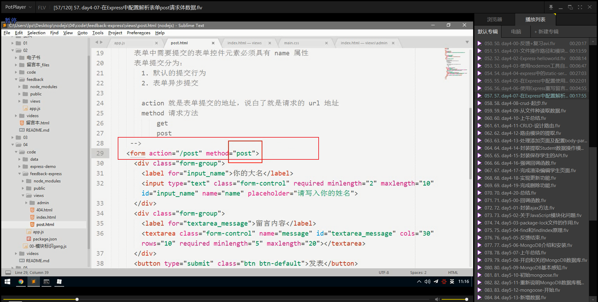

# 笔记

## 文件操作路径和模块标识路径问题

## 使用nodemon工具自动重启服务

### 修改完代码自动重启

我们这里可以使用一个第三方开发的工具：`nodemon` 来帮助我们解决频繁修改代码重启服务器问题。

`nodemon` 是一个基于Node.js开发的一个第三方命令行工具，我们使用的时候需要独立安装。

~~~shell
# 在任意目录下执行该命令都可以
# 也就是说，所有需要 --global来安装的包都可以在任意目录执行
npm install --save nodemon
~~~

安装完毕之后，使用:

~~~shell
node app.js
# 使用nodemon
nodemon app.js
~~~

只要是通过 `nodemon app.js` 启动的服务，则它会监视你的文件变化，当文件发生变化的时候，自动帮你重启服务器。

## express 

### 起步

#### 安装

~~~shell
npm install --save express
~~~

#### hello world

~~~shell
const express = require('express');
const app = express();
const part = 9000;
app.get('/',function(request,response){
    response.send('hello world Express')
})
app.listen(part,() =>{
    console.log('the express server is starting');
})
~~~

#### 基本路由

基本路由组成：

+ 请求方法
+ 请求路径
+ 请求处理函数

get:

~~~shell
// 当以GET方法请求 / 的时候，执行对应的处理函数
app.get('/',function(request,response){
    response.send('hello world Express')
})
~~~

post:

~~~shell
// 当以POST方法请求 / 的时候，指定对应的处理函数
app.post('/',function(req,res){
res.send('Got a POST request')
})
~~~

#### 静态服务

~~~shell
// /public资源
app.use(express.static('public'));

// files资源
app.use(express.static('files'));

// /public/public资源
app.use('/public',express.static('public'));

// /static/static资源
app.use('/static',express.static('public'));

app.use('/static',express.static(path.join(_dirname,'public')))
~~~

### 在Express中配置使用art-template模板引擎

安装:

~~~shell
npm install --save art-template
npm install --save express-art-template
~~~

配置:

~~~javascript
app.engine('art',require('express-art-template'))
// 此处的art指的是要渲染的文件的后缀名，一般可以手动改成html
~~~

使用:

~~~javascript
app.get('/',function(req,res){
//express默认会去项目中的views目录中找index.html
res.render('index.html',{
title:'hello world'
})
})
~~~

如果希望修改默认的`views`视图渲染存储目录，可以：

~~~javascript
app.set('view',目录路径)
~~~

### 使用Express重写留言板案例

### 在Express 中配置解析表单post请求体数据

#### post概述

在post.html页面中配置表单提交为 `action="/post" method="post" `,也就是将表单请求改为post请求方式，那么此时如何获取 `form Data` 请求体重的参数呢？

在Express中无法直接获取post请求方式中的请求体中的数据，需要依赖第三方的中间件提供的API接口来获取

#### 安装body-parser中间件

~~~shell
npm install body-parser --save
~~~

#### 配置body-parser

##### 第一步：引包

##### 第二步：配置中间件

配置body-parser

只要加入这个配置，则在req请求对象上会多出来一个属性body

也就是可以直接通过req.body来获取表单POST请求体数据了

##### 第三步：使用

直接在`post`路由中通过`request.body` 来获取请求体,同时可以看到路由中的`response.send()`都没有添加return结束请求的设置，因为在express已经对响应的结束自动做了处理。

~~~javascript
var express = require('express')
var bodyParser = require('body-parser')
var app = express()
// parse application/x-www-form-urlencoded
app.use(bodyParser.urlencoded({ extended: false }))

// parse application/json
app.use(bodyParser.json())

app.use(function (req, res) {
  res.setHeader('Content-Type', 'text/plain')
  res.write('you posted:\n')
  res.end(JSON.stringify(req.body, null, 2))
})

~~~

~~~javascript
var express = require('express')
var bodyParser = require('body-parser')
var app = express()

// create application/json parser
var jsonParser = bodyParser.json()

// create application/x-www-form-urlencoded parser
var urlencodedParser = bodyParser.urlencoded({ extended: false })

// POST /login gets urlencoded bodies
app.post('/login', urlencodedParser, function (req, res) {
  res.send('welcome, ' + req.body.username)
})

// POST /api/users gets JSON bodies
app.post('/api/users', jsonParser, function (req, res) {
  // create user in req.body
})

~~~

### 在Express中配置解析表单get中的url请求数据

在Express内置了一个API,可以直接通过`request.query` 来获取

~~~javascript
request.query
~~~

