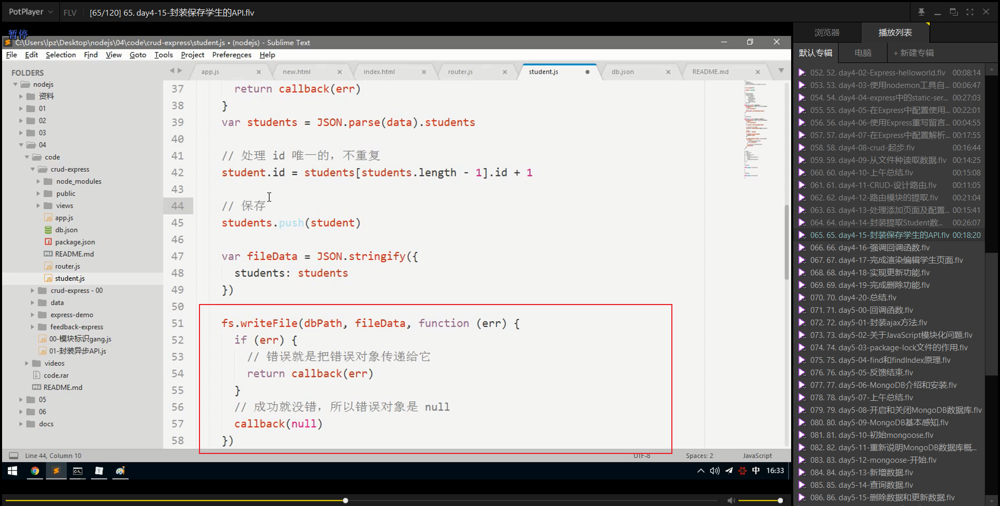

# 笔记

## 文件操作路径和模块标识路径问题

### git中配置忽略文件

在vscoede中配置git忽略文件，也就是.gitignore文件

因为node_modules过大，一般不做上传。

操作

1. 在需要上传的文件夹下右键选择Git Bash 进入命令行，进入项目所在目录。
2. 输入 touch .gitignore ，生成“.gitignore”文件（生成时已经设置好了）。

常用的规则

1. /mtk/ 过滤整个文件夹，例：node_modules/
2. ip *.z  过滤zip后缀文件
3. /mtk/do.c   过滤该文件，例：demo.html
4. 前面加 ！，表示不过滤此项，例：!src/ 或者 !*.js 或者 !index.html

~~~txt
.DS_Store
node_modules/
platforms/
dist/
npm-debug.log*
yarn-debug.log*
yarn-error.log*
package-lock.json

# Editor directories and files
.idea
.vscode
*.suo
*.ntvs*
*.njsproj
*.sln
~~~

### 文件操作路径

文件操作中的相对路径`./`可以省略，例如：`fs.readFile('data/a.txt')`但是一般为了代码清晰，明了，不建议省略 `./`  应该尽可能写成 `fs.readFile('./data/a.txt')` 形式

在模块加载过程中，相对路径中的`./`不可以省略，`Error:Cannot find module 'data/foo.js'`

`require('data/foo.js')`

### 请求模块路径

## 使用nodemon工具自动重启服务

### 修改完代码自动重启

我们这里可以使用一个第三方开发的工具：`nodemon` 来帮助我们解决频繁修改代码重启服务器问题。

`nodemon` 是一个基于Node.js开发的一个第三方命令行工具，我们使用的时候需要独立安装。

当前项目局部安装

~~~shell
# 在任意目录下执行该命令都可以
# 也就是说，所有需要 --global来安装的包都可以在任意目录执行
npm install nodemon --save
~~~

全局安装

~~~shell
# 采用cnpm 方式
cnpm install -g  nodemon 

# 采用npm方式，已经设置淘宝镜像 ，最好是全局安装，因为它是一个服务器工具而不是一个依赖包，且多个项目使用
npm install nodemon -g
~~~

安装完毕之后，使用:

~~~shell
# 执行此命令则依旧采用node模式运行，也就是不会重启服务器
node app.js
# 使用nodemon
nodemon app.js
~~~

只要是通过 `nodemon app.js` 启动的服务，则它会监视你的文件变化，当文件发生变化的时候，自动帮你重启服务器。

## express 

### 起步

#### 安装

~~~shell
npm install --save express
~~~

#### hello world

~~~shell
const express = require('express');
const app = express();
const part = 9000;
app.get('/',function(request,response){
    response.send('hello world Express')
})
app.listen(part,() =>{
    console.log('the express server is starting');
})
~~~

#### 基本路由

基本路由组成：

+ 请求方法
+ 请求路径
+ 请求处理函数

get:

~~~shell
// 当以GET方法请求 / 的时候，执行对应的处理函数
app.get('/',function(request,response){
    response.send('hello world Express')
})
~~~

post:

~~~shell
// 当以POST方法请求 / 的时候，指定对应的处理函数
app.post('/',function(req,res){
res.send('Got a POST request')
})
~~~

#### 静态服务

~~~shell
// /public资源,也就是url可以省略 /public这种方式，例如：http://localhost:9000/img/01.jpg这种形式
app.use(express.static('public'));

// files资源 http://localhost:9000/01.css，不需要添加/files,就可以访问了。
app.use(express.static('files'));

// /public/public资源  http://localhost:9000/public/01.jpg
app.use('/public',express.static('public'));

// /static/static资源   // http://localhost:9000/static/01.jpg
app.use('/static',express.static('public'));
// 暂时用不上
app.use('/static',express.static(path.join(_dirname,'public')))
~~~

### 在Express中配置使用art-template模板引擎

#### 安装

**art-template中对于express做了特殊的兼容性处理，可以直接在art-template中搜索使用**

安装，必须要安装 art-template 然后再安装 express-art-template，因为前者需要后者的依赖项。

#### 使用示例

#### 服务器中的配置

#### 核心配置

~~~javascript
var template = require('art-template'); // 引入art-template模板引擎模块。
// 第一个参数 .art 表示当渲染以.art结尾的文件的时候，使用art-template模板引擎
// express-art-template是专门用来在Express中把art-template整合到Express中，其依赖于art-template
app.engine('art',require('express-art-template'));
~~~

#### 使用配置

~~~shell
# Express 为Response相应对象提供了一个方法：render
# render方法默认是不可以使用的，但是如果配置了模板引擎就可以使用了
# res.render('html模板名',{模板数据})
# 第一个参数不能写路径，默认会去项目中的views目录查找该模板文件
# 也就是说Express中有一个约定:开发人员把所有的视图文件都放到 views目录中
~~~

#### 在路由中使用

~~~javascript
app.get('/',function(req,res){
    res.render('404.art');
})
~~~

如果将`html`文件改为`art`文件的话，固然`app.engine('art',...)`，那么可是编辑器一般不能高亮显示代码，所以为了,更好处理，可以直接将`app.engine('html',...)`, 所谓山不转人转就是这个道理。

#### 修改要渲染的文件的后缀名，默认为art,此处改成html

#### 可以直接渲染文件，可以不需要渲染数据进去。

#### 添加渲染数据

#### 修改默认的渲染路径

~~~javascript
// express 中art-template渲染路径默认为views
// 可以通过手动更改默认的html渲染路径
app.set('views','render函数的默认路径')
// app.set('views','page')
// 尝试设置多条路径
// app.set('views','default/demo');
~~~

安装:

~~~shell
npm install --save art-template
npm install --save express-art-template
~~~

配置:

~~~javascript
app.engine('art',require('express-art-template'))
// 此处的art指的是要渲染的文件的后缀名，一般可以手动改成html
~~~

使用:

~~~javascript
app.get('/',function(req,res){
//express默认会去项目中的views目录中找index.html
res.render('index.html',{
title:'hello world'
})
})
~~~

如果希望修改默认的`views`视图渲染存储目录，可以：

~~~javascript
app.set('view',目录路径)
~~~

#### 使用Express重写留言板案例

#### express自带的重定向功能

~~~javasc
// express自带重定向功能
res.redirect('/');
~~~

~~~javascript
/**
 * 使用express+art-template重写留言板案例
 */
// 引包
var express = require('express');
var template = require('art-template');
// post请求单独处理
var bodyParser = require('body-parser')
// 创建数据
var commentList = [
    {id:'10001',
     name:'silly',
     comment:'hello world',
     dateTime:'2019-12-12 09:26:45'
    },
    {id:'10002',
    name:'silly',
    comment:'hello world',
    dateTime:'2019-12-12 09:26:45'
   },
   {id:'10003',
   name:'silly',
   comment:'hello world',
   dateTime:'2019-12-12 09:26:45'
  },
  {id:'10004',
  name:'silly',
  comment:'hello world',
  dateTime:'2019-12-12 09:26:45'
 }]
// 创建服务器
var app = express();
// 配置express-art-template
app.engine('html',require('express-art-template'));
// 配置body-parser
app.use(bodyParser.urlencoded({extended:false}));
app.use(bodyParser.json())
// 配置开放静态资源
app.use('/node_modules/',express.static('./node_modules'));
app.use('/public/',express.static('./public'))
// 处理 首页请求
app.get('/index',function(request,response){
    response.render('index.html',{
        title:'留言板案例',
        commonList:commentList
    })
})
// 保存新添加的评论记录
app.post('/index',function(request,response){
    var comment = request.body; // 直接使用body-parser技术
    comment.id = new Date().getTime().toString();
    comment.dateTime = '2020-02-02 02-20-22';
    commentList.unshift(comment);
    response.redirect('/index');
})

// 处理 添加请求
app.get('/addItem',function(request,response){
    response.render('addItem.html')
})
// 监听端口
app.listen(3000,function(){
    console.log('the server is running');
})
~~~

### 在Express 中配置解析表单post请求体数据

#### post概述

在post.html页面中配置表单提交为 `action="/post" method="post" `,也就是将表单请求改为post请求方式，那么此时如何获取 `form Data` 请求体中的参数呢？

在Express中无法直接获取post请求方式中的请求体中的数据，需要依赖第三方的中间件提供的API接口来获取

MiddleWare也就是 "中间件"的意思。

#### 安装body-parser中间件

这是一个插件，专门用来解析POST请求的请求体中的参数信息。

~~~shell
npm install body-parser --save
~~~

#### 配置body-parser

##### 第一步：引包

~~~javascript
var bodyParser = require('body-parser')
~~~

##### 第二步：配置中间件

配置body-parser

只要加入这个配置，则在req请求对象上会多出来一个属性body

也就是可以直接通过req.body来获取表单POST请求体数据了

配置项目:

~~~javascript
app.use(bodyParser.urlencoded({extended:false}));
app.use(bodyParser.json());
~~~

##### 第三步：使用

~~~javascript
var comment = req.body
~~~

直接在`post`路由中通过`request.body` 来获取请求体,同时可以看到路由中的`response.send()`都没有添加return结束请求的设置，因为在express已经对响应的结束自动做了处理。

~~~javascript
var express = require('express')
var bodyParser = require('body-parser')
var app = express()
// parse application/x-www-form-urlencoded
app.use(bodyParser.urlencoded({ extended: false }))

// parse application/json
app.use(bodyParser.json())

app.use(function (req, res) {
  res.setHeader('Content-Type', 'text/plain')
  res.write('you posted:\n')
  res.end(JSON.stringify(req.body, null, 2))
})

~~~

~~~javascript
var express = require('express')
var bodyParser = require('body-parser')
var app = express()

// create application/json parser
var jsonParser = bodyParser.json()

// create application/x-www-form-urlencoded parser
var urlencodedParser = bodyParser.urlencoded({ extended: false })

// POST /login gets urlencoded bodies
app.post('/login', urlencodedParser, function (req, res) {
  res.send('welcome, ' + req.body.username)
})

// POST /api/users gets JSON bodies
app.post('/api/users', jsonParser, function (req, res) {
  // create user in req.body
})

~~~

##### 补充知识

Post请求的两种编码格式：application/x-www-form-urlencoded和multipart/form-data

在常见业务开发中，POST请求常常在这些地方使用：前端表单提交时、调用接口代码时和使用Postman测试接口时。我们下面来一一了解：

POST请求的两种编码格式：`application/x-www-urlencoded`是浏览器默认的编码格式，用于键值对参数，参数之间用`&`间隔；`multipart/form-data`常用于文件等二进制，也可用于键值对参数，最后连接成一串字符传输(参考Java OK HTTP)。除了这两个编码格式，还有`application/json`也经常使用。

作者：DeppWang
链接：https://www.jianshu.com/p/53b5bd0f1d44
来源：简书
著作权归作者所有。商业转载请联系作者获得授权，非商业转载请注明出处。

### 在Express中配置解析表单get中的url请求数据

在Express内置了一个API,可以直接通过`request.query` 来获取

~~~javascript
request.query
~~~

## CRUD起步

### 初始配置

### 从文件中读取数据

#### 制作db.json文件持久化数据

#### html页面设置模板引擎

#### 读取db.json中的数据以及readFile可选参数

#### 字符串转JSON对象

### CRUD设置路由

| 请求方法 | 请求路径         | get 参数 | post 参数                      | 备注                         |
| -------- | ---------------- | -------- | ------------------------------ | ---------------------------- |
| GET      | /studens         |          |                                | 渲染首页，也就是初始化页面   |
| GET      | /students/add    |          |                                | 渲染添加学生页面             |
| POST     | /studens/add     |          | name、age、gender、hobbies     | 处理添加学生请求             |
| GET      | /students/edit   | id       |                                | 渲染编辑页面,t同时携带参数   |
| POST     | /studens/edit    |          | id、name、age、gender、hobbies | 处理编辑请求，保存编辑信息。 |
| GET      | /students/delete | id       |                                | 处理删除请求                 |
|          |                  |          |                                |                              |

#### 路由模块的提取

#### 采用module.exports方式提取

对于采用了module.exports这种方式而言,也是可以的，因为可以知道 nodemon 执行的是 `nodemon ./index.js`  文件，所以`主入口文件只能为index.js`  在index.js中引入router.js文件，获取router.js文件导出的匿名函数，将app服务器传递到router.js里面去执行这个函数。这样处理也是可以的。同时易于理解。

#### 利用express封装的Router()方法提取

这张图片中可以看到：在`index.js` 和`router.js`这两个文件中均设置了 

~~~javascript
var express = require('express')
~~~

但是在`index.js` 文件中

~~~javascript
// 利用这个对象构建服务器
var app = express()
~~~

在`router.js` 中

~~~javascript
var router = express.Router()
module.exports = router
~~~

##### 步骤一

##### 步骤二

#### 总结

### 处理添加页面以及配置

**配置模板引擎和body-parser一定要在 `app.use(router)` 挂载路由前面 **

### 封装提取Student数据操作模块

### 单独创建student.js用以封装关于学生对象的增加，删除，和修改

### 封装异步的API

#### 回调函数的主要作用

~~~javascript
// 异步回调函数的作用
function fn(callback){
    setTimeout(function(){
        var data = 4000;
        callback(data);
    },3000)
}
function fn2(data){
    console.log(data);//4000
}
fn(fn2)
~~~

#### 通过回调函数来获取异步的返回值

##### callback(null,JSON.parse(data).students)

​	

​	关于readFile的返回值问题，可以知道readFile的返回值，如果成功的话，返回一个null,如果失败的话返回一个err对象。所以可以如此处理。

// 2.读取文件
// 第一个参数就是要读取的文件的路径
// 第二个参数就是一个回掉函数，回掉函数中带有两个
// 成功：data 数据;error null。
// 失败：data undefined;error 错误对象。

#### 在router.js中引入student的对象

#### 在router.js中使用student.js中定义的查找所有记录find方法

### student.js中封装保存学生的save方法

#### 关于结果的返回值的处理

// 2.将数据写入文件
// 第一个参数：文件路径(如果该路径不存在路径文件，则自动生成新的路径文件)
// 第二个参数：文件内容
// 第三个参数：回掉函数
// 成功：文件写入成功 error是null,
// 失败 ：文件写入失败，error是错误对象，
// 无论成功失败，data都返回undefined，也就是写入操作没有data返回值,

此处这里的话可以直接将err给返回到router.js中在callback中进行判断处理。

#### 在router.js中调用Student.save方法

### 强调回掉函数

### 更新学生updateById方法

####  保存到db.json文件中

#### 处理编辑和删除a标签中的id

#### 在router.js中调用findById方法

#### 关于编辑数据时页面回显渲染引擎如何处理

#### 关于id的隐藏域问题

### 完成删除deleteById方法

#### 在router.js中调用student.js中的deleteById方法

### index.js

~~~javascript
/**
 * 学生信息管理系统的增删改查
 */
var express = require('express');
var template = require('art-template');
var bodyParser = require('body-parser');
var router = require('./router');
// 服务器创建
var app = express();
// 静态资源开放处理
app.use('/node_modules/',express.static('./node_modules'))
app.use('/public/',express.static('./public'))
// 配置art-template
app.engine('html',require('express-art-template'));
// 配置body-parser
app.use(bodyParser.urlencoded({extended:false}));
app.use(bodyParser.json());
// 将路由容器挂载道express中
app.use(router)
//设置监听
app.listen(9000,function(){
    console.log('the server is running');
})

~~~

### router.js

~~~javascript
/**
 * 专门路由处理模块
 */
var express = require('express');
var Student = require('./student');
// 创建路由容器
var router = express.Router();
/**
 * 将简单路由挂载道router容器上面
 */
// 首页展示
 router.get('/find',function(request,response){
     Student.find(function(param,data){
        if(param){
            return response.status(500).send('server error!');
        }
        response.render('index.html',{
            title:'学生信息首页',
            studentInfoList:data
        })
     })
 })
 // 跳转添加
 router.get('/add',function(request,response){
     response.render('add.html',{
         title:'添加学生信息'
     })
 })
 // 保存添加
 router.post('/add',function(request,response){
     Student.add(request.body,function(param){
         if(param){
             return response.status(500).send('server error!');
         }
         console.log('测试测试测试测试测试');
         return response.redirect('find')
     })
 })

 // 跳转编辑
router.get('/edit',function(request,response){
    Student.edit(request.query.id,function(param,data){
        if(param){
            return response.status(500).send('the server error!!')
        }
        return response.render('edit.html',{
            title:'编辑学生信息',
            studentInfo:data
        })
    })
})
// 保存编辑
router.post('/edit',function(request,response){
    Student.save(request.body,function(param){
        if(param){
            return response.status(500).send('the server error!');
        }
        return response.redirect('/find');
    })
})
// 依据id删除学生信息
router.get('/delete',function(request,response){
    Student.deleteById(request.query.id,function(param){
        if(param){
            return response.status(500).send('the server error!!');
        }
        return response.redirect('/find');
    })
})
/**
 * 
 * 将结果导出
 */
module.exports = router;
~~~

### student.js

~~~javascript
/**
 * 创建关于db.json的增加，删除，修改的API并提供给router.js
 */
var fs = require("fs");
// 首页展示列表API
exports.find = function(callback){
    fs.readFile('./db.json','utf8',function(error,data){
        if(error){
            return callback(error)
        }
        return callback(null,JSON.parse(data).studentInfoList)
    })
}
// 添加保存学生信息
exports.add = function(studentInfo,callback){
    fs.readFile('./db.json','utf8',function(error,data){
        if(error){
            return callback(error)
        }
    var studentInfoList = JSON.parse(data).studentInfoList
    var id = new Date().getTime().toString();
    studentInfo.id = id;
    console.log('添加学生信息:',studentInfo);
    studentInfoList.unshift(studentInfo);
    var obj = {};
    obj.studentInfoList = studentInfoList
    fs.writeFile('./db.json',JSON.stringify(obj),function(error){
        if(error){
            return callback(error);
        } else {
            return callback(null);
        }
    })
    })
}

exports.edit = function(id,callback){
    fs.readFile('./db.json','utf8',function(error,data){
        if(error){
            return callback(error);
        }
        var studentInfoList = JSON.parse(data).studentInfoList;
        var targetobj = studentInfoList.find(function(item){
            return item.id === id;
        })
        return callback(null,targetobj);
    })
}
// 保存编辑的学生信息
exports.save = function(studentInfo,callback){
    fs.readFile('./db.json','utf8',function(error,data){
        if(error){
            return callback(error);
        }
        var studentInfoList = JSON.parse(data).studentInfoList;
        var targetobj = studentInfoList.find(function(item){
            return item.id === studentInfo.id;
        })
        console.log('studentInfo',studentInfo);
        for(var key in studentInfo){
            targetobj[key] = studentInfo[key]
        }
        console.log('targetobj',targetobj);
        var obj = {};
        obj.studentInfoList = studentInfoList;
        console.log('查看编辑效果',obj);
        fs.writeFile('./db.json',JSON.stringify(obj),function(error){
            if(error){
                callback(error);
            } else {
                callback(null);
            }
        })
    })
}
// 依据id删除学生的信息
exports.deleteById = function(id,callback){
    fs.readFile('./db.json','utf8',function(error,data){
        if(error){
            return callback(error);
        }
        var studentInfoList = JSON.parse(data).studentInfoList;
        var targetIndex = studentInfoList.findIndex(function(item){
            return item.id === id;
        })
        //  删除一个数组中的对象，返回被删除的对象，同时修改原数组。
        studentInfoList.splice(targetIndex,1);
        var obj = {};
        obj.studentInfoList = studentInfoList;
        fs.writeFile('./db.json',JSON.stringify(obj),function(error){
            if(error){
                callback(error);
            } else {
                callback(null);
            }
        })
    })
}
~~~

