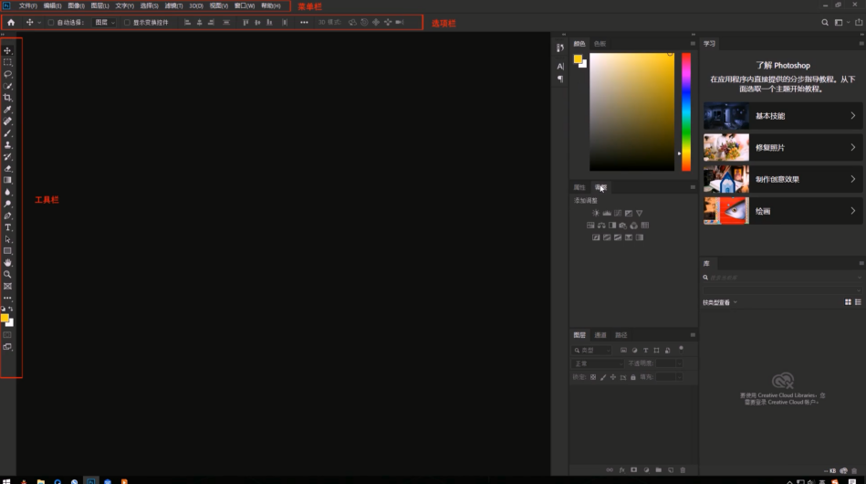
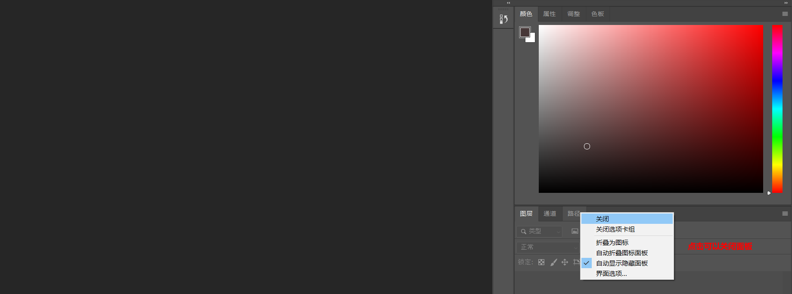
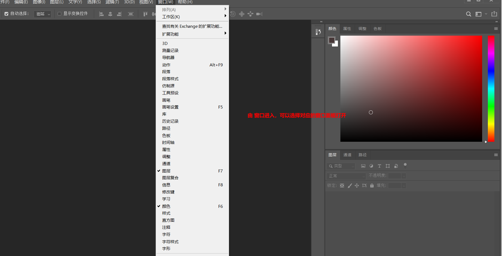
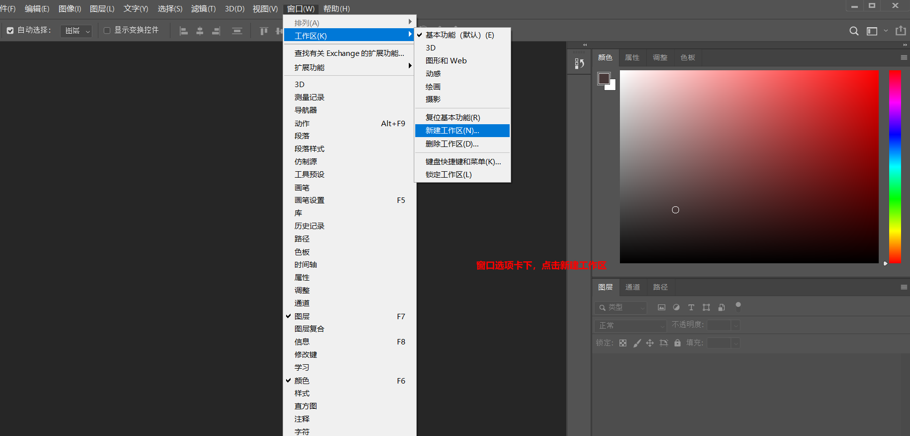
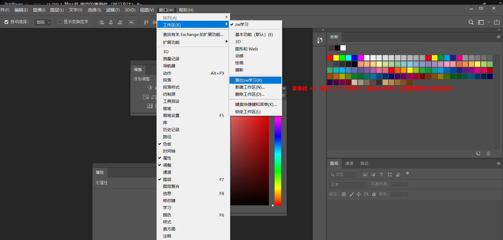
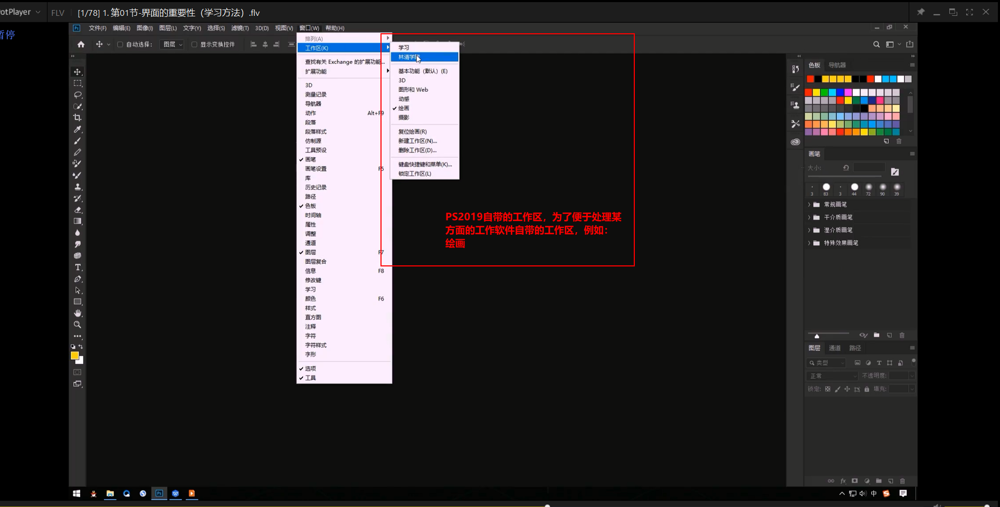

# 笔记

## 一，认识界面

## 二，关闭与开启窗口视图

**关闭视图窗口**

鼠标点击视图窗口的名称，例如：’图层‘，右键菜单选择关闭，即可关闭

**打开视图窗口**

鼠标点击菜单栏中的"窗口"选项卡，可以找到所有的窗口，可以选择需要打开的窗口，点击即可。

## 三，创建工作区与恢复工作区

设置好了自己的窗口工作区，可能别人喜欢的工作区不一样，它使用你的PS，调成了他喜欢的，你可以将你之前设置的工作区保存起来，然后再直接恢复就可以了

**保存工作区**

**恢复工作区**

**自带工作区**

