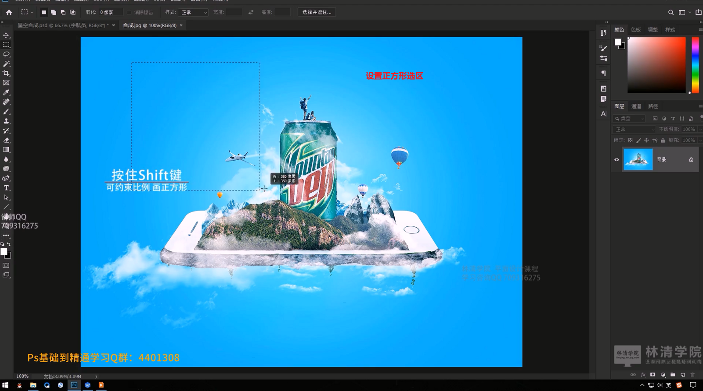
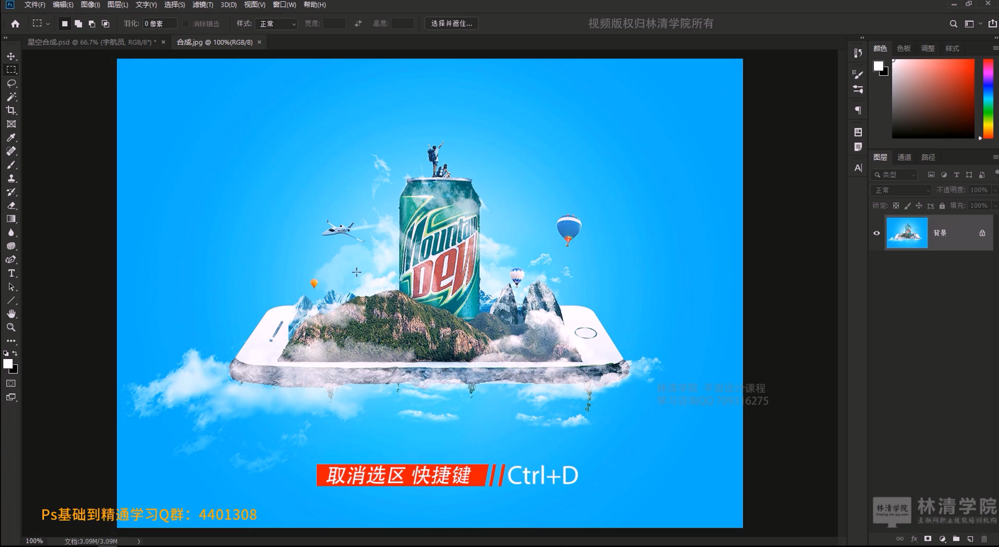
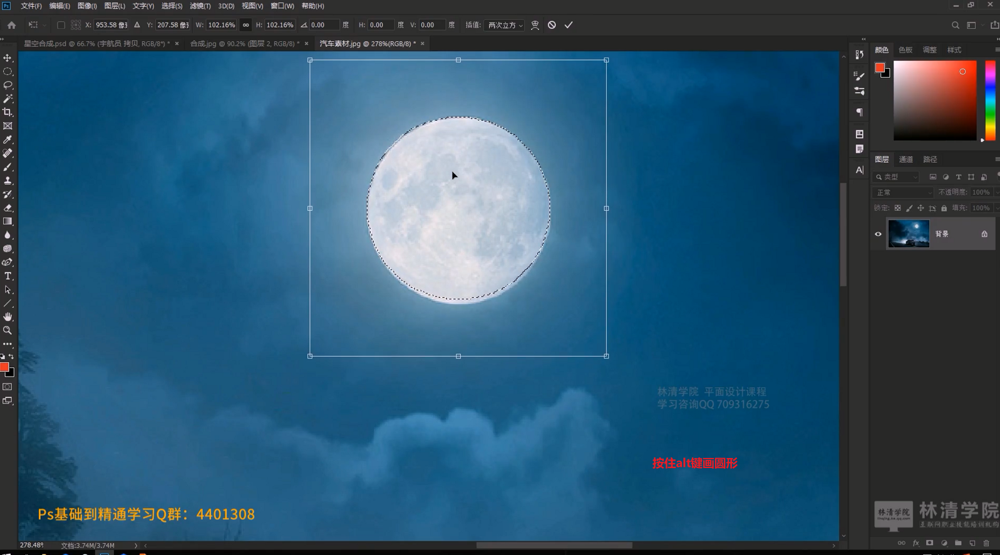

# 笔记

## 矩形选框工具组

1. 认识选区的概念

2. 了解选区的作用

3. 掌握选区工具使用

   

## 调节图层图像颜色

### 多图层调节某个图层颜色

### 单个图层如何调节图层部分颜色

那么必须要用到选区工具。

## 矩形选框工具组

矩形选框工具都是对图像的某一部分做选区工具。选区工具组中有很多的选区工具。

### 矩形选框工具

#### 正方形选区（SHIFT）

#### 选区概念理解

#### 使用选区工具对单独一个区域设置色相饱和度

#### 取消选区操作（CTRL +D）

#### 移动选区操作

​	       移动选区，**先使用选区工具选取**，**再使用移动工具移动**，鼠标点击拖动

#### 图层解锁

​                移动图片的时候，必须先解锁图片图层，否则移动的时候，图层显示的是底色，也就是前景色和后景色中的背景色

#### 将选区拷贝为一个图层(CTRL+J)

#### 移动选区拷贝的图层

#### 增加选区(SHIFT)

#### 减少选区(ALT)

#### 相交选区

#### 羽化属性

**羽化效果与没有羽化效果对比**

#### 前景色颜色填充(ALT+DELETE)

#### 背景色颜色填充(CTRL+DELETE)

### 椭圆选框工具

#### 正圆

#### 菱形

### 单行选框工具

### 单列选框工具

