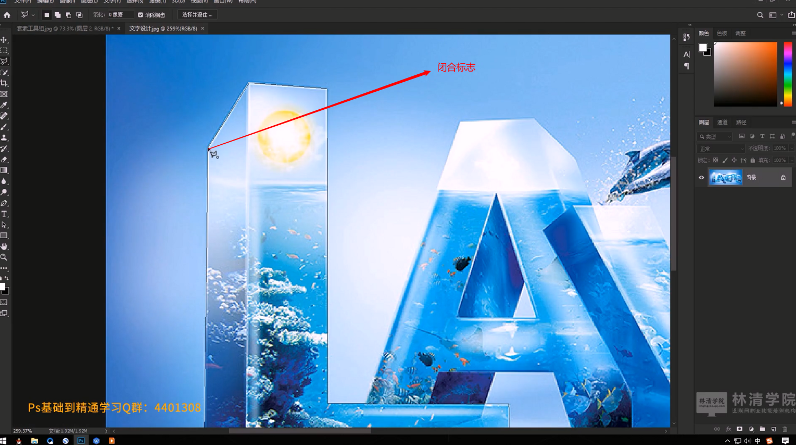

# 笔记

## 套索工具

### 使用

按住鼠标，直接滑动即可选中

### 图层解锁

### 羽化功能

**一般是先选区，然后再右键设置羽化，最后再移动**

**备注：**CTRL + T 调出移动选择的工具组件，可以设置大小，倾斜角度，位置等属性

## 多边形套索工具

​           用于多边形画直线图线选择

### 放大图片方法（ALT+鼠标滚轮）

### 拖动放大的图片（空格+鼠标移动）

## 磁性套索工具

### 选区复制报错

**注意：**图片选区是因为当第一次选区的时候，此时已选中的图层在图片的最上一层，当再次选区的时候，此时最上一层图层往往没有选中的那一部分图案，此时，应该切换图层现实的先后，在进行选区操作。

### 图层跨图片复制

**注意:**是要先点击**移动工具**，然后再点击要移动的图层的图案，按住之后拖动到其他图片，然后再松开鼠标即可复制在那张图上，然后点击 CTRL+T 弹出移动工具显示变换控件，进行大小，倾斜，旋转的调节

## 总结

