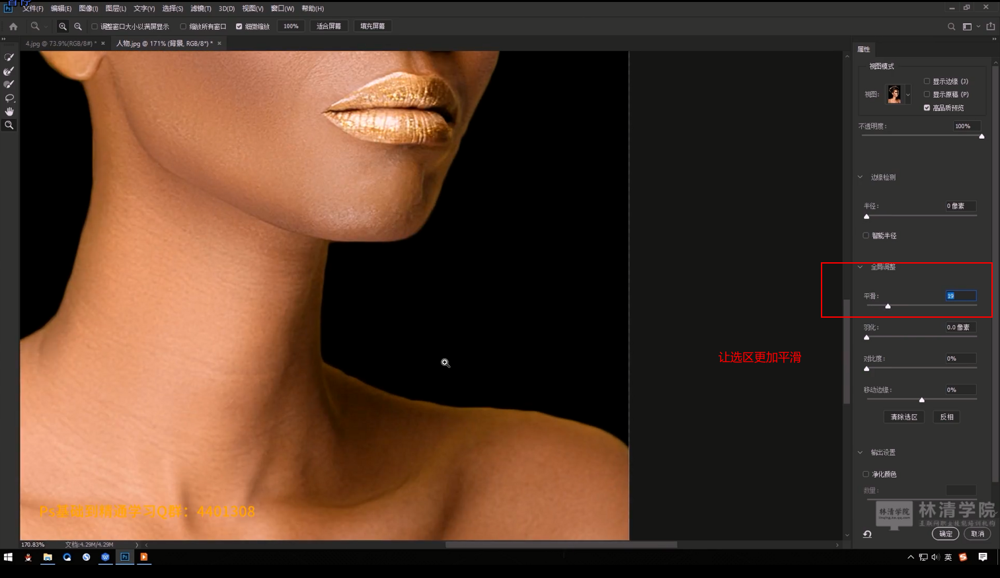
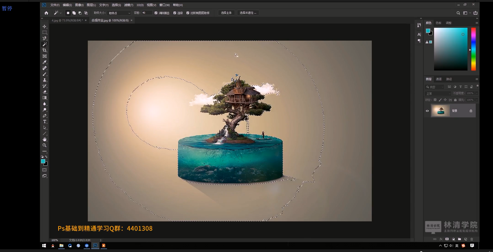

# 笔记

## 要点

1. 掌握快速选择工具
2. 掌握魔棒工具
3. 理解选择并遮住

## 快速选择工具

### 添加选中区域

### 减少选中区域

### 设置拷贝图层的背景色

选中在拷贝图层的下面，也就是原图层，创建一个新的图层，对他设置前景色和背景色，这样选中并且拷贝之后形成的图层就有了背景颜色了。要注意，拷贝图层应该在新建图层的上面。

### 属性：对所有图层取样

#### 图形切分

#### 属性：选择主体

当图片中主体与背景颜色相差较大的时候，可以直接点击选择主体，这样比较方便选择。

### 属性：选择并遮住

当使用了快速选择工具选择肖像，以及设置新图层设置底色之后，放大可以观察到边缘非常的不平滑，且头发有杂色，同样，当使用其他的选区工具，例如矩形选区工具，套索工具组等都会出现这样的问题。

为了解决以上问题，通常在选区之后，不会立即进行CTRL+J复制操作，而是先进行选择并遮住，对选区的边缘进行调节操作。最后在进行CTRL+J操作

先进行快速选择，再进行选择并遮住

展示选择并遮住之后的一些问题，可以调节底色背景以及对应的透明度，用于方便查看选区之后的边缘的一些问题，例如平滑，以及边缘的色差

选择平滑可以调节边缘的平滑程度

选择调整边缘画笔工具可以调节边缘的色差问题

选择净化颜色，用于边缘处的颜色色差处理

兴建图层，相当于CTRL + J

## 魔棒工具

魔棒工具，选择相同颜色，例如在黄色里面一点，就会把周围相同的黄色部分选中，利用容差控制范围，利用容差控制颜色深浅等属性

适用于背景色为纯色的图片，因为需要不停的设置容差值

### 魔术棒添加选区

### 不同选区工具的替换使用

### 选区反选

### 属性：连续

也就是魔棒点击之后，颜色的虚线必须要连在一起，中间不会断开

### 魔棒工具加选区（SHIFT）

### 魔棒工具减选区（ALT）