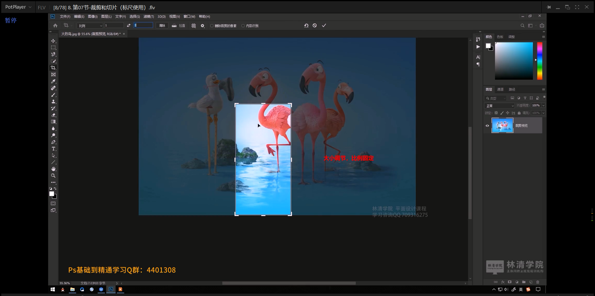
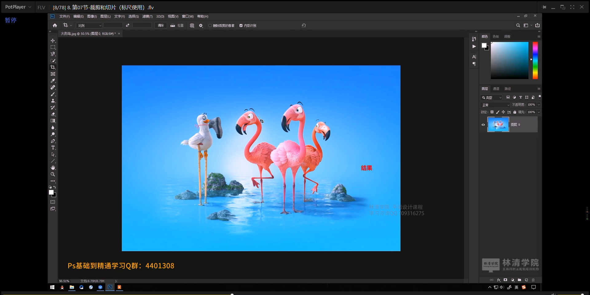
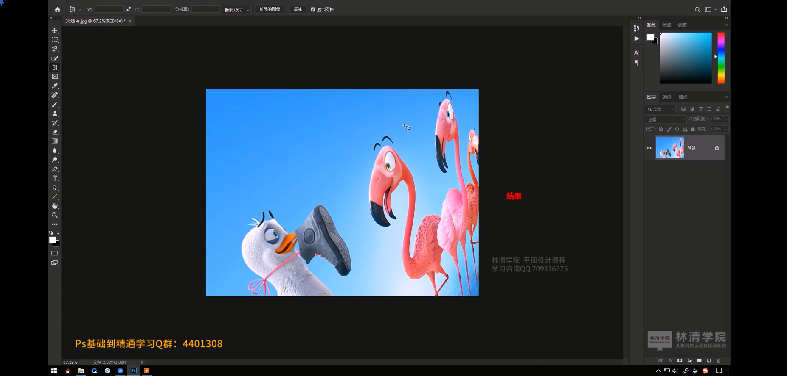

# 笔记

## 主要内容

1. 掌握图像裁剪方法
2. 掌握图像切片方法
3. 掌握标尺的使用

## 裁剪工具组

### 裁剪工具

#### 属性

点击四周白色的**短横线**，确定裁剪范围，完成之后，**鼠标双击确定**。

**结果：**

#### 图像大小查看

点击**编辑** =》**图像大小**

#### 图片扩展

做网页的时候，图片是需要拓展的，因为不知道实际上具体的网页的大小，所以可以将**白色短横线，向外拉伸**

#### 拓展添加底色

**第一步**：先进行拓展，**第二步**：给图片添加下一层图层并且设置颜色，此时就可以设置图片底色了。

#### 属性：比例

**设置比例属性**，可以按照固定的比例来裁剪图形

#### 属性：宽高，大小，分辨率

#### 属性：比例，按照比例裁剪

**1.shift固定比例**

**2. alt乙中间为比例向四周裁剪**

#### 属性：拉直

#### 属性：删除裁剪的像素

当我们使用裁剪功能的时候，一般裁剪之后，双击确定，但是返回了，可以通过单机，然后回到原来画面，但是一旦点击了这个之后，就回不到原来的图片了，因为原来的图片的其他部分都直接被删除了，没有备份

#### 属性：内容识别

当对画面进行拓展，四周都是空白的，此时需要对背景颜色进行适配和填充，则可以使用这个属性。

### 透视裁剪工具

## 切片工具组

### 切片工具

将图片中的各种元素切开保存下来。也就是UI设计师给你一张设计稿，然后，你把它的里面的元素都分别切出来。非常的重要，因为在以后的工作中，可能会经常用到。

#### 添加切片

在裁剪和切片栏目中选择切片工具，然后点击起点，拖动到终点，双击之后再保存就可以切开图片了，但是一般不会这样做，可以使用标尺工具。

#### 清除切片

#### 标尺辅助切片工作

#### 添加标尺

在视图菜单中添加标尺。

左轴和侧轴均显示标尺信息。

拖动标尺到图片上面

#### 删除标尺

可以使用移动工具将添加的标尺删除，也就是拖动到标志位置就可以删除已经添加的标尺线。

#### 保存切片

**点击切片工具 =》选择属性：基于参考线的切片**

**选择文件 =》导出 =》 存储为web所用格式...**

#### 组合切片

先按住CTRL键，然后选中其中的一个切片，然后按住SHIFT键不松开，选择第二个切片，左右鼠标右键，选择组合切片，这样的话两个切片就组合到了一起。

#### 编辑切片选项

可以设置URL，单击图片跳转

### 切片选择工具

#### 清除参考线

#### 影藏和显示参考线（CTRL+H）

### 手动设置参考线

### 总结

