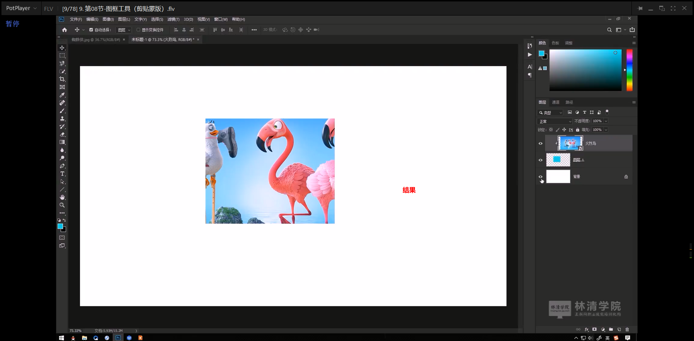

# 笔记

## 要点

1. 理解剪切蒙版
2. 掌握图框工具

## 剪切蒙版

### 置入文件对象：

**第一步：文件 =》新建 =》创建空白文档**

**文件 =》 置入文件对象**

****

### 创建剪切蒙版

### 剪切蒙版特殊效果。

### 释放剪切蒙版。

### 快捷方式。

### 替换电脑壁纸

## 图框工具

类似于剪切蒙版

双击，选择切换图框和相片

