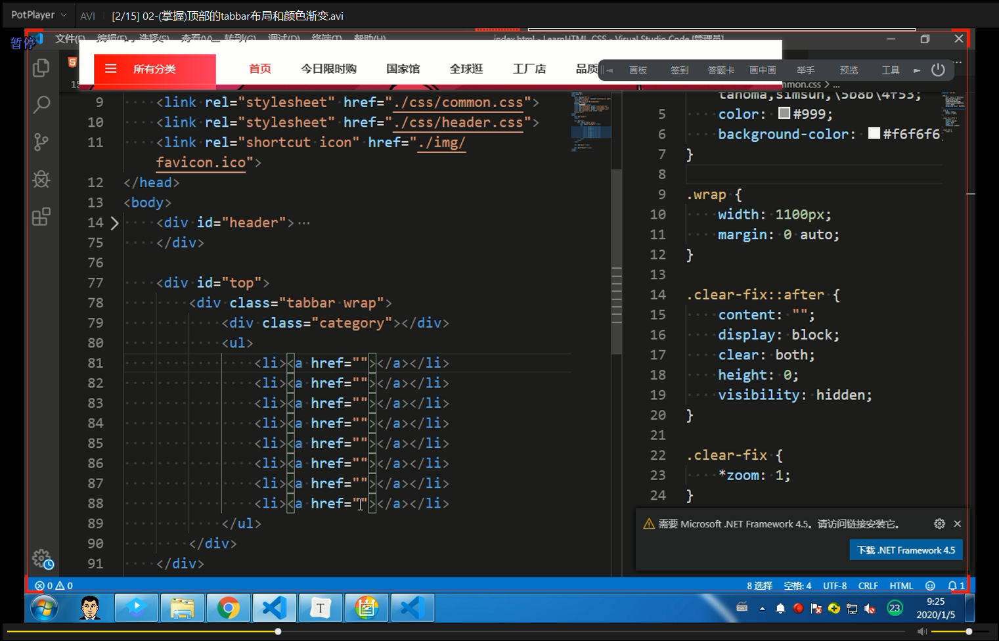
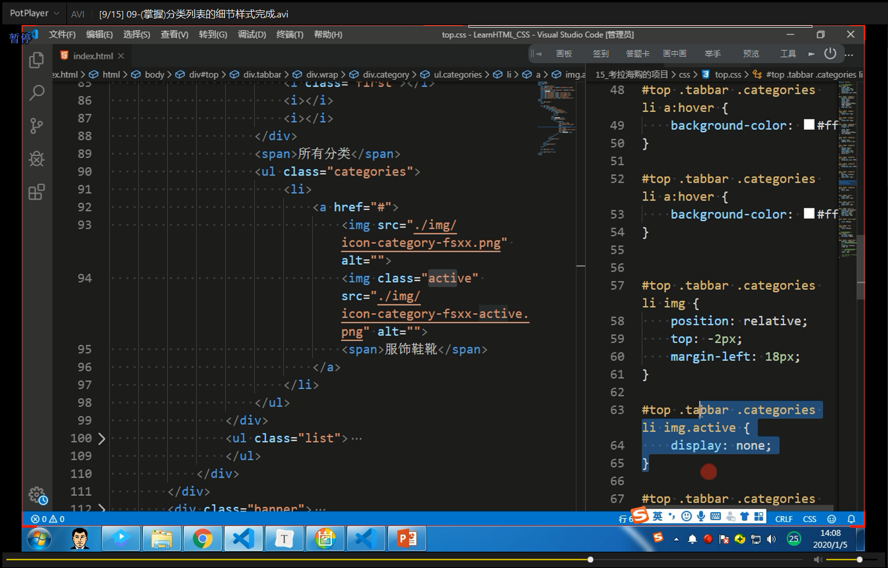
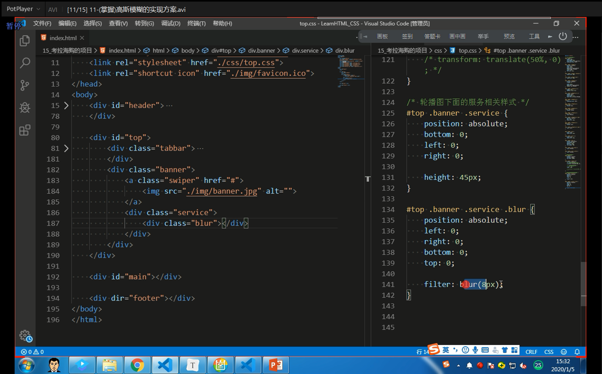
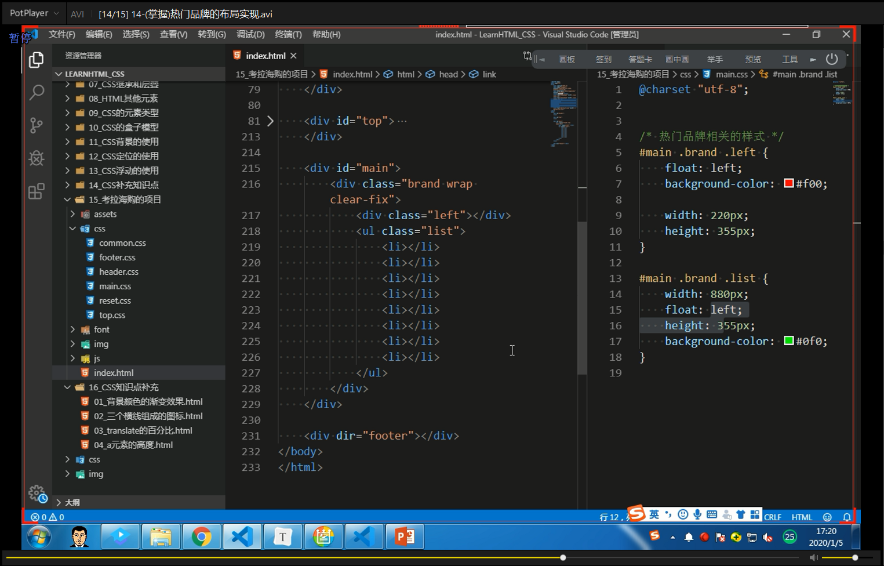

## 网易考拉项目实战

### 1.1考拉项目-目录的划分

### 1.2考拉项目-css的reset以及引入

### 1.3考拉项目-页面的结构和样式的划分

### 1.4考拉项目-顶部广告居中实现

### 1.5考拉项目-导航右侧的内容

### 16.考拉项目-导航左侧的内容

### 1.7考拉项目-loge的内容以及居中

### 1.8考拉项目-顶部的tabber布局和颜色渐变

### 1.9考拉项目-三个横线图标的实现

### 2.0考拉项目-顶部的tabber列表展示的实现

### 2.1考拉项目-轮播图的显示以及居中

### 2.2考拉项目-transform对行内元素无效

### 2.3考拉项目-分类列表的基础结构和布局

### 2.4考拉项目-分类列表的细节样式完成

### 2.5考拉项目-高斯模糊的实现方案

### 2.6考拉项目-轮播图控制按钮的实现

### 2.7考拉项目-轮播图的指示器展示

### 2.8考拉项目-热门品牌的布局实现

### 2.9补充

