# 了解HTTP协议

## 浏览器背后的故事

### 流程图列

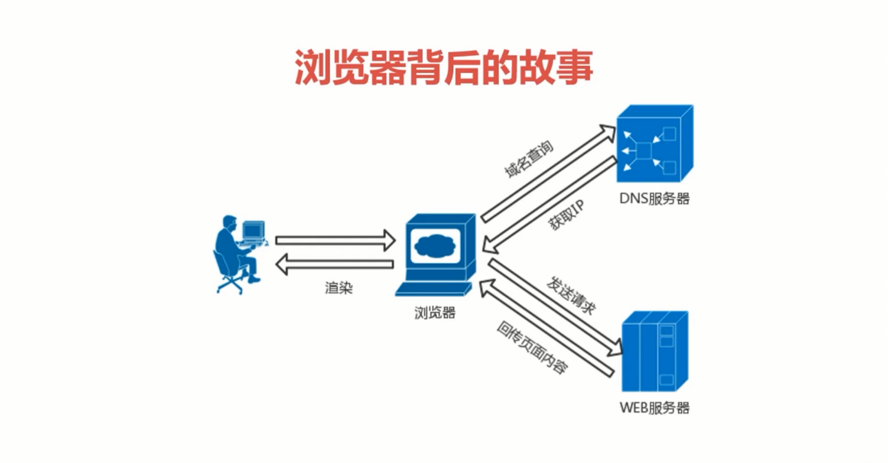

### HTTP协议

> 超文本传输协议（HTTP）是一种**通信协议**，它允许将超文本标记语言（HTML）文档从WEB服务器传输到客户端的浏览器
>
> HTTP是一个属于**应用层的面向对象的协议**，由于其简捷、快速的方式，适用于分布式超媒体信息系统。它于1990年提出，经过几年的使用和发展，得到不断地完善和扩展

#### WEB与HTTP

+ WEB是一种基于超文本和HTTP的、全球性的、动态交互的、跨平台的分布式图形信息系统
+ 建立在Internet上的一种网络服务，为浏览者在Internet上查找和浏览信息提供了图形化、易于访问的直观界面，其中的文档以及超级连接将Internet上的信息节点组织成一个互为关联的网状结构。

#### HTTP协议的前世今生

> 1990年10 万维网之父 Tim Berners -Lee最早提出了HTTP协议

> 1991年 HTTP0.9诞生

> 1996年5月 HTTP1.0发布

> 1997 年1月 HTTP1.1发布

> 2015年5月HTTP2.0提出

> HTTP3.0 QUIC协议

## 透过TCP/IP看HTTP

> 二者关系（仅限于有关HTTP的TCP/IP知识）

+ HTTP协议是构建在**TCP/IP**协议之上的，是TCP/IP协议的一个子集
+ 为了更好的理解HTTP协议，先了解一下**TCP/IP**的相关知识

### TCP/IP协议族

+ TCP/IP协议其实是一系列与互联网相关联的协议集合起来的总称，协议也就是规则，约定双方的通信规则
+ 分层管理是TCP/IP协议的重要特征

### TCP/IP 协议族分层

TCP/IP协议族是由一个四层协议组成的系统，这四层分别为：应用层、传输层、网络层和数据链路层

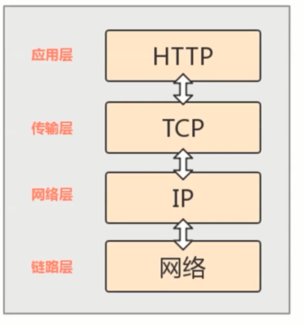

#### 应用层

应用层一般是我们编写的应用程序，决定了向用户提供的应用服务。应用层可以通过系统调用与传输层进行通信。如：FTP、DNS、HTTP等。

#### 传输层

+ 传输层通过系统调用向应用层提供处于网络连接中的两台计算机之间的数据传输功能
+ 在传输层有两个性质不同的协议：TCP和UDP。
  + TCP是面向连接的通信（需要在两台计算机建立连接，效率低）
  + UDP是无连接的通信（不需要在两台计算机建立连接，效率高，但是可靠性低，无连接不需要检验数据）

#### 网络层

网络层用来处理在网络上流动的数据包，数据包是网络传输的最小的数据单位，该层规定了通过怎样的路径（传输路线）到达对方的计算机，并把数据包传输给对象

#### 链路层

链路层用来处理连接网络的硬件部分，包括控制操作系统、硬件设备驱动，NIC(Network Interface Card,网络适配器) 以及光纤等物理可见部分。硬件上的范畴均在数据链路层的作用范围之内。

#### 数据包封装过程

上层协议的数据到底是如何转变为下层协议的数据的呢？这就用到了封装的知识。

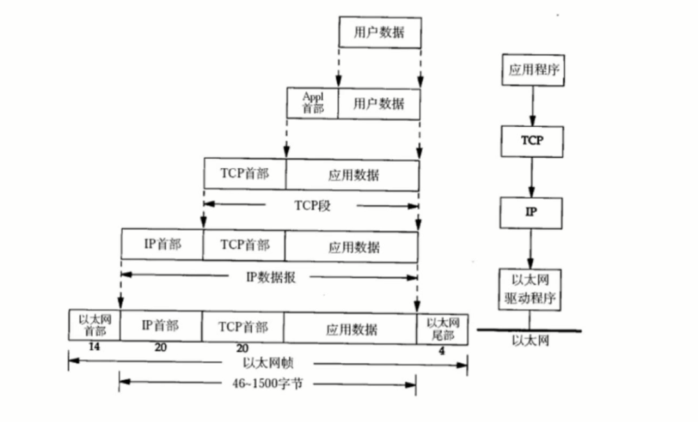

#### HTTP数据传输过程

发送端发送数据时，数据会从上层传输到下层，且每经过一层都会被打上该层的头部信息。在最后一层还要加上尾部信息。

在接收端接收数据时，数据会从下层传输到上层，传输前会把下层的头部信息删除。

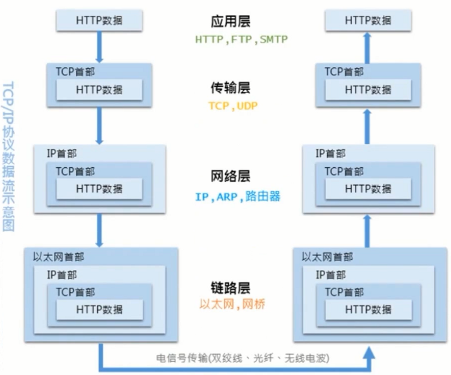

#### 传输层 -TCP三次握手

使用TCP协议进行网络通信的双方必须要先建立连接，然后才能开始传输数据。为了确保连接双方可靠性，在双方建立连接时，TCP协议采用了三次握手策略。

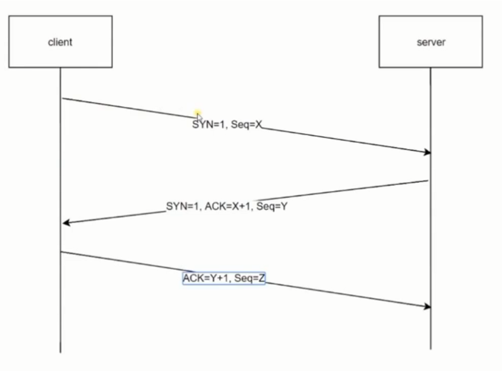

+ **第一次握手：**客户端发送带有SYN标志的连接请求报文段，然后进入SYN_SEND状态，等待服务端的确认

  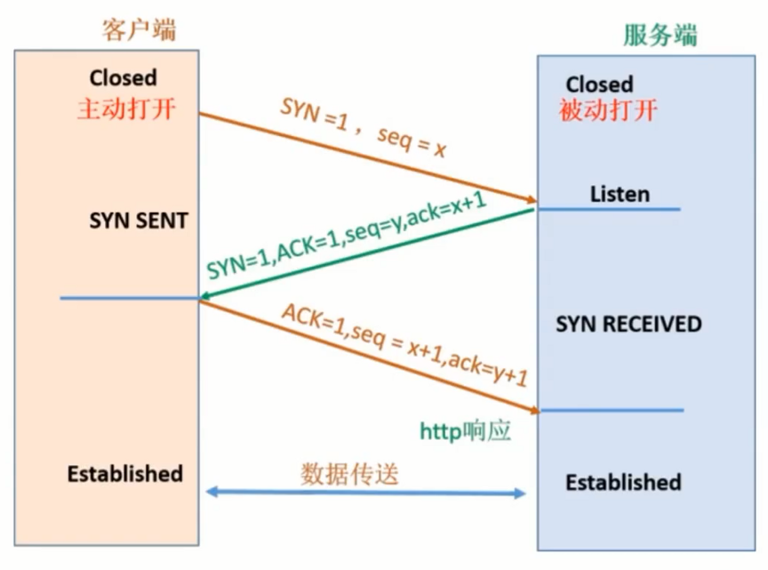

+ **第二次握手：**服务端接收到客户端的SYN报文段后，需要发送ACK信息对这个SYN报文段进行确认。同时还要自己的SYN请求信息。服务端会将上述的信息放到一个报文段（SYN+ACK报文段）中，一并发送给客户端，此时服务端将会进入SYN_RECV状态。

+ **第三次握手：**客户端接收到服务端的SYN+ACK报文段后，会向服务端发送ACK确认报文段，这个报文段发送完毕后，客户端和服务端都进入ESTABLISHED状态，完成了TCP三次握手

  > 验证客户端和服务器的发送报文，接收报文的能力是正常的，必须要经过三次握手，要明确客户端和服务器的收发能力是正常的。也就是自己要明确自己和对方的发送，接收能力都是正常的。
  >
  > 第一次握手:**服务端明白:**验证客户端的发送报文，服务端的接收报文是正常的。
  >
  > 第二次握手：**客户端明白**:验证客户端的接收报文，服务端的发送报文是正常的
  >
  > 第三次握手：**服务端明白:**验证服务端的发送能力是正常的

**总结握手信息**

| 第几次     | 服务端结论                                                   | 客户端结论                                                   | 信息 |
| ---------- | ------------------------------------------------------------ | ------------------------------------------------------------ | ---- |
| 第一次握手 | 服务端的接收能力是正常的 客户端的发送能力是正常的       | 客户端什么都不知道                                           |      |
| 第二次握手 | 服务端什么都不知道                                           | 服务端的接收能力是正常的 服务端的发送能力是正常的 客户端的发送能力是正常的 客户端的接收能力是正常的 |      |
| 第三次握手 | 客户端的接收能力是正常的 服务端的发送能力是正常的  |                                                              |      |

经历了三次握手之后，客户端和服务器都发现了自己和对方的发送和接收能力都是正常的。

每一次握手，都是接收的一方能得到一些结论，发送的一方没有任何头绪

### DNS域名解析

> 已经介绍了与HTTP协议有着密切关系的TCP/IP协议，接下来介绍的DNS服务也是与HTTP协议有着密不可分的关系

通常我们访问一个网站，使用的是主机名或者域名来进行访问的，因为相对于IP地址（一组纯数字），域名更容易让人记住。但是TCP/IP协议使用的是IP地址进行访问的，所以必须要有个机制或者服务器把域名转换成IP地址。DNS服务就是用来解决这个问题的，它提供**域名到IP地址之间的解析服务。**

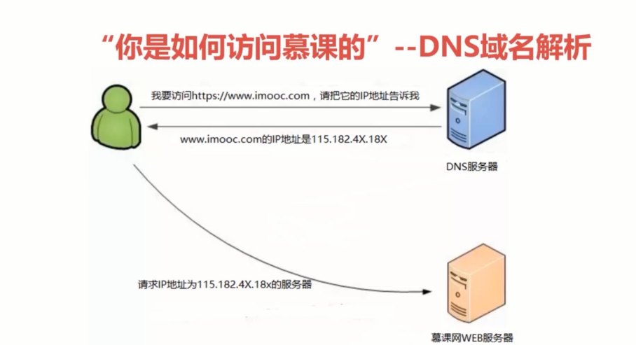

图示：是从宏观的角度来看

从微观的角度来看：为了提高效率，DNS服务的解析是由层次的，具体的来说，就是就近的原则，首先本地电脑会将一些常用的域名和响应的ip地址建立映射关系，并且保存到系统文件中，所以正常情况下，当需要DNS解析服务的时候，浏览器会优先去系统文件host文件中依据域名查找对应的ip地址，如果找到了，就直接使用host文件里面的ip地址，如果没有找到，则系统会去求助于本地的DNS服务器，本地电脑都有一个本地的DNS服务，浏览器向本地的DNS服务发送请求，去请求域名对应的ip地址，本地的DNS服务器响应请求，并将域名映射的ip地址返回给浏览器，当然，这个本地是有限的，如果本地的DNS服务没有找到域名对应的ip地址，则本地的DNS服务器会向上一层DNS服务器发出请求，有则返回，没有则继续上一层DNS,直到到达DNS根服务器，如果找到的话，就进行回传，最终将找到的ip地址返回给浏览器。

详细情况，如果本地的host文件和本地的DNS服务器都找不到域名映射的ip地址，则浏览器会优先去PC电脑中ip地址中配置的DNS服务器去寻找如8.8.8.8 ，这个配置的DNS服务器我们称为本地DNS服务器，这个DNS服务如果收到查询请求，如果要查询域名，包含在本地区域配置资源里面就会返回，如果本地的DNS解析和本地的区域缓存资源都失效了，就根据本地的DNS服务器的设置，这里有一个是否设置转发的设置，进行查询，如果没有使用转发模式，那本地的DNS服务器就直接将请求转发给13台DNS根服务器中，如果你设置了转发，就会一层一层的向上去找，知道找到它的ip地址

CDN服务器与DNS服务器的区别：

在DNS服务器上面又挂载了CDN，先有CDN来进行内容的分发，也就是告诉请求者，根据请求者自己的区域来决定请求者到底是访问哪一台服务器，然后再通过DNS服务器返回给我们，这个服务器就称为CDN服务器。

### 回溯HTTP事务处理过程

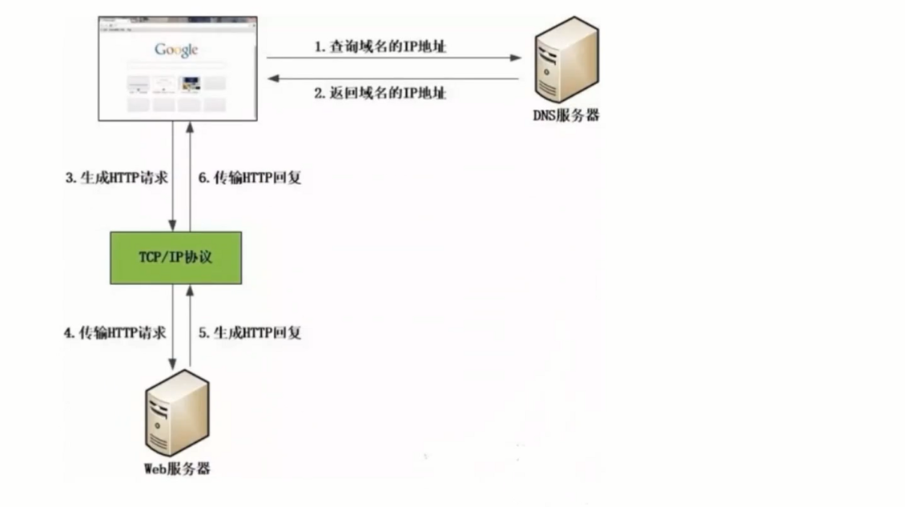

当客户端访问Web站点时候，首先会通过DNS服务器查询到域名的IP地址。然后浏览器生成HTTP请求，并通过TCP/IP协议发送给Web服务器。Web服务器接收到请求后会根据请求生成响应内容，并通过TCP/IP协议返回给客户端。

更细节的图示：

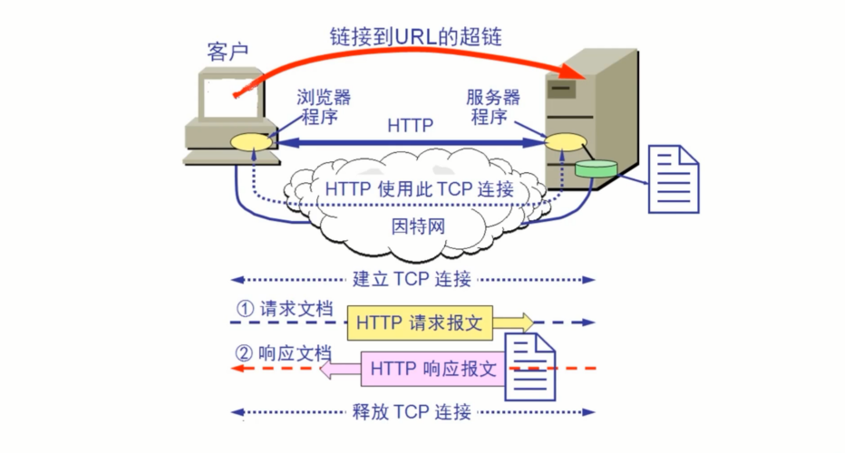

客户端浏览器浏览一个页面，那么我们就要从中分解出协议名、主机名

端口、对象路径等等，协议应该为http协议，主机应该为mock的主机

端口为8080端口，对象路径为mock的根节点，到这一步我们需要DNS服务器来解析它的域名获取IP地址

第二步就是封装http请求的数据包，把以上部分结合本机的信息封装成一个http请求的数据包。

第三步把http请求的数据包封装成TCP包，然后建立TCP连接，就是TCP的三次握手

第四步发送请求给服务器，请求方式为http的格式

第五步然后服务器来进行响应

第六步然后产生响应的报文，响应的消息体里面还有状态码，协议版本号，成功失败的代码，服务器信息，实体信息等等

第七步 WEB服务器响应完了之后，要关闭TCP连接。

以上就是http协议的一次工作原理。

## 实现：HTTP请求

现在我们已经了解了HTTP协议的基本概念，也知道了我们是如何从浏览器访问到我们想要的网站资源的

对于浏览器而言，HTTP请求到底是什么样子呢？可以追踪查看

抓包工具查看HTTP协议的大体工作方式([wireshark](https://www.wireshark.org))

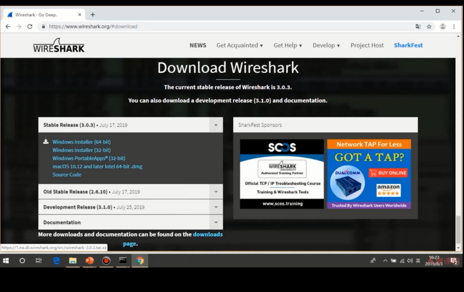

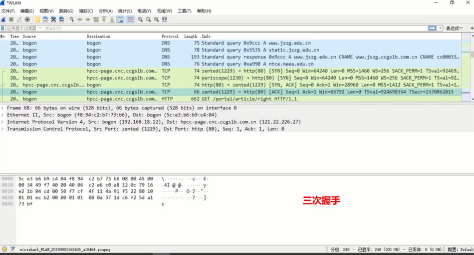

查看浏览器中的HTTP到底是什么样子