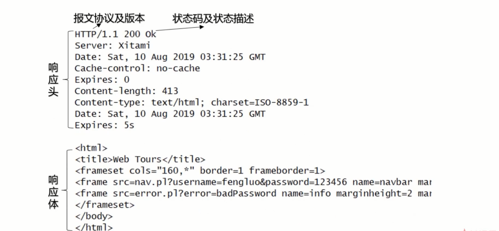

# 熟悉HTTP协议结构和通讯原理

## HTTP协议特点

+ 支持客户/服务器模式

  客户/服务器模式工作的方式是由客户端向服务器发出请求，服务器端响应请求，并进行相应服务

  

+ 简单快速

  + 客户向服务器请求服务时，只需要传送请求方法和路径

  + 请求方法常用的有GET、HEAD、POST。每种方法规定了客户与服务器联系的类型不同
  + 由于HTTP协议简单，使得HTTP协议服务器的程序规模小，因而通信速度很快

+ 灵活
  + HTTP允许传输任意类型的数据对象
  + 正在传输的类型由Content-Type(Content-Type是HTTP包中用来表示内容类型的标识)加以标记

+ 无连接

  + 无连接的含义是限制每次连接只处理一个请求

  + 服务器处理完客户的请求，并收到客户的应答后，即断开连接

  + 采用这种方式可以节省时间

    刚开始的时候网页比较简单，网站一般需要面对数百万用户的HTTP请求，采用无连接的方式比较节省性能，后来随着时间的推移，网页元素越来越复杂，例如加载一个图片都需要一次HTTP请求，此时的无连接就比较垃圾了，比较低效。比较耗费时间，后来提出了keep-alive的功能用来解决效率低的问题，保证客户端对浏览器的连接不被中断，而持续有效，当发起请求的时候，避免重新断开或者新建连接。但是keep-alive再保存连接的时候，有些资源应该被回收的，但是采用这个功能就保持了连接不会回收，此时需要给keep-alive一个有效时间，再有效时间内保持TCP连接，只要浏览器发起请求，就可以使用这条已经建立好的链接。超时或者断电则自动断开TCP连接。

    

+ 无状态
  + HTTP协议是无状态协议
  + 无状态是指协议对于事务处理没有记忆能力。缺少状态意味着如果后续处理需要前面的信息，则它必须重传，这样可能导致每次连接传送的数据量增大
  + 另一方面，在服务器不需要先前信息时它的应答就比较快了

## URI与URL

+ URI：一个紧凑的字符串用来标识抽象或者物理资源
+ A URI可以进一步被分为定位符、名字或者两者都是
+ 术语：“Uniform Resource Locator” （URL）是URI的子集，除了确定一个资源，还提供一种定位该资源的主要访问机制（如其网络“位置”）

**说人话就是：**

+ URI可以分为URL,URN或者同时具备locators和names特性的一个东西
+ URN作用就好像一个人的名字，URL就像一个人的地址
+ 换句话说：URN确定了东西的身份，URL提供了找到它的方式

**特点**

+ URL是URI的一种，但不是所有的URI都是URL
+ URI和URL最大的差别是“访问机制”
+ URN是唯一标识的一部分，是身份信息

**例子**

**以上都可以称之为URI**

## HTTP报文结构分析-请求报文

### HTTP报文头

+ HTTP的报文头大体可以分为四类，分别是：

  通用报文头、请求报文头、响应报文头和实体报文头

+ 在HTTP/1.1里面一共规范了47种报文头字段

**通用报文头，顾名思义就是可以用在请求报文头，或者响应报文头上**

**请求报文头，就是请求专用的报文头**

**响应报文头，也就是用来响应上的报文头**

**实体报文头**

#### Accept

作用：浏览器端可以接受的媒体类型

Accept:text/html 代表浏览器可以接受服务器回发的类型为text/html也就是我们常说的html文档，如果服务器无法返回text/html类型的数据，服务器应该返回一个406错误（Non Acceptable）

Accept:\*/\*代表浏览器可以处理所有类型

如果想要给显示的媒体类型增加优先级，则使用 q= 来额外表示权重值）；重值 q 的范围是0~1（可精确小数点后3位），且1为最大值。不指定权重 q 值时，默认权重为 q = 1.0。当服务器提供多种内容时，将会首先返回权重值最高的媒体类型。

####  Accept-Encoding

作用：浏览器申明自己接收的编码方法，通常指定压缩方法，是否支持压缩，支持什么压缩方法（gzip,deflate）

Accept-Encoding:gzip,deflate

#### Accept-Language

作用：浏览器申明自己接收的语言

Accept-Language:zh-cn,zh;q = 0.7,en-us,en;q=0.3

客户端在服务器中有中文版资源的情况下，会申请其返回中文版对应的响应，没有中文版时，则请求返回英文版响应

#### Connection

Connection:keep-alive 当一个网页打开完成后，客户端和服务器之间用于传输HTTP数据的TCP连接不会关闭，如果客户端再次访问这个服务器上的网页，会继续使用这一条已经建立的连接

Connection:close 代表一个Request完成后，客户端和服务器之间的用于传输HTTP数据的TCP数据连接会关闭，当客户端再次发送Request，需要重新建立TCP连接。

#### Host

作用：请求报头域主要用于指定被请求资源的Internet主机和端口号，它通常从HTTP URL中提取出来

例如：在浏览器中输入：http://www.fljf.com:8080,浏览器发送的请求消息中，就会包含Host请求报头域，如下：Host:www.fljf.com:8080

#### Referer

当浏览器向web服务器发送请求的时候，一般会带上Referer,告诉服务器我是从哪个页面链接过来的，服务器借此可以获得一些信息用于处理

#### User-Agent

作用：告诉HTTP服务器，客户端使用的操作系统和浏览器的名称和版本

很多情况下我们会通过User-Agent来判断浏览器类型，从而进行不同的兼容设计。

#### Content-Type

作用：说明了报文体内对象的媒体类型

+ text/html：HTML格式

+ text/plain: 纯文本

+ text/xml : XML格式

+ image/gif : gif图片格式

+ image/jpeg: jpg图片格式

+ image/png: png图片格式

+ applicaion/xhtml +xml :XHTML格式

+ application/xml :XML数据格式

+ application/atom+xml : Atom XML聚合格式

+ application/json: JSON数据格式

+ application/msword: Word文档格式

+ application/octet-stream :二进制流数据（如常见的文件下载）

+ application/x-www-form-urlencoded: 表单提交

  

## HTTP报文结构分析-响应报文

