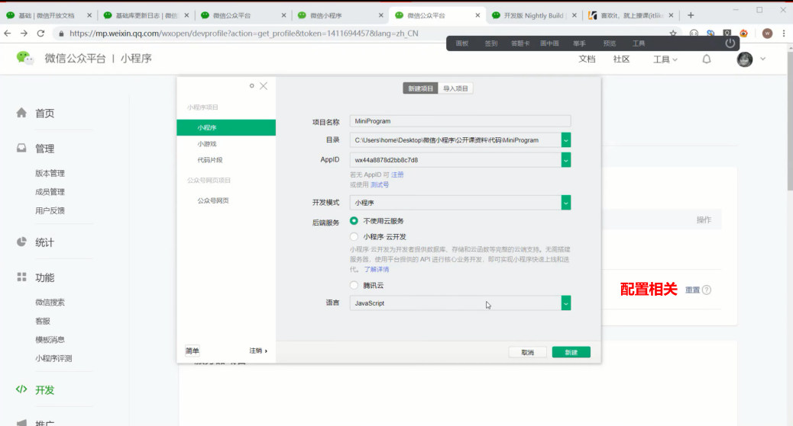
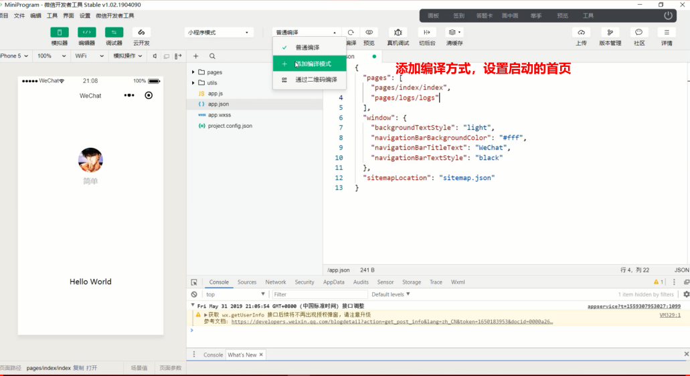
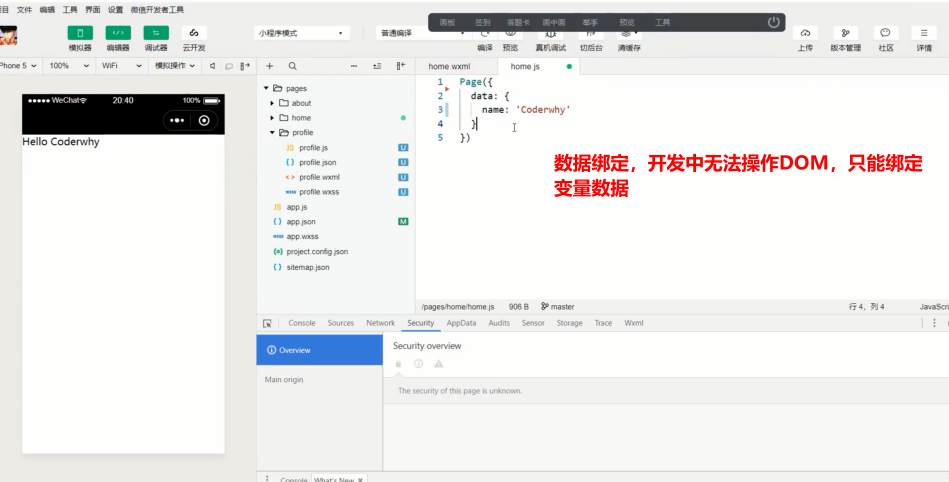

## 大纲

### 一，认识小程序

#### 什么是小程序

官方解释：微信小程序是一种全新的连接用户与服务的方式，它可以在微信内被便捷低获取和传播，同时具有出色的使用体验

我的解释：小程序是微信生态的一部分，它提供了一种更加**方便和高效**的用户交互方式

#### 小程序的出现带来了什么

1. 用户的便捷性
2. 远好于公众号和H5页面的体验
3. 释放手机内存空间
4. 让手机桌面更加简洁

#### 小程序开发的必要性

1. 各种好处，用户会越来越多
2. 公司角度，有自己的小程序就变得非常有必要
3. 给用户带来更好的体验
4. 抢占小程序市场

#### WebView的发展和不足

1. 公众号大量使用，WebView的使用频率越来越高
2. H5页面的劣势很明显：
   + 体验太差，无法调用很多底层App拥有的功能
3. 虽然提供了一些JS-SDK给Web开发者使用，但体验依旧很差
   + 页面经常白屏
   + 交互无反馈
   + 页面切换生硬等

#### Native的优势和劣势

为了解决以上的劣势体验，都必须依靠原生Native

Native的弊端

+ 开发门槛高，多端开发或者适配

新的解决方案

### 二，小程序诞生的背景

> 任何技术或者模式的诞生，都是为了解决行业的痛点；小程序的诞生也是如此

#### 小程序特点

+ 类似于Web开发模式，入门的门槛低：基本上是类似于html+css+js
+ 可直接云端更新：微信审核，无需经过App Store等平台
+ 提升用户体验：通过提供基础能力，原生组件结合等方式，提升用户体验
+ 平台管控能力：小程序提供云端更新，通过代码上传、审核等方式，增强对开发者的管控能力
+ 双线程模型：逻辑层和渲染层分开处理，提供了管控性和安全性（沙盒环境运行js代码，不允许执行任何和浏览器相关的接口，比如跳转页面，操作DOM等）

#### 小程序的历史

+ 2016年9月21发布的小程序内测版
+ 2017年1月9日正式上线

#### 小程序预备知识

1.页面布局：WXML,类似HTML

2.页面样式：WXSS,几乎就是CSS(某些不支持，某些进行了增强)

3.页面脚本：JavaScript+WXS ,(JS以及WeiXinScript后续学习)

### 三，开发之前准备工作

+ 申请AppID
+ 下载开发工具

以上自行百度教程

登录微信公众平台：https://mp.weixin.qq.com

> 补充

+ 一个账户只能对应开发一个小程序。
+ 企业、政府、媒体、其他组织主体可以注册50个小程序（也就是利用信息去注册50个账号，然后利用50个账号来开发50个小程序，也是一个账号对应一个小程序）。
+ 个体户和个人类型主体可注册5个小程序。（也就是可以通过个人信息注册5个账号，来开发5个小程序,也就是一账号对应一个小程序）

**小程序开发工具**

开发工具的选择：官方微信Web开发者工具、VSCode

### 四，小程序目录结构

#### 应用程序的结构

小程序结构划分：最上层App->多个Page->多个组件

#### 应用目录结构

### 五，从零搭建项目

### 六，项目git管理

### 七，小程序初体验

1. 数据绑定

   

   

   
   
2. 列表选渲染

   

   

   

3. 事件监听

   

   

   

   

~~~html
<!--pages/about/about.wxml-->
<text>你好啊，about</text>
<view>数据渲染：{{name}}</view>
<view>小程序列表渲染</view>
<view wx:for="{{movies}}">{{item}}</view>
<view wx:for="{{personInfo}}">{{item.name}}------{{item.age + 20}}-----{{item.hobby}}</view>
<view>多重列表渲染</view>
<view wx:for="{{personInfo}}">
<view wx:for= "{{item.hobby}}"wx:for-item="hobby">{{hobby}}</view>
</view>
<view>事件绑定</view>
<button size="mini" bindtap="add">按钮组件 + </button>
<view>{{counter}}</view>
<button size="mini"bindtap="reduce">按钮组件 - </button>
~~~

~~~javascript
// pages/about/about.js
Page({
  /**
   * 页面的初始数据
   */
  data: {
      name:'李爱英',
      movies:['魔戒','哈利波特','绿里奇迹','天空之城'],
      personInfo:[{
        name:'silly',
        age:23,
        hobby:['baseball','food']
      },{
        name:'alice',
        age:24,
        hobby:['football','baseball']
      },{
        name:'smith',
        age:25,
        hobby:['piano','vilion']
      }],
      counter:9
  },
  add(){
    console.log('点击一下');
    this.setData({
      counter : this.data.counter+1
    })
    
  },
  reduce(){
    console.log('点击一下!!');
    this.setData({
      counter : this.data.counter-1
    })
  },

  /**
   * 生命周期函数--监听页面加载
   */
  onLoad: function (options) {

  },
})
~~~

### 八，小程序的MVVM架构

### 九，命令式和声明式

命令式编程：原生js,例如操作DOM过程

声明式编程：Vue/React/Regular

