# 笔记

## 配置小程序

> 小程序的很多开发需求被规定在了配置文件中

### 原因

+ 有利于我们的开发效率

+ 保证小程序的某些风格是比较一致的

+ 比如导航栏-顶部TabBar,以及页面路由等等

  

### 常见配置文件

#### project.config.json

项目配置文件，比如项目名称、AppID等；

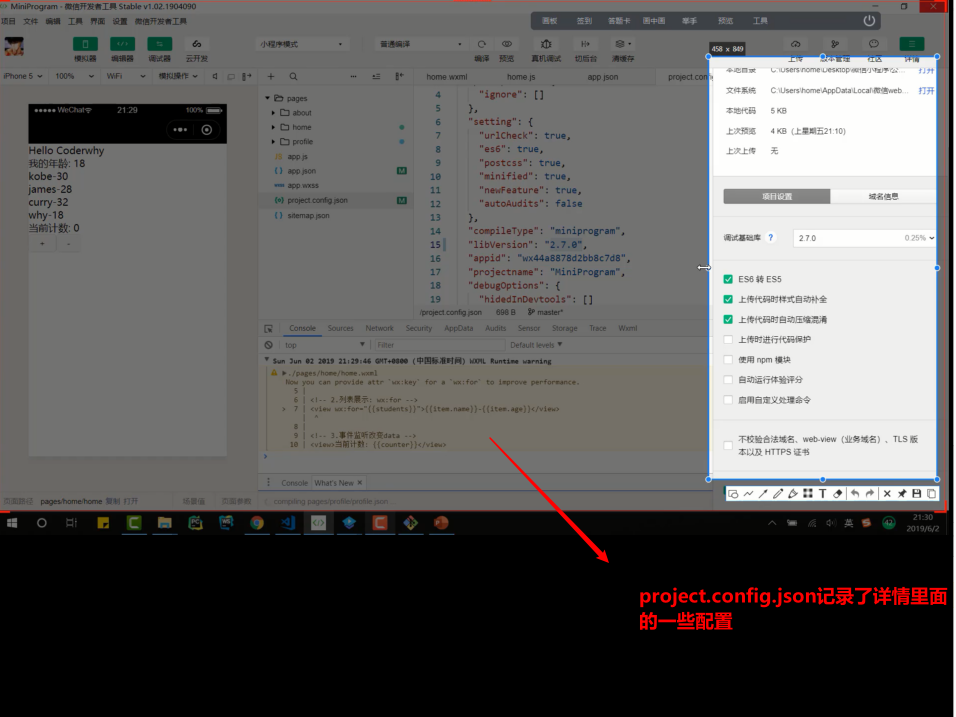

​	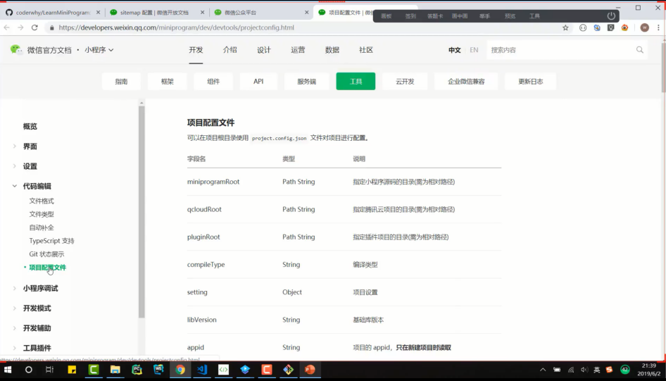

#### sitemap.json

小程序搜索相关的配置；

​	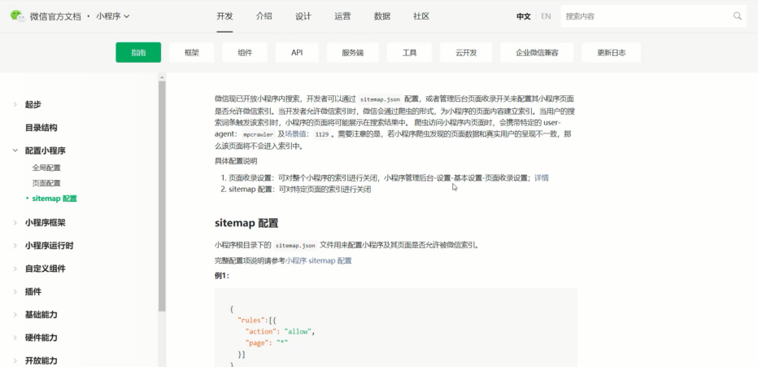

#### app.json

全局配置；

​	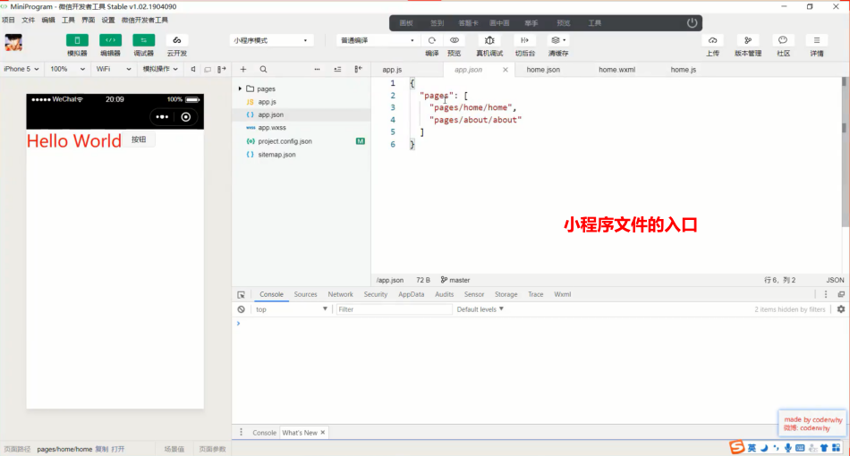

​	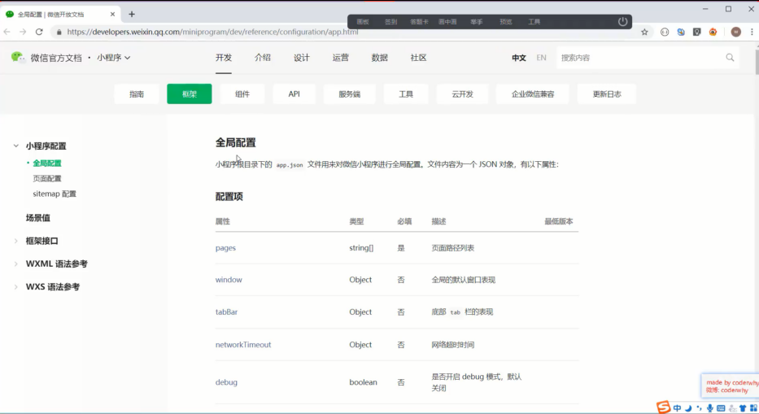

> 几个重要的全局配置 

​	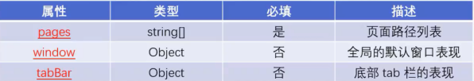

##### **pages**:页面路径列表

+ 用于指定小程序由哪些页面组成，每一项都对应一个页面的路径信息
+ 小程序中所有的页面都必须在pages中进行注册才能被使用
+ 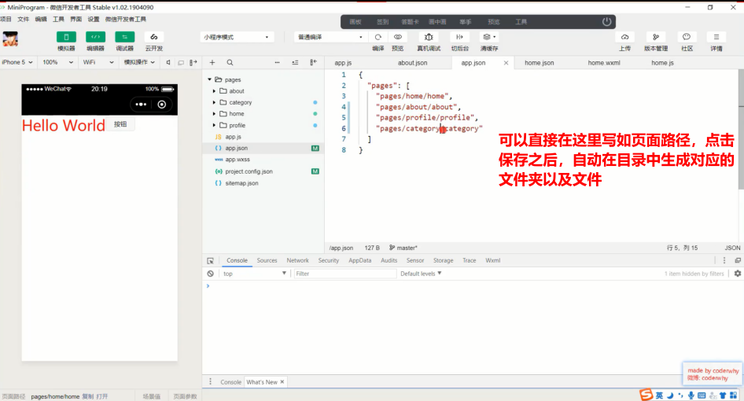

##### **window**:全局的默认窗口展示

+ 用户指定窗口如何展示，其中还包含了很多其他的属性

+ 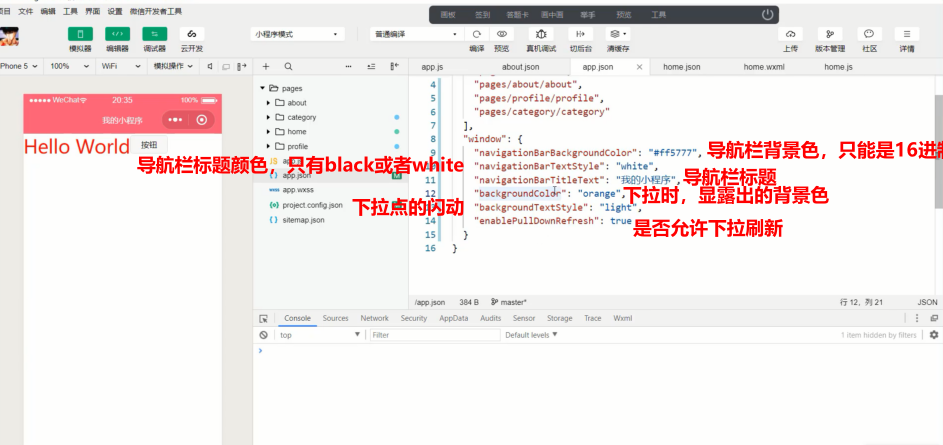

  **此处的下拉属性就是允许所有的页面都可以下拉刷新，一般在单独页面中个性化设置，故此处设置一般不用**

  

##### **tabBar**:顶部tab栏的展示

+ 具体属性稍后演示

+ 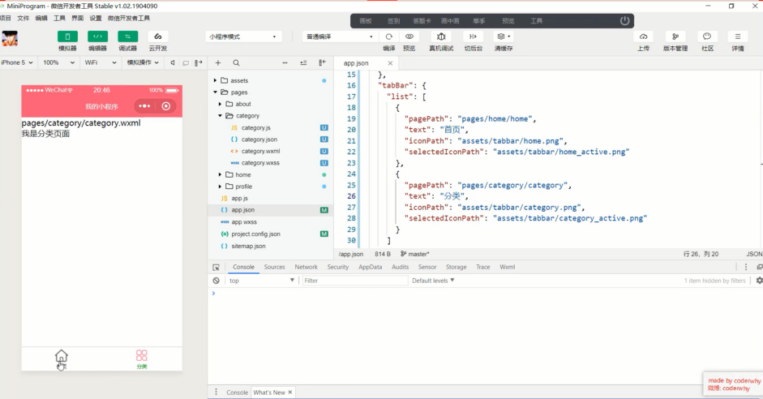

  

+ 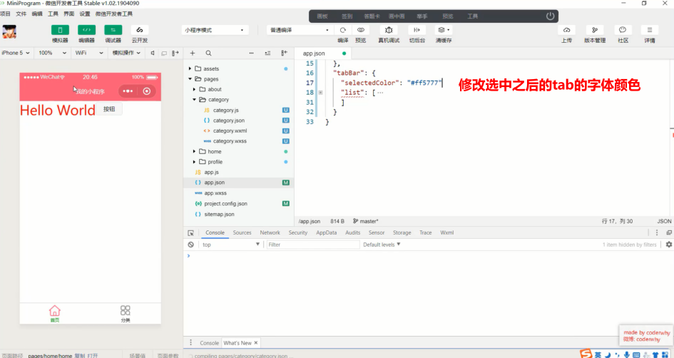

#### page.json:页面配置，局部配置；

> 每一个小程序页面也可以使用.json文件来对本页面的窗口表现进行配置,页面中配置项在当前页面会覆盖app.json的window中相同的配置项

​	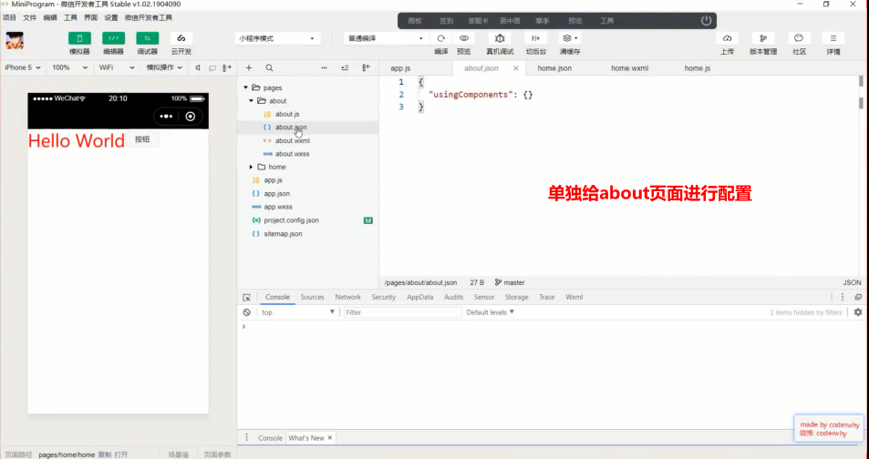

  

​      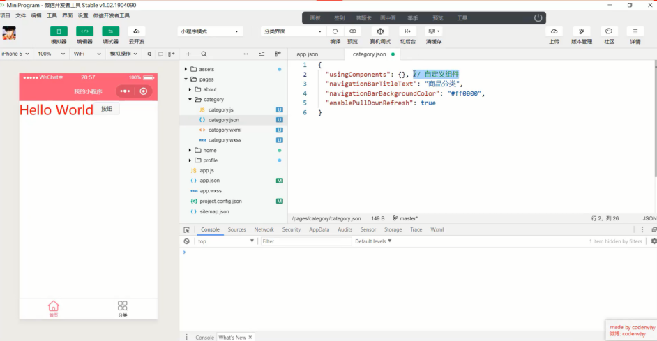

