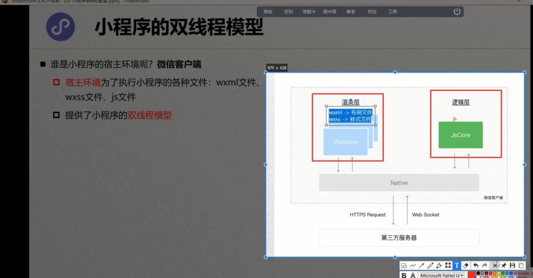
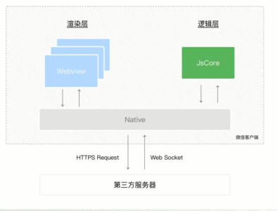
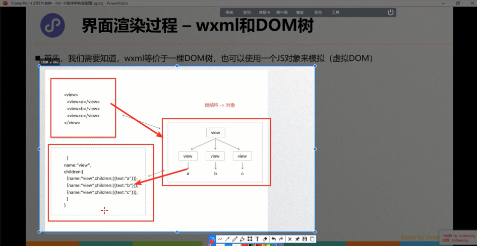
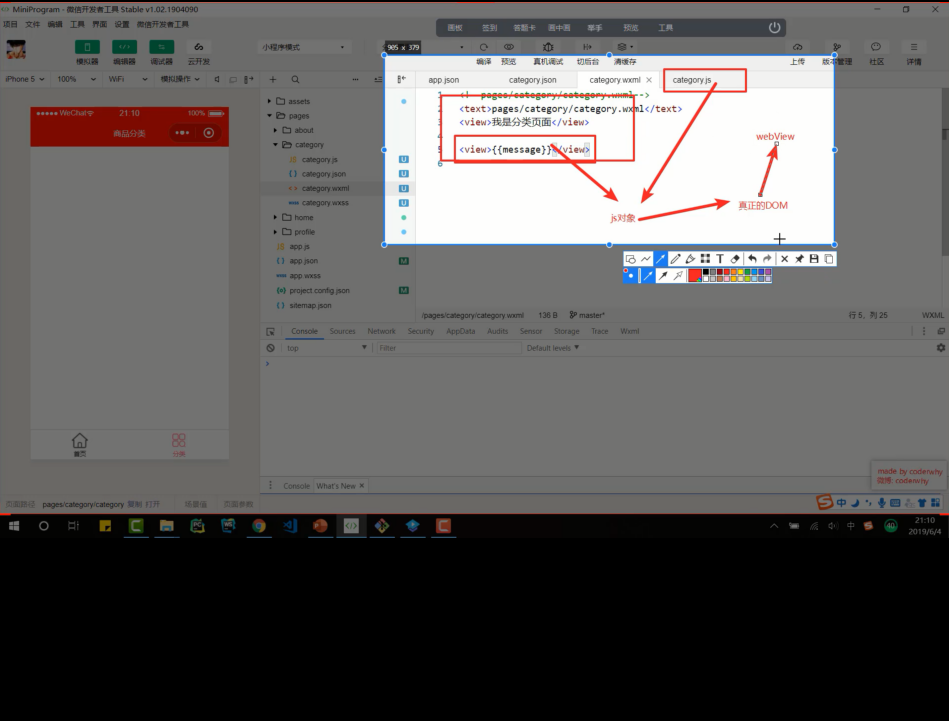
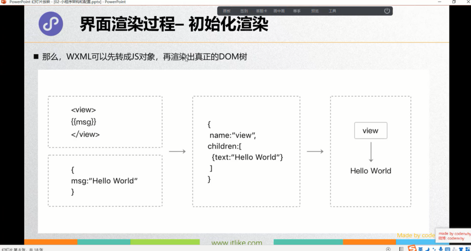
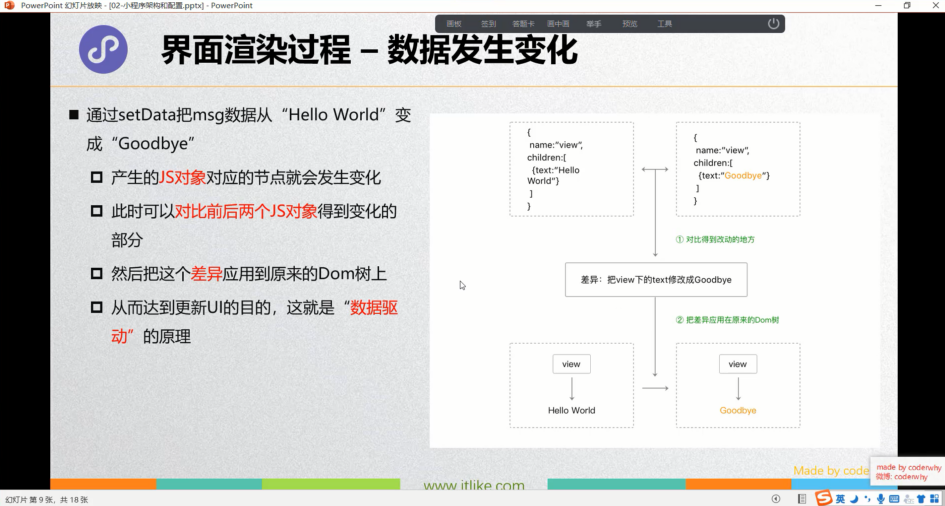

# 笔记

## 小程序双线程模型

### 微信客户端

**微信客户端**是小程序的宿主环境

+ 宿主环境为了执行小程序的各种文件：wxml文件、wxss文件、js文件
+ 提供了小程序的双线程模型

### 双线程模型

+ WXML模块和WXSS样式运行于**渲染层**，渲染层使用WebView线程渲染（一个程序有多个页面，会使用多个WebView的线程）。
+ JS脚本（app.js/home.js等）运行于**逻辑层**，逻辑层使用JSCore运行JS脚本。

这两个线程都会经由**微信客户端（Native）**进行中转交互。

### 界面渲染过程-wxml和DOM树

### 界面渲染过程-初始化渲染

> WXML可以先转成JS对象，再渲染出真正的DOM树

### 界面渲染过程-数据发生变化

### 界面渲染的整体流程

1. 在渲染层，宿主环境会把**WXML**转换成对应的**JS对象**；
2. 将**JS对象**再次转成**真实DOM树**，交由渲染层线程渲染
3. 数据变化的时候，逻辑层提供最新的变化数据，js对象发生变化进行diff算法对比
4. 将最新变化的内容反映到真实的DOM树中，更新UI;