# 笔记

## 小程序的启动流程

> 了解小程序的启动流程，知道自己代码的执行顺序。

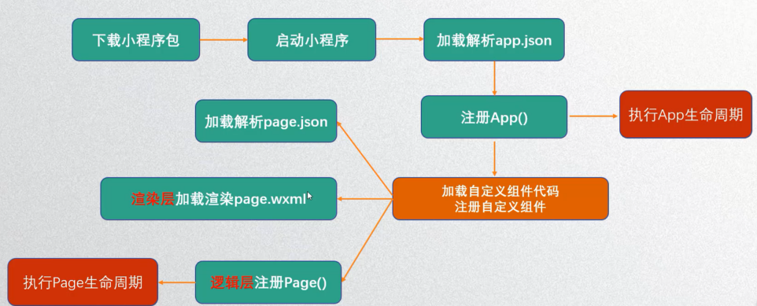

+ app.json为小程序的入口配置文件

+ 注意注册App()是在app.js文件中注册的,可以知道加载所有的页面的时候都有一个page.js文件，用以创建逻辑处理对象。

+ 在注册app.js文件里面的App({....})，如果有生命周期函数，还会执行里面的生命周期函数。

+ 默认加载的页面为app.json中pages配置项配置的第一个页面。

  加载页面的顺序

  + 第一步先加载page.json文件，读取里面的配置，读取完毕之后，就开始加载渲染page.wxml文件，解析wxml文件，同时也在加载page.js文件，然后wxml文件结合js文件，创建一个JS对象，再把这个JS对象转成真实DOM，然后把DOM渲染出来

  + 在加载page.js文件的时候，也会调用Page({...})函数，执行里面的生命周期函数。

    

## 注册小程序-参数解析

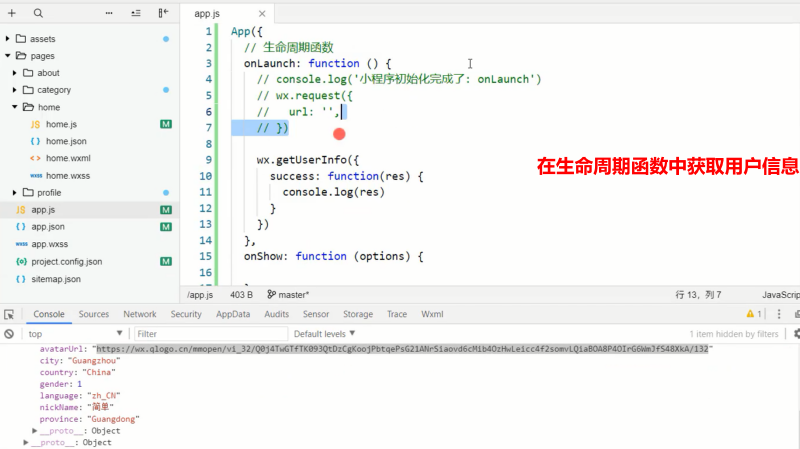

+ onLaunch：小程序初始化完成时，会执行的生命周期函数。一般只执行一次
+ onShow：小程序界面显示出来之后会执行的生命周期函数。一般可能会执行多次
+ onHide：界面被隐藏时会执行。
+ onError：小程序发生错误时，会执行此生命周期函数。

> 补充：按照加载的顺序，一般是先执行onLaunch(通过只会执行一次)，然后执行onShow（可以执行多次），onHide，当页面被隐藏时候触发。onError可以捕获处理系统异常以及自己手动抛出的异常。

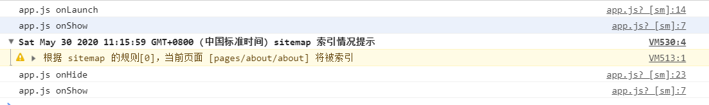

~~~javascript
App({
    /**
   * 当小程序启动，或从后台进入前台显示，会触发 onShow
   */
  onShow: function (options) {
    console.log("app.js onShow");
  },
  /**
   * 当小程序初始化完成时，会触发 onLaunch（全局只触发一次）
   */
  onLaunch: function () {
    console.log("app.js onLaunch");
  },
  /**
   * 当小程序从前台进入后台，会触发 onHide
   */
  onHide: function () {
    console.log("app.js onHide");
  },
  /**
   * 当小程序发生脚本错误，或者 api 调用失败时，会触发 onError 并带上错误信息
   */
  onError: function (msg) {
  }
})
~~~

> 拓展知识，小程序一般在微信端存活两个小时，在这个时间里重新打开小程序不会再次执行app.js里面的生命周期函数，超过时间则要重新初始化加载，也就是重新注册小程序

每个小程序都需要在app.js中调用App方法注册小程序示例，在注册时，可以绑定对应的生命周期函数，在生命周期函数中，执行对应的代码。

> 常见生命周期函数参考

| 属性           | 类型     | 默认值 | 必填 | 说明                                                         |
| -------------- | -------- | ------ | ---- | ------------------------------------------------------------ |
| onLaunch       | function |        | 否   | 生命周期函数--监听小程序初始化                               |
| onShow         | function |        | 否   | 生命周期函数--监听小程序启动或切前台                         |
| onHide         | function |        | 否   | 生命周期函数--监听小程序切后台                               |
| onError        | function |        | 否   | 错误监听函数                                                 |
| onPageNotFound | function |        | 否   | 页面不存在监听函数                                           |
| 其他           | any      |        | 否   | 开发者可以添加任意的函数或变量到Objext参数中，用 **this**可以访问 |

## 注册App()时一般执行操作

> 思考，注册App时，我们一般称之为注册小程序示例。我们一般会做些什么？

1. 判断小程序的进入场景
2. 监听生命周期函数，在生命周期中执行对应的业务逻辑，比如在某个生命周期函数中获取微信用户的信息
3. 因为App()实例只有一个，并且是全局共享的(单例对象)，所以我们可以将一些共享数据放在这里。

### 1.判断进入场景

 >补充知识：小程序的打开场景：群聊会话中打开、小程序列表中打开，微信扫一扫打开、另一个小程序打开
 >
 >如何确定场景？在onLaunch和onShow周期函数中，会有options参数，其中有scene值。

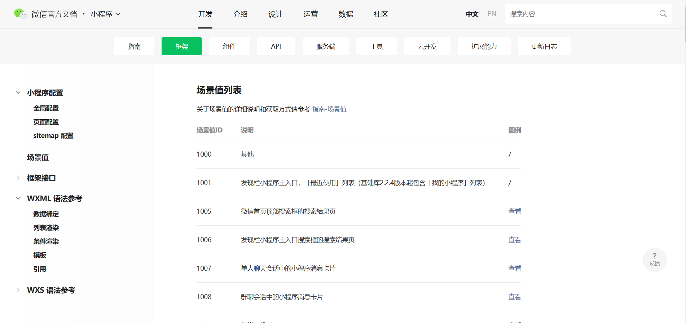

**在手机模拟器中模拟进入场景**

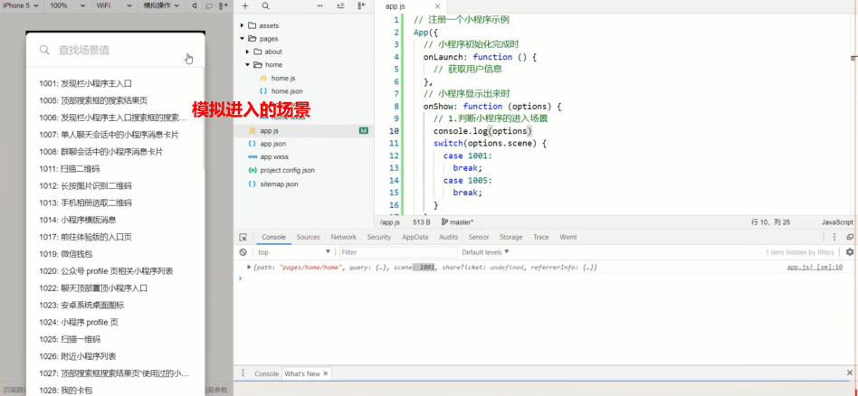

~~~javascript
App({
  /**
   * 当小程序初始化完成时，会触发 onLaunch（全局只触发一次）
   */
  onLaunch: function (options) {
    console.log("app.js onLaunch");
    // 通过比较可以发现该方法只有发现栏小程序主入口情景才会触发
    console.log(options.scene);//1001
  },
  /**
   * 当小程序启动，或从后台进入前台显示，会触发 onShow
   */
  onShow: function (options) {
    console.log("app.js onShow");
    console.log(options.scene);//1001 1005 1012 1007
  },
    ......
})
~~~

### 2.监听生命周期函数

#### 获取用户信息三种方式

1. **wx.getUserInfo-即将废弃的接口**

~~~javascript
  onShow: function (options) {
    console.log("app.js onShow");
    console.log(options.scene);//1001 1005 1012 1007
    // 获取用户信息方式一，获取到用户信息，并且将信息传递到服务器中，该方法逐渐被废弃
    wx.getUserInfo({
      success:function(userInfo){
        console.log(userInfo);
      }
    })
  },
~~~

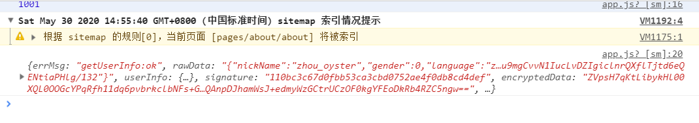

> 补充知识：小程序初始化的时候，当执行到wx.getUserInfo（）的时候，屏幕页面会出现弹窗，提示用户授权信息是否允许授权用户信息。后续不再弹出,测试发现在app.js中的onShow方法里面不会出现提示框？不知是何原因？

2. **button组件-将open-type改成getUserInfo,并且绑定bindgetuserinfo事件去获取**。

   

   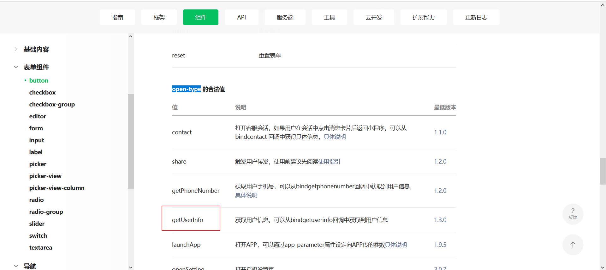

~~~html
// wxml文件中
<button 
    open-type="getUserInfo"
    bindgetuserinfo="getUserDetail">
    获取用户信息
</button>
~~~

~~~javascript
// js文件中 
getUserDetail:function(datas){
    console.log(datas);
  },
~~~

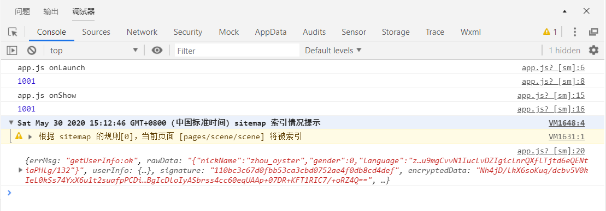

3. **使用open-data组件展示用户信息，不能获取，只能展示**

   

   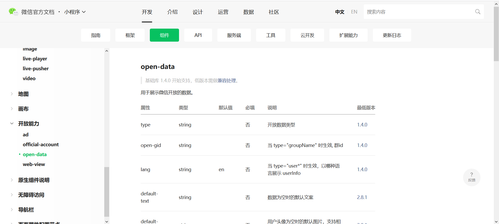
   
   
   
   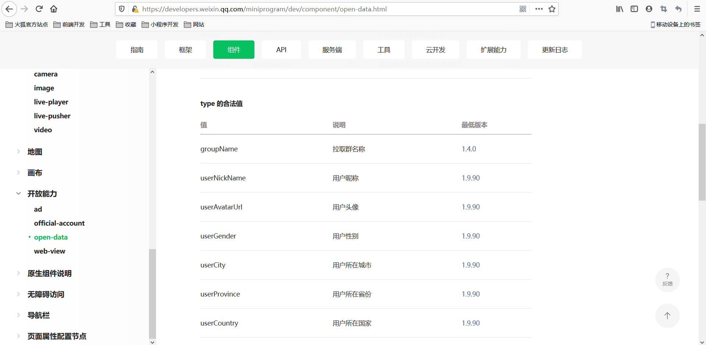
   
   ​	
   
   ~~~html
       <open-data type="userNickName"></open-data>
       <open-data type="userGender"></open-data>
       <open-data type="userAvatarUrl"></open-data>
       <open-data type="userCity"></open-data>
       <open-data type="userCountry"></open-data>
       <open-data type="userLanguage"></open-data>
   ~~~
   
   
   
   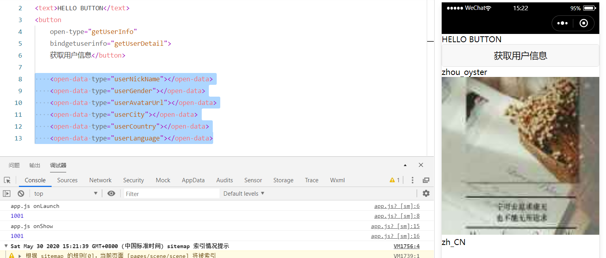

### 3.保存全局变量

> 定义在app.js中的全局变量，可以被所有页面共用

~~~javascript
// app.js文件
 // 我是定义在全局的变量
  globalDatas:{
    personInfo:{
      name:'silly',
      age:13,
      hobby:['羽毛球','兵乓球']
    }
  }
~~~

~~~javascript
// 在页面中的page.js引入全局变量
// pages/scene/scene.js
// 获取全局变量,getApp()获取app.js创建的全局对象
var app = getApp();
console.log(app.globalDatas.personInfo.name);
console.log(app.globalDatas.personInfo.hobby);
Page({
......
})
~~~

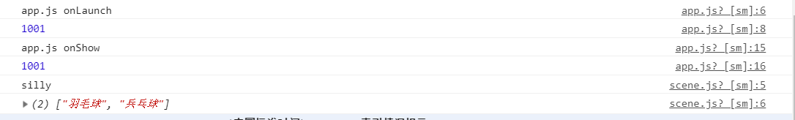

## 注册Page()时一般执行操作

> 小程序中的每一个页面，都有一个对应的js文件，其中调用Page方法注册页面示例。在注册时，可以绑定初始化数据，生命周期回调（监听页面的生命周期），事件处理函数等等。

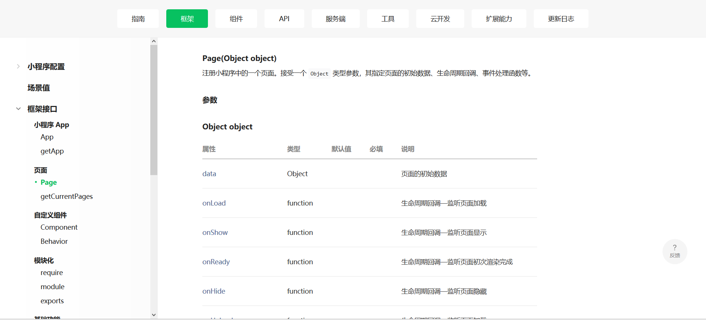

1. 在生命周期函数中发送网络请求，从服务器获取数据。

   + onLoad():生命周期回调—监听页面加载。

     ​	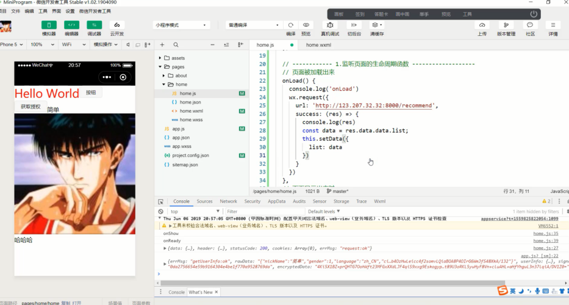

     

     ~~~javascript
  /**
        * 生命周期函数--监听页面加载
     */
       onLoad: function (options) {
      console.log(' scene onLoad');
         wx.request({
           url: 'http://123.207.32.32:8000/api/m3/recommend',
           success:(res)=>{
             console.log(res);
           }
         })
       },
     ~~~
   
     
   
     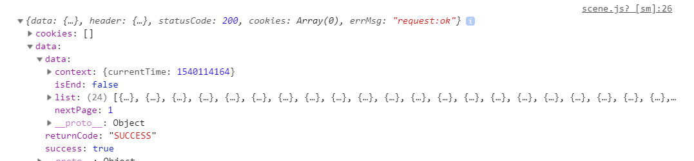
   
     
   
   + onReady():生命周期回调—监听页面初次渲染完成。
   
   + onHide():生命周期回调—监听页面隐藏。
   
   + onUnload():生命周期回调—监听页面卸载(页面跳转)。

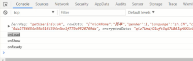

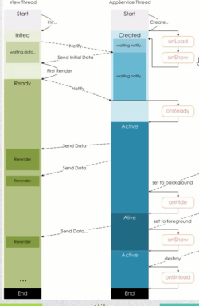

2. 初始化一些数据，以方便被wxml引用展示

   ​	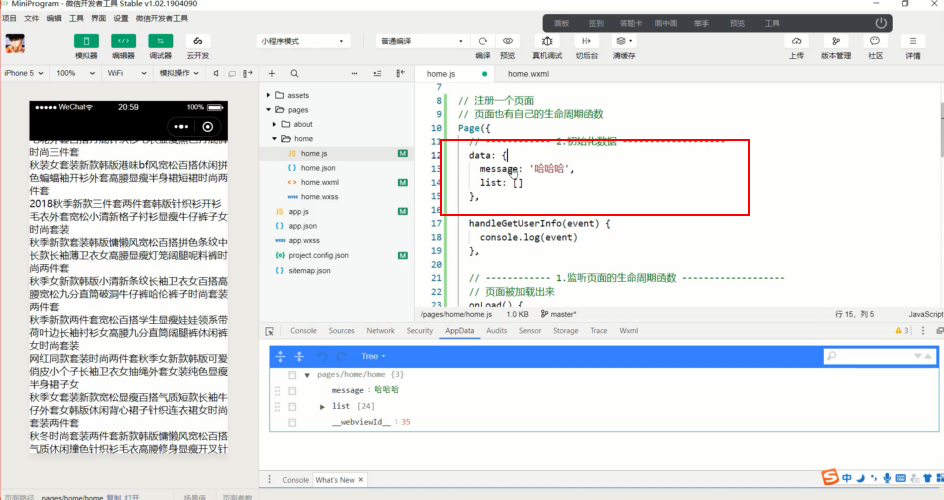

3. 监听wxml中的事件，绑定对应的事件函数；

   

4. 其他一些监听(比如页面滚动，上拉刷新，下拉加载更多等)；

   ​	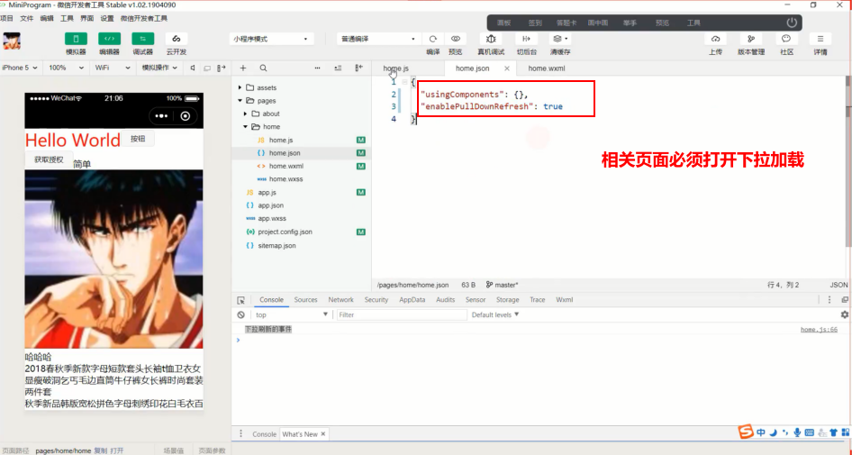

   ​	

   ​	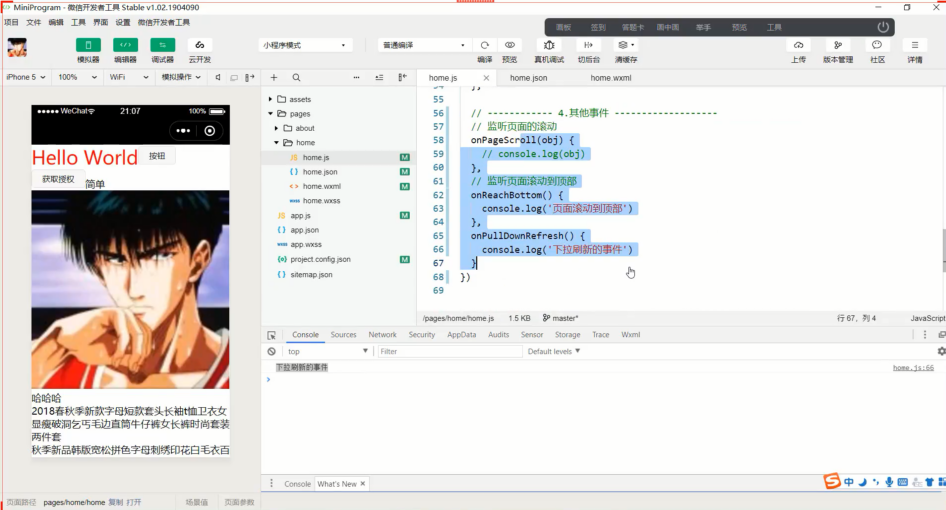

   

   ~~~javascript
    // 下拉刷新
     onPullDownRefresh(event){
       console.log('下拉刷新'+event);
     },
     //下拉加载更多
     onReachBottom(event){
       console.log('下拉加载更多'+event);
     },
     // 监听滚动
     onPageScroll(event){
       console.log('监听滚动'+event);
     }
   ~~~
   
   
   
   ​	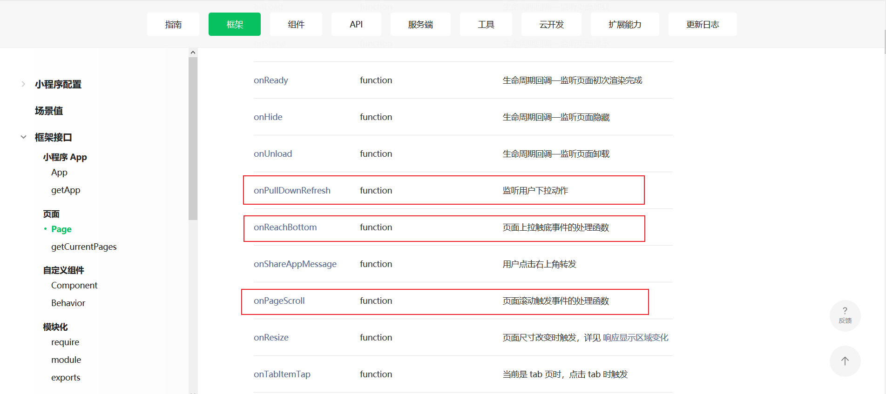
   
   

### Page实例生命周期图

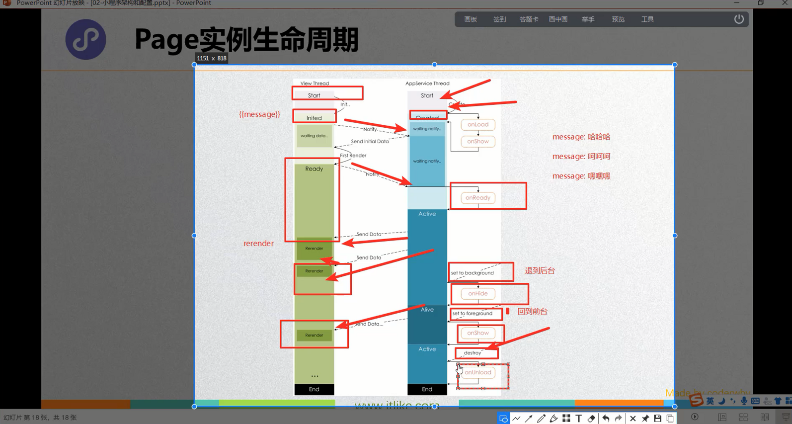

