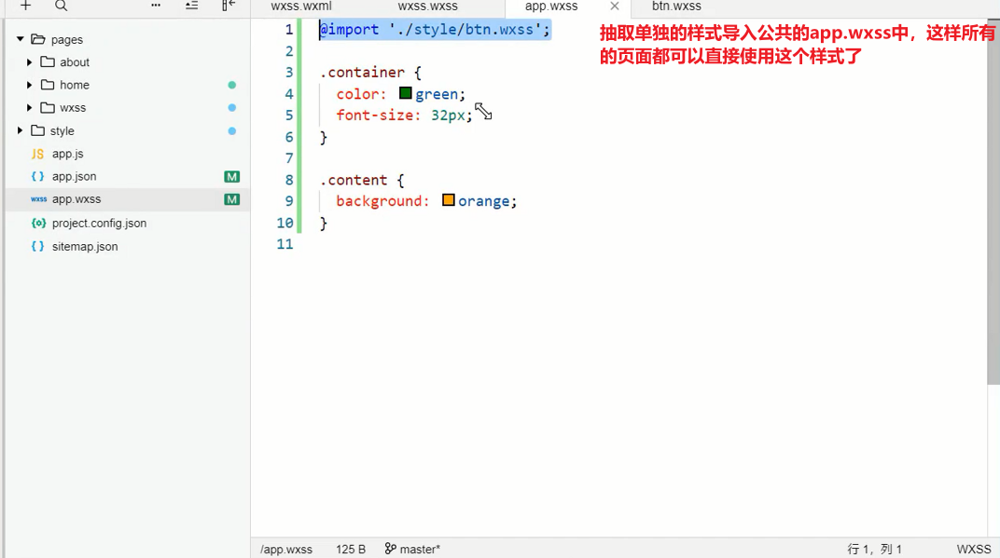
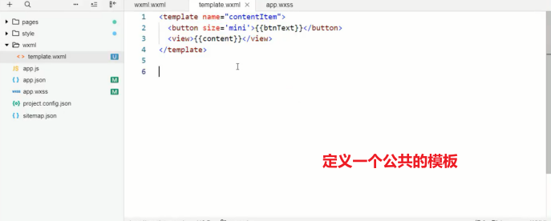

# 笔记

##  页面样式的写法

**页面样式的三种写法**

1. 行内样式

2. 页面样式

   ​	

3. 全局样式

   ​	

   

**样式优先级**

优先级依次是：行内样式>页面样式>全局样式

这里的优先级是建立在权重的角度上的，

## 支持的选择器

**权重**

## wxss的拓展 - 尺寸单位

**尺寸单位**

+ rpx(responsive pixel):可以根据屏幕宽度进行自适应。规定屏幕宽度为750px
+ 如在iphone6 上，屏幕宽度为375px,共有750个物理像素，则750rpx = 375px = 750物理像素，1rpx = 0.5px = 1物理像素

> 建议：开发微信小程序时设计师可以用iPhone6作为视觉稿的标准

## wxss的扩展 - 样式导入

**为什么使用样式导入**

+ 某些情况下，我们可能会将样式分在多个wxss文件中，方便对样式管理。
+ 这个时候，我们就可以使用样式导入，来让单独的wxss生效

**可以在一个wxss文件中导入另一个wxss文件**

+ 使用@import进行导入
+ @import后跟需要导入的外联样式表的相对路径（或者绝对路径也可以），用表示语句结束

**导入的位置在哪里**

+ 可以在app.wxss中导入这个样式  (所有页面都可以使用的公共样式)
+ 也可以在page.wxss导入这个样式（只可以在本页面使用的样式）

**页面样式抽取**

**页面样式导入**

**公共样式的抽取和导入**

## 官方样式库

为了减少开发者样式开发的工作量，小程序官方提供了WeUI.wxss基本样式库

[WeUI](https://github.com/Tencent/weui-wxss)

##  Mustache语法（一）

**wxml基本格式**

+ 类似于HTML代码:比如可以写成单标签，也可以写成双标签
+ 必须有严格的闭合：没有闭合会导致编译错误
+ 大小写敏感：class和Class是不同的属性

**开发中，界面上展示的数据并不是写死的，而是会根据服务器返回的数据，或者用户的操作来进行改变**

+ 如果使用原生的JS或者jQuery的话，我们需要通过操作DOM来进行界面的更新

+ 小程序和Vue/React一样，提供了插值语法：`Mustache语法（双大括号）`

  ​	

  ​        

  ​				

## Mustache语法（二）

+ Mustache语法不仅仅可以直接显示数据，也可以使用表达式

  ​	

+ 并且可以绑定到属性

  ​	

## 逻辑判断 wx:if - wx:elif - wx:else

**某些时候，我们需要根据条件来判断一些内容是否显示**

+ 当条件为true时候，view组件会渲染出来

+ 当条件为false时候，view组件不会渲染出来

  ​	

**根据按钮点击，决定是否渲染**

+ 显示

  ​	

**也可以有多个条件**

+ 显示

  ​	

## 逻辑判断补充二

**hidden属性**

+ hidden是所有的组件都默认拥有的属性

+ 当hidden属性值为true时候，组件会被隐藏

+ 当hidden属性值为false时候，组件会显示

  ​	

**hidden和wx:if的区别**

+ hidden控制隐藏和显示是控制是否添加hidden属性

+ wx:if是控制组件是否渲染

  ​	

  

  

## 列表渲染 - wx:for基础

**为什么使用wx:for**

+ 在实际开发中，服务器经常返回各种列表数据，我们不可能一一从列表中取出数据来进行显示；
+ 需要通过for循环的方式，遍历所有的数据，一次性进行展示

**在组件中，我们可以使用wx:for来遍历一个数组（字符串-数字）**

+ 默认情况下，遍历后在wxml中可以使用一个变量index,保存的是当前遍历数据的下标值。

+ 数组中对应某项的数据，使用变量名item获取

  ​	

## block标签

**什么是block标签？**

+ 某些情况下，我们需要使用wx:if或者wx:for时，可能需要包裹一组组件标签
+ 我们希望对这一组组件标签进行整体的操作，这个时候怎么办呢？

**解决办法**

+ 方式一，使用一个view组件包裹

  ​	

+ 方式二，使用block标签

  ​	

  

## block标签的意义

**注意**

+ \< block/\>并不是一个组件，，它仅仅是一个包装元素，不会在页面中做任何渲染，只接收控制属性。

**使用block的好处**

+ 将需要进行遍历或者判断的内容进行包裹。

+ 将遍历和判断的属性放在block便签中，不影响普通属性的阅读，提高代码的可读性。

+ 补充提交，因为block不会被渲染，所以它的性能比view要高

  

## 列表渲染 - item/index 名称

**默认情况下，item - index 的名字是固定的**

+ 但是某些情况下，我们可能想使用其他名称
+ 或者当出现多层遍历时，名字会重复

**这个时候，我们就可以指定item和index的名称**

+ 如图

  ​	

+ 常见于遍历多层数组，例如二维数组等的时候，重新给item，index取名字

  ​	

  ​	

  

## 列表渲染 - key的作用

**我们看到，使用wx:for时，会报一个警告**

这个提示告诉我们，可以添加一个key来提供性能

**为什么需要key属性呢（了解）？**

+ 如图所示

  ​	

## 模板用法

WXML提供了模板(template),可以在模板中定义代码片段，在不同的地方调用。（是一种wxml代码的复用机制）

使用`name属性` ，作为模板的名字，然后再\<template/\>内定义代码片段。

+ 之前的时候小程序不支持自定义组件，为了进行代码的复用，会使用模板：template。
+ 模板中包裹的内容，在没有被使用前，是不会进行任何的渲染的。

## wxml引入

目的：在上面的模板中可以知道模板只能在一个页面中使用，但是有的时候，我们希望模板能够是公共的，也就是在很多页面都能够被使用，此时我们必须把模板抽取放到公共的wxml中，然后通过如下两种方式引入。

**定义一个公共的模板**

**在wxml.wxml页面中引入**

**在home.wxml页面中引入**

小程序wxml中提供了两种引入文件的方式：import和include

### impot导入

`import引入`：import可以在该文件中使用目标文件定义的template

比如下面的演练：

+ 在item.wxml中定义一个item的template

+ 在home.wxml中引入，并且使用template

  

> 注意：wxml中不能递归引入（也就是A引入了B的templatae,不会引入B中引入C的template）

### include导入

**include可以将目标文件中除了\<template/\> \<wxs\\>外的整个代码引入，相当于是拷贝到include位置**

如果页面中有很多部分的wxml代码可以复用，则提取出来，放到公共的wxml文件中，通过include可以将其引入到其他需要的页面中。不同于import，include可以进行循环导入。

### 两种方式导入总结

+ import导入

  1. 主要是导入template
  2. 特点：不能进行递归导入

+ include导入

  1. 将公共的wxml中的组件抽取到一个文件中

  2. 特点：不能导入template.wxs,可以进行递归导入

     

## wxs模块

`wxs(WeiXin Script)` 是小程序的一套脚本语言，结合WXML，可以构建出页面的结构。

+ 官方：WXS 与javascript是不同的语言，有自己的语法，并不和Javascript一致（不过基本一致）。

**为什么设计WXS语言**

+ 在WXML中是不能直接调用Page/Component中定义的函数的。
+ 但是在某些情况下，我们可以希望使用函数来处理WXML中的数据（类似于Vue中的过滤器），这个时候就要使用WXS了。

**WXS使用的限制和特点**

+ WXS的运行环境和其他JavaScript代码是隔离的，WXS中不能调用其他JavaScript文件中定义的函数，也不能调用小程序提供的API。
+ WXS函数不能作为组件的事件回调。
+ 由于运行环境的差异，在iOS设备上小程序内的WXS会比JavaScript代码块2~20倍。在android设备上二者运行效率无差异。

## WXS的写法

**WXS有两种写法**

+ 写在`<wxs>`标签中
+ 写在以 `.wxs`结尾的文件中
+ wxs中不支持ES6语法，支持ES5语法
+ **wxs的引入必须要使用相对路径**

**\<wxs\>标签的属性**

| 属性名 | 类型   | 默认值 | 说明                                                         |
| ------ | ------ | ------ | ------------------------------------------------------------ |
| module | String |        | 当前 `<wxs>`标签的模块名，必填字段                           |
| src    | String |        | 引用 `.wxs`文件的相对路径，仅当本标签为**单闭合标签**或者 **标签的内容为空**时有效 |

## WXS的简单演练

**格式化数字**

~~~javascript
function fix(price,num){
    var number = num || 2;
    var price = price || '0'
    var f_price = parseFloat(price);
    console.log('f_price:',f_price);
    return f_price.toFixed(number);
}
console.log(fix(2));//2.00
console.log(fix(2,2));//2.00
console.log(fix('2',2));//2.00
console.log(fix('',2));//0.00
console.log(fix('',5));//0.00000
~~~

## WXS练习

红色的字体颜色

