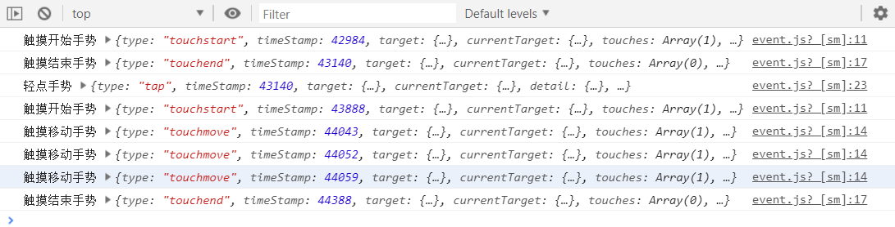
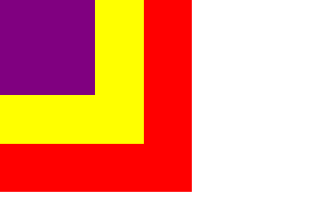
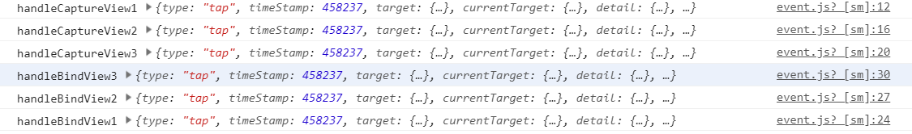
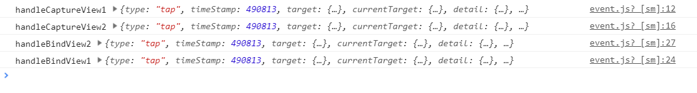
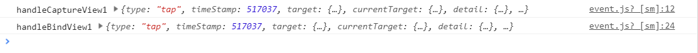
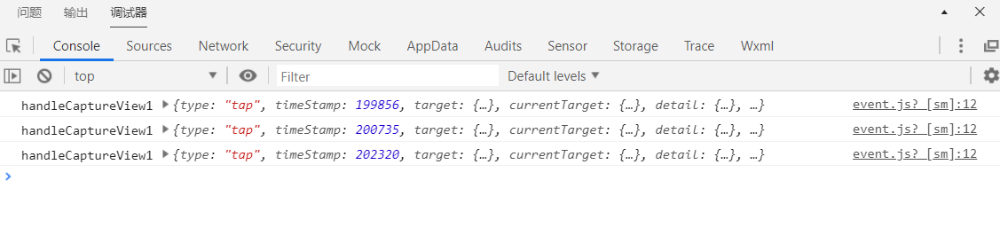

# 笔记

## 事件介绍

**事件产生**

+ 小程序需要经常和用户进行某种交互，比如点击界面上的某个按钮或者区域，比如滑动了某个区域；
+ 这些交互都会产生各种各样的事件

**事件时如何处理**

+ 事件是通过bind/catch这个属性绑定在组件上的（和普通的属性写法很相似，以key = 'value'形式）；
+ key以bind或者catch开发，从1.5.0版本开始，可以在bind或catch后面添加一个冒号：
+ 同时在当前页面的Page构造器中定义对应的事件处理函数tapName,如果没有对应的函数，触发事件时会报错
+ 当用户点击该button区域时，达到触发条件生成事件tap,该事件处理函数tapName会被执行，同时还会收到一个事件对象event

## 事件简单演练

~~~html
<!--home.wxml-->
<button size="mini"
        bindtap="onBtnTap"
        data-name="Solon">
    按钮
</button>
~~~

~~~javascript
// home.js
Page({
    data:{
        message:'微信'
    }，
    onBtnTap(e){
    console.log("按钮点击:",e)
}
})
~~~

## 常见事件类型

**某些组件**会有自己特性的事件类型

+ 比如input有bindinput / bindfocus等
+ 比如scroll-view有bindscrolltowpper / bindscrolltolower等

**这里列出几个组件都有的，并且比较常见的事件类型**

| 类型        | 触发条件                                                     |
| ----------- | ------------------------------------------------------------ |
| touchstart  | 手指触摸动作开始                                             |
| touchmove   | 手指触摸后移动                                               |
| touchcancel | 手指触摸动作被打断，如来电提醒，弹窗                         |
| touchend    | 手指触摸动作结束                                             |
| tap         | 手指触摸后马上离开                                           |
| longpress   | 手指触摸后，超过350ms再离开，如果指定了事件回调 函数并且触发了这个事件，tap事件将不再触发 |
| longtap     | 手指触摸后，超过350ms再离开（推荐使用longpress替代）         |

## 事件类型演练

~~~html
<!--home.wxml-->
<view bind:touchstart = "onTouchStart"
      bind:touchmove = "onTouchMove"
      bind:touchend = "onTouchEnd"
      bind:touchcancel = "onTouchCancel"
      bind:tap = "onTap"
      bind:longpress = "onLongPress">
    常见手势类型
</view>
~~~

~~~javascript
// home.js
Page({
    data:{},
    onTouchStart(e){
       console.log('触摸开始手势',e)
    },
    onTouchMove(e){
       console.log('触摸移动手势',e)
    },
    onTouchEnd(e){
      console.log('触摸结束手势',e)
    },
    onTouchCancel(e){
        console.log('触摸取消手势',e)
    },
    onTap(e){
        console.log('轻点手势',e)
    },
    onLongPress(e){
        console.log('长按手势',e)
    }
})
~~~

**两个注意点**

+ Touchcancle:在特定场景下才会触发（比如来电打断）。

+ tap事件和longpress事件通常只会触发其中一个。

## 事件对象介绍

**当某个事件触发时，会产生一个事件对象**，并且这个对象被传入到回调函数中，事件对象有哪些常见的属性呢？

| 属性           | 类型    | 说明                                         |
| -------------- | ------- | -------------------------------------------- |
| type           | String  | 事件类型                                     |
| timeStamp      | Integer | 页面打开到触发事件所经历的毫秒数             |
| target         | Object  | 触发事件的组合的一些属性值集合               |
| currentTarget  | Object  | 当前组件的一些属性值集合                     |
| detail         | Object  | 额外的信息                                   |
| touches        | Array   | 触摸事件，当前停留在屏幕中的触摸点信息的数组 |
| changedTouches | Array   | 触摸事件，当前变化的触摸点信息的数组         |

### touches和changedTouches的区别

1. 在touchend中不同

2. 多手指触摸时不同

   touches记录当前屏幕中触摸点的个数，以及触摸点对应的一些信息，而changedTouches,则为新曾触摸点后记录变化的触摸点信息，例如当开始有一根手指触摸屏幕，此时touches中的数组保存了这一个触摸点信息，而changedTouch为一个空数组，当再添加一根手指的时候，此时touches为数组保存了两个触摸点信息，而changedTouches中只保存了新添加的触摸点信息。当触发touchend事件的时候，此时屏幕没有触摸点，此时touches为空数组，而changedTouches中保存了两个失去触摸点的信息。

### currentTarget和target的区别

**不同点**

1. currentTarget：为触发事件的view,例如子元素冒泡到父元素，此时父元素事件对象中的currentTarget就是父元素。

2. target：产生事件的view,例如子元素冒泡到父元素中，此时父元素事件对象中currentTarget就是父元素，而target就是子元素

   ​			  此时，对于子元素的事件对象而言，无论是currentTarget还是target均指向它自己，这就是currentTarget和target的区

   ​			 别。

## 事件参数的传递

当视图层发生事件时，某些情况需要事件携带一些参数到执行的函数中，这个时候就可以通过data-属性来完成：

格式：data-属性的名称

获取：e.currentTarget.dataset.属性的名称

### 参数传递的练习

## 事件冒泡和事件捕获

当界面产生了一个事件时，事件分为了事件捕获阶段和事件冒泡阶段

### 代码演练

### 事件捕获与冒泡

event.wxml

~~~html
<!--pages/event/event.wxml-->
<!--事件冒泡和事件捕获-->
<!--事件捕获必须采取 capture-bind这种形式-->
<!--bind:一层一层传递-->
<!--catch:阻止事件的进一步传递，事件一旦被捕获之后,就不会继续往下传-->
<view class="view1" capture-bind:tap = "handleCaptureView1" bind:tap="handleBindView1">
    <view class="view2" capture-bind:tap = "handleCaptureView2" bind:tap="handleBindView2">
        <view class="view3" capture-bind:tap = "handleCaptureView3" bind:tap="handleBindView3"></view>
    </view>
</view>
~~~

event.wxss

~~~css
/* pages/event/event.wxss */
.view1{
  width: 400rpx;
  height: 400rpx;
  background-color: red;
}
.view2{
  width: 300rpx;
  height: 300rpx;
  background-color: yellow;
}
.view3{
  width: 200rpx;
  height: 200rpx;
  background-color: purple;
}
~~~

event.js

~~~javascript
// pages/event/event.js
Page({

  /**
   * 页面的初始数据
   */
  data: {

  },
  // 事件捕获
  handleCaptureView1(e){
    console.log("handleCaptureView1",e);
    
  },
  handleCaptureView2(e){
    console.log("handleCaptureView2",e);
    
  },
  handleCaptureView3(e){
    console.log("handleCaptureView3",e);
  },
  // 事件冒泡
  handleBindView1(e){
    console.log("handleBindView1",e);
  },
  handleBindView2(e){
    console.log("handleBindView2",e);
  },
  handleBindView3(e){
    console.log("handleBindView3",e);
  },
})
~~~

| 操作       | 结果                                                         |
| ---------- | ------------------------------------------------------------ |
| 点击紫色块 |  |
| 点击黄色块 |  |
| 点击红色块 |  |

### 阻止事件捕获

~~~html
<!--利用catch可以阻止事件捕获 如 capture-catch:tap-->
<view class="view1" capture-catch:tap = "handleCaptureView1" bind:tap="handleBindView1">
    <view class="view2" capture-bind:tap = "handleCaptureView2" bind:tap="handleBindView2">
        <view class="view3" capture-bind:tap = "handleCaptureView3" bind:tap="handleBindView3"></view>
    </view>
</view>
~~~

| 操作                           | 结果                                                         |
| ------------------------------ | ------------------------------------------------------------ |
| 分别点击紫色块，黄色块，红色块 |  |

### 阻止事件冒泡

~~~html
<!--事件冒泡和事件捕获-->
<!--事件捕获必须采取 capture-bind这种形式-->
<!--bind:一层一层传递-->
<!--catch:阻止事件的进一步传递，事件一旦被捕获之后,就不会继续往下传-->
<view class="view1" capture-bind:tap = "handleCaptureView1" bind:tap="handleBindView1">
    <!--在冒泡阶段阻止事件继续冒泡，因该采用catch而不是bind-->
    <view class="view2" capture-bind:tap = "handleCaptureView2" catch:tap="handleBindView2">
        <view class="view3" capture-bind:tap = "handleCaptureView3" bind:tap="handleBindView3"></view>
    </view>
</view>
~~~

