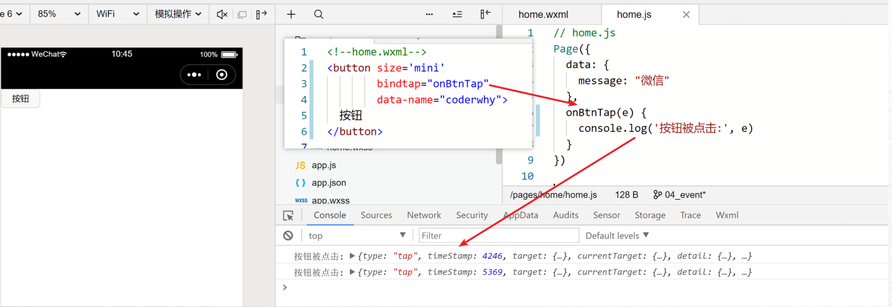
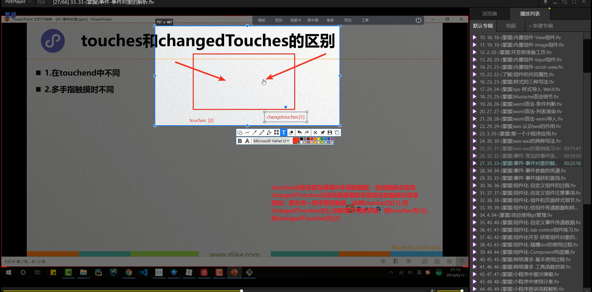
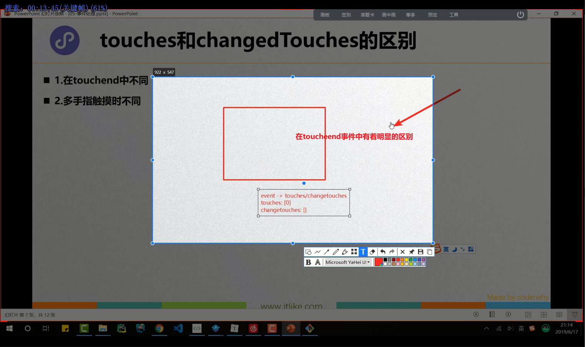

# 笔记

## 事件介绍

**事件产生**

+ 小程序需要经常和用户进行某种交互，比如点击界面上的某个按钮或者区域，比如滑动了某个区域；
+ 这些交互都会产生各种各样的事件

**事件时如何处理**

+ 事件是通过bind/catch这个属性绑定在组件上的（和普通的属性写法很相似，以key = 'value'形式）；
+ key以bind或者catch开发，从1.5.0版本开始，可以在bind或catch后面添加一个冒号
+ 同时在当前页面的Page构造器中定义对应的事件处理函数tapName,如果没有对应的函数，触发事件时会报错
+ 当用户点击该button区域时，达到触发条件生成事件tap,该事件处理函数tapName会被执行，同时还会收到一个事件对象event

## 事件简单演练

## 常见事件类型

**某些组件**会有自己特性的事件类型

+ 比如input有bindinput / bindfocus等
+ 比如scroll-view有bindscrolltowpper / bindscrolltolower等

**这里列出几个组件都有的，并且比较常见的事件类型**

| 类型        | 触发条件                                                     |
| ----------- | ------------------------------------------------------------ |
| touchstart  | 手指触摸动作开始                                             |
| touchmove   | 手指触摸后移动                                               |
| touchcancel | 手指触摸动作被打断，如来电提醒，弹窗                         |
| touchend    | 手指触摸动作结束                                             |
| tap         | 手指触摸后马上离开                                           |
| longpress   | 手指触摸后，超多350ms再离开，如果指定了事件回调 函数并且触发了这个事件，tap事件将不再触发 |
| longtap     | 手指触摸后，超过350ms再离开（推荐使用longpress替代）         |

## 事件类型演练

**两个注意点**

+ Touchcancle:在特定场景下才会触发（比如来电打断）。

+ tap事件和longpress事件通常只会触发其中一个。

## 事件对象介绍

**当某个事件触发时，会产生一个事件对象**，并且这个对象被传入到回调函数中，事件对象有哪些常见的属性呢？

| 属性           | 类型    | 说明                                         |
| -------------- | ------- | -------------------------------------------- |
| type           | String  | 事件类型                                     |
| timeStamp      | Integer | 页面打开到触发事件所经历的毫秒数             |
| target         | Object  | 触发事件的组合的一些属性值集合               |
| currentTarget  | Object  | 当前组件的一些属性值集合                     |
| detail         | Object  | 额外的信息                                   |
| touches        | Array   | 触摸事件，当前停留在屏幕中的触摸点信息的数组 |
| changedTouches | Array   | 触摸事件，当前变化的触摸点信息的数组         |

### touches和changedTouches的区别

1. 在touchend中不同
2. 多手指触摸时不同

### currentTarget和target的区别

## 事件参数的传递

当视图层发生事件时，某些情况需要事件携带一些参数到执行的函数中，这个时候就可以通过data-属性来完成：

格式：data-属性的名称

获取：e.currentTarget.dataset.属性的名称

### 参数传递的练习

## 事件冒泡和事件捕获

当界面产生了一个事件时，事件分为了事件捕获阶段和事件冒泡阶段

### 代码演练

