# 笔记

## 什么是组件化开发

> 复杂问题的处理方式

1. 一个人处理信息的逻辑能力是有限的
2. 面对复杂问题，不大可能一次性解决一大推的问题
3. 将问题进行拆解
4. 复杂问题拆解成一个一个小问题处理，再将其放在整体中，大问题迎刃而解。

> 组件化也是类似的思路

1. 如果我们将一个页面中所有的处理逻辑全部放在一起，处理起来会变得很复杂，而且不利于后续的管理和拓展
2. 将页面拆成一个个小的功能块，每个功能块完成属于自己的这部分的独立的功能，那么之后，整个页面的管理和维护就变得非常容易了。

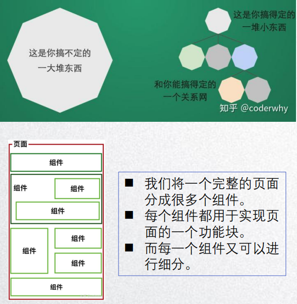

## 小程序组件化思想

+ **小程序在刚开始推出时是不支持组件化的，也是为人诟病的一个点**
+ **但是从v1.6开始，小程序开始支持自定义组件开发，也让我们更加方便的在程序中使用组件化**

**组件化思想的应用**

1. 有了组件化的思想，我们在之后的开发中就要充分的利用它。

2. 尽可能的将页面拆成一个个小的、可复用的组件。
3. 这样让我们的代码更加方便组织和管理，并且扩展性也更强

**所以组件是目前小程序开发中，一个非常重要的一个篇章，要认真学习。**

## 创建一个自定义组件

类似于页面，自定义组件由 json、wxml、wxss、js四个部分组成。

**准备**

1. 先在根目录下面创建一个文件夹，components,里面存放我们之后自定义的公共组件
2. 常见的一个自定义组件 my-cpn:包含对应的四个文件

**自定义组件的步骤**

1. 首先需要在js文件中进行自定义组件生命(将component字段设为true 可将这一组文件设置为自定义组件)
2. 在wxml中编写属于我们组件自己的模板
3. 在wxss中编写属于我们组件自己的相关样式
4. 在js文件中，可以定义数据或数组内部的相关逻辑(后续我们再使用)

**简单示例：**配置一个组件

index.json

~~~json
// components/my-cpn/my-cpn.json
{
  "component": true,
  "usingComponents": {}
}
~~~

index.wxml

~~~html
<!--components/my-cpn/my-cpn.wxml-->
<text>components/my-cpn/my-cpn.wxml \n</text>

<text class="title">我是自定义组件的标题</text>
<view class="content" id="info">我是自定义组件的内容</view>
~~~

index.wxss

~~~css
/* components/my-cpn/my-cpn.wxss */
.title{
  color:red;
  font-size: 50rpx;
  font-weight: 700;
}
.content{
  color:purple;
  font-size: 40rpx;
  font-weight: 700;
}
~~~

index.js

~~~javascript
// components/my-cpn/my-cpn.js
Component({
  /**
   * 组件的属性列表
   */
  properties: {

  },
  /**
   * 组件的初始数据
   */
  data: {
  },
  /**
   * 组件的方法列表
   */
  methods: {
  }
})
~~~

**简单示例:**使用一个组件

在home页面中使用已经配置好了的组件

~~~json
// home.json中注册自定义的组件
// pages/home/home.json
{
    "usingComponents":{
        // key为my-cpn为组件在页面中使用的名称，可以起别名，value可以为绝对路径也可以为相对路径
        "my-cpn":"/components/my-cpn/my-cpn"
    }
}
// 起别名
{
  "usingComponents": {
    "compo-1":"/components/my-cpn/my-cpn"
  }
}
~~~

在home.wxml中直接使用组件

~~~html
<!--pages/home/home.wxml-->
<text class="title">Hello World</text>
<button size="mini">按钮</button>

<!--1.使用自定义的组件,既可以使用单标签也可以使用双标签-->
<my-cpn/>

<!--使用别名->
<!--pages/login/login.wxml-->
<text>pages/login/login.wxml</text>
<text>-----测试自定义组件一：基础-------</text>
<compo-1/>
~~~

**结果:**

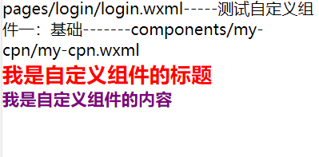

## 使用自定义组件和细节注意事项

**一些需要注意的细节**

+ 因为WXML节点标签名只能是小写字母、中划线和下划线的组合，所以定义组件的标签名也只能包含这些字符（测试发现还可以使用数字）。

+ 自定义组件也是可以引用自定义组件的，引用方法类似于页面引入自定义组件的方式（使用usingComponents字段）。

  **自定义组件引入其他的自定义组件示例：**

  1. 先在自定义组件中注册其他的自定义组件

     my-cpn.json中注册

     ~~~json
     
     {
       "component": true,
       "usingComponents": {
          // 在组件中引入其他组件也需要注册
         "cpn2":"/components/cpn2/cpn2"
       }
     }
     ~~~

  2. my-cpn.wxml页面中使用

     ~~~html
     
     <!--components/my-cpn/my-cpn.wxml-->
     <text>components/my-cpn/my-cpn.wxml \n</text>
     
     <text class="title">我是自定义组件的标题</text>
     <view class="content">我是自定义组件的内容</view>
     <!--在组件页面中使用其他的组件，可以是单标签，也可以是双标签-->
     <cpn2/>
     ~~~

  

+ 自定义组件和页面所在项目根目录不能以wx-为前缀，否则会报错

+ 如果app.json的usingComponents声明某个组件，那么所有页面和组件可以直接使用该组件。也就是可以设置全局组件

  **在app.json中配置全局组件**

  ~~~json
// 在app.json中注册了组件之后，那么在其他页面就不需要再次注册了，可以直接在页面上使用
  {
  "pages": [
      "pages/main/main",
      "pages/template/template",
      "pages/login/login",
    ],
    "usingComponents":{
      "my-cpn":"/components/my-cpn/my-cpn"
    },
    "sitemapLocation": "sitemap58.json"
  }
  ~~~
  
  
  
  **在page页面中直接使用**
  
  ~~~html
  <!--pages/main/main.wxml-->
  <text>你好啊 main</text>
  <my-cpn/>
  ~~~
  
  

## 组件的样式细节

1. 组件内的样式对外部样式的影响
   + 结论一：组件内的class样式，只对组件wxml内的节点生效，对于引用组件的Page页面不生效
   + 结论二：组件内不能使用ID选择器、属性选择器、标签选择器 

2. 外部样式对组件内部样式的影响
   + 结论一：外部使用class的样式，只对外部wxml的class生效，对组件内不是生效的
   + 结论二：外部使用了id选择器，属性选择器不会对组件内产生影响
   + 结论三：外部使用了标签选择器，会对组件内产生影响。(很奇怪，测试的时候发现确实如此。微信小程序为什么如此设计呢？)
3. 整体结论
   + 组件内的class样式和组件外的class样式，默认是有一个隔离效果的
   + 为了防止样式的错乱，官方不推荐使用id、属性、标签选择器（所以微信小程序一般推荐使用类选择器么？）

## 样式的相互影响

**如何让class可以相互影响**

在Component对象中，可以传入一个options属性，其中options属性中有一个stylesolation(隔离)属性。stylelsolation有三个取值。

+ isolated表示启用样式隔离，在自定义组件内外，使用class指定的样式将不会相互影响（默认取值）。

+ apply-shared表示页面wxss样式将影响到自定义组件，但是自定义组件wxss中指定的样式不会影响页面。

+ shared 表示页面wxss样式将影响到自定义组件，而自定义组件wxss中指定的样式也会影响页面和其他设置。

  在微信小程序有App({})，在页面有Page({})，在组件中有Component({})构造函数

  ~~~javascript
  Component({
      options:{
          styleIsolation: "isolated"
      }
  })
  ~~~

  

+ 其他一些样式相关细节，参考官网。

这个用的一般不多，我们的页面和组件一般是不受彼此的样式的影响的，否则，组件独立出来干什么呢？耦合性太高了。完全没有必要，而且组件有可能是被复用的，不同页面情况不同。感觉一个页面的标签样式可以影响组件就已经比较奇怪了。再出来这个？或许比较复杂的业务会用到。

## 组件和页面通信

**很多时候，组件内展示的内容（数据，样式，标签），并不是在组件内写死的，而且可以由使用者来决定。**

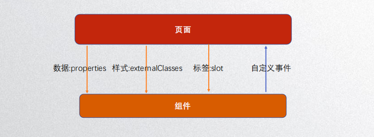

### 向组件内传递数据 - properties

**给组件传递数据**

+ 大部分情况下，组件只负责布局和样式，内容是由使用组件的对象决定的
+ 所以，我们经常需要从外部传递数据给我们的组件，让我们的组件来进行展示，如何传递呢？

+ 使用properties属性

**支持类型**

+ String、Number、Boolean。
+ Object、Array、null(不限制类型)

**使用步骤**

1. 在Page页面引入组件时传入参数

   ~~~html
   <!--pages/login/login.wxml-->
   <my-props title= "标题"
   		  content="内容，哈哈哈"
   		  counter="{{123}}"
   </my-props>
   ~~~

2. 组件的my-cpn.js文件中配置接收传入的参数

   ~~~javascript
   <!--components/my-props/my-props.js-->
   Component({
       properties:{
           title:String,
           content:{
               type：String,
               // value为设置默认值
               value:'',
           },
           counter:{
               type:Number,
               value:0,
               // 实时监听counter值的变化，并将变化之前的值，和变化之后的值返回出来
               observer:function(newVal,oldVal){
                   console.log(newVal,oldVal)
               }
           }
       }
   })
   ~~~

   

3. 组件中显示页面传递过来的参数

   ~~~html
   <!--components/my-props/my-props.wxml-->
   <view>
       <view>title:{{title}}</view>
       <view>content:{{content}}</view>
       <view>counter:{{counter}}</view>
   </view>
   ~~~

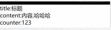

### 向组件传递样式 -externalClasses

**向组件传递样式**

+ 有时候，我们不希望将样式在组件内固定不变，而是外部可以决定样式
+ 这个时候，我们可以使用externalClass属性:
  + 在Component对象中，定义externalClasses属性
  + 在组件内的wxml中使用externalClass属性的class
  + 在页面中传入对应的class，并且给这个class设置样式。

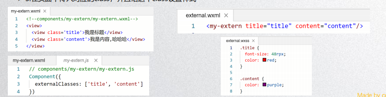

**使用步骤**

1. 在Page页面传递类样式

   ~~~css
   /* pages/login/login.wxss */
   .title{
     font-size:50rpx;
     color:red;
   }
   .content{
     color:purple;
   }
   ~~~

   ~~~html
   <!--pages/login/login.wxml-->
   <my-extern title="title" content="content" />
   ~~~

2. 在component中配置接收类样式

   ~~~javascript
   //components/my-extern/my-extern.js
   Component({
    externalClasses:['title','content']
   })
   ~~~

3. 在component中使用传递过来的参数

   ~~~html
   <!--components/my-extern/my-extern.wxml-->
   <text>components/my-extern/my-extern.wxml</text>
   <view class="title">我是组件的标题</view>
   <view class="content">我是组件的内容</view>
   ~~~

   

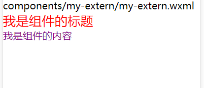

### 组件向外传递事件 - 自定义事件

**有时候是自定义组件内部发生了事件，需要告知使用者，这个时候可以使用自定义事件：**

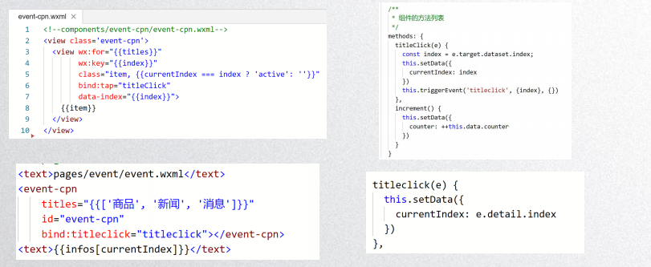

**使用步骤**

1. 在component中配置组件的事件中

~~~html
<!--components/my-event/my-event.wxml-->
<button size="mini" bind:tap="handleIncrement" id="zw" data-name="silly">点击按钮+1</button>
~~~

2. 在component中将组件的事件发射出去

~~~javascript
// components/my-event/my-event.js
Component({
   methods: {
    handleIncrement(event){
      this.triggerEvent("increment",{event:event},{})
    }
  }
})
~~~

3. 在Page页面中接收组件发射出去的事件

~~~html
<!--// pages/login/login.wxml-->
<!--组件内部发出事件-->
<view>当前计数:{{counter}}</view>
<my-event bind:increment = "handleIncrement" />
~~~

4. 在Page的js中处理接收到的事件

~~~javascript
// pages/login/login.js
Page({
    data:{
        counter:0
    },
    handleIncrement(event){
        console.log(event)
        this.setData({
            counter: this.data.counter + 1
        })
    }
})
~~~

#### 自定义组件练习-tab切换

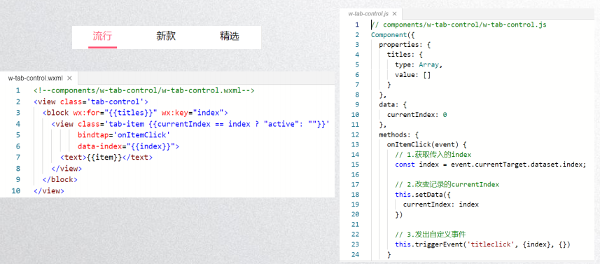

**代码步骤**

1. 处理Component组件

   **my-tab.wxss样式**

   ~~~css
   /* components/my-tab/my-tab.wxss */
   .tab{
     width: 100%;
     height: 60rpx;
     display: flex;
     text-align: center;
   }
   .tab-item{
     flex: 1;
   }
   .active{
     color:red;
   }
   .active .title{
     border-bottom: 6rpx solid red;
     padding:10rpx 20rpx;
   }
   ~~~

   **my-tab.wxml结构**

   ~~~html
   <!--components/my-tab/my-tab.wxml-->
   <view class="tab">
   <block wx:for="{{tabList}}" wx:key="item">
   <view class="tab-item {{ currentIndex === index ? 'active':''}}" 
         data-tabindex="{{index}}"
         bind:tap="tabChange">
         <text class="title">{{item}}</text></view>
   </block>
   </view>
   ~~~

   **my-tab.js交互**

   ~~~javascript
   // components/my-tab/my-tab.js
   Component({
     /**
      * 组件的属性列表
      */
     properties: {
       tabList:{
         type:Array,
         value:[],
         observer:function(newVal,oldVal){
           console.log(newVal);
         }
       }
     },
     /**
      * 组件的初始数据
      */
     data: {
       currentIndex:0
   
     },
     /**
      * 组件的方法列表
      */
     methods: {
       tabChange(event){
         var index = event && event.currentTarget.dataset.tabindex
         this.setData({
           currentIndex : index
         })
         // 将点击的元素索引，以及标题发送给Page页面
         this.triggerEvent('itemClick',{index:index,title:this.properties.tabList[index]},{})
       }
     }
   })
   ~~~

2. 处理Page页面

   **main.json注册组件**

   ~~~json
   // pages/main/main.json
   {
     "usingComponents": {
       "my-tab":"/components/my-tab/my-tab"
     }
   }
   ~~~

   

   **main.wxml结构**

   ~~~javascript
   <!--pages/main/main.wxml-->
   <text>你好啊 main</text>
   <!-- <my-cpn/> -->
   <my-tab tabList = "{{tabList}}" bind:itemClick = "handleClick"/>
   ~~~

   **main.js交互**

   ~~~javascript
   // pages/main/main.js
   Page({
     /**
      * 页面的初始数据
      */
     data: {
       tabList:['流行','新款','精选','潮流']
     },
     handleClick(event){
       console.log(event);
     },
   })
   ~~~

  **结果**

| 渲染结果                                                     | 传递数据                                                     |
| ------------------------------------------------------------ | ------------------------------------------------------------ |
| 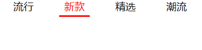 | 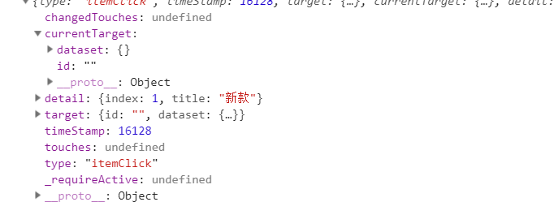 |

## 页面直接调用组件方法

**this.selectComponent**

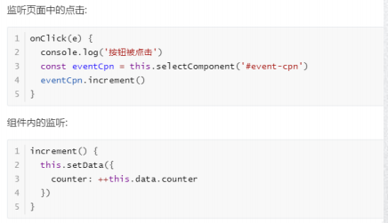

**使用selectComponent获取组件对象**

1. 直接通过组件对象来修改组件的数据

~~~javascript
// 在Page.js中直接通过选择器来获取对应的Page.wxml页面的组件对象
handleIncrementCpn(){
    // 1.获取组件对象
    const my_sel = this.selectComponent(".sel-class")
    console.log(my_sel);
    // 2.通过setData修改组件中的数据,这种方式可行，但是不符合规范，一般不建议采用
    my_sel.setData({
        counter: my_sel.data.counter + 20
    })
    
}
~~~

2. 通过组件的方法来修改组件的数据

~~~javascript
// components/my-tab/my-tab.js
Component({
  /**
   * 组件的初始数据
   */
  data: {
    counter:0
  },
  /**
   * 组件的方法列表
   */
  methods: {
   incrementCounter(num){
       this.setData({
           counter : this.data.counter + num;
       })
   }
  }
})
~~~

~~~javascript
// 在Page.js中直接通过选择器来获取对应的Page.wxml页面的组件对象
handleIncrementCpn(){
    // 1.获取组件对象
    const my_sel = this.selectComponent(".sel-class")
    console.log(my_sel);
    // 2.通过方法对数据进行修改
    my_sel.incrementCounter(10)
}
~~~

## 什么是插槽

**slot翻译为插槽**

+ USB插槽
+ 让设备具备更多的扩展性
+ 例如电脑的USB可以插入U盘、硬盘、手机、音响、键盘、鼠标等等

**组件的插槽**

+ 组件的插槽也是为了让我们封装的组件更具有拓展性
+ 让使用者可以决定组件内部的一些内容到底显示什么

**移动网站中的导航栏**

+ 移动开发都有导航栏
+ 导航栏我们必然封装一个插件，比如 nav-bar组件
+ 一旦由了这个组件，我们就可以在多个页面中复用了

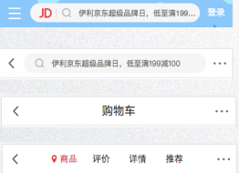

### 单个插槽的使用

**除了内容和样式可能由外界决定之外，也可能外界想决定显示的方式**

+ 比如我们有一个组件定义了头部和尾部，但是中间的内容可能是一段文字，也可能是一张图片，或者是一个鸡进度条

+ 在不确定外界想插入什么其他组件的前提下，我们可以在组件中预留插槽。

  

  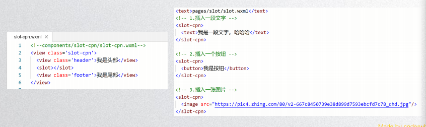
  
  
  **组件中插槽的使用**

        ~~~html
<!--components/slot-cpn/slot-cpn.wxml-->
<view>
    <view class="header">我是头部</view>
    <!--使用插槽-->
    <slot></slot>
    <view class="footer">我是尾部</view>
</view>
        ~~~

​     **页面中插槽的使用**

~~~html
<text>pages/slot/slot.wxml</text>
<!--插入一段文字-->
<slot-cpn>
    <text>我是一段文字</text>
</slot-cpn>
<!--插入一个按钮-->
<slot-cpn>
    <button>我是一个按钮</button>
</slot-cpn>
<!--插入一张图片-->
<slot-cpn>
    <image src="...jpg"/>
</slot-cpn>
~~~

### 多个插槽的使用

有时候为了让组件更加灵活，我们需要定义多个插槽

**使用步骤**

1. 在component.js文件中配置多插槽

   ~~~json
   Component({
       options:{
           // 必须先配置，才可以使用多插槽，注意与单插槽做区分
           multipleSlots:true
       }
   })
   ~~~

2. 在component.wxml中配置多个插槽

   ~~~html
   <view class="mslot-cpn">
       <view class="left item"><slot name="left"></slot></view>
       <view class="center item"><slot name="center"></slot></view>
       <view class="right item"><slot name="right"></slot></view>
   </view>
   ~~~

3. 在Page.wxml页面中使用插槽

   ~~~html
   <mslot-cpn>
       <text slot="left">哈哈</text>
       <text slot="right">呵呵</text>
       <text slot="center">嘿嘿</text>
   </mslot-cpn>
   ~~~

   

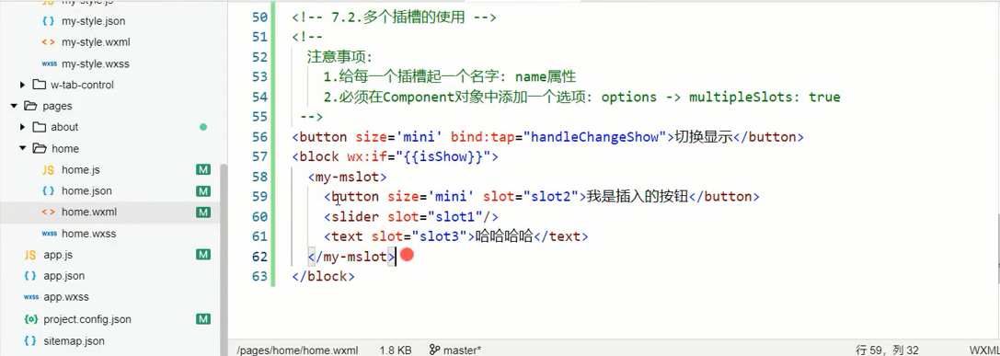

## Component构造器

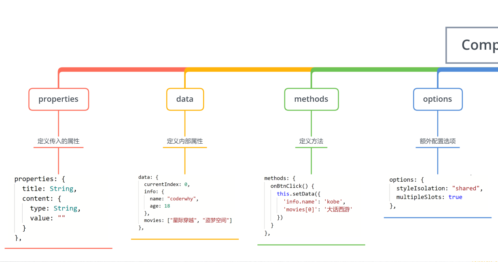

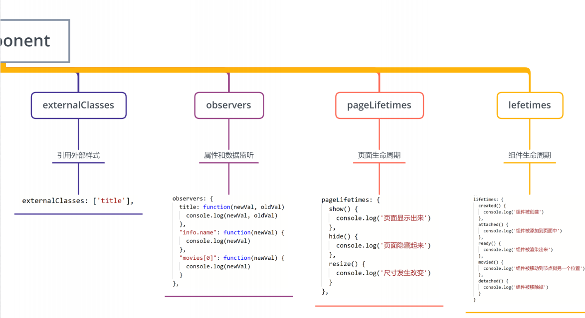

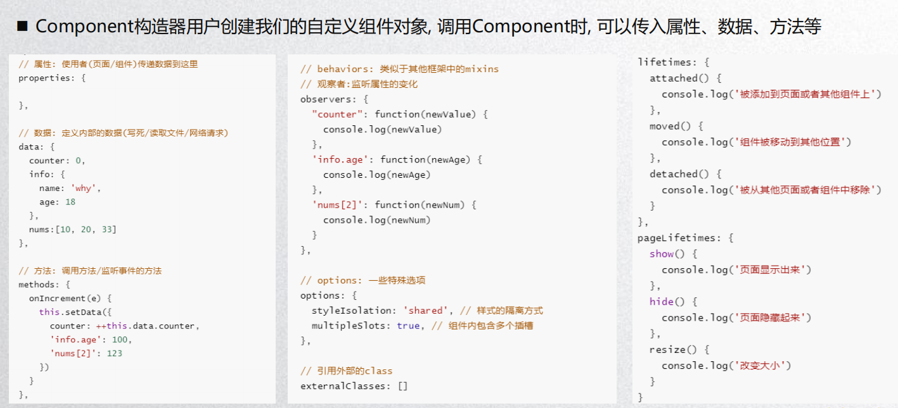

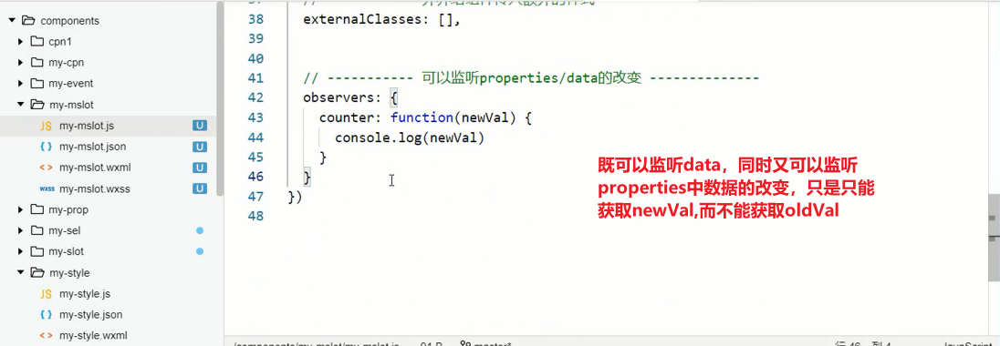

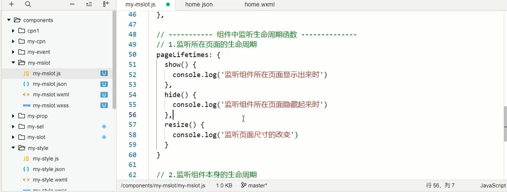

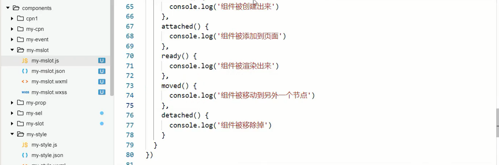

