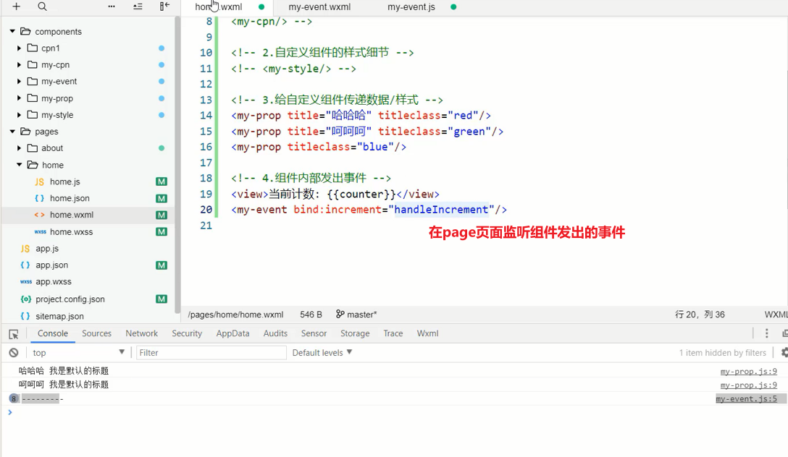
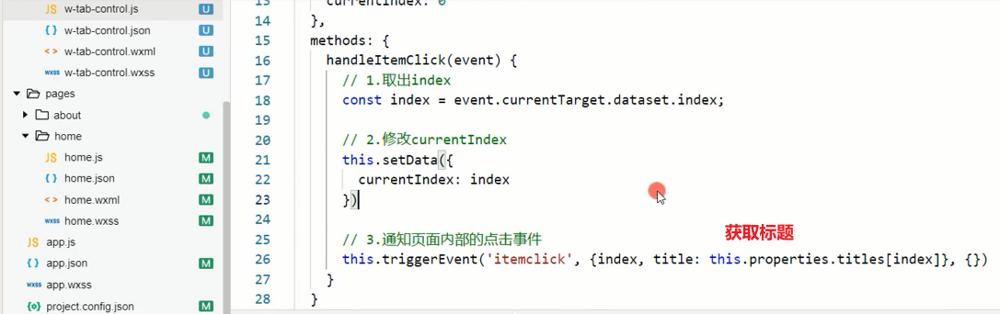
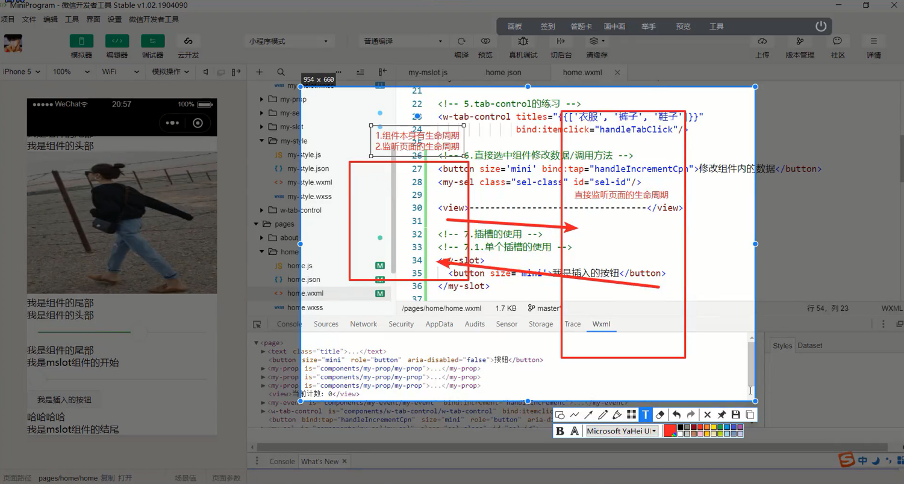

# 笔记

## 什么是组件化开发

> 复杂问题的处理方式

1. 一个人处理信息的逻辑能力是有限的
2. 面对复杂问题，不大可能一次性解决一大推的问题
3. 将问题进行拆解
4. 复杂问题拆解成一个一个小问题处理，再将其放在整体中，大问题迎刃而解。

> 组件化也是类似的思路

1. 如果我们将一个页面中所有的处理逻辑全部放在一起，处理起来会变得很复杂，而且不利于后续的管理和拓展
2. 将页面拆成一个个小的功能块，每个功能块完成属于自己的这部分的独立的功能，那么之后，整个页面的管理和维护就变得非常容易了。

## 小程序组件化思想

+ **小程序再刚开始推出时是不支持组件化的，也是为人诟病的一个点**
+ **但是从v1.6开始，小程序开始支持自定义组件开发，也让我们更加方便的在程序中使用组件化**

**组件化思想的应用**

1. 有了组件化的思想，我们在之后的开发中就要充分的利用它。

2. 尽可能的将页面拆成一个个小的、可复用的组件。
3. 这样让我们的代码更加方便组织和管理，并且扩展性也更强

**所以组件是目前小程序开发中，一个非常重要的一个篇章，要认真学习。**

## 创建一个自定义组件

类似于页面，自定义组件由 json、wxml、wxss、js四个部分组成。

**准备**

1. 先在根目录下面创建一个文件夹，components,里面存放我们之后自定义的公共组件
2. 常见的一个自定义组件 my-cpn:包含对应的四个文件

**自定义组件的步骤**

1. 首先需要在js文件中进行自定义组件生命(将component字段设为true 可将这一组文件设置为自定义组件)
2. 在wxml中编写属于我们组件自己的模板
3. 在wxss中编写属于我们组件自己的相关样式
4. 在js文件中，可以定义数据或数组内部的相关逻辑(后续我们再使用)

## 使用自定义组件和细节注意事项

**一些需要注意的细节**

+ 因为WXML节点标签名只能是小写字母、中划线和下划线的组合，所以定义组件的标签名也只能包含这些字符

+ 自定义组件也是可以引用自定义组件的，引用方法类似于页面引入自定义组件的方式（使用usingComponents字段）。

  ​	

  ​	

  ​	

+ 自定义组件和页面所在项目根目录不能以wx-为前缀，否则会报错

+ 如果app.json的usingComponents声明某个组件，那么所有页面和组件可以直接使用该组件。

  

  

  ​               

  ​				

## 组件的样式细节

1. 组件内的样式对外部样式的影响
   + 结论一：组件内的class样式，只对组件wxml内的节点生效，对于引用组件的Page页面不生效
   + 结论二：组件内不能使用id选择器、属性选择器、标签选择器

2. 外部样式对组件内部样式的影响
   + 结论一：外部使用class的样式，只对外部wxml的class生效，对组件内不是生效的
   + 结论二：外部使用了id选择器，属性选择器不会对组件内产生影响
   + 结论三：外部使用了标签选择器，会对组件内产生影响。
3. 整体结论
   + 组件内的class样式和组件外的class样式，默认是有一个隔离效果的
   + 为了方式样式的错乱，官方不推荐使用id、属性、标签选择器

## 样式的相互影响

**如何让class可以相互影响**

在Component对象中，可以传入一个options属性，其中options属性中有一个stylesolation(隔离)属性。stylelsolation有三个取值。

+ isolated表示启用样式隔离，在自定义组件内外，使用class指定的样式将不会相互影响（默认取值）。

+ apply-shared表示页面wxss样式将影响到自定义组件，但是自定义组件wxss中指定的样式不会影响页面和其他设置了

  

  ​	

  

+ 其他一些样式相关细节，参考官网

# 组件和页面通信

**很多时候，组件内展示的内容（数据，样式，标签），并不是在组件内写死的，而且可以由使用者来决定。**

### 向组件内传递数据 - properties

**给组件传递数据**

+ 大部分情况下，组件只负责布局和样式，内容由使用组件的对象决定的
+ 所以，我们经常需要从外部传递数据给我们的组件，让我们的组件来进行展示，如何传递呢？

+ 使用properties属性

**支持类型**

+ String、Number、Boolean。
+ Object、Array、null(不限制类型)

### 向组件传递样式 -externalClasses

**向组件传递样式**

+ 有时候，我们不希望将样式在组件内固定不变，而是外部可以决定样式
+ 这个时候，我们可以使用externalClass属性:
  + 在Component对象中，定义externalClasses属性
  + 在组件内的wxml中使用externalClass属性的class
  + 在页面中传入对应的class，并且给这个class设置样式。

### 组件向外传递事件 - 自定义事件

**有时候是自定义组件内部发生了事件，需要告知使用者，这个时候可以使用自定义事件：**

#### 自定义组件练习

## 页面直接调用组件方法

**this.selectComponent**

## 什么是插槽

**slot翻译为插槽**

+ USB插槽
+ 让设备具备更多的扩展性
+ 例如电脑的USB可以插入U盘、硬盘、手机、音响、键盘、鼠标等等

**组件的插槽**

+ 组件的插槽也是为了让我们封装的组件更具有拓展性
+ 让使用者可以决定组件内部的一些内容到底显示什么

**移动网站中的导航栏**

+ 移动开发都有导航栏
+ 导航栏我们必然封装一个插件，比如 nav-bar组件
+ 一旦由了这个组件，我们就可以在多个页面中复用了

### 单个插槽的使用

**除了内容和样式可能由外界决定之外，也可能外界想决定显示的方式**

+ 比如我们有一个组件定义了头部和尾部，但是中间的内容可能是一段文字，也可能是一张图片，或者是一个鸡进度条

+ 在不确定外界想插入什么其他组件的前提下，我们可以在组件中预留插槽。

  

  

### 多个插槽的使用

有时候为了让组件更加灵活，我们需要定义多个插槽

## Component构造器

