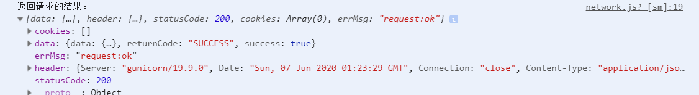
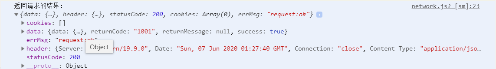
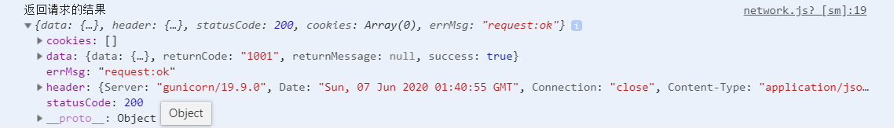
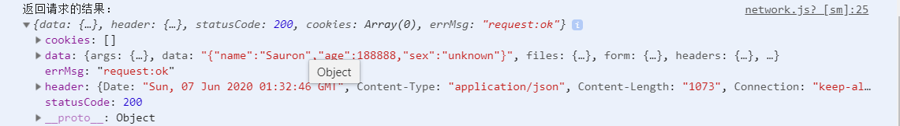
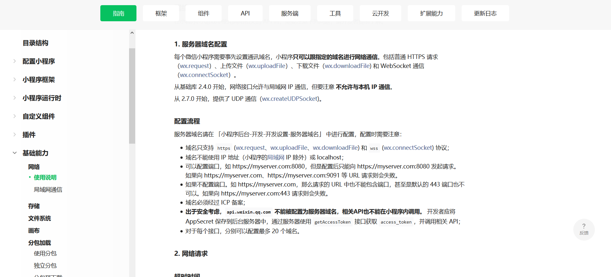
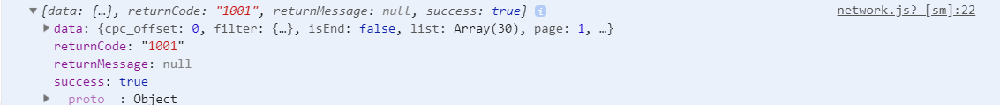
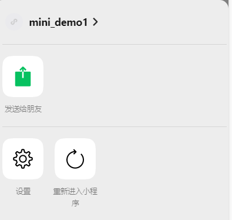
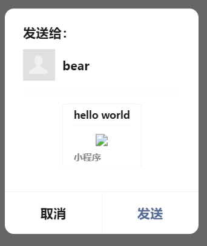

# 笔记

## 网络请求基本使用

**微信提供了专属的API接口，用于网络请求：<font color="red">wx:request(Object object)</font>**

| 属性         | 类型                 | 默认值 | 必填 | 说明                                                         |
| ------------ | -------------------- | ------ | ---- | ------------------------------------------------------------ |
| url          | string               |        | 是   | 开发者服务器接口地址                                         |
| data         | string/object/Buffer |        | 否   | 请求的参数                                                   |
| header       | Object               |        | 否   | 设置请求的header,header中不能设置Referer。Content-Type默认值为application/json |
| method       | string               | GET    | 否   | HTTP请求方法                                                 |
| dataType     | string               | json   | 否   | 返回的数据格式                                               |
| responseType | string               | text   | 否   | 响应的数据类型                                               |
| success      | function             |        | 否   | 接口调用成功的回调函数                                       |
| fail         | function             |        | 否   | 接口调用失败的回调函数                                       |
| complete     | function             |        | 否   | 接口调用结束的回调函数（调用成功，或者失败都会执行）         |


### 网络请求-代码演练

1. **<font color="red">GET请求的调用</font>**

   + 没有参数的网络请求

     ~~~javascript
     // 没有参数的GET请求，也是接口的默认请求方式
     wx.request({
         url: "http://123.207.32.32:8000/api/m3/recommend",
         success: function(res){}
         console.log('返回请求的结果',res)
     })
     ~~~

     ​	

   + 携带参数的网络请求

     ~~~javascript
     // 携带了参数的GET请求
     wx.request({
         url: "http://123.207.32.32:8000/api/m3/home/data",
         data:{
             type : 'sell',
             page: 1
         },
         success: function(res){
         console.log('返回请求的结果',res)
         }
     })
     ~~~

     ​	

   + 将参数直接拼接到URL地址中

     ~~~javascript
     // 携带了参数的GET请求,采用URL拼接的方式
     wx.request({
         url: "http://123.207.32.32:8000/api/m3/home/data?type=sell&page=1",
         success: function(res){
         console.log('返回请求的结果',res)
         }
     })
     ~~~

     ​	

2. **<font color="red">POST请求的调用</font>**

   ​				

   ```javascript
   // POST不是默认请求方式，需要手动添加调用方式,携带了参数
   wx.request({
   	url: 'https://httpbin.org/post',
       data: {
           name : 'Sauron',
           age : 18888,
           sex : 'unknow'
       },
       method:"post",
       success: function(res){
       console.log('返回请求的结果',res)
       }
   })
   ```

   ​	


### 小程序域名的相关配置




### 网络请求-请求封装

**目前我们采用的网络请求是非常古老的请求方式，我们将他封装成Promise的方式**

1. **<font color="red">封装</font>**

~~~javascript
// 在network.js里面封装
import {baseURL,timeout} from './config.js'
function request(options){
    return new Promise((resolve,reject)=>{
        wx.request({
            url: baseURL + options.url,
            method:options.method || 'get',
            timeout:timeout || 3000,
            data:options.data || {},
            success: function(res){
                resolve(res.data)
            },
            fail:reject
        })
    })
}
export default request;
~~~

2.**<font color="red">使用</font>**

~~~javascript
// 导出到app.js页面中使用
import request from './network'
App({
  // 使用封装的request发出网络请求
    get_data_origin(){
    request({
        url: "http://123.207.32.32:8000/api/m3/home/data",
        data:{type : 'sell',page: 1}
        }).then(res => {
        	console.log(res)
        }).catch(err => {
            console.log(err)
        })
        }
})
~~~


### 网络请求-封装演练

1. <font color="red">config.js文件</font>

   ~~~javascript
   // export var baseURL = 'http://123.207.32.32:8000'
   // export var timeout = 5000
   var baseURL = 'http://123.207.32.32:8000'
   var timeout = 5000
   export {
     baseURL,
     timeout
   }
   ~~~


2. <font color="red">http.js文件</font>

   ~~~javascript
   // 在network.js里面封装
   import {baseURL,timeout} from './config.js'
   console.log(baseURL);
   function request(options){
       return new Promise((resolve,reject)=>{
           wx.request({
               url: baseURL + options.url,
               method:options.method || 'get',
               timeout:timeout || 3000,
               data:options.data || {},
               success: function(res){
                   resolve(res.data);
               },
               fail:function(err){
                   reject(err);
               }
               // 因为fail的值是一个回调函数，所以也可以直接写作 succss:resolve,fail:reject
           })
       })
   }
   export default request;
   ~~~


3. <font color="red">home.js文件</font>

   ~~~javascript
   // pages/home/home.js
   import request from './http.js';
   Page({
     /**
      * 页面的初始数据
      */
     data: {
     },
   
     /**
      * 测试网络请求
      */
     // 使用封装的request发出网络请求
     getHttp: function(){
       request({
           url: "/api/m3/home/data",
           data:{type : 'sell',page: 1}
           }).then(res => {
           	console.log(res)
           }).catch(err => {
               console.log(err)
           })
       },
     onLoad: function (options) {
      this.getHttp();
     },
   })
   ~~~

   ​	


## 展示弹窗

**小程序中展示弹窗有四种方式：<font color="red">showToast</font>、<font color="red">showModal</font>、<font color="red">showLoading</font>、<font color="red">showActionSheet</font>**


~~~html
<button size="mini" bind:tap="onToastClick">showToast</button>
<button size="mini" bind:tap="onModalClick">showModal</button>
<button size="mini" bind:tap="onLoadingClick">showLoading</button>
<button size="mini" bind:tap="onActionSheetClick">showActionSheet</button>
~~~

**1.<font color="red">showToast</font>**

~~~javascript
Page({
    onToastClick(){
        wx.showToast({
            title:'你好啊',
            duration:3000,
            icon:'loading',
            mask:true,
            // image:"./image/icon/icon.png" 可以自定义图标
            success:function(){console.log("展示成功")}，
            fail:function(){console.log("展示失败")},
            complete:function(){console.log('展示完成')}
        })
    }
})
~~~

**2.<font color="red">showModal</font>**

~~~javascript
Page({
    onModalClick(){
        wx.showModal({
            title:'我是标题',
            content: '我是内容，哈哈哈',
            // 可以手动设置有无'取消'选项
            showCancel:true,
            cancelText:'返回',
            cancelColor:'#ff8800',
            success:function(res){
                if(res.confirm){
                    console.log("用户点击了确定")
                }
                if(res.cancel){
                    console.log('用户点击了取消')
                }
             }
        })
    }
})
~~~

**3.<font color="red">showLoading</font>**

~~~javascript
Page({
    onLoadingClick(){
        wx.showLoading({
            title:'加载img',
            mask:true
        });
        setTimeout(()=>{
            wx.hideLoading()
        },2000)
    }
})
~~~


**4.<font color="red">showActionSheet</font>**

~~~javascript
Page({
    onActionSheetClick(){
     	wx.showActionSheet({
            itemList:['相册','拍照'],
            itemColor:'#ff000',
            success:function(res){
                console.log(res)
            }
        })
    }
})
~~~


## 页面分享

**分享是小程序扩散的一种重要方式，小程序中有两种分享方式:**

+ 点击右上角的<font color="red">菜单</font>，之后点击转发
+ 点击某一个按钮，直接转发

**当我们转发给好友一个小程序时候，通常小程序中会显示一些信息**

+ 如何决定这些信息的展示呢？通过<font color="red">onShareAppMessage</font>


~~~javascript
 /**
   * 用户点击右上角分享
   * 该方法已经在页面上自动生成了
   */
onShareAppMessage:function(options){
    return {
        title:'hello world',
        // 设置转发路径也就是要分享的页面
        path:'/pages/about/about',
        // 设置自定义路径，即默认使用截图
        imageUrl:'http://chuantu.xyz/t6/738/1591507279x1700338588.jpg'
    }
}
~~~



**分享按钮，一键分享**

~~~html
<button size="mini" open-type="share">分享</button>
~~~



## 小程序的登录流程

**我们先来查看一下官方给出的小程序登录流程图：**

1. 调用wx.login获取code
2. 调用wx.request发送code到我们自己的服务器（我们自己的服务器会返回一个登录状态的标识，比如token）
3. 将登录状态的标识token进行存储，以便下次使用
4. 请求需要登录状态标识的接口时，携带token


### 小程序登录演练


> 请求token接口，也就是登录

~~~javascript
const TOKEN = 'token'
 login:function(){
    wx.login({
      success: (res) => {
          // 1.获取code
          const code = res.code
          console.log('打印code:'+code);
          // 2.向自己的服务器发送请求
          wx.request({
              url: "http://123.207.32.32:3000/login",
              method: 'post',
              data: {
                  code:code
              },
              success: (res) =>{
               if(res.statusCode === 200){
                    //3.取出token
                    console.log("取出token:"+JSON.stringify(res))
                    const token = res.data.token
                    console.log(token);
                    //4.将token保存到全局变量中
                    this.globalDatas.token = token
                    //5.将token保存到本地storage中
                    wx.setStorageSync(TOKEN,token,function(res){
                      console.log('保存成功',res);
                    })
               } else if(res.statusCode === 404 ) {
                 console.log('请求路径错误');
               } else {
                 console.log('请求失败');
               }
              },
              fail: (err) => {
                console.log("获取token失败:" + JSON.stringify(err) );
              }
          })
      },
      fail: (err) => {
        console.log('login登录失败:'+error);
      }
  })
  },
~~~

> 验证token接口

~~~javascript
const TOKEN = 'token'
onLaunch:function(){
    //1.从缓存中取出token
    const token = wx.getStorageSync(TOKEN)
    //2.判断是否取出token
    if(token && token.length){
        this.check_token(token)
    } else {
        console.log('进行了登录');
        this.login()
    }
}
check_token:function(token){
    console.log(token);
    wx.request({
        url:"http://123.207.32.32:8000/auth",
        method:"post",
        header:{
            token
        },
        success: (res) =>{
            console.log(res)
        }
    })
}
~~~


### 服务器端代码


### 在App()中设置全局变量


### 其他页面获取token


### 标准开发-设置常量


### code时间


### 箭头函数的使用


### 封装登录函数


### token后台的校验机制


## 界面跳转

**界面的跳转有两种方式：<font color="red">通过navigator组件</font>和<font color="red">通过wx的API跳转</font>**

### 1.navigator的取值

navigator组件主要就是用于界面的跳转的:

| 属性      | 类型   | 默认值   | 必填 | 说明                                                         |
| --------- | ------ | -------- | ---- | ------------------------------------------------------------ |
| target    | string | self     | 否   | 在哪个目标上发生跳转，默认当前小程序                         |
| url       | string |          | 否   | 当前小程序内的跳转链接                                       |
| open-type | string | navigate | 否   | 跳转方式                                                     |
| delta     | number | 1        | 否   | 当open-type为<font color="red">navigateBack</font>时有效，表示回退的层数 |


~~~html
<!--pages/home/home.wxml-->
<text class="title">hello world</text>
<button size="mini">按钮</button>
<!--1.navigator页面跳转，既可以使用相对路径，也可以使用绝对路径-->
<navigator url="/pages/detail/detail">跳转到详情页</navigator>
~~~


### 2.open-type的取值

| 值           | 说明                                                         |
| ------------ | ------------------------------------------------------------ |
| navigate     | 对应<font color="red">wx.navigateTo</font>或 <font color="red">wx.navigateToMiniProgram</font>的功能 |
| redirect     | 对应<font color="red">wx.redirectTo</font>的功能             |
| switchTab    | 对应<font color="red">wx.switchTab</font>的功能              |
| reLaunch     | 对应<font color="red">wx.reLaunch</font>的功能               |
| navigateBack | 对应<font color="red">wx.navigateBack</font>的功能           |
| exit         | 退出小程序，target="miniProgram"时生效                       |

**<font color="red">redirect：</font>**关闭当前页面，跳转到应用内的某个页面。但是不允许跳转到tabber页面，并且不能返回。（不是一个压栈）

**<font color="red">switchTab：</font>**跳转到tabBar页面，并关闭其他所有的非tabBar页面。（需要在tabBar中定义的）

**<font color="red">reLaunch：</font>**关闭所有的页面，打开应用中的某个页面。（直接展示某个页面，并且可以跳转到tabBar页面）

#### redirect

~~~html
<!--1.navigator页面跳转，既可以使用相对路径，也可以使用绝对路径-->
<navigator url="/pages/detail/detail"
           <!--此时跳转之后的detail页面的左上角没有返回键，因为redirect彻底关闭了之前的页面-->
           open-type="redirect" 
           >跳转到详情页(redirect)
</navigator>
~~~


#### switchTab

**先设置tabBar页面**

~~~json
// app.json
{
    "tabBar":{
        {
        "pagePath":"pages/home/home"，
        "text" : "首页"
   	   },
       {
        "pagePath":"pages/about/about"，
        "text" : "关于"
   	   }
    }
}
~~~


~~~html
<navigator url="pages/about/about"
           <!--跳到关于的tab页面-->
           open-type="switchTab"> 
    跳到关于页(switchTab)
</navigator>
~~~


#### reLaunch

~~~html
<navigator url="/pages/detail/detail"
           open-type="reLaunch">
    <!--跳到详情页面，同时关闭所有的页面-->
    跳到详情页(reLaunch)
</navigator>
~~~


#### tabBar的显示和隐藏


## 导航返回

**导航返回有两个属性来起作用**

+ open-type：navigateBack（表示该navigator组件用于返回）

+ delta:返回的层级（指定返回的层级，open-type必须是navigateBack才生效）

  ~~~html
  <!--返回上一级-->
  <navigator open-type="navigateBack">
  返回上一级
  </navigator>
  ~~~


### 手动设置返回按钮

~~~html
<navigator open-type="navigateBack">返回</navigator>
~~~


### 设置返回的层级

~~~html
<!--直接返回两个层级-->
<navigator open-type="navigateBack" delta = "2">返回两个层之后的页面</navigator>
~~~


## 数据传递

### 传递方式分析

**如何在界面跳转过程中我们需要相互传递一些数据，应该如何完成呢？**

1. 首页 -->详情页：使用URL中的query字段

2. 详情页-->首页：在详情页内部拿到首页的页面对象，直接修改数据

   

#### URL拼接传值

~~~html
<!--跳转过程中数据的传递-->
<navigator url="/pages/detail/detail?name=Sauron&height=1.88"></navigator>
~~~

#### 接收URL跳转传递的数据

~~~javascript
Page({
    onLoad: function(options){
        //onLoad生命周期函数，可以获取传递的参数信息
        console.log(options)
    }
})
~~~


#### 通过getCurrentPages中传值

通过在跳转页中的onUnload()的函数中获取所有活跃的页面对象，直接找到我们要返回的对象，然后直接修改

~~~javascript
Page({
    data: {
        title:'' // 预先要定义一个变量
    }
})
~~~


~~~javascript
// 跳转之前触犯onUnload生命周期函数，在函数里面找到指定的页面对象，然后获取data，修改其值
Page({
    onUnload(){
        // 1.获取首页的页面对象
        // getCurrentPages当前所有栈的页面
        const pages = getCurrentPages();
        const home = pages[pages.length-2];
        // 2.调用页面对象的setData
        home.setData({
            title:'呵呵呵'
        })
        
    }
})
~~~


### 传递过程

1. 首页 - > 详情页

   通过修改URL传递参数

2. 详情页 - > 首页

    返回时携带数据有两个问题需要考虑

   + 问题一：在什么地方修改数据
     + 如果你是监听按钮或者navigator的点击来返回时，可以通过bindtap来映射到某个函数，在函数中完成
     + 但是这种方式不能监听左上角返回按钮的点击
     + 所以我们选择在onUnload中修改数据
   + 问题二：如何修改数据
     + 小程序并没有提供直接修改数据的方法
     + 但是可以通过getCurrentPages来获取所有的页面，然后使用页面对象的setData({})函数来修改。


### 代码的跳转和返回

**很多情况下，我们并不喜欢使用navigator组件来进行跳转**

+ 可能我们希望用户点击了某个button或者view时，对该button或者view进行监听
+ 之后，通过相关的代码逻辑实现跳转

**对此，微信也提供了对应的API接口**

+ wx.navigateTo(url,[])

+ wx.navigateBack([delta])

  


#### 通过代码跳转

~~~html
<button size="mini" bind:tap = "handlePushDetail">跳到详情页面</button>
~~~


~~~javascript
Page({
    handlePushDetail(){
        wx.navigateTo({
            url:'/pages/detail/detail?title=你好啊'
        })
    }
})
~~~


#### 通过代码返回

~~~html
<button 
        size="mini" 
        bind:tap="handleBack">
    返回
</button>
~~~

~~~javascript
Page({
	handleBack(){
	wx.navigateBack({
        delta:1}) // 控制返回层级，默认为1，可加可不加
    }
})
~~~

