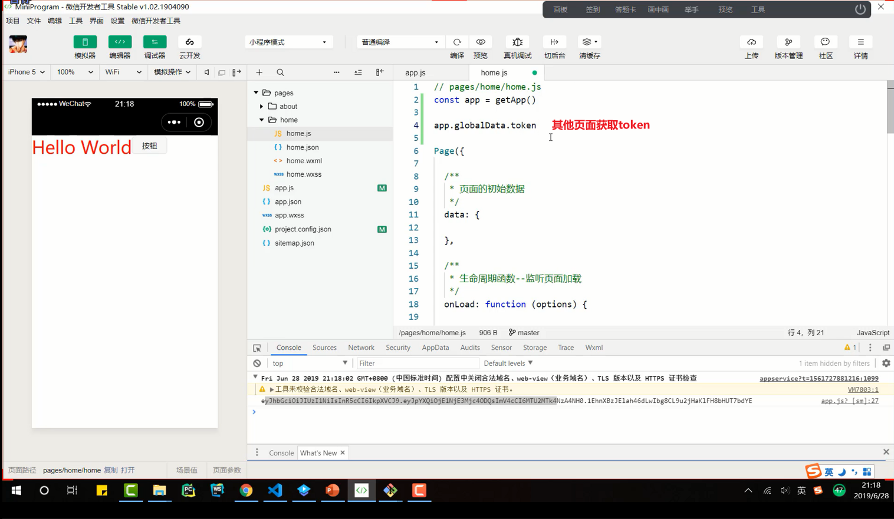
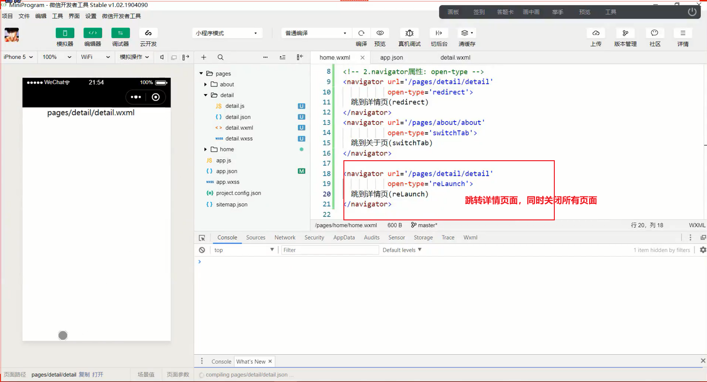
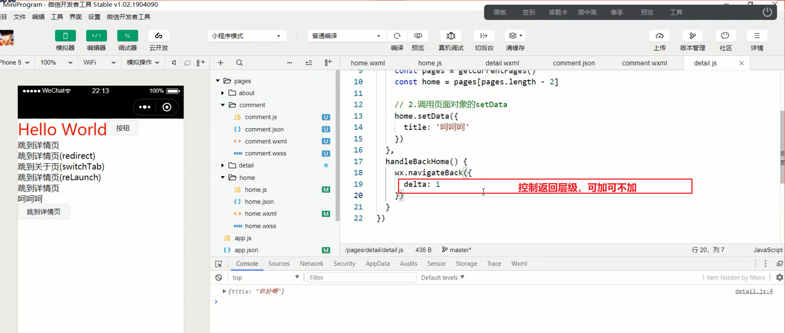

# 笔记

## 网络请求基本使用

**微信提供了专属的API接口，用于网络请求：wx:request(Object object)**

| 属性         | 类型                 | 默认值 | 必填 | 说明                                                         |
| ------------ | -------------------- | ------ | ---- | ------------------------------------------------------------ |
| url          | string               |        | 是   | 开发者服务器接口地址                                         |
| data         | string/object/Buffer |        | 否   | 请求的参数                                                   |
| header       | Object               |        | 否   | 设置请求的header,header中不能设置Referer。Content-Type默认值为application/json |
| method       | string               | GET    | 否   | HTTP请求方法                                                 |
| dataType     | string               | json   | 否   | 返回的数据格式                                               |
| responseType | string               | text   | 否   | 响应的数据类型                                               |
| success      | function             |        | 否   | 接口调用成功的回调函数                                       |
| fail         | function             |        | 否   | 接口调用失败的回调函数                                       |
| complete     | function             |        | 否   | 接口调用结束的回调函数（调用成功，或者失败都会执行）         |

### 网络请求-代码演练

### 网络请求-请求封装

**目前我们采用的网络请求是非常古老的请求方式，我们将他封装成Promise的方式**

**配置域名**

## 展示弹窗

**小程序中展示弹窗有四种方式：showToast、showModal、showLoading、showActionSheet**

## 页面分享

**分享是小程序扩散的一种重要方式，小程序中有两种分享方式:**

+ 点击右上角的菜单，之后点击转发
+ 点击某一个按钮，直接转发

**当我们转发给好友一个小程序时候，通常小程序中会显示一些信息**

+ 如何决定这些信息的展示呢？通过onShareAppMessage

## 小程序的登录流程

**我们先来查看一下官方给出的小程序登录流程图：**

1. 调用wx.login获取code
2. 调用wx.request发送code到我们自己的服务器（我们自己的服务器会返回一个登录状态的标识，比如token）
3. 将登录状态的标识token进行存储，以便下次使用
4. 请求需要登录状态标识的接口时，携带token

### 小程序登录演练

## 界面跳转

**界面的跳转有两种方式：通过navigator组件和通过wx的API跳转**

navigator组件主要就是用于界面的跳转的:

| 属性      | 类型   | 默认值   | 必填 | 说明                                                         |
| --------- | ------ | -------- | ---- | ------------------------------------------------------------ |
| target    | string | self     | 否   | 在哪个目标上发生跳转，默认当前小程序                         |
| url       | string |          | 否   | 当前小程序内的跳转链接                                       |
| open-type | string | navigate | 否   | 跳转方式                                                     |
| delta     | number | 1        | 否   | 当open-type为navigateBack时有效，表示回退的层数 |

### open-type的取值

| 值           | 说明                                                         |
| ------------ | ------------------------------------------------------------ |
| navigate     | 对应wx.navigateTo或 wx.navigateToMiniProgram的功能 |
| redirect     | 对应wx.redirectTo的功能             |
| switchTab    | 对应wx.switchTab的功能              |
| reLaunch     | 对应wx.reLaunch的功能               |
| navigateBack | 对应wx.navigateBack的功能           |
| exit         | 退出小程序，target="miniProgram"时生效                       |

**redirect：**关闭当前页面，跳转到应用内的某个页面。但是不允许跳转到tabber页面，并且不能返回。（不是一个压栈）

**switchTab：**跳转到tabBar页面，并关闭其他所有的非tabBar页面。（需要在tabBar中定义的）

**reLaunch：**关闭所有的页面，打开应用中的某个页面。（直接展示某个页面，并且可以跳转到tabBar页面）

## 导航返回

**导航返回有两个属性来起作用**

+ open-type：navigateBack（表示该navigator组件用于返回）

+ delta:返回的层级（指定返回的层级，open-type必须是navigateBack才生效）

  ~~~html
  <!--返回上一级-->
  <navigator open-type="navigateBack">
  返回上一级
  </navigator>
  ~~~

## 数据传递

### 传递方式分析

**如何在界面跳转过程中我们需要相互传递一些数据，应该如何完成呢？**

1. 首页 -->详情页：使用URL中的query字段

2. 详情页-->首页：在详情页内部拿到首页的页面对象，直接修改数据

   
   
   

### 传递过程

1. 首页 - > 详情页

   通过修改URL传递参数

2. 详情页 - > 首页

    返回时携带数据有两个问题需要考虑

   + 问题一：在什么地方修改数据
     + 如果你是监听按钮或者navigator的点击来返回时，可以通过bindtap来映射到某个函数，在函数中完成
     + 但是这种方式不能监听左上角返回按钮的点击
     + 所以我们选择在onUnload中修改数据
   + 问题二：如何修改数据
     + 小程序并没有提供直接修改数据的方法
     + 但是可以通过getCurrentPages来获取所有的页面，然后使用页面对象的setData({})函数来修改。

### 代码演练

### 代码的跳转和返回

**很多情况下，我们并不喜欢使用navigator组件来进行跳转**

+ 可能我们希望用户点击了某个button或者view时，对该button或者view进行监听
+ 之后，通过相关的代码逻辑实现跳转

**对此，微信也提供了对应的API接口**

+ wx.navigateTo(url,[])

+ wx.navigateBack([delta])

  

