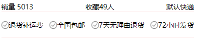

# 笔记

> 2020/06/08 zw

## Storage和StorageSync的写法是不一样的

**1、StorageSync(同步)**

~~~javascript
wx.setStorageSync("uname", that.data.name );
~~~

**2、getStorageSync(同步)**

~~~javascript
 wx.getStorageSync('uname')


~~~

**3、setStorage(异步)**

```javascript
wx.setStorage({
  key:"uname",
  data:that.data.name,
  success:functioon(res){
    ...
}
})
```

**4、getStorage(异步)**

```javascript
wx.getStorage({
  key: 'uname',
})
```

 


## 解决scroll-view中的bindscrolltolower事件无法触发问题

小程序scroll-view中的bindscrolltolower方法失效的原因是，

需要在`app.wxss`中设置

~~~css
page{
  height：100%
}
~~~


并且在有scroll-view的view中设置height：100%

即可生效


## 页面跳转绝对路径

~~~javascript
 methods: {
    handlegoto(){
      console.log(this.data.goodItem);
      var iid  = this.data.goodItem && this.data.goodItem.iid
      var url = "/pages/detail/detail?iid="+iid
      wx.navigateTo({
        url: url,
      })
    }
  }
})
~~~


## 图片文字使用vertical-align

~~~html
	<view class="base-service">
		<block wx:for="{{goodBaseInfo.services}}" wx:key="index">
			<view wx:if="{{index !== 0}}" class="service-item">
				<image class='icon' src="{{item.icon}}" mode="widthFix"></image>
				<text class='name'>{{item.name}}</text>
			</view>
		</block>
	</view>
~~~


~~~css
.base-service{
 display: flex;
 font-size: 28rpx;
 justify-content: space-between;
 padding:30rpx 0rpx;
 border-bottom: 3rpx solid #fef2f2;
}
.service-item .icon{
  width: 30rpx;
  height: 30rpx;
  position: relative;
  vertical-align:middle;
}
.service-item .name{
  vertical-align:middle;
}
~~~




## new Date不能在wxs中使用

~~~javascript
  //不能使用 new Date()
      var time = getDate(value);
      var year = time.getFullYear();
      var month = time.getMonth() + 1;
      var date = time.getDate();
      var hour = time.getHours();
      var minute = time.getMinutes();
      var second = time.getSeconds();
      month = month < 10 ? "0" + month : month;
      date = date < 10 ? "0" + date : date;
      hour = hour < 10 ? "0" + hour : hour;
      minute = minute < 10 ? "0" + minute : minute;
      second = second < 10 ? "0" + second : second;
      return year + "-" + month + "-" + date + " " + hour + ":" + minute + ":" + second;
  }
~~~


