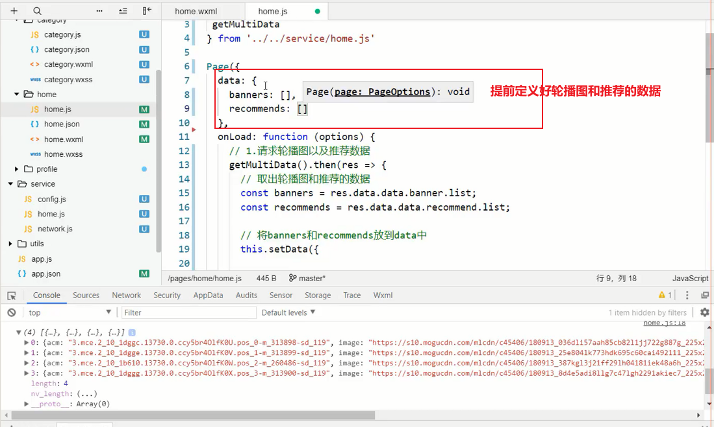
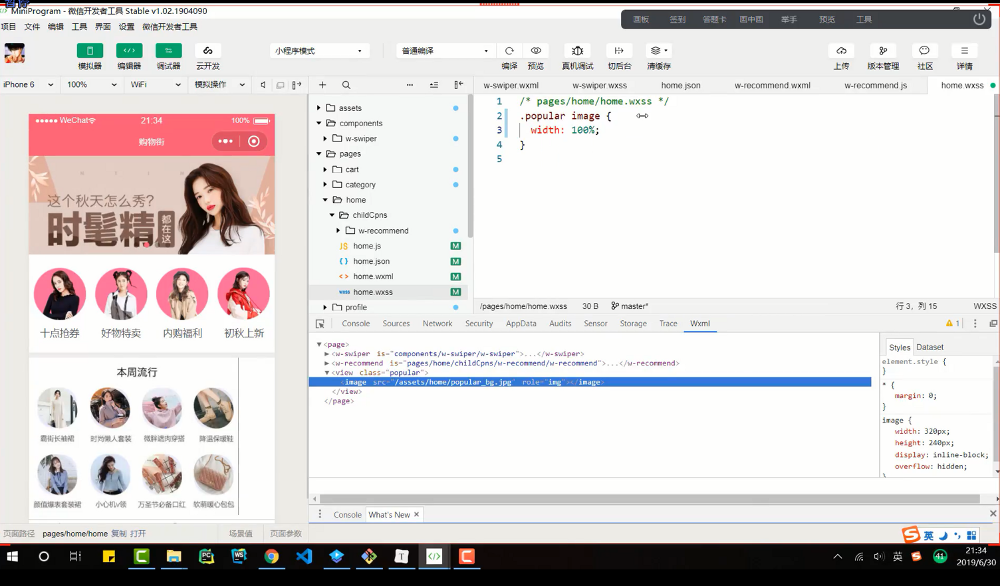
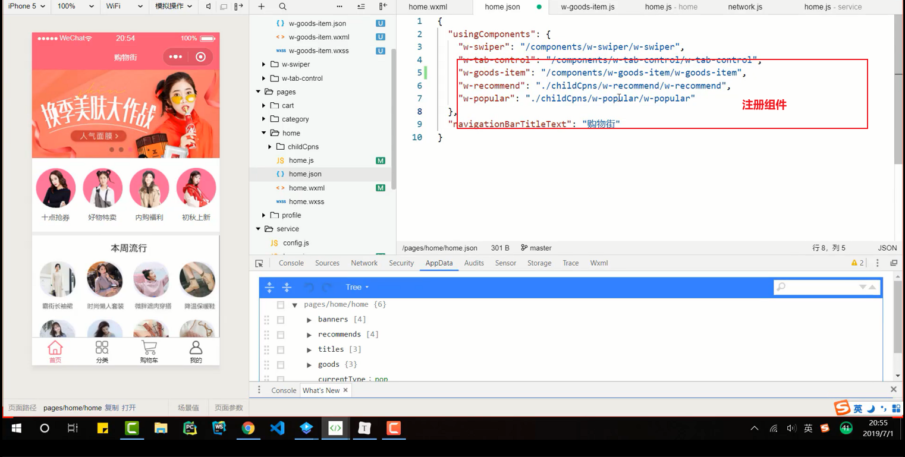
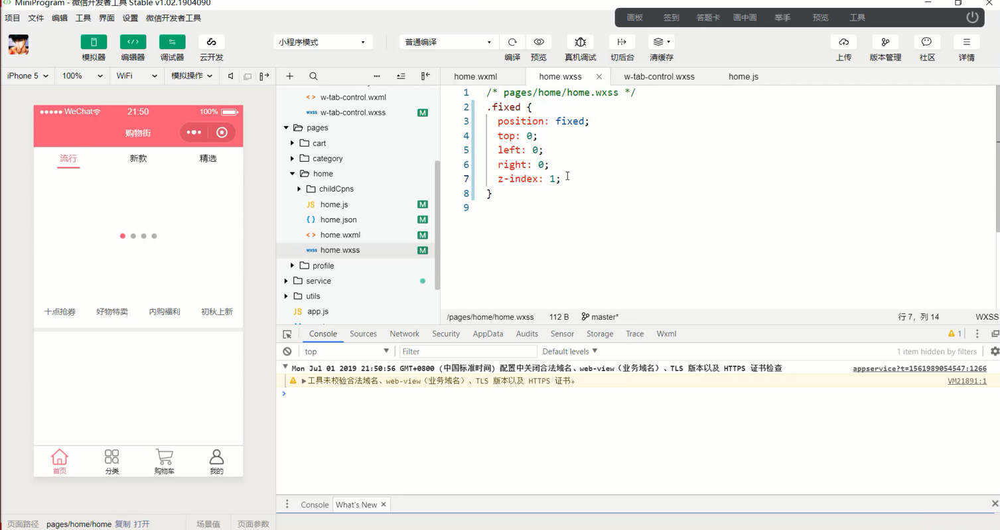

# 笔记

## 一.全局配置

### 1.1顶部导航配置

## 二.首页配置

### 2.1顶部标题

### 2.2轮播图

#### 1.轮播图数据请求

#### 2.轮播图实际效果展示

### 2.3 推荐数据的展示

### 2.4本周流行

### 2.5页面bug显示以及修复

### 2.6tab-control组件

### 2.7 商品数据的展示效果

#### 1.数据模型设计

#### 2.发送网络请求，将数据存储起来

#### 3.展示所有的数据，并且可以完成切换

#### 4.自定义w-goods-item组件，并且设置样式

##### wxss无法引入本地图片

#### 5.自定义w-goods组件，调整样式

### 2.8首页上拉加载更多

### 2.9首页回到顶部的功能

#### wx.pageScrollTo

#### 控制返回显示与否

#### hidden对自定义组件无效

### 3.0 tab-control停留

