# 浏览器渲染原理

## 序章

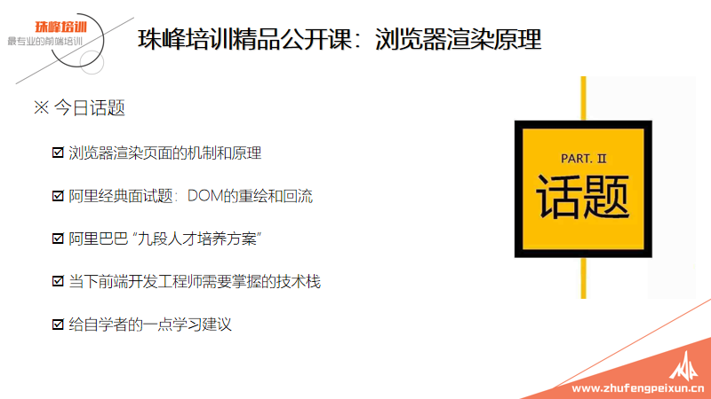

## 浏览器渲染原理

### 面试题

### 浏览器渲染页面的机制和原理

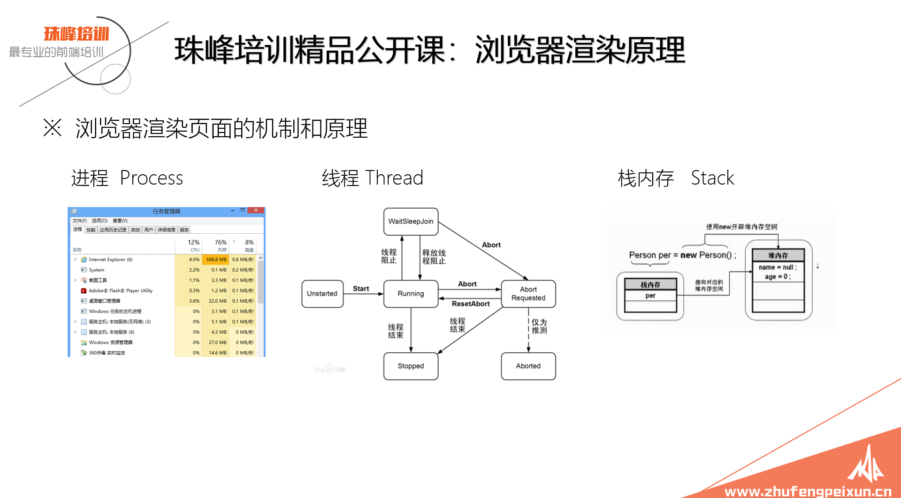

### 进程与线程

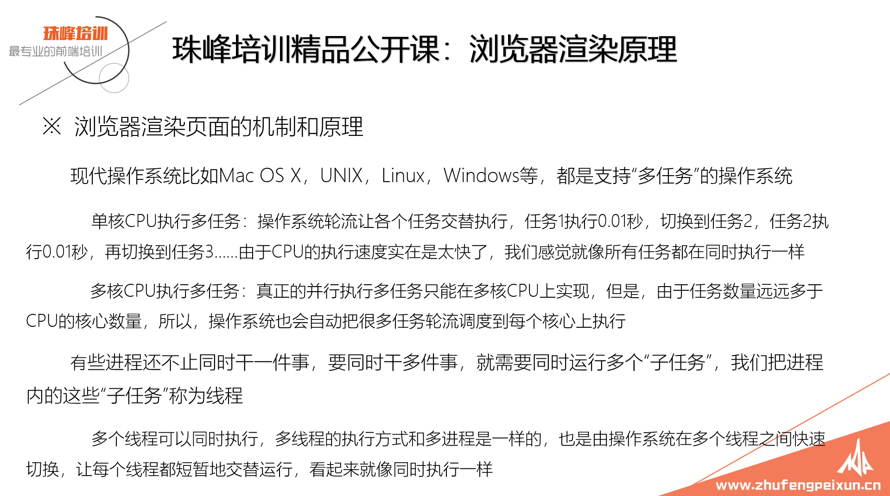

### 客户端浏览器

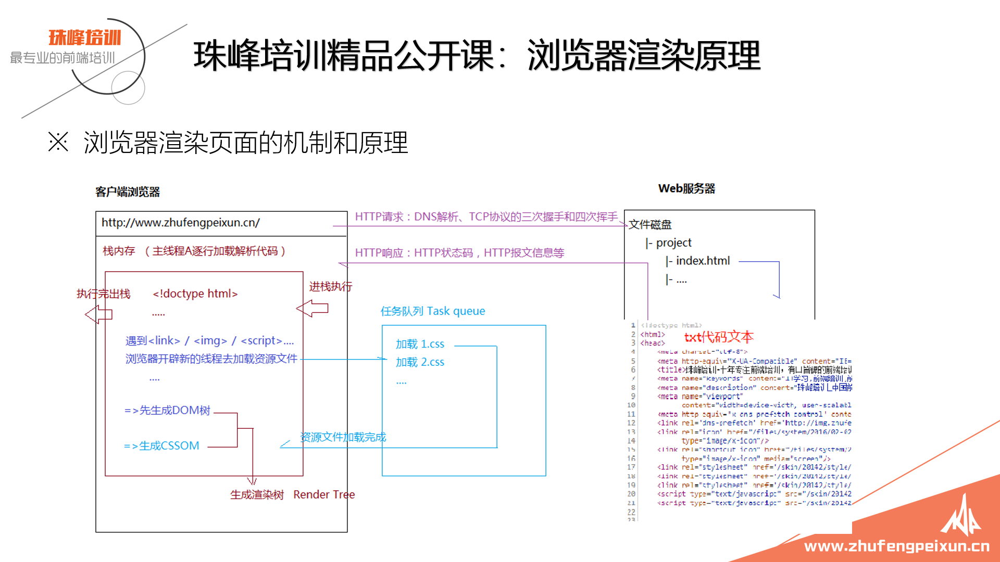

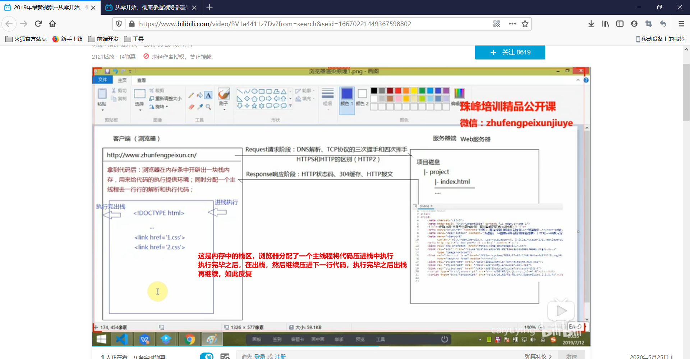

拿到代码之后，浏览器在内存条中开辟了一块栈内存，用来给代码的执行提供环境；同时分配一个主线程去一行行的解析和执行代码。这也解释了为什么说前端`javascript`是单线程的，因为浏览器只会分配一个线程去处理

进栈执行===》执行完之后===》出栈，也就是说在当前的栈内存中 只有当前行代码执行完毕，并且执行了出栈之后，才能腾出栈内存空间来执行下一行代码。

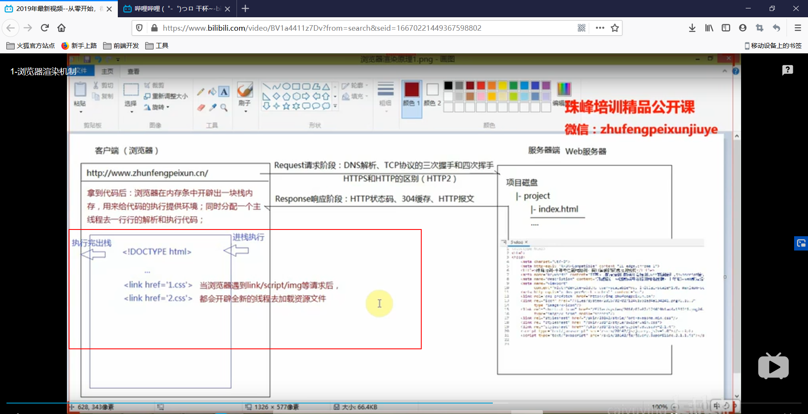

当浏览器遇到`link/script/img`等请求后，都会开辟全新的线程去加载资源文件，所以可以所浏览器是多线程，而 `javascript`是单线程的，因为浏览器虽然是多线程的，但是它只会使用一个线程，也就是主线程来执行代码。所以说浏览器是多线程的，而javascript是单线程的。

所以可以说浏览器是一个多线程程序，但是它只分配了一个线程去执行`javascript`代码，所以`javascript`是单线程的。

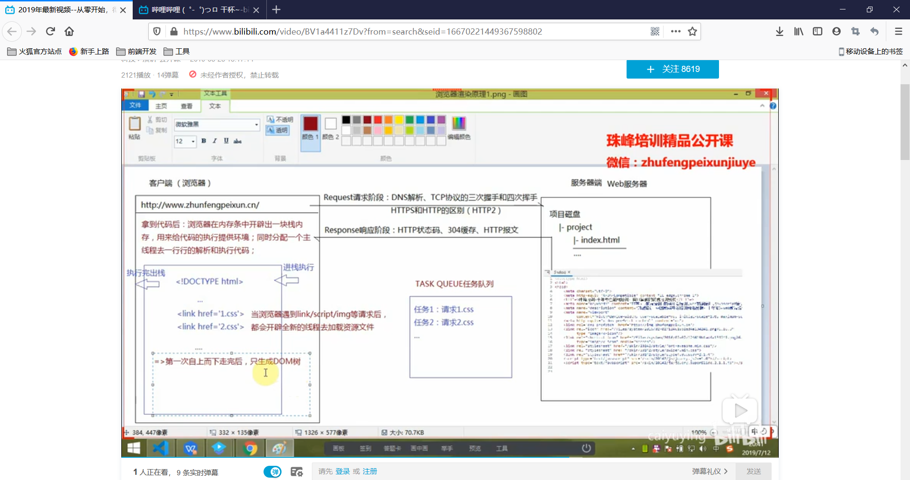

可以知道在浏览器对于`link`额外创建的两个子线程会将线程放入`TASK QUEUE任务队列`中，接下来主线程会继续执行下一行代码，...... 然后主线程第一次自上而下走完了`html`文件代码之后，只会生成DOM树,此时无法确定 `TASK QUEUE`任务队列是否已经加载完成了。

当主线程已经走完了，也就是整个`html`页面的的DOM树已经渲染出来了，此时主线程会去 `TASK QUEUE`任务中去找已经执行完成的任务，然后将它执行进栈执行操作，也就是将他压入之前已经开辟好了的栈内存中，执行相关操作，然后执行出栈，接下来继续去`TASK QUEUE`任务对立中查找，继续重复执行操作。这就是时间循环 `event loop`;

所谓的时间循环 `event loop` 其实就是当主线程，也就是主任务执行完了之后去等待任务队列 `TASK QUEUE`中，当有任务了，或者任务到时间了，就把这个任务拿到主任务，也就是主线程中去执行，执行完毕之后，继续到等待任务队列 `TASK QUEUE`中等待新的任务，一直到等待任务全都执行完毕了，才算完成了。

等待任务里面又有微任务和宏任务，所有的微任务均要求要优先于宏任务。

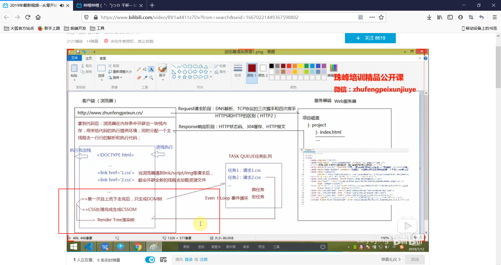

当`TASK QUEUE`中的任务也就是加载`css`文件都被主线程加载执行完成之后，会生成 `CSSOM`

此时浏览器会将`DOM树`和`CSSOM` 结合到一起生成 `Render Tree`渲染树

渲染树生成以后，浏览器会通过`GPU`在浏览器中绘制页面，这就是整个过程。

###  浏览器渲染页面的机制和原理

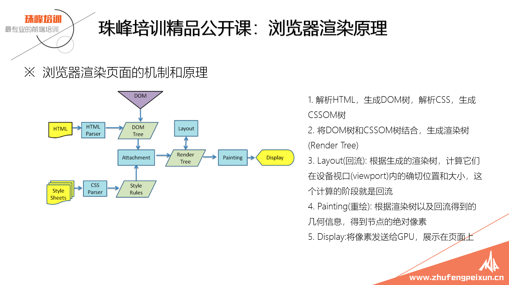

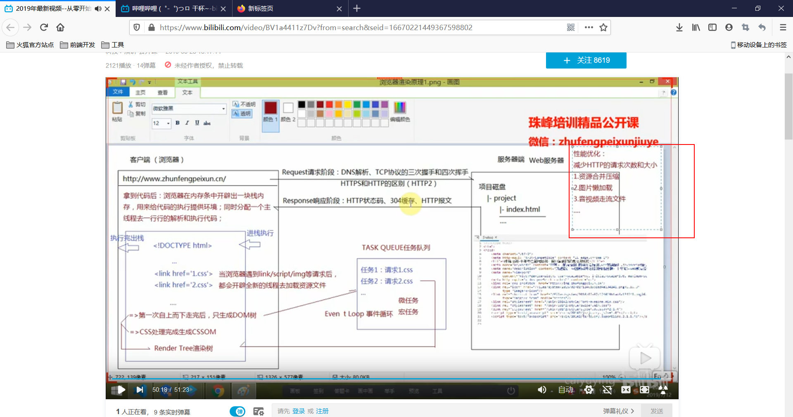

页面优化：有等待任务队列中可以知道

+ 减少`HTTP`请求的次数和大小

  + 资源合并压缩

  + 图片懒加载

  + 音视频走流文件

  + ......

    

### DOM的重绘和回流 Repaint & Reflow

### 前端性能优化之：避免DOM的回流（一）

#### 读写分离

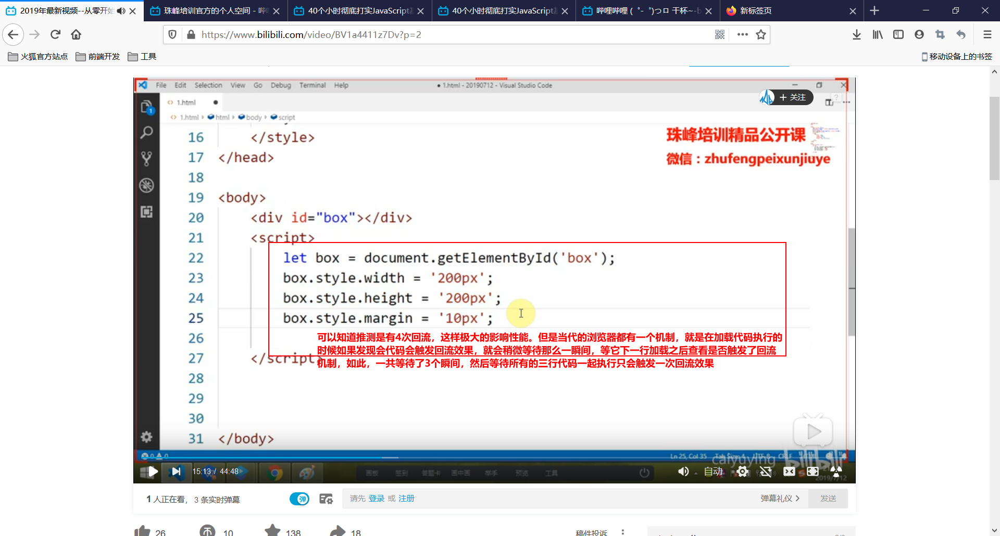

### 前端性能优化之：避免DOM的回流（二）

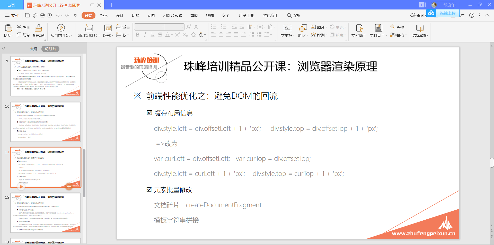

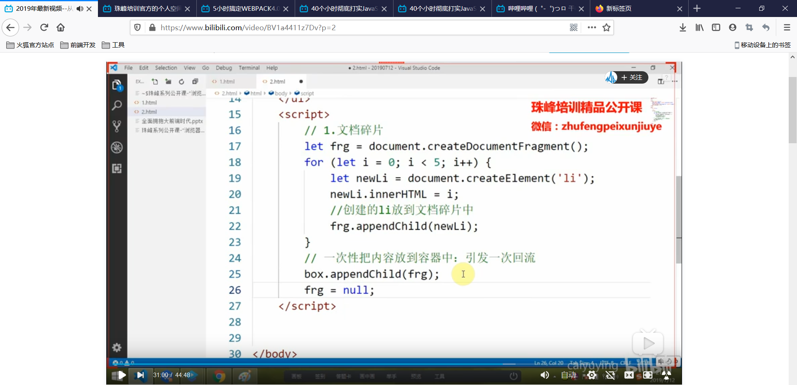

### 前端性能优化之：避免DOM的回流（三）

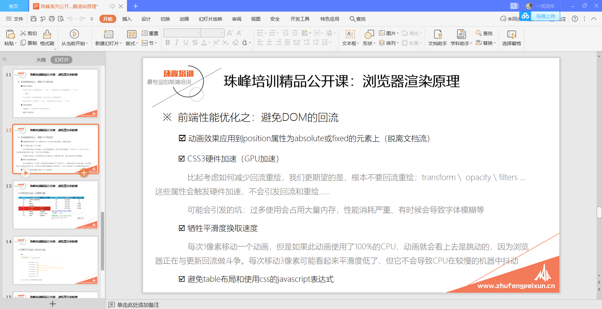

